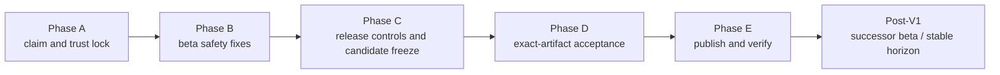

# Roadmap to V1 Beta

## Document control

- **Status:** active execution plan
- **V1 destination:** first usable public beta, `0.1.0-beta.3`
- **Baseline:** `1d44fdd80a3dcb32c580434924bb03c1e5291ae1`, 2026-07-25
- **Human owner:** one maintainer
- **Review model:** AI-assisted implementation and adversarial review; no claim
  of independent human approval
- **Evidence rule:** code, documentation, synthetic tests, or a green earlier
  commit do not make a release claim true
- **Scheduling rule:** this roadmap deliberately contains no effort estimates,
  calendar targets, or velocity assumptions

This roadmap defines the shortest responsible path from the integrated
baseline to a beta that another person can install and use. It is not a plan
for stable `1.0.0`, and it does not make every known hardening item a V1
blocker. Successor beta / stable, mobile, and research work is separated into
the post-V1 horizon.

Exact candidate results belong in an immutable release receipt and in
[`REQUIREMENTS_TRACEABILITY.md`](REQUIREMENTS_TRACEABILITY.md). The roadmap is
complete only as a plan; the beta is complete only when its exact artifacts
pass the defined gates.

## Decisions already made

| ID | Decision | Resolution |
|---|---|---|
| A-01 | What does V1 mean? | The first usable public beta, `0.1.0-beta.3`, not stable `1.0.0` |
| A-02 | Does mobile block V1? | No. V1 is same-device desktop use with Core online and loopback-only by default |
| A-03 | Who drives the release? | One human maintainer using AI tools for implementation and review |
| A-04 | Should the roadmap estimate time? | No. Sequence and evidence determine readiness |
| A-05 | Does a real N-1 update block the first published beta? | No. The first published beta requires the implemented same-version transactional updater smoke; a real first-beta-to-successor N-1 transaction gates the successor |
| A-06 | Do Project Context Capsules or Memory Lab mechanisms enter V1? | No. They remain research or post-beta work |
| A-07 | May the roadmap become GitHub work? | Yes. The reviewed beta packages may be represented as milestones and issues |
| A-08 | Does the beta retain the advertised 2 GB import limit? | Yes. `2,000,000,000` raw bytes is a mandatory inclusive beta boundary; structural chunk support alone is insufficient, and full boundary/resource/recovery evidence blocks publication |
| A-09 | May a configured Codex/Claude client attest that text was explicitly written by the user? | Yes, when the same-device client principal is explicitly authorized for that witness class. This is a local trust grant, not cryptographic proof; inference remains tentative and imported conflicts remain conservative |
| A-10 | How are sensitive findings and solo approval handled? | GitHub private vulnerability reporting is enabled. The sole human maintainer approves releases and may use reproducible AI-assisted review without claiming independent review or separation of duties |
| A-11 | Which platforms and providers are formally supported? | Windows 11 x86-64 and Ubuntu 24.04 LTS x86-64 are the mandatory desktop targets; macOS is unsupported and excluded from release assets/evidence. ChatGPT, Claude, and Grok exports remain mandatory. Missing evidence for a supported target or provider blocks publication rather than narrowing that scope |

The high-level product scope is fixed. Phase A still has to freeze the exact
Windows version/build, Linux desktop/keyring baseline, supported client variants,
bounded source-Python policy if advertised, provider parser/format shapes, and
scale acceptance profile used to prove it.

## Fixed beta support floor

| Surface | `0.1.0-beta.3` floor |
|---|---|
| Windows | Windows 11 x86-64 desktop artifact; the exact supported feature release/build is recorded at candidate freeze |
| macOS | Unsupported; retained source/CI code only, with no candidate asset, receipt, or support claim |
| Linux | Ubuntu 24.04 LTS x86-64 GNOME desktop with a working Secret Service/GNOME Keyring backend; other distributions/desktops are experimental |
| Local AI clients | Current stable Codex on Windows and Linux plus current stable Claude Desktop on Windows; freeze exact versions/config paths. Linux Claude beta is excluded unless a stable supported client is deliberately added before candidate freeze |
| Provider exports | Current nonempty ChatGPT, Claude, and Grok account exports, with the freshness/shape/reconciliation rules below |
| Raw source | Inclusive `2,000,000,000` bytes on both supported artifact targets under the frozen scale profile |
| Source installs | Contributor-only, not a normal-user beta support claim; no unbounded `Python 3.12+` public promise |
| Network | Same device, Core on `127.0.0.1` by default; no mobile/remote/cloud path |

## What “first usable beta” means

A beta user on Windows or supported Ubuntu can:

1. obtain one immutable artifact and verify its checksum/provenance;
2. install and start one user-owned Core without Python, Docker, a hosting
   account, or a manually copied bearer token. Windows uses the one-click
   installer with no routine terminal use. Supported Ubuntu remains a
   portable `tar.gz` requiring documented manual extract and launch;
3. keep Core on `127.0.0.1` and use it from the same device;
4. connect a supported local Codex or Claude client once without destroying unrelated
   client configuration;
5. state durable context and retrieve it in a later session without a review
   inbox;
6. import current ChatGPT, Claude, and Grok exports locally with truthful coverage and
   automatic outcome counts;
7. inspect provenance, correct context, reversibly delete/restore ordinary
   records and sources, and deliberately purge;
8. create an encrypted backup and follow a documented stopped-Core CLI recovery
   procedure; and
9. understand the beta’s unsigned-package, platform, update, recovery, storage,
   and support limitations before relying on it.

The beta does **not** promise:

- phone or remote-computer access;
- Core availability while the device is offline;
- paid native publisher signing;
- macOS product support or a Mac release package;
- automatic Linux replacement;
- a no-terminal native restore experience;
- stable 1.x API, schema, export, or support compatibility;
- a real N-1 update result before a successor beta exists;
- provider login, scraping, APIs, or recurring cloud sync;
- a cloud replica, hosted Edge, or second authority; or
- production use of Project Context Capsules, Memory Lab mechanisms, learned
  retrieval, graphs, or external memory engines.

## Ground-truth snapshot

Current main is a strong implementation baseline, not a release candidate.

| Area | Existing strength | Beta gap |
|---|---|---|
| Core and policy | One authoritative Core; automatic dispositions; correction; reversible delete/restore; purge barriers; source-level B-102 witness grant and unkeyed archive conflict collapse | Exact packaged Codex/Claude witness E2E receipts and generalized multi-slot conflict normalization remain open |
| Retrieval | Authorization/time-first Retrieval V3, bounded FTS5, deterministic selection, 1k/10k gates | Repeat safety and quality gates on the exact candidate |
| Imports | Generic and ChatGPT/Claude/Grok parsers, raw preservation, atomic finish, retry, bounded chunks | Current real exports for all three providers plus exact-boundary, progress/cancel, resource, interruption, export, and restore evidence at 2,000,000,000 bytes |
| Desktop | Windows/Linux release packages, setup flow, managed MCP adapter, dashboard; retained unsupported Mac implementation | Downloaded-artifact browser/client acceptance in both supported OS families |
| Credentials | OS keyring abstraction and scoped client principals | No silent plaintext fallback; failed configuration must not leave a usable orphaned credential |
| Runtime scope | Edge UI, worker, and deployment workflow removed | Core still constructs Edge managers and exposes callable enrollment/connect/sync/client-management and CLI surfaces |
| Release | Candidate assets, checksums, SBOM/provenance, beta public key, updater/rollback mechanics | Exact-SHA quality enforcement, locked composition, generated-dashboard parity, key backups, protected publication, and first immutable release |
| Repository operations | Strong hosted nine-job matrix; GitHub private vulnerability reporting enabled | No execution backlog; `main` remains unprotected and several repository security controls are absent at the baseline snapshot |
| Recovery | Encrypted export, contributor CLI restore tests, Windows transactional rollback, version-matched Windows helper and Linux console recovery modes | Exact downloaded-artifact backup/restore/purge receipts on both supported OS families remain open; contributor CLI alone is not the acceptance surface |

Exact `main` commit `1d44fdd` passed all nine hosted jobs in
[CI run 30177362472](https://github.com/Martian-ux/All-The-Context/actions/runs/30177362472):
Python 3.12 on Windows/macOS/Ubuntu, dashboard on Node 20/22, and package
regressions on Windows, Ubuntu, macOS ARM, and macOS Intel. The Mac jobs now
protect source portability only; they do not replace a frozen Windows/Linux
candidate or operator-owned supported-target acceptance.

## Governing rules

1. **Core remains authoritative.** Clients, importers, Relay, rankers, and
   models submit evidence or queries; they do not write canonical current
   records.
2. **Imported text is inert.** It is data, never instructions for Core, build
   tooling, or an agent.
3. **Authorization precedes relevance.** Identity, scope, currentness,
   deletion, purge, validity, and time run before ranking or disclosure.
4. **Loopback is the beta boundary.** No beta workflow silently exposes Core or
   claims mobile access.
5. **Evidence is bound to bytes.** Browser, client, provider, platform, recovery,
   and security acceptance run after the candidate is frozen and against the
   exact downloaded artifacts.
6. **Mandatory claims block when evidence is missing.** Synthetic formats do
   not prove current provider support; hosted runners do not prove normal
   desktop behavior; structural chunk tests do not prove a 2 GB user journey.
   Missing proof for A-08 or A-11 leaves the beta in draft.
7. **Personal context stays out of evidence.** Receipts contain versions,
   counts, closed reason codes, timings, digests, and pass/fail—not raw
   conversations, observations, queries, credentials, or full local paths.
8. **One human remains accountable.** AI tools may implement, inspect, and
   falsify, but the release record names the maintainer as the human approver
   and never calls AI review independent human review.

## Non-waivable beta gates

The following failures always leave the release as a draft:

- authentication or authorization bypass;
- durable retention or disclosure of direct secret-like payloads contrary to
  the accepted secret boundary;
- raw context or credentials in logs, diagnostics, browser URL/referrers,
  artifacts, or public evidence;
- data loss, corruption, or purge resurrection;
- an older or failed update damaging the vault or losing the installed
  application without recovery;
- manifest/signature/hash/target/version verification failure;
- unintended Edge/Relay/network operation in the supported Core-only artifact;
- missing or failing exact-artifact evidence for supported Windows or Linux,
  current-real-export evidence for ChatGPT, Claude, or Grok, or the accepted
  `2,000,000,000`-byte boundary receipt;
- candidate artifacts not traceable to the exact reviewed source and required
  checks; or
- an open P0/P1 defect affecting a supported journey.

Only P2/P3 limitations may be accepted. The release record must name each one,
state its user impact and workaround, link a follow-up issue, and ensure public
copy does not claim the missing behavior.

## Critical path



No acceptance receipt may be collected before a later code or packaging change
that invalidates it. A failed receipt stays in the evidence history; a rerun
does not erase it.

## Phase A: Claim and trust lock

### Work

- Record A-08 through A-11 consistently in every product, security, support,
  acceptance, and release document.
- Freeze the beta support table:
  - operating systems and architectures;
  - Linux distribution/desktop/keyring baseline;
  - bounded minimum and maximum source-install Python versions, if advertised;
  - Codex/Claude client variants;
  - provider export formats and parser versions;
  - import-size ceiling;
  - manual Linux update and CLI restore limitations plus the explicit absence
    of macOS support.
- Before Phase B measurements exist, freeze the 2 GB acceptance profile:
  - reference floor: 4 logical CPU cores, 8 GiB RAM, local SSD, and 16 GiB
    free before the full import/export/isolated-restore journey;
  - import preflight requires the greater of measured high-water plus 25
    percent or four times the raw-source size plus 1 GiB; export and isolated
    restore use the same measured-high-water rule with operation-specific
    estimates;
  - Core plus import-worker peak RSS is at most 1 GiB, and peak incremental
    import storage is at most four times raw-source size plus 1 GiB;
  - visible progress starts within 5 seconds, then advances monotonically at
    least every 5 seconds or 64 MiB (whichever comes first), stays within one
    8 MiB chunk of committed byte progress, and reaches 100 percent only after
    integrity verification and atomic publication;
  - cancellation is acknowledged within 5 seconds and reaches a quiescent,
    rollback-safe, temporary-clean state within 30 seconds; restart exposes the
    interrupted state and retry uses the preserved raw source without re-upload
    or duplicate decisions;
  - import, source-inclusive export, and isolated restore each complete within
    60 minutes on the reference floor; and
  - the full journey runs on Windows x86-64 and Linux x86-64 candidate
    artifacts.
  These are product usability budgets, not project time estimates. They cannot
  be relaxed after candidate results are known without an explicit revised
  decision and a new candidate.
- Define “current real provider export” as acquired after parser freeze and
  within 30 days of candidate acceptance. Freeze provider-specific structural
  fingerprints, required nonempty fictional canary shapes, expected count
  reconciliation, and closed warning/reason codes before collecting evidence.
- Record the same-device boundary and remove mobile from beta success criteria.
- Define P0-P3 severity and the non-waivable set above.
- Define one release receipt containing source SHA, required workflows,
  artifacts/digests, dependency composition, key fingerprint, platform/client/
  provider/browser/recovery receipts, known limitations, failures, and the
  final human decision.
- Reconcile product requirements, status, beta acceptance, security, platform,
  provider, implementation-plan, and traceability documents.
- Create GitHub milestones and issues with dependencies and gate mappings.

### Exit

- Every public beta claim maps to one objective proof. Optional unsupported
  claims are removed; the mandatory A-08/A-11 targets cannot be removed.
- The accepted local-client witness model, mandatory provider/platform scope,
  import ceiling, security-intake path, and solo approval model are reflected
  consistently.
- No stable, mobile, research, or estimated-time work is disguised as a beta
  blocker.

## Phase B: Beta safety and product fixes

All implementation changes finish before the candidate is frozen.

### Direct-secret boundary

- Refuse or irreversibly redact direct secret-like payload content before it
  enters durable observation history.
- Preserve only a bounded content-free receipt needed for idempotency,
  diagnostics, and user feedback.
- Forbid unkeyed hashes, deterministic fingerprints, prefixes, or other
  offline-guessing verifiers derived from refused content. Use an opaque
  client operation ID or a reviewed keyed construction with documented key
  storage, rotation, export, and restore behavior.
- Define how existing ignored secret-like observations are detected and
  repaired without copying their content into logs or reports.
- Rebuild or compact affected live stores so synthetic secret canaries are
  absent from SQLite pages/freelists, WAL/journal/SHM, FTS, temp files,
  diagnostics, and new exports. Document that historical external backups and
  storage-device remanence cannot be silently repaired and require explicit
  operator warning/retirement.
- Test submission, replay, correction/forget attempts, export, restore,
  diagnostics, audit, migration, idempotency values, and byte-level
  post-repair scans.

### Client trust and minimum conflict safety

- Implement A-09 in the product contract, permissions, generated client
  instructions, policy tests, and threat model.
- Permit the explicit-statement witness only for an ATC-configured same-device
  client principal granted that class; authentication alone is insufficient.
- Ensure a client cannot silently receive stronger force than its configured
  permission and accepted witness class allow.
- Keep unattested inference tentative.
- Add chronological provider fixtures for contradictory preferences, goals,
  projects, decisions, workflows, and constraints.
- Prevent contradictory unkeyed historical statements from simultaneously
  becoming confident current truth. A generalized slot ontology may remain
  post-V1; beta needs a conservative safe outcome.

### Core-only distribution

- Remove or build-gate active Edge enrollment, deployment, connect, sync,
  remote-client management, mutation triggers, and ordinary CLI entry points
  from supported artifacts.
- Retain legacy decommissioning only through a narrow isolated path that cannot
  create a second authority or make an outbound hosted connection by default.
- Add negative API/CLI/package/network tests and correct present-tense README,
  security, architecture, and status claims.

### Credential and connection safety

- Do not silently select plaintext app-data storage when the OS credential
  service is unavailable.
- Require a deliberately enabled development fallback or an accepted protected
  platform fallback.
- Keep the long-lived Core bearer credential out of normal client configuration
  where the client can use a protected reference.
- Make client-principal creation and configuration transactional: failure
  revokes or removes newly created credentials and restores prior config.
- Exercise real supported OS credential services on clean machines.

### Import boundary

- Treat `2,000,000,000` raw bytes as an inclusive, non-negotiable beta
  boundary.
- Add disk-space preflight, durable bounded progress, cancellation/retry,
  interruption recovery, and resource/integrity evidence.
- Build a deterministic, physically allocated/non-sparse exact-boundary
  fixture with a published generator version, known SHA-256, chunk count,
  nonzero expected parse/publication result, coverage counts, and interruption
  checkpoints. It must not pass by being parse-empty or pathologically
  compressible.
- Run a successful exactly `2,000,000,000`-byte raw-source journey on every
  OS/architecture combination frozen in the support table and prove
  deterministic refusal at `2,000,000,001` bytes. Each success journey must
  meet the predeclared profile and include import publication, complete source
  SHA-256 verification, source-inclusive encrypted export, packaged restore,
  and retrieval/integrity checks.
- Version provider parsers and retain sanitized current-format shapes without
  personal content.

### Packaged recovery and irreversible administration

- Version-matched recovery/admin helper or native mode is integrated in every
  supported Windows and Linux artifact without Python, a source checkout, or
  developer tooling.
- Documented stopped-Core preflight, encrypted restore into an isolated
  destination, integrity verification, cutover/rollback, and help are exposed
  from the installed product. Contributor CLI use remains secondary.
- Deliberate authenticated purge is exposed from the packaged product with
  unmistakable confirmation, non-resurrection checks, and no client-facing
  purge permission.
- Prove recovery and purge from exact frozen downloaded artifacts, not only
  contributor CLI or built-byte engineering smokes.

### Exit

- Focused adversarial tests pass for every changed boundary.
- No fix remains that would invalidate browser, client, provider, platform, or
  recovery acceptance.
- All present-tense beta claims match the implemented runtime.

## Phase C: Release controls and candidate freeze

### Repository and security controls

- Keep detailed security findings in the enabled GitHub private vulnerability
  reporting path and verify the public security policy routes reporters there.
- Protect `main` with pull-request/required-check rules that remain workable for
  one maintainer, or record the exact sole-maintainer residual and emergency
  path.
- Enable feasible secret scanning/push protection, dependency alerts/security
  updates, and code scanning.
- Add hosted dashboard and Python dependency vulnerability gates.
- Scan reachable history and candidate artifacts for credentials, private-key
  markers, raw personal context, absolute developer paths, and unexpected
  executables.

### Exact-SHA candidate composition

- Make candidate creation require or rerun all required checks on the exact
  source SHA:

  ```text
  python -m ruff format --check .
  python -m ruff check .
  python -m mypy packages/allthecontext/src
  python -m pytest
  python scripts/check_docs.py
  ```

- Require dashboard `npm ci`, type/check, tests, build, and high-severity audit.
- Require the exact nine-job hosted source-health matrix on the candidate SHA:
  Python 3.12 on Windows/macOS/Ubuntu; dashboard on Node 20/22; and package
  regressions on Windows, Ubuntu, macOS ARM64, and macOS x86-64. The Mac jobs
  are portability regressions, not release targets or acceptance receipts.
- Build Python and Node dependencies from reviewed locks/constraints rather
  than resolving broad ranges independently.
- Verify committed dashboard assets match the production build byte-for-byte.
- Produce a reviewed component/license inventory in addition to file-level
  checksums, SPDX SBOM, and provenance.
- Pin or explicitly govern third-party Actions references.

### Key and publication controls

- Create, restore-test, and verify two recoverable encrypted backups of the
  beta release private key in distinct failure domains, both outside the
  checkout and synchronized workspace.
- Configure the beta publication and Pages promotion path so a typed human
  decision, exact candidate inventory, immutable asset slot, and key
  authorization are enforced.
- Do not call a self-approved or AI-reviewed action independent human review.
- Freeze one clean default-branch SHA only after every Phase B issue closes.
- Build one immutable draft candidate inventory from that SHA. Any changed
  artifact byte requires a new version/candidate.

### Exit

- Required checks and artifact composition are mechanically bound to the exact
  candidate SHA.
- Candidate artifacts, checksums, SBOM/provenance, notices, and descriptor are
  complete and immutable.
- The release key is recoverable and no private key or credential entered the
  repository, Actions, logs, or evidence.

## Phase D: Exact-artifact acceptance

All tests in this phase use the frozen, downloaded candidate artifacts.

### Browser and authentication

- Drive the real setup wizard and dashboard in a browser, not only HTTP probes.
- Distinguish three credentials:
  - the long-lived Core credential never enters a browser URL, browser storage,
    console, log, or referrer;
  - the one-use browser handoff ticket expires, cannot replay, leaks through no
    referrer/cache, and is removed from navigation;
  - the short-lived browser capability has bounded scope and lifetime, is
    revocable server-side, is kept only in session-scoped storage if the
    accepted design requires it, and clears on session termination.
- Complete first launch, fictional import, automatic outcomes, Context,
  retrieval, correction, delete/undo/restore, source removal/undo, provenance,
  history, encrypted backup, update status, and error recovery.
- Check keyboard traversal, visible focus, basic accessible names, and the
  supported narrow viewport.
- Observe no unexpected console errors, network calls, review UI, Edge UI, or
  Edge API request.

### Clients and platforms

- On every claimed clean platform, exercise downloaded-file warnings,
  installation, first run, real OS credential storage, claimed Codex/Claude
  configuration, MCP handshake, automatic observe/retrieve, restart/login
  behavior, shutdown, reinstall/manual upgrade, uninstall, and vault
  preservation.
- Test the minimum and maximum advertised source Python versions if source
  installs are a public claim.
- Record SmartScreen, unsigned-package, Linux desktop, and manual update
  behavior exactly rather than treating hosted CI as proof. Gatekeeper
  observations belong to the superseded Mac plan and are not a
  `0.1.0-beta.3` execution requirement.

### Providers and import scale

- Import a current real export for ChatGPT, Claude, and Grok on an
  operator-controlled machine. Record acquisition date and a content-free
  structural fingerprint; do not invent a provider format version where none
  exists.
- Each provider receipt must be nonempty and reconcile every input item to a
  recognized, excluded, skipped, unavailable, or failed count with a closed
  reason. It must exercise multiple conversations, user/assistant role
  handling, timestamps, Unicode, and every provider-specific envelope,
  branch/edit, memory/profile, attachment, or other shape actually claimed in
  the frozen support table. Unknown/unparsed material produces a visible
  coverage warning and cannot be counted as success.
- Record parser version, counts, coverage, dispositions, warnings, elapsed
  operation state, resource bounds, retry behavior, and pass/fail without
  retaining conversation content.
- Run the accepted import-size boundary on every frozen OS/architecture target
  using the non-sparse canary and verify all predeclared budgets, raw-source
  SHA, current publication atomicity, packaged source-inclusive encrypted
  export/restore, and interruption behavior.
- A missing ChatGPT, Claude, Grok, or 2,000,000,000-byte receipt leaves the
  candidate in draft; these mandatory targets are not narrowed for the beta.

### Data, security, and recovery

- Repeat authorization, revocation, policy isolation, correction, ordinary
  delete/restore, source delete/restore, purge non-resurrection, restart,
  export/restore, and retrieval gates on the exact candidate.
- Perform encrypted backup and documented stopped-Core restore through the
  version-matched helper/mode shipped in each downloaded artifact into an
  isolated destination; verify hashes, schema, FTS/retrieval, records, sources,
  tombstones, and client access.
- Run the same-version Windows transactional replacement smoke, including
  interruption and failed-health rollback. Real N-1 remains post-V1.
- Inspect the artifact, runtime routes/CLI, network behavior, browser state,
  logs, and support evidence for the non-waivable failures.

### Exit

- Every claimed platform, client, provider, and size boundary has a passing
  exact-artifact receipt.
- No open P0/P1 remains.
- Every accepted P2/P3 has a public limitation, workaround, owner, and
  post-V1 issue.
- The maintainer records an explicit approve or reject decision referencing
  every required receipt and all failed/repeated attempts.

## Phase E: Publish and verify

- Before publication, require the exact 20-receipt prepublication bundle and
  explicit sole-maintainer approve decision. Known issues, support, security
  intake, and recovery guidance must already exist and remain linked in the
  candidate source, but source readiness is not a `BETA-O01` pass.
- Publish the exact immutable beta assets through the protected workflow.
- Promote only the signed metadata that references the approved candidate.
- Verify public release, checksum, SBOM/provenance, install, update-channel,
  documentation, known-issues, support, and security-reporting URLs.
- Download the public artifacts into clean environments and repeat a bounded
  install/start/browser/client smoke before announcement.
- Keep feature changes out while the initial launch watch is open.
- Stop promotion and remove mutable channel pointers if a data-safety,
  credential, authorization, or release-integrity incident appears. Immutable
  assets are never replaced in place.
- Close the launch watch only when public URLs, install/start, client
  connection, backup guidance, support/security intake, and channel
  verification remain healthy and every report is triaged.
- Record `BETA-R05` and `BETA-O01` only after publication. Neither receipt may
  appear in or satisfy the prepublication maintainer-decision bundle.

## V1 beta acceptance matrix

| Gate | Requirement | Current state | Required proof |
|---|---|---|---|
| BETA-P01 | Install/start without developer tooling on every claimed platform | Earlier hosted/package evidence | Exact downloaded-artifact clean-machine receipts |
| BETA-P02 | One-time claimed Codex/Claude connection survives restart | Earlier tests | Real-client exact-artifact receipt |
| BETA-P03 | Direct context applies and is later retrieved without review | Source-level automatic apply/retrieve and witness policy tests pass; residual is exact-client E2E | Exact packaged Codex/Claude observe-to-retrieve receipt |
| BETA-P04 | Current mandatory provider imports are truthful | Synthetic/parser evidence | Fresh nonempty real-export receipts, frozen shape canaries, and complete count reconciliation |
| BETA-P05 | Correction, record/source delete/restore, provenance, history, and deliberate purge are reachable | Earlier API/tests; packaged recovery/admin purge surface integrated in source packaging | Exact-artifact UI/MCP plus packaged administrator receipt |
| BETA-P06 | Basic keyboard/focus/error/narrow-width behavior | Partial tests plus source search-wrapper focus-within regression; P06 has not passed | Real browser receipt |
| BETA-S01 | Direct secret-like payload or guessable verifier is not durably retained | Open | Pre-ledger refusal, no unkeyed fingerprint, repair/compaction, raw SQLite/WAL/freelist/export/diagnostic scans |
| BETA-S02 | Client witness and minimum conflict handling are safe and explicit | Source implementation and chronological fixtures integrated; residual exact-client evidence open | Exact packaged authorized-client witness and conflict receipts |
| BETA-S03 | Credentials use accepted protected storage and setup rolls back | Partial | Real OS stores; no silent plaintext; orphan-free failure |
| BETA-S04 | Supported artifacts expose only the Core product boundary | Open | No active Edge operation path; isolated cleanup proof |
| BETA-S05 | Browser handoff/session credentials obey the accepted design | Partial | URL/ticket/session/referrer/cache/revocation browser tests |
| BETA-S06 | Repository, dependency, artifact, and private-intake defenses exist | Private intake enabled; other controls partial | Enabled controls and exact-candidate scan receipts |
| BETA-D01 | The inclusive 2,000,000,000-byte import boundary is usable on every supported frozen target | Structural chunks only | Predeclared hardware/budgets; allocated non-sparse canary; Windows/Linux exact-boundary success; boundary+1 refusal; progress/cancel/retry/interruption/SHA/export/restore |
| BETA-D02 | Authorization/deletion/purge survive restart and restore | Earlier API evidence; packaged purge surface integrated | Exact-candidate packaged destructive-privacy matrix |
| BETA-D03 | Encrypted backup and documented packaged recovery work | Packaged helper/mode and fail-closed built-byte recovery smokes integrated; contributor CLI remains secondary | Shipped-helper stopped-Core restore receipt on supported Windows and Linux from exact downloaded artifacts |
| BETA-R01 | Candidate derives from exact green, locked source | Source-side closed (ADR-059); frozen SHA evidence open | Exact nine-job matrix + security/parity jobs on same 40-hex SHA, locks, dashboard parity, component inventory |
| BETA-R02 | Key custody is recoverable and publication remains deliberate | Public key prepared; human custody prerequisite open | Two restore-tested backups in distinct failure domains, then one source receipt; the separate 20-receipt maintainer decision precedes offline signing/publication |
| BETA-R03 | Candidate inventory is complete and immutable | Earlier mechanics | Digests, checksums, SBOM/provenance, notices, descriptor |
| BETA-R04 | Windows replacement failure preserves app and vault | Engineering evidence | Exact-candidate same-version interruption/rollback receipt |
| BETA-R05 | Public beta and channel reference the approved bytes | Open | Exact-candidate public download/install/channel smoke |
| BETA-X01 | Public platform/client/provider claims match observed evidence | Open | Frozen support table and receipts for every claim |
| BETA-O01 | Known issues, support, security intake, and recovery guidance exist | Source readiness required before candidate creation; post-publication gate open | Exact-candidate live public paths and triaged launch-watch receipt after publication |

## Work packages

Every package becomes one GitHub issue or a small issue checklist. Gate IDs
make the mapping explicit.

| Package | Phase | Depends on | Gates | Deliverable |
|---|---|---|---|---|
| [B-001 Scope, support, and trust contract](https://github.com/Martian-ux/All-The-Context/issues/14) | A | none | all claim-dependent gates | A-08..A-11 decisions and frozen mandatory support table |
| [B-002 Documentation truth and evidence receipt](https://github.com/Martian-ux/All-The-Context/issues/15) | A | B-001 | all | aligned docs, severity, limitations, receipt template |
| [B-101 Pre-ledger secret boundary](https://github.com/Martian-ux/All-The-Context/issues/16) | B | B-001 | BETA-S01 | content-free refusal/redaction and existing-data handling |
| [B-102 Client witness and minimum conflict safety](https://github.com/Martian-ux/All-The-Context/issues/17) | B | B-001 | BETA-P03, BETA-S02 | accepted trust model and conservative chronological behavior |
| [B-103 Core-only distribution isolation](https://github.com/Martian-ux/All-The-Context/issues/18) | B | B-001 | BETA-S04 | no active Edge/Relay surface in supported artifacts |
| [B-104 Credential storage and transactional setup](https://github.com/Martian-ux/All-The-Context/issues/19) | B | B-001 | BETA-P02, BETA-S03 | protected storage and orphan-free rollback |
| [B-105 Honest provider/import boundary](https://github.com/Martian-ux/All-The-Context/issues/20) | B | B-001 | BETA-P04, BETA-D01 | parser/claim versions and tested size behavior |
| [B-109 Packaged recovery and deliberate purge administration](https://github.com/Martian-ux/All-The-Context/issues/37) | B | B-001 | BETA-P05, BETA-D02, BETA-D03 | version-matched restore/admin surface in every supported artifact |
| [B-106 Repository security and private intake](https://github.com/Martian-ux/All-The-Context/issues/21) | C | B-001 | BETA-S06, BETA-O01 | feasible controls, intake path, scan policy |
| [B-107 Exact-SHA locked candidate pipeline](https://github.com/Martian-ux/All-The-Context/issues/22) | C | B-101..B-106, B-109 | BETA-R01, BETA-R03 | exact nine-job matrix, required checks, locks, parity, inventory |
| [B-108 Beta key backup and protected publication](https://github.com/Martian-ux/All-The-Context/issues/23) | C | B-106 | BETA-R02 | verified backups and deliberate solo workflow |
| [B-201 Freeze immutable beta candidate](https://github.com/Martian-ux/All-The-Context/issues/24) | C | B-002, B-107, B-108 | BETA-R01..BETA-R03 | one exact SHA and candidate inventory |
| [B-202 Browser and auth acceptance](https://github.com/Martian-ux/All-The-Context/issues/25) | D | B-201 | BETA-P03, BETA-P05, BETA-P06, BETA-S05 | real packaged browser receipt |
| [B-203 Client and platform acceptance](https://github.com/Martian-ux/All-The-Context/issues/26) | D | B-201 | BETA-P01, BETA-P02, BETA-S03, BETA-X01 | clean-machine and real-client receipts |
| [B-204 Provider and scale acceptance](https://github.com/Martian-ux/All-The-Context/issues/27) | D | B-201 | BETA-P04, BETA-D01, BETA-X01 | real-export and accepted-boundary receipts |
| [B-205 Data, security, and recovery acceptance](https://github.com/Martian-ux/All-The-Context/issues/28) | D | B-201 | BETA-S01..BETA-S06, BETA-D02, BETA-D03, BETA-R04 | exact-candidate adversarial/recovery matrix |
| [B-206 Publish, public smoke, and go/no-go](https://github.com/Martian-ux/All-The-Context/issues/29) | E | B-202..B-205 | BETA-R05, BETA-O01 | publish after the 20-receipt approval, then close public smoke and launch watch |

GitHub tracking is organized under
[V1 Beta — Product & Safety](https://github.com/Martian-ux/All-The-Context/milestone/1),
[V1 Beta — Candidate Acceptance & Publication](https://github.com/Martian-ux/All-The-Context/milestone/2),
and
[Post-V1 — Beta 2 & Stable Horizon](https://github.com/Martian-ux/All-The-Context/milestone/3).

## Risk register

| Risk | Trigger | Control |
|---|---|---|
| The beta solves stable-release problems instead of shipping | Stable/mobile/research work enters the critical path | A-01, A-02, A-05, A-06; post-V1 horizon |
| A secret is called ignored but persists or leaves a guessable verifier | Direct token/password-like text is submitted | B-101; no unkeyed payload hashes; SQLite/WAL/freelist/export repair scans; non-waivable BETA-S01 |
| A client inference becomes a user fact | Client asserts a stronger witness than its explicit local grant | A-09, B-102, scoped permissions and conservative fallback |
| Old/new imported preferences both become current | Historical statements lack stable slots | B-102 chronological conflict fixtures |
| Core-only copy hides active Edge behavior | API/CLI can enroll, connect, or sync | B-103 negative package/API/network proof |
| Credential fallback weakens silently | Keyring fails or client config partially writes | B-104 protected fallback and transactional cleanup |
| Mandatory import boundary exceeds usable behavior | A 2,000,000,000-byte source stalls, exhausts resources, corrupts, or cannot recover | A-08, B-105/B-204; predeclared profile, non-sparse canary, every frozen target; keep beta in draft |
| Provider receipt proves only a trivial export | Empty/minimal account or unrecognized material reports success | B-105/B-204; 30-day freshness, frozen fictional shapes, nonempty real exports, complete count reconciliation |
| Recovery or purge exists only for developers | Packaged user needs Python/source checkout or an undocumented API | B-109/B-205; shipped version-matched helper/admin path on both supported OS families |
| Acceptance evidence is stale | Fixes land after browser/platform/provider receipts | Freeze at B-201; all receipts depend on it |
| Candidate bytes differ from reviewed source | Broad dependencies or stale web assets resolve/build differently | B-107 exact-SHA locks/parity/inventory |
| Solo approval is described as independent | AI or self-review is mislabeled | A-10; truthful sole-maintainer record |
| Security details are disclosed publicly | Sensitive issue body is filed outside the enabled private intake | A-10 and B-106 |
| Mandatory platform/provider scope is silently narrowed | One supported OS artifact or current provider export lacks proof | A-11; keep the beta in draft until every frozen supported category passes |
| Unsigned packages confuse users | OS warning appears without context | Exact warning receipts, checksums, provenance, prominent notice |
| No telemetry hides failures | Beta problems go unreported | Live support/security paths and criteria-based launch watch |

## Definition of done

V1 beta is complete only when:

- A-01 through A-11 are reflected consistently;
- every work package B-001 through B-206 is closed against its acceptance
  criteria;
- every `BETA-*` gate passes on one exact candidate or is an eligible P2/P3
  limitation with public disclosure and a follow-up issue; A-08/A-11 platform,
  provider, and size-boundary gates are never limitation-eligible;
- every non-waivable gate passes;
- every claimed platform, client, provider, and import boundary has an
  exact-artifact receipt;
- the beta key is recoverable and the immutable release/channel reference the
  approved bytes;
- zero P0/P1 remains open;
- the sole human maintainer records an explicit approve decision without
  claiming independent human review; and
- the public beta is downloaded and smoke-tested from its public URLs.

## Post-V1 horizon

These items are important, but do not block the first usable beta unless the
maintainer expands a beta claim:

1. Publish the successor to the first public beta and run the real signed N-1
   update, interruption, failed-health rollback, and vault-preservation drill.
2. Add database/export forward-version refusal, migration identity, a true
   disposable-vault restore dry run, and supported beta snapshot matrix before
   the first schema-changing update.
3. Extend import scheduling, performance, and observability beyond the beta's
   accepted 2 GB progress/cancel/retry and recovery contract.
4. Add a redacted support bundle and bounded log rotation/retention.
5. Add a one-click graphical restore experience beyond the beta's required
   packaged stopped-Core helper/mode, preserving preflight, cutover, health
   checks, and rollback.
6. Generalize append-only policy events, witness semantics, and conflict/slot
   normalization beyond the minimum beta safeguard.
7. Add stable cursor/pagination/filter contracts for large-vault
   administration.
8. Define stable API/schema/export/config compatibility and support policy.
9. Add stable key/channel/site-builder/publish/promote behavior. The current
   parser accepts beta and stable versions, not `1.0.0-rc.1`; any RC scheme
   needs an explicit implementation decision.
10. Evaluate secure direct-Core mobile pairing only through a separate threat
    model and real-device gate.
11. Keep Project Context Capsules, Memory Lab promotion, graphs, learned
    retrieval, and external suppliers behind separate production ADRs.

## Next actions

1. Freeze exact Windows and Linux versions/architectures, supported
   Codex/Claude variants, and ChatGPT/Claude/Grok parser-format versions under
   A-11.
2. Complete the two-backup restore tests on the custody form, then emit one
   candidate-bound `BETA-R02` source receipt. Do not start offline signing
   until all 20 unique prepublication receipts pass and the maintainer
   records `approve` with `independent_human_review_claimed=false`.
3. Route detailed findings through the enabled private vulnerability intake
   and finish the remaining repository security controls.
4. Complete Phase B fixes, including the mandatory 2 GB path, before collecting
   any release acceptance evidence.
5. Freeze one exact Windows/Linux candidate only after the beta safety/product
   surface stops changing. Do not reuse the unpublished `0.1.0-beta.1` draft.
6. Run every browser, client, platform, provider, security, and recovery receipt
   against that exact downloaded candidate before publication.
