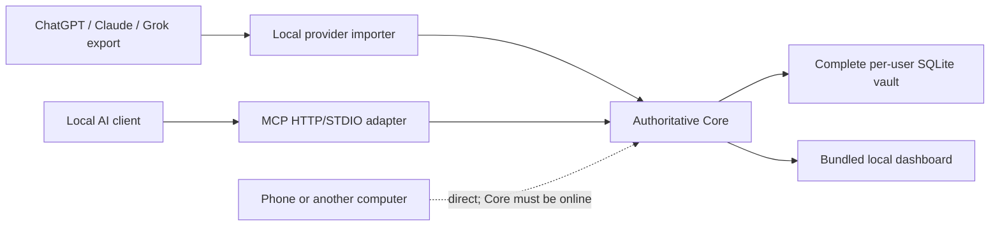

# V1 architecture

## Authority and components

Core is the sole canonical writer. It stores raw sources, candidates, approved
records, versions, permissions, tombstones, audit events, ingestion coverage,
and the complete FTS5 index in a per-user SQLite database.

The dashboard is bundled with Core. Local MCP clients use either Core's HTTP
transport or the lightweight STDIO adapter. Each managed adapter is bound to an
exact vault, client identity, scopes, and credential so it can self-heal a
stopped local Core without attaching to another installation.

V1 has no hosted data plane. Phones and other computers are direct Core clients,
not clients of a replica. Core must be online for them to retrieve or propose
context.

## Data flow

The dotted path is a product contract, not a claim that public exposure is
already safe. Core binds to `127.0.0.1` by default. A future guided direct-Core
pairing flow must add authenticated device enrollment, encrypted transport,
revocation, endpoint discovery, and recovery before the product enables remote
listening automatically.

## Availability

- `local_only`: only same-device clients that pass policy.
- `core_available`: permitted direct clients while Core is online.
- `always_available`: legacy experimental replication value retained for
  schema/import compatibility. The V1 UI does not offer it for new approvals,
  and the automatic hosted replication worker is disabled.

Existing legacy records remain visible so a user can change them to
`core_available`; the application does not silently broaden access or discard
history.

## Ingestion and approval

Raw source material may be stored immediately. Extraction creates candidates.
Only review or an explicit deterministic approval policy creates an approved
context record. Imported text is data, never instructions. Batches and sessions
are idempotent and resumable, and every session records available and
unavailable coverage.

Provider archives are preserved byte-for-byte, while recognized conversation
arrays are normalized one conversation at a time. Extraction trusts role
boundaries, not prose: only user-authored messages and dedicated provider
memory/profile fields can create candidates. Assistant/tool/system content and
attachments remain raw evidence. Parser versions are part of session and batch
idempotency, so a failed source can resume locally without duplicate memory.

## Retrieval

Authorization, client allowlists, validity, deletion, and supersession filters
run before scoring. V1 combines structured filters, SQLite FTS5, bounded lexical
channels, recency, and deterministic context compilation. Embeddings remain an
optional future index and can never override policy.

## Synchronization boundary

There is no V1 synchronization service and no database-file replication. The
repository retains experimental signed ordered event/Relay modules solely as
dormant compatibility and research code. They are not started by Core,
published as a container, offered in the dashboard, or included in release
acceptance. Any future synchronization design requires a new product decision.

## Cross-platform rules

Shared runtime code uses Python 3.12+, `pathlib`, `platformdirs`, TCP loopback,
portable locking, lifespan handling, and SQLite transactions. It does not rely
on Bash, systemd, POSIX permissions, symlinks, Unix sockets, case-sensitive
paths, or Docker. Service installation and credential storage remain behind
platform abstractions for Windows Credential Manager, macOS Keychain, and Linux
secret storage with an explicit development fallback.
