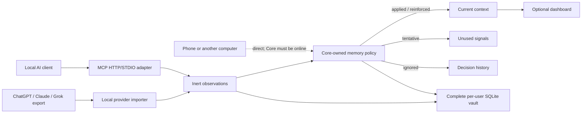

# V1 architecture

## Authority and components

Core is the sole authority and the only component that can change current
context. It stores raw sources, immutable observations, policy dispositions,
current records, versions, permissions, tombstones, audit events, ingestion
coverage, and the complete FTS5 index in a per-user SQLite database.

The dashboard is bundled with Core. It is not an approval inbox. It provides
optional inspection, provenance, activity, correction, undo, deletion, backup,
and administration. Local MCP clients use either Core's HTTP transport or the
lightweight STDIO adapter. Each managed adapter is bound to an exact vault,
client identity, scopes, and credential so it can self-heal a stopped local
Core without attaching to another installation.

V1 has no hosted data plane. Phones and other computers are direct Core clients,
not clients of a replica. Core must be online for them to retrieve or submit
observations.

## Data flow

The dotted path is a product contract, not a claim that public exposure is
already safe. Core binds to `127.0.0.1` by default. A future guided direct-Core
pairing flow must add authenticated device enrollment, encrypted transport,
revocation, endpoint discovery, and recovery before the product enables remote
listening automatically.

## Availability

- `local_only`: only same-device clients that pass policy.
- `core_available`: permitted direct clients while Core is online.
- `always_available`: legacy experimental replication value retained for
  schema/import compatibility. The V1 UI does not offer it for new current
  context, and the automatic hosted replication worker is disabled.

Existing legacy records remain visible so a user can change them to
`core_available`; the application does not silently broaden access or discard
history.

## Automatic context maintenance

An authenticated client or importer submits an observation. The observation
cannot choose its origin or disposition. Core derives origin from the
authenticated route, server-known client registration, parser, and ingestion
session; evaluates the asserted basis, message role, and provenance; then
applies a versioned policy in the same logical transaction that records the
decision.

The observation lifecycle has five dispositions:

- `staged`: internal unpublished work in an unfinished ingestion session or
  Relay queue;
- `applied`: create or update current context;
- `reinforced`: an applied observation supports an existing current record
  without creating a duplicate;
- `tentative`: retain a noncurrent signal for deterministic corroboration; and
- `ignored`: retain the noncurrent observation and bounded decision for audit,
  subject to retention and purge policy.

Explicit user statements and corrections from eligible authenticated clients
normally apply immediately. Slot conflicts resolve deterministically using
targeted-correction intent, explicitness, observation time, and stable tie
breakers while preserving the displaced version and evidence. Model inference
and provider-synthesized memory cannot become current merely by asserting
confidence. Tentative and staged observations are not a user queue and are not
retrieved as current context.

`automatic-v1` does not expire or decay tentative observations. A future
versioned policy may add configurable retention/decay without making tentative
state current or turning it into user work.

Raw imported source material may be stored immediately, but imported text is
untrusted data, never instructions. Provider archives are preserved
byte-for-byte while recognized conversation arrays are normalized one
conversation at a time. Only explicit user-authored durable statements from a
normalized provider archive are eligible for automatic application; generic
document observations remain tentative untrusted evidence. Provider
memory/profile summaries are tentative by default. Provider adapters exclude
assistant, tool, system, and attachment roles; generic instruction-bearing text
remains tentative and is never executed. A source does not publish policy
decisions to current context until its
extraction session completes successfully. Batches and sessions are idempotent
and resumable, and every session records available and unavailable coverage.

Ordinary deletion and restoration are reversible, provenance-backed current
context changes. Irreversible purge remains an explicit administrator state
machine with resurrection barriers.

## Retrieval

Authorization, client allowlists, applied disposition, validity, deletion, and
supersession filters run before scoring. V1 combines structured filters, SQLite
FTS5, bounded lexical channels, recency, and deterministic context compilation.
Embeddings remain an optional future index and can never override policy.

## Synchronization boundary

There is no V1 synchronization service and no database-file replication. The
repository retains experimental signed ordered event/Relay modules solely as
dormant compatibility and research code. Relay can accept signed ordered
projections from Core and queue observations for Core; it can never evaluate an
observation or create current context. The modules are not started by Core,
published as a container, offered in the dashboard, or included in release
acceptance. Any future synchronization design requires a new product decision.

## Cross-platform rules

Shared runtime code uses Python 3.12+, `pathlib`, `platformdirs`, TCP loopback,
portable locking, lifespan handling, and SQLite transactions. It does not rely
on Bash, systemd, POSIX permissions, symlinks, Unix sockets, case-sensitive
paths, or Docker. Service installation and credential storage remain behind
platform abstractions for Windows Credential Manager, macOS Keychain, and Linux
secret storage with an explicit development fallback.
