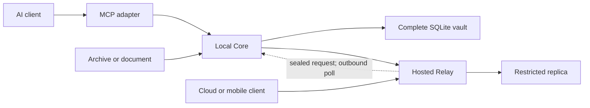

# V1 architecture

## Authority and components

Core is the sole canonical writer. It stores raw sources, candidates, approved
records, versions, permissions, tombstones, audit events, and the complete FTS5
index in a per-user SQLite database. Core listens on `127.0.0.1` by default.

Relay is separately deployed and separately stored. It applies authenticated,
ordered events and serves only approved `always_available` records. A Relay may
queue proposals, but Core must review or policy-approve them before they become
canonical. Database files are never replicated.

MCP clients use a small adapter. For local STDIO clients it forwards JSON-RPC
tool calls to loopback Core HTTP. Streamable HTTP is available for clients that
support it. Each adapter is configured once with a client ID and bearer token;
ordinary retrieval and durable-memory proposals then happen through the nine
stable tools without repeated user setup.

## Data flow

The dotted path is application-level online-Core forwarding. Edge persists only
an encrypted, expiring request envelope. Core initiates every network request,
decrypts and authorizes against its local approved-client mapping, and returns
only `core_available` results. The waiting Edge process holds that response in
bounded memory; it never persists it. `local_only` is excluded at Core.

## Retrieval

The retrieval interface applies authorization, validity, deletion, and
supersession filters before scoring. V1 then combines structured filters with
SQLite FTS5 and recency ordering. Embeddings are an optional future index and
can never override policy filters.

## Cross-platform rules

Shared runtime code uses `pathlib`, `platformdirs`, TCP loopback, `filelock`,
Python signal/lifespan handling, and SQLite transactions. No runtime path
depends on Bash, systemd, POSIX permissions, symlinks, case sensitivity, or
Unix-domain sockets. Docker is optional for Core and intended only for Relay,
development, and CI.
