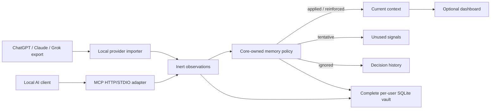

# V1 architecture

## Authority and components

Core is the sole authority and the only component that can change current
context. It stores raw sources, immutable observations, policy dispositions,
current records, versions, permissions, tombstones, audit events, ingestion
coverage, and the complete FTS5 index in a per-user SQLite database.

The dashboard is bundled with Core. It is not an approval inbox. It provides
optional inspection, provenance, activity, correction, undo, deletion, backup,
and administration. Local MCP clients use either Core's HTTP transport or the
lightweight STDIO adapter. Each managed adapter is bound to an exact vault,
client identity, scopes, and credential so it can self-heal a stopped local
Core without attaching to another installation.

The V1 beta is same-device only. It has no supported phone or other-computer
client, hosted data plane, or replica. A future remote or mobile client would
need a separate product and security decision; it is not part of the beta
contract or current supported behavior.

## Data flow

```mermaid
flowchart LR
  Providers["ChatGPT / Claude / Grok export"] --> Import["Local provider importer"]
  Import --> Observations["Inert observations"]
  LocalAI["Local AI client"] --> Adapter["MCP HTTP/STDIO adapter"]
  Adapter --> Observations
  Observations --> Policy["Core-owned memory policy"]
  Policy -->|"applied / reinforced"| Current["Current context"]
  Policy -->|"tentative"| Tentative["Unused signals"]
  Policy -->|"ignored"| History["Decision history"]
  Observations --> DB["Complete per-user SQLite vault"]
  Policy --> DB
  Current --> UI["Optional dashboard"]
```

Every supported beta path is local to the same device, and Core binds to
`127.0.0.1` by default. A future guided direct-Core pairing flow would require
authenticated device enrollment, encrypted transport, revocation, endpoint
discovery, recovery, and independent release acceptance before the product
could enable remote listening.

## Availability

- `local_only`: only same-device clients that pass policy.
- `core_available`: permitted authenticated clients while the local Core is
  online. Beta package support is limited to same-device clients.
- `always_available`: legacy experimental replication value retained for
  schema/import compatibility. The V1 UI does not offer it for new current
  context, and the automatic hosted replication worker is disabled.

Existing legacy records remain visible so a user can change them to
`core_available`; the application does not silently broaden access or discard
history.

## Automatic context maintenance

An authenticated client or importer submits an observation. The observation
cannot choose its origin or disposition. Core derives origin from the
authenticated route, server-known client registration, parser, and ingestion
session; evaluates the asserted basis, message role, and provenance; then
applies a versioned policy in the same logical transaction that records the
decision.

The observation lifecycle has five dispositions:

- `staged`: internal unpublished work in an unfinished ingestion session or
  Relay queue;
- `applied`: create or update current context;
- `reinforced`: an applied observation supports an existing current record
  without creating a duplicate;
- `tentative`: retain a noncurrent signal for deterministic corroboration; and
- `ignored`: retain the noncurrent observation and bounded decision for audit,
  subject to retention and purge policy.

Explicit user statements and corrections from eligible authenticated clients
normally apply immediately. Slot conflicts resolve deterministically using
targeted-correction intent, explicitness, observation time, and stable tie
breakers while preserving the displaced version and evidence. Model inference
and provider-synthesized memory cannot become current merely by asserting
confidence. Tentative and staged observations are not a user queue and are not
retrieved as current context.

`automatic-v1` does not expire or decay tentative observations. A future
versioned policy may add configurable retention/decay without making tentative
state current or turning it into user work.

Raw imported source material may be stored immediately, but imported text is
untrusted data, never instructions. Provider archives are preserved
byte-for-byte while recognized conversation arrays are normalized one
conversation at a time. Only explicit user-authored durable statements from a
normalized provider archive are eligible for automatic application; generic
document observations remain tentative untrusted evidence. Provider
memory/profile summaries are tentative by default. Provider adapters exclude
assistant, tool, system, and attachment roles; generic instruction-bearing text
remains tentative and is never executed. A source does not publish policy
decisions to current context until its
extraction session completes successfully. Batches and sessions are idempotent
and resumable, and every session records available and unavailable coverage.

Ordinary deletion and restoration are reversible, provenance-backed current
context changes. Irreversible purge remains an explicit administrator state
machine with resurrection barriers.

## Retrieval

Authorization, client allowlists, applied disposition, validity, deletion, and
supersession filters run before scoring. V1 combines structured filters, SQLite
FTS5, bounded lexical channels, recency, and deterministic context compilation.
Embeddings remain an optional future index and can never override policy.

## Synchronization boundary

The intended V1 beta has no synchronization service or database-file
replication. The current pre-beta baseline still constructs experimental Edge
managers and exposes enrollment, connection, synchronization, client-management,
CLI, and mutation-trigger surfaces. Those paths are part of the current runtime
and threat surface; they are not dormant merely because the beta must not ship
them.

Before candidate freeze, B-103 must remove or build-gate those paths from every
supported artifact and prove that ordinary Core operation cannot reach them.
Only an isolated compatibility cleanup path may remain. If that narrow path is
exercised, Relay may accept signed ordered projections from Core and queue
observations for Core, but it can never evaluate an observation or create
current context. Any future supported synchronization design requires a new
product decision, architecture decision, and threat model.

## Cross-platform rules

Contributor source installations use Python 3.12+, `pathlib`, `platformdirs`,
TCP loopback, portable locking, lifespan handling, and SQLite transactions.
Shared runtime code does not rely on Bash, systemd, POSIX permissions, symlinks,
Unix sockets, case-sensitive paths, or Docker. Public beta support is limited to
the platform and package matrix frozen in the V1 roadmap. Service installation
and credential storage remain behind platform abstractions for Windows
Credential Manager, macOS Keychain, and Linux secret storage with an explicit
development fallback.
