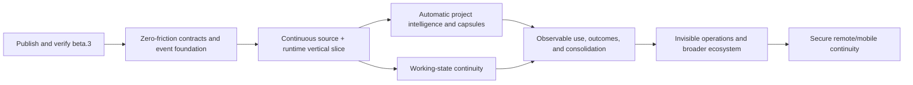

# Zero-Friction Platform Execution Plan

| Field | Value |
|---|---|
| Status | Proposed post-V1 execution plan |
| Product contract | [`ZERO_FRICTION_PLATFORM.md`](ZERO_FRICTION_PLATFORM.md) |
| Immediate release boundary | `0.1.0-beta.3` remains unchanged |
| Scheduling rule | Dependency and evidence determine readiness; no calendar or effort estimates |
| Promotion rule | A more complex mechanism must beat the strongest simpler accepted baseline |

## 1. Objective

Advance ATC from a strong local memory foundation into a platform that requires
no routine user administration after installation and account/client
connection.

The execution order is:

```text
capture automatically
→ form memory automatically
→ organize automatically
→ deliver automatically
→ preserve working continuity
→ measure observable outcomes
→ maintain automatically
```

Project graphs, capsules, learned retrieval, mobile access, and external memory
systems are subordinate to that sequence. A feature that increases internal
sophistication while adding routine user work does not advance the product.

## 2. Governing constraints

All work in this plan must preserve:

1. Core as the sole canonical authority.
2. Imported and connected text as inert untrusted data.
3. Authorization and temporal/lifecycle resolution before derived work.
4. No routine review inbox or manual memory administration.
5. Dependency-bound correction, deletion, and purge closure.
6. Truthful source coverage and integration-level claims.
7. Local-first operation without a mandatory hosted authority.
8. Cross-platform shared runtime constraints.
9. Bounded latency, storage, model, network, and monetary cost.
10. Reproducible evidence before production promotion.

## 3. Critical path



Project intelligence and working continuity may be developed in parallel after
the first continuous vertical slice. Outcome learning depends on both because
ATC must know what context was supplied, what task state existed, and what
observable result followed.

## 4. Phase 0 — Complete the release foundation

### Goal

Publish the first usable `0.1.0-beta.3` without importing post-V1 product claims
into the candidate.

### Required work

- finish exact-candidate Windows and Ubuntu acceptance;
- finish current-real-export provider acceptance;
- finish the accepted raw-import boundary evidence;
- finish packaged browser, client, recovery, purge, and security acceptance;
- publish only the approved immutable candidate; and
- record the exact public smoke and human go/no-go decision.

### Exit

- another person can install and use the beta through its documented boundary;
- the beta provides the authoritative Core, automatic policy, deterministic
  retrieval, import, client setup, backup, recovery, and purge foundation; and
- no graph, recurring-sync, working-state, learned-retrieval, or remote claim is
  made merely because a research or source-level implementation exists.

## 5. Phase 1 — Freeze the zero-friction substrate

### Goal

Define the stable conceptual seams required for continuous capture and runtime
delivery before building provider-specific behavior.

### Work packages

#### ZF-001: Freeze the friction budget and notification policy

Define:

- which operations must be automatic;
- which events may notify silently, visibly, or interruptively;
- user-action-required reason codes;
- notification deduplication and expiry;
- healthy-operation silence; and
- end-to-end acceptance requiring no routine dashboard use.

**Exit:** every proposed user prompt or dashboard dependency maps to a permitted
security, recovery, or consent boundary.

#### ZF-002: Define `SourceConnector`

Freeze a versioned connector ABI covering:

- identity and capabilities;
- authorization and protected credential references;
- initial snapshots;
- incremental sync and cursors;
- retries, backoff, and interruption recovery;
- coverage and freshness;
- disconnect, source deletion, and purge coordination;
- data egress and network declarations; and
- bounded health diagnostics.

**Exit:** a synthetic connector can prove complete, partial, unavailable,
reauthorization-required, retryable-failure, disconnect, deletion, restart, and
replay behavior without provider-specific code.

#### ZF-003: Define `ClientRuntimeAdapter`

Freeze a versioned runtime ABI covering:

- client, conversation, task, workspace, and project signals;
- pre-generation context requests;
- directly observed user turns;
- tool and observable result events;
- response emission;
- compaction and task checkpoints;
- task completion and abandonment;
- supported consequence checkpoints; and
- integration capability levels L0–L3.

**Exit:** a synthetic host proves that context arrives before generation, direct
user evidence is captured without model self-attestation, and unsupported hooks
are reported rather than assumed.

#### ZF-004: Define the evidence and experience event schema

Add a normalized append-only event contract with:

- stable event and source IDs;
- origin and witness class;
- account, client, conversation, task, project, and artifact references;
- source sequence/cursor and idempotency material;
- event time and observed time;
- content or bounded structured payload;
- sensitivity and retention classification;
- schema and producer version; and
- correction, deletion, and purge dependencies.

**Exit:** deterministic replay produces the same candidate observations and
projection inputs from the same authorized event history.

#### ZF-005: Freeze projection lineage and invalidation

Define a common dependency contract for indexes, relations, summaries,
capsules, checkpoints, procedures, and usage statistics.

**Exit:** every derived artifact declares how it is rebuilt and how correction,
permission change, source drift, deletion, and purge remove its future
influence.

### Phase exit

- no provider-specific or graph-specific implementation has been allowed to
  define the shared authority model;
- synthetic contracts pass restart, replay, permission, deletion, and purge
  scenarios; and
- all contracts remain usable without a hosted service.

## 6. Phase 2 — Prove one continuous end-to-end vertical slice

### Goal

Demonstrate the actual zero-friction loop with one strong source connector and
one strong lifecycle-aware AI client integration before expanding breadth.

### Work packages

#### ZF-006: Implement the connector scheduler and health state

Build Core-owned scheduling for:

- initial backfill;
- incremental sync;
- persisted cursors;
- bounded retries and backoff;
- retry-after and rate-limit handling;
- reauthorization state;
- connector concurrency and resource limits;
- restart recovery; and
- actionable health aggregation.

**Exit:** ordinary transient failures recover without user interaction or
duplicate publication, and genuine authorization failure emits one bounded
actionable notification.

#### ZF-007: Implement the first continuous source connector

Select a source with a truthful supported acquisition path and enough structure
to exercise initial history, incremental events, edits, deletion, and cursor
recovery.

Selection criteria:

- official or locally controlled acquisition path;
- stable identity and cursor semantics;
- testable permission and revocation behavior;
- no mandatory scraping;
- representative project or conversational evidence; and
- ability to create sanitized fixtures.

**Exit:** installation plus one account connection produces an initial snapshot
and later incremental evidence with no repeat archive import or manual
classification.

#### ZF-008: Implement the first lifecycle-aware client adapter

Select one client or reference host that can provide pre-turn, post-turn, tool,
compaction, and task events.

**Exit:** the client receives context before generation, directly observed user
corrections reach Core automatically, and task checkpoints survive restart and
session transition.

#### ZF-009: Add automatic memory formation over the event stream

Begin with conservative, inspectable formation classes:

- explicit direct user claims;
- direct corrections and forget requests;
- deterministic source facts;
- project goals, decisions, and constraints with strong evidence;
- outcome-labelled experiences; and
- temporary working-state updates.

Inference and summaries remain tentative or derived.

**Exit:** the user completes ordinary work without a save-memory command or
memory review queue, while uncertain extraction cannot silently become current
truth.

### Phase acceptance journey

1. install ATC;
2. connect one continuous account and one lifecycle-aware client;
3. complete initial backfill;
4. begin a new interaction;
5. receive relevant context before generation;
6. state a durable preference or project decision naturally;
7. observe it in a later session without a save command;
8. correct it naturally;
9. verify future context uses the correction;
10. restart Core and the client;
11. resume synchronization without duplication; and
12. complete the journey without opening the dashboard.

### Phase exit

The zero-friction loop works for one narrow but real integration pair. Breadth
must not precede this proof.

## 7. Phase 3 — Automatic project intelligence

### Goal

Allow ATC to identify, organize, and brief ongoing projects without requiring
manual project creation, tagging, or graph curation.

### Work packages

#### ZF-010: Add stable project identity and discovery

Define:

- opaque project IDs;
- names and aliases;
- source and workspace bindings;
- automatic evidence-based discovery;
- ambiguity and delayed assignment;
- rename, merge, split, archive, correction, and purge behavior; and
- cross-project authorization and applicability.

**Exit:** the project is inferred from repository, workspace, conversation, and
recurring-memory signals; names are not used as authority-bearing identities.

#### ZF-011: Build the project graph in Memory Lab

Start with an ephemeral graph over an already-authorized temporal snapshot.
Compare:

- current Retrieval V3;
- structured project filters;
- lexical seeds plus typed one-hop expansion;
- lexical seeds plus bounded two-hop expansion; and
- relation-family ablations.

Initial production candidates should be structural or explicit relations such
as `belongs_to`, `supersedes`, `depends_on`, `blocks`, `implements`, and
`tested_by`. Model-inferred causal or failure relations remain shadow until
separately proven.

**Exit:** each promoted relation family improves its target project tasks over
the strongest simpler baseline and passes cross-project isolation, correction,
historical, deletion, purge, cycle, and high-fan-out tests.

#### ZF-012: Build the Project Context Capsule compiler

Compile structured project context containing current objective, constraints,
decisions, components, blockers, working state, failed approaches, open
questions, next actions, provenance, and freshness.

**Exit:** a client entering a project cold receives a deterministic bounded
briefing without user curation, and every capsule becomes invalid when a
recorded dependency changes.

#### ZF-013: Add project inspection to the dashboard

Provide actionable views for:

- overview and current objective;
- decisions and rationale;
- dependencies and blockers;
- work and experiments;
- history and freshness;
- “why is this here?” provenance; and
- “what depends on this?” invalidation impact.

A force-directed graph is optional and secondary.

**Exit:** project UI improves inspection and correction but remains unnecessary
for healthy automatic operation.

### Phase exit

A user can resume an established project in another supported client and receive
current goals, decisions, constraints, blockers, failed approaches, and working
state without selecting or maintaining the project in ATC.

## 8. Phase 4 — Cross-session working continuity

### Goal

Preserve task progress across compaction, session closure, client change, and
model change without confusing working state with durable truth.

### Work packages

#### ZF-014: Implement versioned working checkpoints

A checkpoint records:

- task and project identity;
- objective;
- completed steps;
- active artifacts and source revisions;
- current hypothesis;
- blockers and open questions;
- next likely action;
- expiry and close state; and
- dependency generation.

**Exit:** checkpoint replay resumes declared observable state, never hidden
reasoning, and fails closed when source or permission drift makes the checkpoint
stale.

#### ZF-015: Implement working-state reconciliation

Support three-way repair between:

- the last accepted checkpoint;
- current source/project state; and
- new client observations.

**Exit:** source changes, abandoned work, conflicting clients, and stale
checkpoints are reconciled deterministically or surfaced as bounded uncertainty
without resurrecting displaced state.

### Phase exit

A task can move between supported clients or survive compaction without forcing
the user to restate the project or without pretending the full prior model
context still exists.

## 9. Phase 5 — Observable outcomes and conservative learning

### Goal

Measure whether memory changed observable results and cautiously derive reusable
experience without granting agents truth authority.

### Work packages

#### ZF-016: Add the memory-use and outcome ledger

Record:

- context assignment and issue receipt;
- client acknowledgement;
- declared use or nonuse when observable;
- tool and action envelopes;
- task completion state;
- external result or user correction;
- exact memory and projection versions; and
- later invalidation or purge.

**Exit:** ATC can reconstruct what context was supplied and what observable
result followed without storing private chain-of-thought.

#### ZF-017: Add background consolidation in shadow

Compare simple controls before learned consolidation:

- raw events;
- deterministic current-state log;
- bounded summaries;
- project capsules;
- typed relations;
- experience retrieval; and
- candidate procedures.

**Exit:** a consolidation mechanism advances only if it improves current
authorized outcome success, minimum disclosure, or maintenance cost without
hard lifecycle failures.

#### ZF-018: Gate procedural memory

A procedure requires:

- observable outcome evidence;
- recurrence or strong external verification;
- explicit applicability boundaries;
- counterexamples or negative guards;
- correction and repair tests;
- source and outcome dependencies; and
- purge closure.

**Exit:** no procedure is promoted from a single successful-looking trace or
agent self-rating.

### Phase exit

ATC can distinguish retrieval quality from actual outcome benefit and can reject
memory mechanisms that retrieve well but cause stale guidance, sycophancy,
cross-domain leakage, or negative transfer.

## 10. Phase 6 — Invisible operations and broader integration breadth

### Goal

Make the platform reliable without turning the user into an operator.

### Work packages

#### ZF-019: Automatic backup, repair, and storage policy

Add:

- scheduled encrypted backups;
- retention and bounded cleanup;
- restore verification and dry run;
- derived-state repair;
- storage forecasting;
- corruption detection;
- safe compaction; and
- one-click graphical recovery beyond the packaged helper.

**Exit:** healthy maintenance is silent; failure emits one actionable state; no
automatic cleanup weakens purge, audit, or recovery guarantees.

#### ZF-020: Stable connector and client SDKs

Publish versioned contracts, conformance fixtures, capability negotiation,
permission boundaries, and compatibility policy.

**Exit:** an external integration can prove its acquisition, runtime, lifecycle,
network, egress, correction, and deletion behavior without becoming an alternate
authority.

#### ZF-021: Expand connectors and clients one at a time

Each new integration must pass the common contracts plus source-specific
acceptance. Integration count is not a success metric if coverage, identity, or
lifecycle semantics are weak.

**Exit:** breadth increases without provider-specific authority exceptions or
manual user workflows.

### Phase exit

Routine synchronization, indexing, project organization, backup, updates,
repair, and health remain invisible across multiple supported sources and
clients.

## 11. Phase 7 — Secure remote and mobile continuity

### Goal

Extend an already working automatic local loop to other devices without adding
a second authority.

Required foundations include:

- authenticated device enrollment;
- encrypted transport;
- revocation and device loss recovery;
- endpoint discovery and restart persistence;
- bounded remote disclosure;
- safe Core-offline behavior;
- no silent LAN or public exposure;
- mobile and remote acceptance on real devices; and
- correction and purge closure across issued remote state.

Remote availability must not precede local automatic reliability. Making an
incomplete memory loop reachable from more devices does not advance the core
product.

## 12. First implementation pull requests after this contract

### PR A — Contract fixtures and typed interfaces

Add only:

- `SourceConnector` protocol and capability manifest;
- `ClientRuntimeAdapter` protocol and capability levels;
- normalized event schemas;
- projection dependency schemas;
- sanitized synthetic fixtures; and
- structural tests.

No provider, production scheduler, graph, model, network call, or migration.

### PR B — Disposable vertical-slice harness

Add:

- fake continuous connector;
- fake lifecycle-aware client;
- in-memory or disposable SQLite event stream;
- deterministic formation baseline;
- restart/replay/correction/purge fixtures; and
- a zero-dashboard end-to-end harness.

No operator Core or personal data.

### PR C — Core-owned event substrate behind a disabled feature flag

After PR B passes, add:

- migrations and storage APIs;
- cursor/idempotency support;
- lineage and invalidation records;
- feature-disabled scheduler seams; and
- export, restore, delete, and purge coverage.

No live provider is promoted in the same PR.

## 13. Proposed GitHub issue hierarchy

Create one post-V1 epic and keep the beta milestone unchanged.

| Issue | Scope |
|---|---|
| ZF-001 | Friction budget and notification policy |
| ZF-002 | SourceConnector ABI and conformance fixture |
| ZF-003 | ClientRuntimeAdapter ABI and capability levels |
| ZF-004 | Evidence and experience event stream |
| ZF-005 | Projection lineage and invalidation contract |
| ZF-006 | Connector scheduler and health state |
| ZF-007 | First continuous source connector |
| ZF-008 | First lifecycle-aware client adapter |
| ZF-009 | Automatic formation over the event stream |
| ZF-010 | Automatic project identity and discovery |
| ZF-011 | Typed project graph research and ablations |
| ZF-012 | Project Context Capsule compiler |
| ZF-013 | Optional project inspection UI |
| ZF-014 | Versioned working checkpoints |
| ZF-015 | Working-state reconciliation |
| ZF-016 | Memory-use and outcome ledger |
| ZF-017 | Background consolidation shadow program |
| ZF-018 | Procedural-memory promotion gates |
| ZF-019 | Automatic backup, repair, and storage policy |
| ZF-020 | Stable connector and client SDKs |
| ZF-021 | Integration expansion program |
| ZF-022 | Secure direct-Core remote/mobile product |

## 14. Cross-phase hard gates

The following failures stop promotion regardless of aggregate quality:

- unauthorized content or unauthorized-derived signal reaches a client;
- stale, deleted, or purged content influences a projection or issued capsule;
- a connector reports complete coverage when material is unavailable;
- a retry duplicates events, observations, decisions, or current records;
- imported content executes or changes policy as instructions;
- a normal journey requires a memory inbox or manual classification;
- a supported automatic journey requires routine dashboard use;
- a stronger integration level is claimed without the required lifecycle hooks;
- optimized invalidation disagrees with the full-rebuild oracle;
- graph, learned, or external-system complexity fails to beat a simpler baseline;
- a procedure is promoted from unverified self-rated experience;
- diagnostics, evidence, or logs expose raw personal context or credentials; or
- remote access silently broadens the local authorization boundary.

## 15. Scope control

Do not combine these changes into one implementation wave:

- event stream plus multiple live providers;
- graph plus embeddings plus reranking;
- project discovery plus procedure learning;
- runtime hooks plus consequence enforcement;
- local reliability plus mobile access; or
- connector SDK stabilization plus broad third-party integration.

Each mechanism should enter through a narrow contract, isolated fixture,
shadow comparison where appropriate, and separate production decision.

## 16. Completion condition

The platform direction is complete only when a new user can:

1. install ATC;
2. connect supported accounts and clients;
3. work normally across projects and models;
4. receive current context and working continuity automatically;
5. state and correct durable information naturally;
6. survive sync interruption, restart, and client change;
7. have corrections close all supported future influence; and
8. avoid routine ATC administration.

A large memory database, impressive graph, or high retrieval score does not
satisfy this condition by itself.
