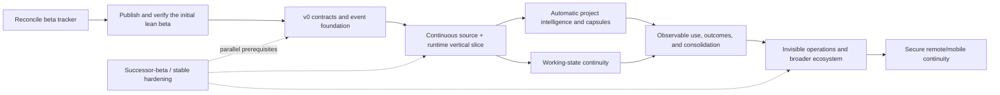

# Zero-Friction Platform Execution Plan

| Field | Value |
|---|---|
| Status | Accepted post-V1 execution direction under [`ADR-090`](ADR-090_ZERO_FRICTION_PLATFORM.md) |
| Product contract | [`ZERO_FRICTION_PLATFORM.md`](ZERO_FRICTION_PLATFORM.md) |
| Immediate release boundary | `0.1.0-beta.6` remains unchanged |
| Early interface status | Experimental v0 until exercised by a fake harness and one real vertical slice |
| Scheduling rule | Dependency and evidence determine readiness; no calendar or effort estimates |
| Promotion rule | A more complex mechanism must beat the strongest simpler accepted baseline |

## 1. Objective

Advance ATC from a strong local memory foundation into a platform that requires
no routine user administration after installation and explicit account/client
connection.

The execution order is:

```text
capture automatically
→ form memory automatically
→ organize automatically
→ deliver automatically
→ preserve working continuity
→ measure observable outcomes
→ maintain automatically
```

Project graphs, capsules, learned retrieval, mobile access, and external memory
systems are subordinate to that sequence. A feature that increases internal
sophistication while adding routine user work does not advance the product.

All promises remain capability-qualified. L0 MCP is a best-effort compatibility
path. Pre-generation delivery, direct-turn capture, working checkpoints,
outcomes, or consequence enforcement require the matching lifecycle-aware
adapter level and acceptance evidence.

## 2. Governing constraints

All work in this plan must preserve:

1. Core as the sole canonical authority.
2. Imported and connected text as inert untrusted data.
3. Authorization and temporal/lifecycle resolution before derived work.
4. No routine review inbox or manual memory administration.
5. Dependency-bound correction, deletion, and purge closure.
6. Truthful source coverage and integration capability claims.
7. Local-first operation without a mandatory hosted authority.
8. Cross-platform shared runtime constraints.
9. Bounded latency, storage, model, network, and monetary cost.
10. Reproducible evidence before production promotion.
11. No duplicate event, project, outcome, retrieval, or repair authorities.
12. No claim of retroactive erasure from an external provider after disclosure.

## 3. Existing-system reuse map

Post-V1 work extends the current implementation rather than replacing it.

| Current ATC mechanism | Required evolution |
|---|---|
| Source records and blobs | Continue to own retained raw source bytes; connectors publish source snapshots and references into this boundary |
| Observation ledger | Remains the durable-context proposal and policy surface; event-derived formation produces observations rather than current records |
| Current records and versions | Remain the only canonical current memory |
| Permissions and temporal sidecar | Continue to run before every projection, retrieval, graph, or capsule operation |
| Retrieval V3 | Remains the production baseline and downstream authorization/admissibility/set-selection path |
| `bootstrap_context` / `search_context` | Remain L0 compatibility paths; lifecycle adapters invoke the same compiler before generation |
| Existing project scopes / `current_project` | Become compatibility inputs and migration hints for stable project IDs |
| Memory Lab M1 | Provides the initial observable-use/outcome event contract and falsification cases |
| Memory Lab M3 | Provides the initial influence-closure contract and full-rebuild oracle |
| Earlier Project Context Capsule research | Becomes the starting capsule design, not a separate project-memory authority |

A work package that creates a parallel version of one of these systems must
first show why extension is impossible and receive a separate production ADR.

## 4. Critical path and parallel hardening



Project intelligence and working continuity may proceed in parallel only after
the first continuous vertical slice. Outcome learning depends on both because
ATC must know what context was supplied, what task state existed, and what
observable result followed.

The zero-friction program does not absorb issue #30 or its successor. Real N-1
updates, forward-version refusal, migration identity, compatibility policy,
recovery improvements, support bundles, stable APIs/schemas/exports, and
release-channel hardening remain a separate post-V1 track.

## 5. Phase 0 — Reconcile and complete the release foundation

### Goal

Publish the first usable `0.1.0-beta.6` without importing post-V1 product claims
or carrying a misleading execution tracker forward.

### Tracker reconciliation

Before creating `ZF-*` issues:

- update or supersede open beta issue language that still describes beta.1 or
  mandatory macOS acceptance;
- preserve historical beta.1/macOS requirements as history rather than
  relabelling them passed, skipped, or waived;
- align active acceptance work with the current Windows/Ubuntu lean-beta source;
- separate source-level implementation readiness from exact-downloaded-candidate
  acceptance; and
- remove dependency cycles in which candidate creation requires a test that can
  run only after the candidate already exists.

The B-109/B-107/B-201 relationship requires particular review: packaged
recovery behavior may be source-ready before candidate freeze, while
exact-downloaded-artifact recovery acceptance necessarily follows candidate
creation. Those must not be represented as one circular prerequisite.

### Release work

- finish exact-candidate Windows and Ubuntu acceptance;
- finish current-real-export provider acceptance;
- finish the accepted raw-import boundary evidence;
- finish packaged browser, client, recovery, purge, and security acceptance;
- publish only the approved immutable candidate; and
- record the exact public smoke and human go/no-go decision.

### Exit

- another person can install and use the beta through its documented boundary;
- the active issue tracker reflects the actual release scope and acyclic
  evidence order;
- the beta provides the authoritative Core, automatic policy, deterministic
  retrieval, import, client setup, backup, recovery, and purge foundation; and
- no graph, recurring-sync, working-state, learned-retrieval, or remote claim is
  made merely because research or source-level code exists.

## 6. Phase 1 — Define the experimental zero-friction substrate

### Goal

Define conceptual seams for continuous capture and runtime delivery without
prematurely promising stable ABIs or allowing provider-specific behavior to
shape authority.

### ZF-001: Friction budget and notification policy

Define:

- which operations must be automatic;
- which events may remain silent, notify, or interrupt;
- capability-limited user journeys;
- user-action-required reason codes;
- notification deduplication and expiry;
- healthy-operation silence; and
- end-to-end acceptance requiring no routine dashboard use.

**Exit:** every proposed prompt or dashboard dependency maps to a permitted
consent, security, ambiguity, or recovery boundary.

### ZF-002: `SourceConnector` v0 contract

Define an experimental versioned connector seam covering:

- identity, acquisition method, and capabilities;
- authorization and protected credential references;
- initial snapshots;
- incremental sync and cursors;
- retries, backoff, and interruption recovery;
- coverage and freshness;
- disconnect, source deletion, and purge coordination;
- data egress and network declarations; and
- bounded health diagnostics.

**Exit:** a synthetic connector proves complete, partial, unavailable,
reauthorization-required, retryable-failure, disconnect, deletion, restart, and
replay behavior. This does not yet freeze a stable public ABI.

### ZF-003: `ClientRuntimeAdapter` v0 contract

Define an experimental runtime seam covering:

- client, conversation, task, workspace, and project signals;
- pre-generation context requests;
- directly observed user turns;
- tool and observable result events;
- response emission;
- compaction and task checkpoints;
- task completion and abandonment;
- supported consequence checkpoints; and
- integration capability levels L0–L3.

**Exit:** a synthetic host proves that L1 context arrives before generation,
direct user evidence is captured without model self-attestation, and
unsupported hooks are reported rather than assumed. No stable SDK promise is
made.

### ZF-004: Evidence and experience event v0 schema

Define a normalized Core-owned event contract with:

- stable event and source IDs;
- origin and witness class;
- account, client, conversation, task, project, and artifact references;
- source sequence/cursor and idempotency material;
- event time and observed time;
- bounded payload or authoritative source reference;
- explicit content ownership and retention class;
- sensitivity and pre-persistence secret handling;
- schema and producer version; and
- correction, deletion, expiry, and purge dependencies.

The event layer must not duplicate retained raw history by default. Source-owned
raw bytes remain in source records/blobs. Events should use bounded envelopes or
references unless content is necessary for a declared evidence role.

“Append-only” applies while an event is retained during ordinary operation.
Authorized retention expiry and destructive purge may remove content-bearing
events and derivatives while preserving only opaque resurrection barriers.

**Exit:** deterministic replay within the retained boundary produces the same
candidate observations and projection inputs. Secret-like direct payloads never
enter the durable event store.

### ZF-005: Projection lineage and invalidation v0 contract

Define one dependency contract for indexes, relations, summaries, capsules,
checkpoints, procedures, and usage statistics, reusing the M3 closure model.

**Exit:** every derived artifact declares how it is rebuilt and how correction,
permission change, source drift, deletion, expiry, and purge remove future ATC
influence. The contract explicitly does not claim retroactive deletion from
external providers.

### Phase exit

- no provider-specific or graph-specific implementation defines shared
  authority;
- synthetic contracts pass restart, replay, permission, retention, deletion,
  and purge scenarios;
- the v0 contracts remain changeable based on the vertical slice; and
- all contracts remain usable without a hosted service.

## 7. Phase 2 — Prove one continuous end-to-end vertical slice

### Goal

Demonstrate the actual zero-friction loop with one strong source connector and
one strong lifecycle-aware AI client integration before expanding breadth or
stabilizing interfaces.

### ZF-006: Connector scheduler and health state

Build Core-owned scheduling for:

- initial backfill;
- incremental sync;
- persisted cursors;
- bounded retries and backoff;
- retry-after and rate-limit handling;
- reauthorization state;
- connector concurrency and resource limits;
- restart recovery; and
- actionable health aggregation.

**Exit:** transient failures recover without user interaction or duplicate
publication, while genuine authorization failure emits one bounded actionable
notification.

### ZF-007: First continuous source connector

Select a source with:

- an official or locally controlled acquisition path;
- stable identity and cursor semantics;
- testable permission and revocation behavior;
- no mandatory scraping;
- representative project or conversational evidence; and
- sanitizable fixtures.

**Exit:** installation plus one account connection produces an initial snapshot
and later incremental evidence with no repeat archive import or manual
classification.

### ZF-008: First lifecycle-aware client adapter

Select one client or reference host that can provide pre-turn, post-turn, tool,
compaction, and task events.

**Exit:** the client receives context before generation, directly observed user
corrections reach Core automatically, integration capability is negotiated
truthfully, and task checkpoints survive restart and session transition.

### ZF-009: Automatic formation over retained events

Begin with conservative, inspectable classes:

- explicit direct user claims;
- direct corrections and forget requests;
- deterministic source facts;
- project goals, decisions, and constraints with strong evidence;
- outcome-labelled experiences; and
- temporary working-state updates.

Inference and summaries remain tentative or derived. Formation writes
observations into the existing ledger; it does not create a parallel current
memory path.

**Exit:** the user completes ordinary work without a save-memory command or
review queue, while uncertain extraction cannot silently become current truth.

### Phase acceptance journey

1. install ATC;
2. connect one continuous account and one L1-or-higher client;
3. complete initial backfill;
4. begin a new interaction;
5. receive relevant context before generation;
6. state a durable preference or project decision naturally;
7. observe it in a later session without a save command;
8. correct it naturally;
9. verify future ATC context uses the correction;
10. restart Core and the client;
11. resume synchronization without duplication; and
12. complete the journey without opening the dashboard.

### Phase exit

The zero-friction loop works for one narrow but real integration pair. Results
feed revisions to v0 contracts. Breadth and ABI stabilization must not precede
this proof.

## 8. Phase 3 — Automatic project intelligence

### Goal

Identify, organize, and brief ongoing projects without manual project creation,
tagging, or graph curation.

### ZF-010: Stable project identity and discovery

Define:

- opaque project IDs;
- names and aliases;
- source and workspace bindings;
- evidence-based discovery;
- `resolved`, `unresolved`, and `ambiguous` assignment outcomes;
- project-neutral fallback retrieval;
- bounded clarification only when ambiguity is materially unsafe;
- rename, merge, split, archive, correction, and purge behavior; and
- cross-project authorization and applicability.

**Exit:** project identity is inferred where evidence is sufficient, and ATC
abstains from project-specific injection rather than silently attaching the
wrong project.

### ZF-011: Project graph in Memory Lab

Start with an ephemeral graph over an already-authorized temporal snapshot.
Compare:

- current Retrieval V3;
- structured project filters;
- lexical seeds plus typed one-hop expansion;
- lexical seeds plus bounded two-hop expansion; and
- relation-family ablations.

Initial production candidates should be structural or explicit relations such
as `belongs_to`, `supersedes`, `depends_on`, `blocks`, `implements`, and
`tested_by`. Model-inferred causal or failure relations remain shadow until
separately proven.

**Exit:** every promoted relation family improves its target tasks over the
strongest simpler baseline and passes cross-project isolation, ambiguity,
correction, historical, deletion, purge, cycle, and high-fan-out tests.

### ZF-012: Project Context Capsule compiler

Extend the existing Retrieval V3 compiler path to produce a structured project
capsule containing current objective, constraints, decisions, components,
blockers, working state, failed approaches, open questions, next actions,
provenance, capability level, and freshness.

**Exit:** a client entering a resolved project cold receives a deterministic
bounded briefing without user curation. Ambiguous projects receive no
project-specific capsule. Every capsule invalidates when a dependency changes.

### ZF-013: Optional project inspection

Provide actionable views for:

- overview and current objective;
- decisions and rationale;
- dependencies and blockers;
- work and experiments;
- history and freshness;
- “why is this here?” provenance; and
- “what depends on this?” invalidation impact.

A force-directed graph is optional and secondary.

**Exit:** project UI improves inspection and correction but remains unnecessary
for healthy automatic operation.

### Phase exit

A user can resume a resolved established project in another lifecycle-aware
client and receive current goals, decisions, constraints, blockers, failed
approaches, and working state without selecting or maintaining the project in
ATC.

## 9. Phase 4 — Cross-session working continuity

### ZF-014: Versioned working checkpoints

A checkpoint records:

- task and project identity or explicit unresolved state;
- objective;
- completed steps;
- active artifacts and source revisions;
- current hypothesis;
- blockers and open questions;
- next likely action;
- expiry and close state; and
- dependency generation.

**Exit:** checkpoint replay resumes declared observable state, never hidden
reasoning, and fails closed when source, project, permission, or policy drift
makes it stale.

### ZF-015: Working-state reconciliation

Support three-way repair between:

- the last accepted checkpoint;
- current source/project state; and
- new client observations.

**Exit:** source changes, abandoned work, conflicting clients, project
ambiguity, and stale checkpoints are reconciled or surfaced as bounded
uncertainty without resurrecting displaced state.

### Phase exit

A task can move between supported clients or survive compaction without forcing
the user to restate the project and without pretending the full prior model
context still exists.

## 10. Phase 5 — Observable outcomes and conservative learning

### ZF-016: Memory-use and outcome ledger

Promote the M1 contract into a Core-owned product slice that records:

- context assignment and issue receipt;
- client acknowledgement;
- declared use or nonuse when observable;
- tool and action envelopes;
- task completion state;
- external result or user correction;
- exact memory and projection versions; and
- later invalidation or purge.

**Exit:** ATC can reconstruct what it supplied and what observable result
followed without hidden chain-of-thought or a parallel truth authority.

### ZF-017: Background consolidation in shadow

Compare simple controls before learned consolidation:

- raw source references and retained events;
- deterministic current-state log;
- bounded summaries;
- project capsules;
- typed relations;
- experience retrieval; and
- candidate procedures.

**Exit:** a mechanism advances only if it improves current authorized outcome
success, minimum disclosure, or maintenance cost without hard lifecycle
failures.

### ZF-018: Procedural-memory gates

A procedure requires:

- observable outcome evidence;
- recurrence or strong external verification;
- explicit applicability boundaries;
- counterexamples or negative guards;
- correction and repair tests;
- source and outcome dependencies; and
- purge closure.

**Exit:** no procedure is promoted from one successful-looking trace or agent
self-rating.

### Phase exit

ATC distinguishes retrieval quality from outcome benefit and rejects memory
mechanisms that retrieve well but cause stale guidance, sycophancy,
cross-domain leakage, or negative transfer.

## 11. Phase 6 — Invisible operations and integration breadth

### ZF-019: Automatic backup, repair, and storage policy

Add:

- scheduled encrypted backups;
- retention and bounded cleanup;
- restore verification and dry run;
- derived-state repair;
- storage forecasting;
- corruption detection;
- safe compaction; and
- one-click graphical recovery beyond the packaged helper.

**Exit:** healthy maintenance is silent; failure emits one actionable state; no
automatic cleanup weakens purge, audit, or recovery guarantees.

### ZF-020: Stabilize connector and client SDKs

Only after the fake harness and first real vertical slice, publish versioned
contracts, conformance fixtures, capability negotiation, permission boundaries,
and compatibility policy.

**Exit:** an external integration can prove acquisition, runtime, lifecycle,
network, egress, correction, retention, and deletion behavior without becoming
an alternate authority. This is the first stable ABI/SDK milestone.

### ZF-021: Expand integrations one at a time

Each integration passes the common contracts plus source-specific acceptance.
Integration count is not a success metric if coverage, identity, or lifecycle
semantics are weak.

**Exit:** breadth increases without provider-specific authority exceptions,
false capability claims, or manual user workflows.

### Phase exit

Routine synchronization, indexing, project organization, backup, updates,
repair, and health remain invisible across multiple supported sources and
clients.

## 12. Phase 7 — Secure remote and mobile continuity

### ZF-022: Direct-Core remote/mobile product

Required foundations include:

- authenticated device enrollment;
- encrypted transport;
- revocation and device-loss recovery;
- endpoint discovery and restart persistence;
- bounded remote disclosure;
- safe Core-offline behavior;
- no silent LAN or public exposure;
- real-device acceptance; and
- correction/purge closure across future issued remote state.

Remote availability must not precede local automatic reliability. Making an
incomplete memory loop reachable from more devices does not advance the core
product.

## 13. First implementation PRs after contract acceptance

These PRs begin only after Phase 0 tracker reconciliation and beta publication.

### PR A — v0 contracts and fixtures

Add only:

- `SourceConnector` v0 protocol and capability manifest;
- `ClientRuntimeAdapter` v0 protocol and capability levels;
- event and retention schemas;
- projection dependency schemas;
- sanitized synthetic fixtures; and
- structural tests.

No provider, production scheduler, graph, model, network call, stable ABI claim,
or migration.

### PR B — Disposable vertical-slice harness

Add:

- fake continuous connector;
- fake lifecycle-aware client;
- disposable event stream;
- deterministic formation baseline feeding the existing observation ledger;
- restart/replay/retention/correction/purge fixtures; and
- a zero-dashboard end-to-end harness.

No operator Core or personal data.

### PR C — Core-owned event substrate behind a disabled flag

After PR B passes, add:

- migrations and storage APIs;
- cursor/idempotency support;
- content ownership and retention enforcement;
- pre-persistence direct-secret refusal;
- lineage and invalidation records;
- feature-disabled scheduler seams; and
- export, restore, expiry, delete, and purge coverage.

No live provider is promoted in the same PR.

## 14. Proposed GitHub issue hierarchy

Create one zero-friction epic only after tracker reconciliation and beta.3
publication. Keep successor-beta/stable issue #30 or its successor separate.

| Issue | Scope |
|---|---|
| ZF-001 | Friction budget and notification policy |
| ZF-002 | SourceConnector v0 and conformance fixture |
| ZF-003 | ClientRuntimeAdapter v0 and capability levels |
| ZF-004 | Evidence/experience event and retention contract |
| ZF-005 | Projection lineage and invalidation contract |
| ZF-006 | Connector scheduler and health state |
| ZF-007 | First continuous source connector |
| ZF-008 | First lifecycle-aware client adapter |
| ZF-009 | Automatic formation over retained events |
| ZF-010 | Automatic project identity, ambiguity, and discovery |
| ZF-011 | Typed project graph research and ablations |
| ZF-012 | Project Context Capsule compiler |
| ZF-013 | Optional project inspection UI |
| ZF-014 | Versioned working checkpoints |
| ZF-015 | Working-state reconciliation |
| ZF-016 | Memory-use and outcome ledger |
| ZF-017 | Background consolidation shadow program |
| ZF-018 | Procedural-memory promotion gates |
| ZF-019 | Automatic backup, repair, and storage policy |
| ZF-020 | Stable connector and client SDKs |
| ZF-021 | Integration expansion program |
| ZF-022 | Secure direct-Core remote/mobile product |

## 15. Cross-phase hard gates

The following failures stop promotion regardless of aggregate quality:

- unauthorized content or unauthorized-derived signal reaches a client;
- stale, deleted, expired, or purged content influences a projection or future
  issued capsule;
- a connector reports complete or continuous coverage it does not possess;
- a retry duplicates events, observations, decisions, or current records;
- direct secret-like content enters the event layer before refusal;
- the event stream becomes an undeclared duplicate permanent raw-history store;
- imported content executes or changes policy as instructions;
- a normal journey requires a memory inbox or manual classification;
- a supported automatic journey requires routine dashboard use;
- a stronger integration level is claimed without the required hooks;
- ambiguous project evidence is silently forced into project-specific context;
- correction closure is described as retroactive provider-side erasure;
- optimized invalidation disagrees with the full-rebuild oracle;
- graph, learned, or external-system complexity fails to beat a simpler baseline;
- a procedure is promoted from unverified self-rated experience;
- diagnostics, evidence, or logs expose raw personal context or credentials; or
- remote access silently broadens the local authorization boundary.

## 16. Scope control

Do not combine these changes into one implementation wave:

- event stream plus multiple live providers;
- graph plus embeddings plus reranking;
- project discovery plus procedure learning;
- runtime hooks plus consequence enforcement;
- local reliability plus mobile access; or
- v0 contract definition plus stable third-party SDK promises.

Each mechanism enters through a narrow contract, isolated fixture, shadow
comparison where appropriate, and separate production decision.

## 17. Completion condition

The platform direction is realized only when a new user can:

1. install ATC;
2. authorize supported accounts and clients;
3. work normally across projects and models;
4. receive the behavior promised by each declared capability automatically;
5. state and correct durable information naturally;
6. survive sync interruption, restart, and client change;
7. have corrections close all supported future ATC influence;
8. receive an explicit abstention rather than wrong project injection when
   project evidence is materially ambiguous; and
9. avoid routine ATC administration.

A large memory database, impressive graph, or high retrieval score does not
satisfy this condition by itself.
