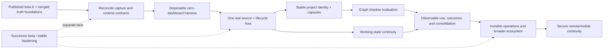

# Zero-Friction Platform Execution Plan

| Field | Value |
|---|---|
| Status | Accepted post-V1 execution direction under [`ADR-090`](ADR-090_ZERO_FRICTION_PLATFORM.md) |
| Product contract | [`ZERO_FRICTION_PLATFORM.md`](ZERO_FRICTION_PLATFORM.md) |
| Immediate release boundary | `0.1.0-beta.6` remains unchanged |
| Current execution frontier | Accept the optional packaged local-workspace setup on exact artifacts, add the first supported lifecycle-aware client, complete Wave 4 E–G product acceptance (complete Packet H), and run Phase 2 |
| Early interface status | Experimental v0; Wave 3 E/F/G remain component-complete; PR #78 closed the local registered-source admission contract; PRs #82/#84 wired CoreService/startup capture-runtime composition and the opt-in Packet E scheduler; Packet H-D is a merged disposable Packet F + admission + Memory Truth + Retrieval V3 proof and is not complete Packet H/Phase 2 acceptance; later clean-vault journeys exercise the real Core worker through retry, initial snapshot, incremental update/deletion, and restart, then carry worker-produced records through authenticated Packet G pre-generation delivery and controlled ZF-010 preference formation, correction, forget, Core restart, principal reauthentication, and caller-owned L2 checkpoint restore; this branch also adds optional first-run authorization plus verified scheduler activation for one local workspace without a dashboard. These close local developer and packaged-setup code seams, not exact packaged/live acceptance, supported lifecycle-client capture, or ZF-007/ZF-008/ZF-009/ZF-010 product exits |
| Scheduling rule | Dependency and evidence determine readiness; no calendar or effort estimates |
| Promotion rule | A more complex mechanism must beat the strongest simpler accepted baseline |

## 1. Objective

Advance ATC from a strong local memory foundation into a platform that requires
no routine user administration after installation and explicit account/client
connection.

The execution order is:

```text
Import Truth
→ Memory Truth
→ Retrieval usefulness
→ Continuous Capture
→ project continuity and capsules
→ graphs and conservative learning
```

The first three foundations and the provider-neutral capture ledger are merged.
Packet D supplied the disposable synthetic composition, and the Wave 3 E/F/G
component seams are locally complete. PR #78 merged the Core-owned
registered-source admission contract, so that seam is no longer missing. Packet
H-D is a merged disposable proof over Packet F local workspace, that
admission contract, public Memory Truth, and Retrieval V3; it does not exercise
Packet E scheduler, Packet G reference host, ZF-010 automatic formation, the
full Wave 4 E–G composition, or the Phase 2 journey. Packet E x Packet F
manual-cycle composition evidence remains historical. A later clean-vault
acceptance journey starts the real Core worker after one-time authorization,
persists and resumes a transient retry across restart, produces the initial
snapshot, applies a later update and deletion, and proves a second restart is
duplicate-free through public Memory Truth and Retrieval without opening the
dashboard or calling `capture_scheduler.run_cycle()` directly. That closes the
local worker-backed developer gap, not complete ZF-007/ZF-008 product exit,
packaged/live support, complete Packet H, or Phase 2. PR #86 merged compilation
of admitted records through Packet G and is not ZF-009 product exit. A later
clean-vault journey now proves the same compile path over the real worker across
Core restart, principal reauthentication, typed host checkpoint restore, and a
worker-driven update/deletion. A companion clean-vault journey carries the
worker-created truth through controlled ZF-010 preference formation,
correction, forget, Core restart, scope reauthentication, and restored host
checkpoint advancement. These close the local Packet G and ZF-010 developer
gaps, not supported-client or product exits. This branch also provides the
optional packaged setup code path for one explicit local workspace: it
authorizes and enables the source, starts/wakes the durable scheduler, keeps the
dashboard closed, and reports success only for a running worker. Exact-artifact
acceptance and the lifecycle-aware client half remain open. Remaining work is
that artifact acceptance, the first supported lifecycle-aware client, complete
Wave 4 E–G product acceptance, and Phase 2. This plan does not turn the component seams
or local proofs into support, a stable SDK, or complete Packet H acceptance.

Project graphs, capsules, learned retrieval, mobile access, and external memory
systems are subordinate to that sequence. A feature that increases internal
sophistication while adding routine user work does not advance the product.

All promises remain capability-qualified. L0 MCP is a best-effort compatibility
path. Pre-generation delivery, direct-turn capture, working checkpoints,
outcomes, or consequence enforcement require the matching lifecycle-aware
adapter level and acceptance evidence.

## 2. Governing constraints

All work in this plan must preserve:

1. Core as the sole canonical authority.
2. Imported and connected text as inert untrusted data.
3. Authorization and temporal/lifecycle resolution before derived work.
4. No routine review inbox or manual memory administration.
5. Dependency-bound correction, deletion, and purge closure.
6. Truthful source coverage and integration capability claims.
7. Local-first operation without a mandatory hosted authority.
8. Cross-platform shared runtime constraints.
9. Bounded latency, storage, model, network, and monetary cost.
10. Reproducible evidence before production promotion.
11. No duplicate event, project, outcome, retrieval, or repair authorities.
12. No claim of retroactive erasure from an external provider after disclosure.

## 3. Existing-system reuse map

Post-V1 work extends the current implementation rather than replacing it.

| Current ATC mechanism | Required evolution |
|---|---|
| Source records and blobs | Continue to own retained raw source bytes; connectors publish source snapshots and references into this boundary |
| Observation ledger | Remains the durable-context proposal and policy surface; event-derived formation produces observations rather than current records |
| Current records and versions | Remain the only canonical current memory |
| Permissions and temporal sidecar | Continue to run before every projection, retrieval, graph, or capsule operation |
| Retrieval V3 | Remains the production baseline and downstream authorization/admissibility/set-selection path |
| `bootstrap_context` / `search_context` | Remain L0 compatibility paths; lifecycle adapters invoke the same compiler before generation |
| Existing project scopes / `current_project` | Become compatibility inputs and migration hints for stable project IDs |
| Memory Lab M1 | Provides the initial observable-use/outcome event contract and falsification cases |
| Memory Lab M3 | Provides the initial influence-closure contract and full-rebuild oracle |
| Earlier Project Context Capsule research | Becomes the starting capsule design, not a separate project-memory authority |
| Continuous Capture foundation | `CaptureProviderAdapter`, `CaptureEvent`, `CaptureApplicationSink`, `CaptureCoordinator`, checkpoints, leases, lineage, and replay remain the sole source-acquisition path; v0 connector work extends this boundary rather than creating another event ledger |

A work package that creates a parallel version of one of these systems must
first show why extension is impossible and receive a separate production ADR.

## 4. Critical path and parallel hardening



Project intelligence and working continuity may proceed in parallel only after
the first continuous vertical slice. Outcome learning depends on both because
ATC must know what context was supplied, what task state existed, and what
observable result followed.

The zero-friction program does not absorb issue #30 or its successor. Real N-1
updates, forward-version refusal, migration identity, compatibility policy,
recovery improvements, support bundles, stable APIs/schemas/exports, and
release-channel hardening remain a separate post-V1 track.

## 5. Phase 0 — Published release and truth foundation (complete)

### Goal

Establish a public beta and the Import Truth, Memory Truth, Retrieval, Context
UI, and provider-neutral Continuous Capture foundations without importing
post-V1 product claims into the release.

### Established state

- `0.1.0-beta.6` is the public immutable downloadable release;
- Windows and supported Linux remain the product support boundary;
- retained macOS portability code creates no support, asset, gate, or acceptance
  claim;
- PR #73 merged the Import Truth, Memory Truth, Retrieval, Context UI, and
  provider-neutral Continuous Capture foundations;
- PR #76 moved ordinary MCP transport to SDK v2 and first-party HTTP transport
  to HTTPX2 without changing MCP's L0 lifecycle-capability classification;
- migration 015 owns capture sources, checkpoints, staged events, source-item
  lineage, foreground runs, leases, retry, and idempotent replay; and
- successor-beta migration, updater, recovery, compatibility, and release work
  remains a separate maintenance lane.

### Exit

- the public release and merged source retain their exact historical identities;
- the zero-friction work may begin without relabelling existing release evidence;
- no real connector, scheduler, lifecycle-aware client, graph, recurring-sync,
  working-state, learned-retrieval, or remote claim is inherited from the
  foundations; and
- `ZF-*` work remains independently reviewed and accepted.

## 6. Phase 1 — Reconcile the experimental zero-friction seams

### Goal

Extend the merged Continuous Capture foundation into a complete experimental
contract set without creating a second source ledger, replay authority, or
current-memory path.

### Required contract mapping

| Proposed seam | Canonical starting point | Allowed change |
|---|---|---|
| Source acquisition | `CaptureProviderAdapter` and `CapturePage` | Add a versioned capability manifest and conformance requirements |
| Source event | `CaptureEvent` and `capture_events` | Extend only when acquisition semantics require it; do not add another source-event ledger |
| Application | `CaptureApplicationSink` | Form observations through the existing Core policy boundary using the supplied idempotency and source/item lineage |
| Coordination | `CaptureCoordinator`, runs, leases, and checkpoints | Add scheduling around this authority; do not replace its replay or lease rules |
| Runtime lifecycle | New experimental `ClientRuntimeAdapterV0` | Add only the hooks truthfully available at the declared L0–L3 level |
| Derived state | Existing observation/current-record, Retrieval V3, and M3 invalidation boundaries | Add dependency metadata and disposable projections, never a parallel truth authority |

Where source-acquisition events cannot truthfully represent client lifecycle or
observable-outcome events, a separate bounded envelope may reference capture
event IDs. It must not duplicate source payloads, cursors, checkpoints,
idempotency, or replay authority.

### ZF-001: Friction budget and notification policy

Define:

- which operations must be automatic;
- which events may remain silent, notify, or interrupt;
- capability-limited user journeys;
- user-action-required reason codes;
- notification deduplication and expiry;
- healthy-operation silence; and
- end-to-end acceptance requiring no routine dashboard use.

**Exit:** every proposed prompt or dashboard dependency maps to a permitted
consent, security, ambiguity, or recovery boundary.

### ZF-002: Capture connector v0 capability contract

Extend `CaptureProviderAdapter` with an experimental versioned capability
manifest and conformance contract covering:

- identity, acquisition method, and capabilities;
- authorization and protected credential references;
- initial snapshots;
- incremental sync and cursors;
- retries, backoff, and interruption recovery;
- coverage and freshness;
- disconnect, source deletion, and purge coordination;
- data egress and network declarations; and
- bounded health diagnostics.

**Exit:** the deterministic fake adapter proves complete, partial, unavailable,
reauthorization-required, retryable-failure, disconnect, deletion, restart, and
replay behavior through the existing coordinator and ledger. This does not
freeze a stable public ABI or introduce `SourceConnector` as a parallel path.

### ZF-003: `ClientRuntimeAdapter` v0 contract

Define an experimental runtime seam covering:

- client, conversation, task, workspace, and project signals;
- pre-generation context requests;
- directly observed user turns;
- tool and observable result events;
- response emission;
- compaction and task checkpoints;
- task completion and abandonment;
- supported consequence checkpoints; and
- integration capability levels L0–L3.

**Exit:** a synthetic host proves that L1 context arrives before generation,
direct user evidence is captured without model self-attestation, and
unsupported hooks are reported rather than assumed. No stable SDK promise is
made.

### ZF-004: Capture and lifecycle event reconciliation

Define how the existing `CaptureEvent` acquisition envelope and any required
client-lifecycle envelope compose. The combined contract must cover:

- stable event and source IDs;
- origin and witness class;
- account, client, conversation, task, project, and artifact references;
- source sequence/cursor and idempotency material;
- event time and observed time;
- bounded payload or authoritative source reference;
- explicit content ownership and retention class;
- sensitivity and pre-persistence secret handling;
- schema and producer version; and
- correction, deletion, expiry, and purge dependencies.

The event layer must not duplicate retained raw history by default. Source-owned
raw bytes remain in source records/blobs. Events should use bounded envelopes or
references unless content is necessary for a declared evidence role.

“Append-only” applies while an event is retained during ordinary operation.
Authorized retention expiry and destructive purge may remove content-bearing
events and derivatives while preserving only opaque resurrection barriers.

**Exit:** deterministic replay within the retained boundary produces the same
candidate observations and projection inputs through the existing capture
idempotency authority. Secret-like direct payloads never enter durable event
storage, and no second source cursor or checkpoint can advance independently.

### ZF-005: Projection lineage and invalidation v0 contract

Define one dependency contract for indexes, relations, summaries, capsules,
checkpoints, procedures, and usage statistics, reusing the M3 closure model.

**Exit:** every derived artifact declares how it is rebuilt and how correction,
permission change, source drift, deletion, expiry, and purge remove future ATC
influence. The contract explicitly does not claim retroactive deletion from
external providers.

### Phase exit

- no provider-specific or graph-specific implementation defines shared
  authority;
- the contract map above is enforced by structural tests;
- synthetic contracts pass restart, replay, permission, retention, deletion,
  and purge scenarios;
- the v0 contracts remain changeable based on the vertical slice; and
- all contracts remain usable without a hosted service.

## 7. Phase 2 — Prove one continuous end-to-end vertical slice

### Goal

Demonstrate the actual zero-friction loop with one strong source connector and
one strong lifecycle-aware AI client integration before expanding breadth or
stabilizing interfaces.

### ZF-006: Disposable zero-dashboard harness

Compose the entire path using only sanitized synthetic evidence:

- the deterministic fake capture adapter and idempotent application sink;
- a fake lifecycle-aware client with genuine pre-generation and direct-turn
  hooks;
- deterministic event-to-observation formation through Core policy;
- existing authorized Retrieval V3 compilation;
- restart, replay, correction, permission, retention, expiry, delete, and purge
  fixtures; and
- a full journey that never opens the dashboard or touches an operator vault.

**Exit:** replay produces identical effective observations and context with zero
duplicate current records; corrections affect the next eligible context compile;
deleted or purged evidence has zero future ATC influence; unauthorized and
secret-like content fails before disclosure or durable event storage.

### ZF-007: Connector scheduler and health state

Build Core-owned scheduling for:

- initial backfill;
- incremental sync;
- persisted cursors;
- bounded retries and backoff;
- retry-after and rate-limit handling;
- reauthorization state;
- connector concurrency and resource limits;
- restart recovery; and
- actionable health aggregation.

**Exit:** transient failures recover without user interaction or duplicate
publication, while genuine authorization failure emits one bounded actionable
notification.

### ZF-008: First continuous source connector

The first implementation target is an explicit-root, read-only local
Git/workspace connector because it offers controlled identity, incremental
state, project relevance, sanitizable fixtures, and no OAuth or scraping. It
must provide:

- an official or locally controlled acquisition path;
- stable identity and cursor semantics;
- testable permission and revocation behavior;
- no mandatory scraping;
- representative project or conversational evidence; and
- sanitizable fixtures.

The connector may read only operator-authorized roots, must declare exclusions
and incomplete coverage, and must not treat workspace text as instructions.
Changing the first source requires an explicit comparison showing stronger
lifecycle semantics or a more representative zero-friction journey.

**Exit:** installation plus one account connection produces an initial snapshot
and later incremental evidence with no repeat archive import or manual
classification.

**Current product path:** optional first-run setup can select and acknowledge
one local workspace, authorize and enable it, and start or wake the durable Core
worker without opening the dashboard. Focused local tests cover no-root,
idempotent repeat, preserved pause/degraded state, second-root refusal, and
content-free reporting. Exact packaged-artifact and live/private-workspace
acceptance are still required before this exit is credited.

### ZF-009: First lifecycle-aware client adapter

Build one controlled in-repository reference host that can provide pre-turn,
post-turn, tool, compaction, task, restart, and session-transition events. This
host proves the lifecycle contract; it does not create a provider-support claim.
Ordinary MCP remains L0 and cannot satisfy this gate by itself.

**Exit:** the client receives context before generation, directly observed user
corrections reach Core automatically, integration capability is negotiated
truthfully, and task checkpoints survive restart and session transition.

### ZF-010: Automatic formation over retained events

Begin with conservative, inspectable classes:

- explicit direct user claims;
- direct corrections and forget requests;
- deterministic source facts;
- project goals, decisions, and constraints with strong evidence;
- outcome-labelled experiences; and
- temporary working-state updates.

Inference and summaries remain tentative or derived. Formation writes
observations into the existing ledger; it does not create a parallel current
memory path.

**Exit:** the user completes ordinary work without a save-memory command or
review queue, while uncertain extraction cannot silently become current truth.

### Phase acceptance journey

1. install ATC;
2. connect one continuous account and one L1-or-higher client;
3. complete initial backfill;
4. begin a new interaction;
5. receive relevant context before generation;
6. state a durable preference or project decision naturally;
7. observe it in a later session without a save command;
8. correct it naturally;
9. verify future ATC context uses the correction;
10. restart Core and the client;
11. resume synchronization without duplication; and
12. delete or purge the information and verify zero future ATC influence; and
13. complete the journey without opening the dashboard.

### Phase evidence scorecard

Every harness and real-slice receipt reports the same measures:

| Measure | Required evidence |
|---|---|
| First useful context | The first eligible new session after backfill contains every fixture-required fact without another user action |
| Context correctness | Zero forbidden, superseded, unauthorized, deleted, expired, purged, or wrong-project facts are emitted |
| Correction propagation | The next eligible pre-generation compile uses the accepted correction and excludes the displaced value |
| Replay duplicates | Zero duplicate capture events, observations, current records, or issued context items after restart/retry |
| User intervention | Zero save, classify, review-inbox, retrieval-tuning, or dashboard actions during the acceptance journey |
| Resume behavior | Cursor recovery, time to first post-restart context, and context-compile latency are recorded with a declared bound |
| Capability truth | Every exercised hook is declared; every absent hook remains unsupported rather than inferred |

A broader usefulness benchmark may supplement these gates but cannot average
away any authorization, false-memory, correction, duplication, or purge failure.

### Phase exit

The zero-friction loop works for one narrow but real integration pair. Results
feed revisions to v0 contracts. Breadth and ABI stabilization must not precede
this proof.

## 8. Phase 3 — Automatic project intelligence

### Goal

Identify, organize, and brief ongoing projects without manual project creation,
tagging, or graph curation.

### ZF-011: Stable project identity and discovery

Define:

- opaque project IDs;
- names and aliases;
- source and workspace bindings;
- evidence-based discovery;
- `resolved`, `unresolved`, and `ambiguous` assignment outcomes;
- project-neutral fallback retrieval;
- bounded clarification only when ambiguity is materially unsafe;
- rename, merge, split, archive, correction, and purge behavior; and
- cross-project authorization and applicability.

**Exit:** project identity is inferred where evidence is sufficient, and ATC
abstains from project-specific injection rather than silently attaching the
wrong project.

### ZF-012: Project Context Capsule compiler

Extend the existing Retrieval V3 compiler path to produce a structured project
capsule containing current objective, constraints, decisions, components,
blockers, working state, failed approaches, open questions, next actions,
provenance, capability level, and freshness.

**Exit:** a client entering a resolved project cold receives a deterministic
bounded briefing without user curation. Ambiguous projects receive no
project-specific capsule. Every capsule invalidates when a dependency changes.

### ZF-013: Project graph in Memory Lab

Only after stable project identity and the deterministic capsule baseline, start
an ephemeral graph over an already-authorized temporal snapshot. Compare:

- current Retrieval V3;
- structured project filters;
- deterministic Project Context Capsules;
- lexical seeds plus typed one-hop expansion;
- lexical seeds plus bounded two-hop expansion; and
- relation-family ablations.

Initial production candidates should be structural or explicit relations such
as `belongs_to`, `supersedes`, `depends_on`, `blocks`, `implements`, and
`tested_by`. Model-inferred causal or failure relations remain shadow until
separately proven.

**Exit:** every promoted relation family improves its target tasks over the
strongest simpler baseline and passes cross-project isolation, ambiguity,
correction, historical, deletion, purge, cycle, and high-fan-out tests.

### ZF-014: Optional project inspection

Provide actionable views for:

- overview and current objective;
- decisions and rationale;
- dependencies and blockers;
- work and experiments;
- history and freshness;
- “why is this here?” provenance; and
- “what depends on this?” invalidation impact.

A force-directed graph is optional and secondary.

**Exit:** project UI improves inspection and correction but remains unnecessary
for healthy automatic operation.

### Phase exit

A user can resume a resolved established project in another lifecycle-aware
client and receive current goals, decisions, constraints, blockers, failed
approaches, and working state without selecting or maintaining the project in
ATC.

## 9. Phase 4 — Cross-session working continuity

### ZF-015: Versioned working checkpoints

A checkpoint records:

- task and project identity or explicit unresolved state;
- objective;
- completed steps;
- active artifacts and source revisions;
- current hypothesis;
- blockers and open questions;
- next likely action;
- expiry and close state; and
- dependency generation.

**Exit:** checkpoint replay resumes declared observable state, never hidden
reasoning, and fails closed when source, project, permission, or policy drift
makes it stale.

### ZF-016: Working-state reconciliation

Support three-way repair between:

- the last accepted checkpoint;
- current source/project state; and
- new client observations.

**Exit:** source changes, abandoned work, conflicting clients, project
ambiguity, and stale checkpoints are reconciled or surfaced as bounded
uncertainty without resurrecting displaced state.

### Phase exit

A task can move between supported clients or survive compaction without forcing
the user to restate the project and without pretending the full prior model
context still exists.

## 10. Phase 5 — Observable outcomes and conservative learning

### ZF-017: Memory-use and outcome ledger

Promote the M1 contract into a Core-owned product slice that records:

- context assignment and issue receipt;
- client acknowledgement;
- declared use or nonuse when observable;
- tool and action envelopes;
- task completion state;
- external result or user correction;
- exact memory and projection versions; and
- later invalidation or purge.

**Exit:** ATC can reconstruct what it supplied and what observable result
followed without hidden chain-of-thought or a parallel truth authority.

### ZF-018: Background consolidation in shadow

Compare simple controls before learned consolidation:

- raw source references and retained events;
- deterministic current-state log;
- bounded summaries;
- project capsules;
- typed relations;
- experience retrieval; and
- candidate procedures.

**Exit:** a mechanism advances only if it improves current authorized outcome
success, minimum disclosure, or maintenance cost without hard lifecycle
failures.

### ZF-019: Procedural-memory gates

A procedure requires:

- observable outcome evidence;
- recurrence or strong external verification;
- explicit applicability boundaries;
- counterexamples or negative guards;
- correction and repair tests;
- source and outcome dependencies; and
- purge closure.

**Exit:** no procedure is promoted from one successful-looking trace or agent
self-rating.

### Phase exit

ATC distinguishes retrieval quality from outcome benefit and rejects memory
mechanisms that retrieve well but cause stale guidance, sycophancy,
cross-domain leakage, or negative transfer.

## 11. Phase 6 — Invisible operations and integration breadth

### ZF-020: Automatic backup, repair, and storage policy

Add:

- scheduled encrypted backups;
- retention and bounded cleanup;
- restore verification and dry run;
- derived-state repair;
- storage forecasting;
- corruption detection;
- safe compaction; and
- one-click graphical recovery beyond the packaged helper.

**Exit:** healthy maintenance is silent; failure emits one actionable state; no
automatic cleanup weakens purge, audit, or recovery guarantees.

### ZF-021: Stabilize connector and client SDKs

Only after the fake harness and first real vertical slice, publish versioned
contracts, conformance fixtures, capability negotiation, permission boundaries,
and compatibility policy.

**Exit:** an external integration can prove acquisition, runtime, lifecycle,
network, egress, correction, retention, and deletion behavior without becoming
an alternate authority. This is the first stable ABI/SDK milestone.

### ZF-022: Expand integrations one at a time

Each integration passes the common contracts plus source-specific acceptance.
Integration count is not a success metric if coverage, identity, or lifecycle
semantics are weak.

**Exit:** breadth increases without provider-specific authority exceptions,
false capability claims, or manual user workflows.

### Phase exit

Routine synchronization, indexing, project organization, backup, updates,
repair, and health remain invisible across multiple supported sources and
clients.

## 12. Phase 7 — Secure remote and mobile continuity

### ZF-023: Direct-Core remote/mobile product

Required foundations include:

- authenticated device enrollment;
- encrypted transport;
- revocation and device-loss recovery;
- endpoint discovery and restart persistence;
- bounded remote disclosure;
- safe Core-offline behavior;
- no silent LAN or public exposure;
- real-device acceptance; and
- correction/purge closure across future issued remote state.

Remote availability must not precede local automatic reliability. Making an
incomplete memory loop reachable from more devices does not advance the core
product.

## 13. Swarm-ready first implementation packets

Phase 0 is complete. These packets may begin after this plan revision is
accepted. Each packet uses a fresh standalone task and branch, owns a disjoint
primary file set, runs focused tests, and hands off a commit for independent
integration. Before replacing a task that appears not to have started, confirm
that no duplicate task or worktree exists.

Workers do not merge, publish, access private data, change release state, claim
provider support, or run the long repository-wide suite. The integrating task
reviews every diff, resolves shared-file changes serially, runs the required
repository gates, and leaves hosted CI as the final full-matrix authority.

### Wave 1 — parallel contract packets

| Packet | Primary ownership | Output | Focused evidence |
|---|---|---|---|
| A — capture capability reconciliation | `capture.py`, new capture conformance fixtures, capture tests | Versioned capability manifest extending `CaptureProviderAdapter`; no second source-event API | Existing capture tests plus new manifest/state conformance cases |
| B — lifecycle client contract | New bounded runtime-adapter module and its tests | `ClientRuntimeAdapterV0`, L0–L3 capability declarations, deterministic fake host | Hook/capability truthfulness, pre-generation ordering, unsupported-hook cases |
| C — formation and dependency contract | New formation/lineage contract module and isolated tests | Event-to-observation input, retention class, dependency/invalidation declarations | Secret refusal, authorization, correction, expiry, delete, purge, rebuild-oracle cases |

Shared exports, `models.py`, `storage.py`, Core service wiring, migrations, and
the required status/decision/traceability documents are integration-owned in
Wave 1. A worker must stop and hand off a design note rather than editing those
shared surfaces.

### Wave 2 — serial disposable-harness integration

Packet D integrates A–C into the zero-dashboard harness. It owns the new harness
and end-to-end synthetic tests and may make reviewed shared-file edits. It must
reuse the capture ledger, Core observation/policy boundary, and authorized
Retrieval path. It cannot add a scheduler, network connector, operator-vault
access, dashboard dependency, provider claim, or stable SDK promise.

**Exit:** the complete synthetic journey and phase scorecard pass, including
restart/replay, correction, authorization, retention, expiry, deletion, purge,
zero duplicates, and zero routine user actions.

**Progress (2026-08-22):** Packet D is locally complete as sanitized synthetic
developer evidence. Its supersedes-output, wrong-project, unsupported-hook,
and durable secret-absence checks are independently closed. This does not
change the Wave 2 boundary or credit a real source/client journey.

### Wave 3 — parallel real-slice components

Only after Packet D passes:

| Packet | Primary ownership | Output | Stop condition |
|---|---|---|---|
| E — scheduler and health | New scheduler module plus isolated tests; minimal reviewed capture integration | Disabled-by-default Core-owned scheduling around existing coordinator leases/checkpoints | Stop if replay, lease, retry, or source lifecycle authority must be duplicated |
| F — local Git/workspace connector | New connector module and sanitized repository fixtures | Explicit-root, read-only snapshot/incremental adapter with truthful exclusions and coverage | Stop on network/OAuth, implicit root access, instruction execution, or undeclared secret/raw-history retention |
| G — controlled reference host | New reference-host module and sanitized lifecycle fixtures | Real pre-generation/direct-turn/checkpoint/restart hooks with truthful capability negotiation | Stop if only ordinary MCP hooks are available or a provider-support claim would be required |

**Progress (2026-08-24):** E, F, and G remain locally component-complete. F now
binds provider and source fingerprint before scanning and omits AWS access-key
shaped content; G restores typed runtime sequencing state, uses its digest only
for integrity, gives the sink a stable retry idempotency key, keeps L0 semantics
truthful so generation can proceed without fabricated context, and leaves empty
L1+ Core context explicitly fail-closed. PR #78 merged the Core-owned
registered-source admission contract, so that seam is no longer missing. PR #79
merged a disposable Packet H-D foreground proof over Packet F, that admission
contract, public Memory Truth, and Retrieval V3; it does not compose Packet E
or Packet G. Packet E x Packet F manual-cycle composition evidence remains
historical. A later clean-vault acceptance journey now starts the real Core
worker and proves automatic retry/resume, initial snapshot, incremental
update/deletion, and duplicate-free restart through public truth/retrieval with
no dashboard or direct cycle call. This closes the local worker-backed
developer gap, not complete ZF-007/ZF-008 product exit or packaged/live
support. PR #86 merged compilation of those admitted records through Packet G
and is not ZF-009 product exit. A later controlled clean-vault journey forms,
corrects, and forgets one declared preference over worker-created records
across Core restart; it closes the local ZF-010 developer gap but is not a
supported client or ZF-010 product exit. Remaining work is complete Wave 4 E–G
product acceptance, the packaged source/client journey, and Phase 2.
ZF-007, ZF-008, and ZF-009 complete product acceptance and release/support
claims remain open. PRs #82 and #84 already wired
CoreService/startup capture-runtime composition and the opt-in Packet E
scheduler. macOS remains absent/deferred under the current project truth.

### Wave 4 — serial product-proof integration

Packet H integrates E–G with conservative automatic formation and runs the real
phase journey against a disposable Core. It records the phase scorecard and
compares the issued context with the accepted Retrieval baseline. Shared API,
storage, migration, CLI, package, and documentation edits occur only here after
review of the component handoffs.

No interface becomes stable and no additional source/client support is claimed
from this proof. Breadth begins only after the real slice passes and the v0
contracts are revised from its evidence.

**Current progress (2026-08-24):** PR #78 merged the local registered-source
admission contract. Packet H-D is a merged disposable proof that
exercises Packet F local workspace, that admission contract, public Memory
Truth, and Retrieval V3 against a throwaway Core. It does not exercise Packet E
scheduler, Packet G reference host, ZF-010 automatic formation, the full Wave 4
E–G composition described above, or the Phase 2 journey. Packet E x Packet F
manual-cycle composition evidence remains historical. The later worker-backed
clean-vault journey closes its local developer acceptance gap through automatic
retry/resume, initial snapshot, incremental update/deletion, and duplicate-free
restart without a dashboard or direct cycle call. It does not close complete
ZF-007/ZF-008 product exit, packaged/live support, complete Packet H, or Phase
2. PR #86 merged compilation of those admitted records through Packet G and is
not ZF-009 product exit. A later controlled clean-vault journey carries those
worker-created records through ZF-010 preference formation, correction,
forget, Core restart, principal reauthentication, and checkpoint restoration.
It closes the local ZF-010 developer gap, not supported-client or product
acceptance. Optional packaged first-run local-workspace setup is now implemented
on this branch and activates the real scheduler without opening the dashboard,
but exact-artifact/live acceptance and the lifecycle-aware client remain open.
Packet E and Packet G remain component-complete; remaining work is complete
Wave 4 E–G product acceptance, that client/artifact acceptance, and Phase 2.
Packet H-D is not complete Packet H or Phase 2 acceptance.

## 14. Proposed GitHub issue hierarchy

The publication and tracker prerequisites are satisfied. Create one
zero-friction epic when the Wave 1 owners are assigned; keep successor-beta and
stable-release hardening separate.

| Issue | Scope |
|---|---|
| ZF-001 | Friction budget and notification policy |
| ZF-002 | Capture connector v0 capability and conformance contract |
| ZF-003 | ClientRuntimeAdapter v0 and capability levels |
| ZF-004 | Capture and lifecycle event/retention reconciliation |
| ZF-005 | Projection lineage and invalidation contract |
| ZF-006 | Disposable zero-dashboard vertical-slice harness |
| ZF-007 | Connector scheduler and health state |
| ZF-008 | First continuous local Git/workspace connector |
| ZF-009 | First controlled lifecycle-aware reference host |
| ZF-010 | Automatic formation over retained events |
| ZF-011 | Automatic project identity, ambiguity, and discovery |
| ZF-012 | Project Context Capsule compiler |
| ZF-013 | Typed project graph shadow research and ablations |
| ZF-014 | Optional project inspection UI |
| ZF-015 | Versioned working checkpoints |
| ZF-016 | Working-state reconciliation |
| ZF-017 | Memory-use and outcome ledger |
| ZF-018 | Background consolidation shadow program |
| ZF-019 | Procedural-memory promotion gates |
| ZF-020 | Automatic backup, repair, and storage policy |
| ZF-021 | Stable connector and client SDKs |
| ZF-022 | Integration expansion program |
| ZF-023 | Secure direct-Core remote/mobile product |

## 15. Cross-phase hard gates

The following failures stop promotion regardless of aggregate quality:

- unauthorized content or unauthorized-derived signal reaches a client;
- stale, deleted, expired, or purged content influences a projection or future
  issued capsule;
- a connector reports complete or continuous coverage it does not possess;
- a retry duplicates events, observations, decisions, or current records;
- direct secret-like content enters the event layer before refusal;
- the event stream becomes an undeclared duplicate permanent raw-history store;
- imported content executes or changes policy as instructions;
- a normal journey requires a memory inbox or manual classification;
- a supported automatic journey requires routine dashboard use;
- a stronger integration level is claimed without the required hooks;
- ambiguous project evidence is silently forced into project-specific context;
- correction closure is described as retroactive provider-side erasure;
- optimized invalidation disagrees with the full-rebuild oracle;
- graph, learned, or external-system complexity fails to beat a simpler baseline;
- a procedure is promoted from unverified self-rated experience;
- diagnostics, evidence, or logs expose raw personal context or credentials; or
- remote access silently broadens the local authorization boundary.

## 16. Scope control

Do not combine these changes into one implementation wave:

- event stream plus multiple live providers;
- graph plus embeddings plus reranking;
- project discovery plus procedure learning;
- runtime hooks plus consequence enforcement;
- local reliability plus mobile access; or
- v0 contract definition plus stable third-party SDK promises.

Each mechanism enters through a narrow contract, isolated fixture, shadow
comparison where appropriate, and separate production decision.

## 17. Completion condition

The platform direction is realized only when a new user can:

1. install ATC;
2. authorize supported accounts and clients;
3. work normally across projects and models;
4. receive the behavior promised by each declared capability automatically;
5. state and correct durable information naturally;
6. survive sync interruption, restart, and client change;
7. have corrections close all supported future ATC influence;
8. receive an explicit abstention rather than wrong project injection when
   project evidence is materially ambiguous; and
9. avoid routine ATC administration.

A large memory database, impressive graph, or high retrieval score does not
satisfy this condition by itself.
