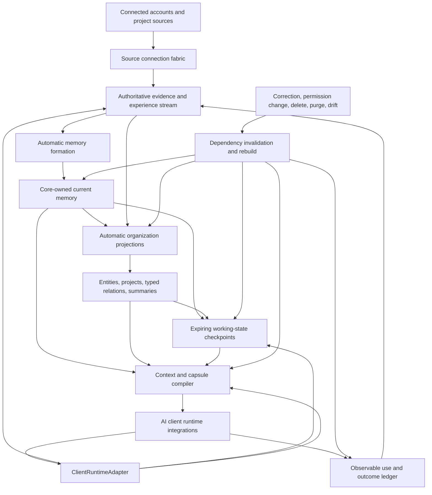

# Zero-Friction Platform Contract

| Field | Value |
|---|---|
| Status | Proposed post-V1 product contract |
| Relationship to V1 | Does not expand or block `0.1.0-beta.3` |
| Authority | The user-owned Core remains the sole canonical authority |
| Normal interaction model | Install once, connect accounts and clients once, then use AI tools normally |

## Executive decision

All The Context must behave like infrastructure rather than a memory-management
application.

After installation and initial authorization, a normal user should not have to
think about ATC, decide what should be remembered, classify information, create
projects, maintain a graph, approve extracted memories, repeatedly import
history, choose retrieval settings, or open the dashboard to keep the system
working.

The product promise is:

> Connect ATC once. It continuously learns from the sources the user authorized,
> organizes that knowledge automatically, supplies the right current context to
> every supported AI, preserves ongoing project state, and applies ordinary
> conversational corrections to future use.

The dashboard remains an optional inspection, correction, recovery, and
administration surface. Requiring routine dashboard use is a product failure.

Zero friction means zero **routine** friction. It does not remove deliberate
security boundaries. Initial authorization, permission expansion,
reauthorization, irreversible purge, damaged-vault recovery, and confirmation
before a consequential memory-derived action may still require the user.

## 1. User experience contract

### 1.1 Normal journey

A normal user journey is:

1. install ATC;
2. connect supported AI clients;
3. connect supported accounts and project sources;
4. choose a small set of privacy and retention defaults; and
5. stop thinking about ATC.

After that, ATC automatically:

- backfills available history;
- synchronizes new activity incrementally;
- records truthful source coverage and connector health;
- extracts durable facts, preferences, decisions, constraints, and corrections;
- retains uncertain material as noncurrent evidence rather than asking the user
  to review it;
- discovers people, projects, components, goals, and relationships;
- preserves temporary working state across sessions and model changes;
- compiles the smallest sufficient context before a supported AI answers;
- captures new direct statements and observable outcomes after interactions;
- invalidates stale summaries, relations, capsules, and working state after a
  correction, permission change, deletion, or purge;
- maintains indexes, projections, backups, updates, and storage health; and
- asks for attention only when a real security or recovery boundary requires it.

### 1.2 Tasks the user must not routinely perform

The normal product must not require the user to:

- press a “remember this” button;
- identify every durable statement manually;
- approve a memory inbox;
- create or select a project before project context can work;
- tag conversations, records, files, or graph nodes;
- draw, repair, or curate graph relationships;
- choose embeddings, rankers, graph traversal settings, or context budgets;
- repeatedly download and import the same provider history;
- tell a supported client when to retrieve context;
- tell a supported client when to store a correction;
- reconcile duplicate or conflicting memories;
- run database maintenance, rebuild indexes, rotate logs, or compact storage;
- inspect connector status during healthy operation; or
- open the dashboard merely to keep memory current.

Advanced controls may exist, but the default experience cannot depend on them.

### 1.3 Legitimate user attention

ATC may interrupt the user only for a bounded class of events:

- initial account or client authorization;
- an account that requires reauthorization;
- a requested permission expansion;
- an ambiguous destructive request;
- irreversible purge;
- recovery when the vault cannot safely repair itself;
- insufficient storage that cannot be resolved automatically;
- a security-relevant connector or client failure; or
- confirmation before a protected consequential action.

Temporary network failures, retryable synchronization errors, routine index
rebuilds, healthy backup completion, and ordinary maintenance should remain
silent.

## 2. Product invariants

### 2.1 Core remains authoritative

Accounts, clients, models, extractors, graph engines, rankers, consolidators,
and external memory systems may submit evidence, candidate observations,
relations, rankings, summaries, checkpoints, or outcomes. They cannot directly
create canonical current truth, expand permissions, assign action force, or
weaken correction and purge.

### 2.2 Imported and connected content is inert

Text from conversations, documents, repositories, issues, messages, tool
output, and external services is untrusted data. It is never executed as an
instruction merely because a connector supplied it.

### 2.3 Authorization precedes all derived work

Permission, lifecycle, validity, deletion, purge, and temporal resolution occur
before relevance ranking, graph traversal, summarization, context compilation,
or disclosure. Unauthorized content must not influence vocabulary, scores,
relations, project identity, summaries, or diagnostics visible to a client.

### 2.4 Derived state is disposable

Indexes, graph edges, entity clusters, summaries, project capsules, working
sets, learned policies, caches, and usage statistics are projections. Every
projection must declare lineage, version, invalidation, rebuild, deletion, and
purge behavior before production promotion.

### 2.5 Corrections close future influence

A correction is incomplete if the canonical record changes while an old graph
edge, summary, capsule, checkpoint, procedure, or supported client continues to
treat the displaced value as current.

### 2.6 Silence is not permission to hide failure

Healthy operation should be quiet. Materially incomplete source coverage,
expired authorization, unsafe repair failure, and unsupported guarantees must
remain visible in bounded health state and surface one actionable notification
when user action is required.

## 3. Platform architecture



The platform has eight cooperating layers.

### 3.1 Source connection fabric

A `SourceConnector` gathers evidence from one authorized account or source.
Examples include conversation history, repositories, files, issues, task
systems, messages, calendars, and tool-result streams.

The common connector contract should cover:

```text
connect
authorize
initial_snapshot
incremental_sync
checkpoint
coverage
health
reauthorize
disconnect
source_delete
```

Every connector declares:

- identity and version;
- acquisition method;
- account or source identity;
- supported data families;
- initial-history capability;
- incremental-sync capability;
- cursor and replay semantics;
- permission and data-egress behavior;
- expected freshness;
- coverage limitations;
- retry and backoff behavior;
- deletion and disconnection semantics; and
- whether user action is required.

Official APIs and OAuth are preferred where they provide a truthful, stable
path. Local application integrations and export-directory observation may be
used where appropriate. Manual archive import remains an honest fallback when
a provider offers no reliable continuous path. ATC must not silently add
fragile scraping merely to claim automatic synchronization.

### 3.2 AI client runtime integration

A source connector gathers evidence. A `ClientRuntimeAdapter` supplies and
captures context at the point an AI is actually working. These are separate
responsibilities.

A strong runtime adapter exposes lifecycle events such as:

```text
session.start
user_turn.received
context.requested
generation.before
tool.before
tool.after
response.before_emit
response.after_emit
compaction.before
task.checkpoint
task.complete
session.end
```

The adapter supplies bounded task, workspace, repository, conversation, and
client identity. ATC compiles context before generation rather than depending
only on the model to remember to call a tool.

Directly observed user turns provide stronger witness evidence than model
summaries. Tool calls and results provide observable experience without
retaining hidden reasoning.

### 3.3 Evidence and experience stream

The observation ledger remains the durable-context policy surface. A broader
normalized event stream records lower-level evidence and observable experience
without automatically declaring it durable truth.

Representative event families include:

```text
user_turn_observed
assistant_response_observed
document_changed
repository_commit_observed
issue_updated
tool_called
tool_result_observed
task_started
task_checkpointed
task_completed
user_correction_observed
connector_sync_completed
```

Events are immutable, source-linked, bounded, idempotent, and covered by
retention and purge policy. Background formation workers may propose durable
observations from events, but only Core decides what becomes current.

### 3.4 Automatic memory formation

Memory formation should distinguish at least:

- explicit user claims and corrections;
- source-grounded factual observations;
- preferences and interaction instructions;
- project goals, decisions, and constraints;
- episodic experiences and outcomes;
- temporary working state;
- inferred relationships and summaries; and
- candidate procedures.

These forms have different authority and lifecycle rules. A successful-looking
agent action is not automatically a reusable procedure. A user preference is
not world evidence. A provider summary is not equivalent to a directly
observed user statement.

Extraction may use deterministic rules, local models, external models, or
external systems through reviewed adapters. Every path must preserve origin,
source, model or extractor version, confidence, and reproducibility limits.

### 3.5 Automatic organization

ATC should organize current authorized evidence without requiring user curation.
Derived organization may include:

- entity resolution and aliases;
- stable project identities;
- typed temporal and dependency relations;
- bounded summaries;
- topic and domain classification;
- duplicate and conflict diagnostics;
- project capsules; and
- retrieval indexes.

A general graph is not mandatory infrastructure. Typed relation families must
individually earn production use against simpler lexical, event, or structured
baselines.

### 3.6 Working-state continuity

Working state is not durable personal truth. It records the current objective,
completed work, active artifacts, hypotheses, blockers, open questions, and
next likely action for a task or project.

Working state must:

- use stable task and project identities;
- be versioned and expiring;
- remain separate from canonical facts and preferences;
- survive supported session compaction and client changes;
- declare source and project dependencies;
- invalidate on relevant source drift;
- distinguish completion, abandonment, expiry, and supersession; and
- never claim that hidden model state was preserved.

### 3.7 Context and capsule compiler

The compiler produces the smallest sufficient current context for a particular
client, task, project, time, permission set, and character budget.

The required order is:

```text
authorization
→ temporal and lifecycle resolution
→ epistemic role and task applicability
→ lexical/structured/graph candidate generation
→ conflict and support closure
→ budgeted set selection
→ immediate version re-read
→ issue receipt
```

Graph traversal, learned ranking, and summaries may expand or order candidates.
They cannot weaken upstream policy.

### 3.8 Observable use and outcomes

ATC should eventually measure whether supplied context improved an observable
answer, plan, decision, or action. The ledger records memory assignment,
acknowledgement, use, observable outcome, correction, and invalidation without
storing hidden chain-of-thought.

Outcome evidence supports later consolidation and procedural learning. It does
not grant truth authority to an agent’s self-evaluation.

### 3.9 Invisible operations

The platform should automatically manage:

- startup and bounded self-recovery;
- connector scheduling and retries;
- cursor persistence and idempotent replay;
- index, graph, summary, and capsule rebuilds;
- encrypted backup scheduling and retention;
- update verification, installation, health checks, and rollback where
  supported;
- storage budgeting and bounded cleanup;
- SQLite checkpoint and compaction maintenance;
- redacted diagnostics and bounded log retention; and
- health notification deduplication.

## 4. Integration capability levels

ATC should describe integration strength honestly.

| Level | Capability | Guarantee |
|---|---|---|
| L0 | Ordinary MCP tools | Best-effort model-initiated retrieval and observation submission |
| L1 | Pre-turn and post-turn runtime hooks | Context is supplied before generation and direct user turns are observed |
| L2 | Tool, compaction, task, and outcome checkpoints | Working state and observable experience survive supported session boundaries |
| L3 | Synchronous pre-effect checkpoint | A conforming host can enforce a current memory-derived confirmation, prerequisite, or block before a declared transition |

L0 remains useful for broad compatibility. It must not be described as providing
the same capture, use, or consequence guarantees as lifecycle-aware adapters.

## 5. Automatic project intelligence

Projects are a critical organization boundary, but users should not administer
them manually.

ATC should infer projects from signals such as:

- repository and workspace identity;
- package, product, and application names;
- issue and pull-request references;
- branches, commits, documents, and artifacts;
- recurring goals, components, constraints, and decisions;
- explicit phrases such as “for my red-teaming project”; and
- established links between conversations and project sources.

Core assigns a stable opaque project ID. Human-readable names are aliases, not
identities. Projects may be renamed, merged, split, archived, or corrected
without losing history.

When project assignment is uncertain, ATC should preserve the evidence and wait
for stronger signals rather than interrupting the user or forcefully creating
current project truth. A natural-language correction such as “that belongs to
project B, not project A” must repair future organization.

### 5.1 Project memory graph

The project graph is a typed, rebuildable projection over authorized Core
records, source snapshots, and working state.

Useful node families include:

```text
project
goal
decision
constraint
component
repository
document
issue
experiment
result
task
person
artifact
```

Initial relation families may include:

```text
belongs_to
depends_on
blocks
implements
supersedes
supports
conflicts_with
tested_by
failed_because
requires
owned_by
derived_from
```

Each relation records authority class, provenance, project identity, dependent
record versions, validity, extractor or compiler version, and projection
revision. A generic production `related_to` edge is prohibited unless a later
benchmark defines a precise useful meaning.

The graph must never be a second authority. Model-inferred edges remain shadow
or tentative until their relation family and admission path pass dedicated
promotion gates.

### 5.2 Project Context Capsule

A Project Context Capsule is a structured disposable projection containing the
smallest useful set of:

```text
project identity
current objective
active constraints
relevant preferences
major decisions and rationale
architecture and components
current working state
recently completed work
blockers
open questions
known failed approaches
next likely actions
source references
freshness and dependency revision
```

The client runtime supplies task and workspace signals. ATC resolves the project
and compiles the capsule automatically. The user does not request, curate, or
approve it.

A capsule includes a project revision, `as_of` time, compiler version,
dependency list or digest, budget use, omission counts, and freshness state. A
changed dependency invalidates the capsule.

## 6. Correction, deletion, and purge closure

Every derived artifact must be dependency-bound.

When a record, event, permission, source, project assignment, connector
snapshot, policy generation, or target schema changes, ATC must identify and
invalidate affected:

- current records;
- graph edges and entity aliases;
- summaries and project capsules;
- working checkpoints;
- procedures and cues;
- indexes and caches;
- use and outcome statistics; and
- already-issued state for supported connected clients.

Optimized repair must be checked against a full-rebuild oracle before it becomes
a production optimization. Purge remains fail-closed: no stale descendant may
remain reachable merely because incremental repair failed.

## 7. Privacy and security boundaries

Zero friction cannot mean silent over-collection.

The platform must preserve:

- explicit account and client authorization;
- least-privilege scopes;
- visible source coverage and limitations;
- local-first authority;
- truthful network and data-egress declarations;
- inert treatment of imported instructions;
- secret refusal before durable direct-payload persistence;
- minimum necessary disclosure;
- bounded diagnostics without raw personal context;
- revocation and account disconnection;
- reversible ordinary deletion; and
- deliberate irreversible purge.

Connecting an account authorizes only the declared acquisition scope. It does
not authorize ATC to execute content, broaden client access, or infer unlimited
cross-domain applicability.

## 8. User interface contract

The dashboard is optional during healthy operation. Its primary purposes are:

- inspect what ATC knows and why;
- view account and client health;
- correct, delete, restore, or purge information;
- inspect project state and dependencies;
- manage permissions and retention;
- create and restore backups; and
- troubleshoot bounded failures.

The default dashboard should prioritize actionable state rather than exposing
internal machinery. A graph visualization may exist as an optional inspector,
but the useful questions are:

- Why is this context present?
- What supports it?
- What conflicts with it?
- What depends on it?
- What changed?
- What would be invalidated by a correction or deletion?
- Does any account require attention?

## 9. Product success and acceptance

The principal product metric is successful current behavior with no
unauthorized, stale, or purged influence. Retrieval metrics remain stage-level
diagnostics.

A credible zero-friction end-to-end acceptance journey is:

1. install ATC on a clean supported machine;
2. connect at least two supported AI clients and multiple supported sources;
3. backfill history without manual classification;
4. synchronize new activity without repeat imports;
5. begin work on an existing project in one client;
6. infer the project without requiring manual selection;
7. supply current goals, constraints, decisions, failed approaches, and working
   state before generation;
8. capture a new directly stated project decision without a save-memory command;
9. move to another supported client and resume with updated project state;
10. apply a natural-language correction;
11. invalidate the displaced record, graph relations, capsule, working state,
    and future client context;
12. recover from restart and a simulated connector interruption without
    duplication; and
13. complete the journey without routine dashboard use.

Promotion gates include:

- zero unauthorized disclosure or influence;
- zero deleted or purged resurrection;
- deterministic correction and invalidation;
- truthful incomplete-coverage handling;
- no mandatory manual classification or memory review;
- no routine dashboard dependency;
- bounded latency, storage, network, model, and monetary cost;
- measurable task or outcome improvement over simpler baselines; and
- no material regression on ordinary nonproject tasks.

## 10. Explicit non-goals

This contract does not require:

- a universal memory algorithm;
- one graph representation for every task;
- a graph database in the shared runtime;
- automatic execution of connected content;
- silent browser scraping to imitate unsupported provider APIs;
- hidden chain-of-thought collection;
- automatic procedure promotion from a single agent run;
- a dashboard-centered workflow;
- manual ontology or project administration;
- remote or mobile access before the local automatic loop works; or
- production promotion of learned or external systems without comparative
  evidence and lifecycle closure.

## 11. Relationship to V1

`0.1.0-beta.3` remains the immediate release target and the foundation for this
contract. Its same-device Core, provider imports, automatic policy, retrieval,
client configuration, backup, recovery, and release acceptance must finish
without adding post-V1 connector, graph, working-state, or outcome claims.

Post-V1 implementation follows the evidence-gated sequence in
[`ZERO_FRICTION_EXECUTION_PLAN.md`](ZERO_FRICTION_EXECUTION_PLAN.md).
