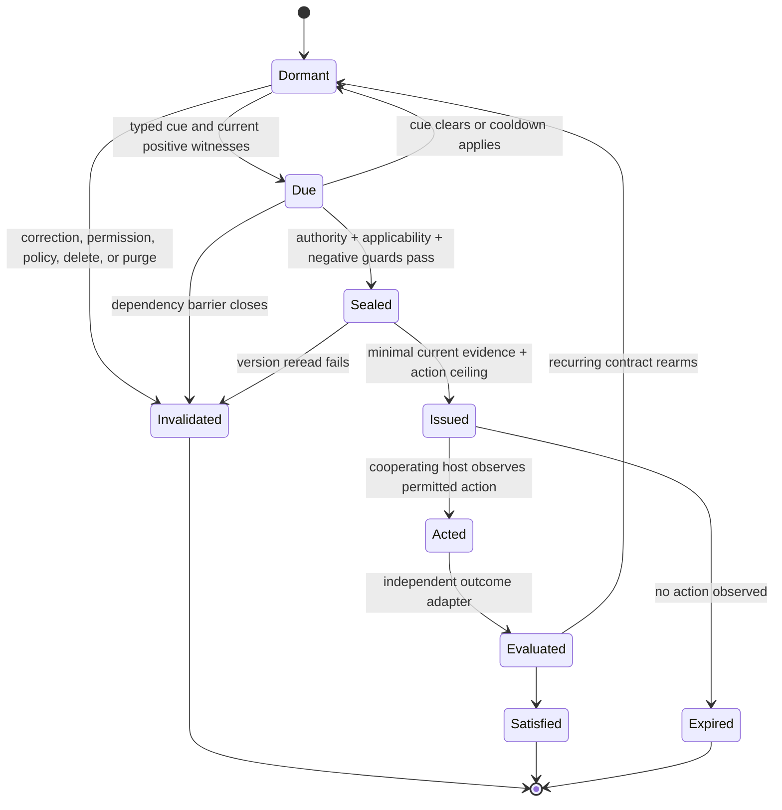

# ATC Memory Lab Wave 4 integrated results

## The retained unit is a revocable memory transaction, not a retrieved fact

| Field | Value |
|---|---|
| Date | July 23, 2026 |
| Coordinator branch | `codex/memory-lab-wave4-coordinator` |
| Immutable worker base | `f545c37157845f0bd402215719cb8c747b7fc21d` |
| Governance | Four fresh visible `gpt-5.6-sol` worktree tasks; coordinator-only integration |
| Data | Hand-authored symbolic fixtures and disposable synthetic Core stores |
| External execution | None; no competitor code, model, provider, operator Core, personal context, or real action |
| Status | M3 and M1 research contracts retained at coordinator-reproduced `L2`; five production semantics unsupported and one not exercised; no production promotion |

## Executive judgment

Wave 4 advances the architecture, but it does not establish that ATC has
solved AI memory.

Two bounded mechanisms survived their frozen falsifiers:

1. dependency-complete withdrawal and repair matched an independently coded
   full rebuild across all six declared derived surfaces while evaluating 99%
   fewer nodes in the synthetic work control; and
2. a privacy-minimized ledger reconstructed assignment, supply,
   acknowledgement, host-observed use, action, independently observed outcome,
   and invalidation without storing raw supplied context or hidden reasoning.

The production-Core probe is the brake on premature promotion. Generic
epistemic role, project-and-domain applicability, dependency lineage,
decay/retirement, and procedure precondition/transfer semantics are
unsupported. Exact same-identifier recreation after terminal purge is not
exercisable through the public input API.

The retained architecture is therefore:

> A memory use is a revocable transaction. Core first resolves canonical
> evidence, authority, currentness, and applicability; a compiler discloses
> the minimum sufficient projection; every derived influence remains
> withdrawable; any permitted action is capped; and only host-observable use
> and independently observed outcomes enter the ledger.

This is stronger than retrieval, but it is still a research contract.

## Integrated result matrix

| Cell | Evidence | Result | Coordinator decision |
|---|---|---|---|
| F02 frozen falsification oracle | `L0` independent specification | 15 M3 cases, 16 M1 cases, six declared derived surfaces, frozen before M3/M1 dispatch | Preserve as the grading authority |
| M3 influence closure | `L2` deterministic symbolic | 15/15 cases pass; all hard-safety counts zero; exact optimized/full-rebuild agreement; 99% evaluated-node reduction | `RETAIN_M3_CONTRACT_AND_OPTIMIZATION` for research only |
| E02 production semantic gaps | `L2` isolated production-path observation | Five `UNSUPPORTED`, one `NOT_EXERCISED`; 15/15 boundary probes match frozen expectations | Implement missing semantics in small Core-owned slices before any mechanism promotion |
| M1 observable-use ledger | `L2` deterministic symbolic | 16/16 cases pass; all hard-safety counts zero; exact replay and aggregate rebuild; paired-vault differences zero | `RETAIN_M1_OBSERVABLE_LEDGER` for research only |

`L2` means that the coordinator reviewed the scoped worker diff and reproduced
the deterministic result on the integrated branch. It does not mean
cross-platform, stochastic-model, external-system, real-user, or production
evidence.

### Execution-origin validity incident

The workers discovered that the machine's installed editable Python package
could resolve to a different local checkout. Any receipt produced before
worktree-origin verification was invalidated and is not counted as evidence.
Every accepted run bound `PYTHONPATH` to the exact worker or coordinator
worktree, verified imported module origins, and serialized only
repository-relative paths. This incident did not change a result, but it
changed which executions were admissible.

## 1. M3: dependency-complete closure survived the bounded falsifier

M3 models six derived surfaces:

1. retrieval selection;
2. issued context;
3. procedure;
4. selection cache;
5. working state; and
6. use statistics.

It applies correction, scope narrowing, permission revocation, ordinary
delete, terminal purge, and policy-generation changes over chain, fan-out,
fan-in, shared-descendant, illegal-cycle, and illegal-cross-scope topologies.
Publication is closed before repair. An optimized affected-descendant rebuild
is compared with a separately coded full rebuild.

### Decisive result

| Metric | Result |
|---|---:|
| Frozen F02 cases | 15/15 pass |
| Declared-surface coverage | 1.0 |
| Published stale descendants | 0 |
| Optimized/full-rebuild mismatches | 0 |
| Terminal-purge residue | 0 |
| Fail-open or partial-repair publication | 0 |
| Stale-writer acceptance | 0 |
| Illegal-edge acceptance | 0 |
| Ordinary-delete/purge conflation | 0 |
| Optimized descendants scanned/rebuilt | 120/120 |
| Full-rebuild nodes evaluated | 12,000 |
| Evaluated-node reduction | 0.99 |

The coordinator found an important blind spot during review: checking only
published artifacts was insufficient to establish terminal-purge closure. The
accepted result scans the full declared inspectable boundary, including graph
inventory. Across 20 repeats, it verifies 140 exclusive-descendant checks
(seven graph slots per repeat) and 80 shared-recipe checks (four recipes per
repeat) reconstructed solely from retained support. These are repeated checks,
not 220 unique graph nodes.

The ablations are decisive within the fixture. Repair-before-withdrawal,
direct-edge-only repair, content-only lineage, generation-only barriers,
inventory-only validation, raw-record-only purge, and an injected missing
inventory edge all preserve stale publication, mismatch, residue, or
fail-open failures.

### Novelty boundary

Barrier-first cascade repair is not an ATC novelty claim.
[MemoRepair](https://arxiv.org/abs/2605.07242) already formalizes withdrawal
before repair, predecessor-closed republication, and complete-provenance
cascade repair across summaries, caches, skills, and procedures. The narrower
ATC candidate is the composition of that kind of closure with Core-owned
scope, permission, policy generation, currentness, ordinary-delete versus
terminal-purge semantics, exact full-rebuild equivalence across ATC surfaces,
and privacy-bounded use/outcome receipts.

## 2. E02: the frozen production Core does not yet supply the required semantics

E02 froze its expected classifications before execution, then used disposable
SQLite Core stores and public or stable Python paths. Fifteen adversarial
boundary probes matched the frozen matrix, with no evaluation errors.

| Required semantic | Classification | Decisive observation |
|---|---|---|
| Generic epistemic role distinct from kind | `UNSUPPORTED` | Candidate/search schemas reject role fields; kind is not a valid substitute |
| Project **and** domain applicability | `UNSUPPORTED` | No first-class domain predicate; project labels and `current_project` do not form the required hard gate |
| Dependency lineage and invalidation | `UNSUPPORTED` | Dependency fields are rejected; dependency-shaped metadata is inert after source correction |
| Eviction, decay, and procedure retirement | `UNSUPPORTED` | Expiry affects eligibility but not storage eviction, confidence decay, or procedure retirement |
| Same identifier after terminal purge | `NOT_EXERCISED` | Public candidate input does not accept caller-selected record IDs |
| Procedure preconditions and transfer applicability | `UNSUPPORTED` | Typed fields are rejected; equivalent structured metadata is inert |

`UNSUPPORTED` is a positive absence finding, not a passed conformance test.
`NOT_EXERCISED` records a public-API boundary, not a favorable result.

The smallest safe production slice is an optional, explicit, Core-owned
generic epistemic role that round-trips through candidate, record, version,
search, replication, export, and import paths. Legacy values remain unknown;
role must never be inferred from kind. This slice is necessary but not
sufficient.

## 3. M1: observable memory use is reconstructable without chain-of-thought

M1 keeps seven observable stages distinct:

`assigned -> supplied -> acknowledged -> observed_use -> action -> outcome`

Any active transaction may instead enter `invalidated`. Each downstream event
binds the exact canonical record ID and version, snapshot, policy generation,
principal capability view, and observable predecessors. The ledger rejects
raw prompts, raw supplied context, hidden reasoning, model self-report as
causal proof, unknown parents, impossible transitions, conflicting replays,
and fabricated outcomes.

### Decisive result

| Metric | Result |
|---|---:|
| Frozen F02 cases | 16/16 pass |
| Required-zero safety metrics | all zero |
| Accepted-event replay mismatches | 0 |
| Aggregate-rebuild mismatches | 0 |
| Purge-compaction replay mismatches | 0 |
| Paired-vault differences across counts, reasons, cursor shape, timing, aggregates, and receipts | 0 |
| Paired episode arm executions | 200 |
| Controlled assignments | 40 |

The paired episodes preserve signs that a net total would conceal:

| Episode kind | Observational association | Controlled-omission effect |
|---|---:|---:|
| Applicable required memory | +10 | +10 |
| Harmful memory | -10 | -10 |
| Authorized but inapplicable distractor | 0 | 0 |
| Redundant with task input | 0 | 0 |

Acknowledgement and host-observed dependence remain observational. Only the
preassigned controlled omission is reported as an experimental effect. No
event may promote itself to causal evidence.

The coordinator also found and closed a purge flaw before promotion. Ordinary
accepted events are append-only. Terminal purge is an explicit destructive
privacy compaction: affected records, events, and indexes are removed from
every declared inspectable surface. Replay resumes from only an aggregate
identity-generation barrier and purge count. That exception is a required
privacy qualification, not an implementation detail to hide.

## 4. Independent post-result review

The same worker that committed the frozen F02 oracle before M3/M1 dispatch
performed the last promotion-stage review against the coordinator-integrated
artifacts. It graded:

- M3: 15 `PASS`, 0 `HOLD`, 0 `FAIL`;
- M1: 16 `PASS`, 0 `HOLD`, 0 `FAIL`;
- M3 verdict: `RETAIN_M3_CONTRACT_AND_OPTIMIZATION`; and
- M1 verdict: `RETAIN_M1_OBSERVABLE_LEDGER`.

The reviewer did not treat report self-labels as grades. It inspected the
implementations and tests read-only, preserved E02's negative production
findings, and narrowed the accepted claims:

- M3's reverse index is code-audited and rebuilt after purge, but it is not
  directly serialized in the research privacy-boundary receipt.
- M1 purge compaction is in-memory symbolic evidence, not durable proof over
  SQLite tables, WAL, backups, replication, exports, telemetry, or clients.
- Controlled omission is fixture-specific, and no ledger event proves hidden
  model use or general causation.
- The review is not an exhaustive scholarly or legal novelty search.

The full per-case grading is in
[the independent review](ATC_MEMORY_LAB_WAVE4_INDEPENDENT_REVIEW_2026-07-23.md).

## 5. What the current research horizon changes

Recent primary research reinforces four conclusions:

- Final-answer accuracy is too coarse. [MemOps](https://arxiv.org/abs/2607.12893)
  evaluates explicit lifecycle-operation traces, while
  [MemTrace](https://arxiv.org/abs/2605.28732) traces error propagation through
  executable memory-evolution graphs.
- Retrieval is not use. [Mem2ActBench](https://arxiv.org/abs/2601.19935)
  evaluates memory-grounded tool choice and parameter grounding, and
  [MemoryArena](https://arxiv.org/abs/2602.16313) couples memory formation to
  later action across interdependent sessions.
- Credit must bind observable evidence. [Fine-Mem](https://aclanthology.org/2026.acl-long.900/)
  anchors reward attribution to memory operations, while
  [experience-following research](https://aclanthology.org/2026.acl-long.27/)
  shows that similar retrieved experiences can propagate errors or replay a
  superficially successful but misaligned trajectory.
- Forgetting must cover derived influence, not only raw rows.
  [Memora](https://arxiv.org/abs/2604.20006) penalizes obsolete-memory use, and
  deployment-time memorization research reports that raw-only deletion can
  leave derived summary residue
  ([paper](https://arxiv.org/abs/2606.10062)).

These are not reasons to copy an entire framework. They are reasons to adopt
good mechanisms behind ATC's authority boundary: explicit lifecycle traces,
complete lineage, independent action/outcome observation, full-pipeline purge,
and strong external baselines.

## 6. New direction: Evidence-Compiled Prospective Memory

The next gap is not larger recall. It is memory that knows **when** it is
allowed and required to become relevant.

[PM-Bench](https://arxiv.org/abs/2607.12385) reports that the best evaluated
configuration reaches only 65.1 F1 on deferred intentions and that no strategy
dominates across models.
[TriggerBench](https://arxiv.org/abs/2606.23459) separately finds a
precision-recall tradeoff, false-alarm risk, and attentional fragility for
prospective memory. These results point to a product layer that neither a
retriever nor an always-on prompt can safely provide.

The proposed ATC mechanism is an **Event-Contingent Memory Transaction**:

Each transaction contains only typed, Core-owned fields:

- exact supporting evidence IDs and versions;
- explicit principal, project, domain, and policy generations;
- a bounded cue predicate over authorized event metadata;
- positive witnesses, negative guards, expiry, cooldown, and rearm rules;
- a maximum action force such as notify, suggest, draft, or
  confirmation-required execute;
- dependency closure over every compiled trigger, projection, cache, and
  prepared action; and
- observable issue, action, outcome, and invalidation receipts.

The mechanism has three compilers:

1. **when compiler** — turns an explicitly accepted intention into a bounded
   deterministic cue monitor;
2. **what compiler** — discloses the minimal current authorized evidence only
   after the cue is due; and
3. **force compiler** — caps the consequence and requires fresh confirmation
   for protected actions.

The unusual property is **dormant non-disclosure**. A latent intention does not
continuously inject its content into model context. Typed cue evaluation runs
first; only a due and still-authorized transaction can cause minimal evidence
compilation. This reduces both always-remind false alarms and unnecessary
personal-context exposure.

M2 supplies the sealed minimal projection, M3 supplies revocable influence
closure, and M1 supplies privacy-bounded observable use and outcomes. None of
those components alone implements prospective memory.

### Frozen first experiment

The first prospective experiment should compare:

1. no memory;
2. long context;
3. a simple explicit task table and deterministic scheduler;
4. retrieval-only memory;
5. Evidence-Compiled Prospective Memory;
6. the same mechanism without negative guards;
7. without current-version reread;
8. without dependency closure; and
9. without an action ceiling.

Fixtures must include delayed time cues, event cues, implicit and overloaded
cues, negative controls, correction after scheduling, scope change,
permission revocation, policy change, ordinary delete/restore, terminal purge,
duplicate cues, offline catch-up, time-zone changes, recurrence, conflicting
intentions, harmful stale instructions, and protected actions.

Hard gates are:

- zero unauthorized, stale, deleted, purged, or wrong-domain influence;
- zero protected-action execution without fresh confirmation;
- zero duplicate execution for one-shot intentions;
- zero paired-vault differences caused by inaccessible canaries;
- exact full-rebuild equivalence after every canonical mutation; and
- prospective precision/recall/F1 reported separately from action success,
  disclosure, latency, outcome benefit, and false alarms.

A simple scheduler is the strongest first control. The new mechanism advances
only if evidence compilation and closure add measurable safety or outcome
value beyond scheduling alone.

## 7. Product implementation order

No research prototype should be wired into production as one large merge. The
smallest safe sequence is:

1. add optional explicit generic epistemic role end to end;
2. add Core-owned project-and-domain applicability with fail-closed unknowns;
3. add version-bound dependency and influence inventory;
4. dual-run optimized M3 closure against a full-rebuild shadow oracle;
5. add the M1 observable ledger and explicit privacy-compaction boundary;
6. implement the prospective kernel under a notification-only action ceiling;
7. add model/client/external-system and cross-platform cells; and
8. only then consider stronger action or learned retention policies.

Competitor code may enter later through a dedicated supplier cell only after
pinning the repository revision, confirming license and dependency provenance,
scanning the tree, isolating execution, and proving that it cannot create
canonical records or bypass Core. Wave 4 did not download or execute
competitor code because its frozen cells prohibited external execution.

## 8. What Wave 4 does not establish

- It does not prove completeness over unknown production-derived surfaces.
- It does not test a real model, client, provider, external action, or user.
- It does not establish causal model use from acknowledgement or a host
  artifact.
- It does not establish cryptographic privacy, wall-clock side-channel
  resistance, or physical erasure.
- It does not supply the five unsupported production semantics.
- It does not establish cross-platform behavior for the new research modules.
- It does not establish that Evidence-Compiled Prospective Memory is novel in
  every component or superior to a scheduler; that is the next falsifiable
  question.

Wave 4 therefore advances a disciplined architecture and a new experiment,
not a solved-memory claim.

## 9. Integrated validation

The coordinator bound imports to the isolated worktree and completed:

- 49 focused Wave 4 oracle, governance, M3, E02, and M1 tests;
- byte-equal M3 JSON/Markdown and M1 JSON/Markdown report reproduction;
- semantically equal E02 JSON reproduction across its ten repeats;
- Ruff over the repository;
- strict mypy over 68 source files;
- documentation-link validation;
- `git diff --check`; and
- the full Windows Python 3.14.3 suite: 652 passed and four expected
  host-limited symlink tests skipped.

This is one-host integrated evidence. The Wave 4 research modules have not yet
run in the repository's hosted Python 3.12 Windows, macOS, and Linux matrix.
