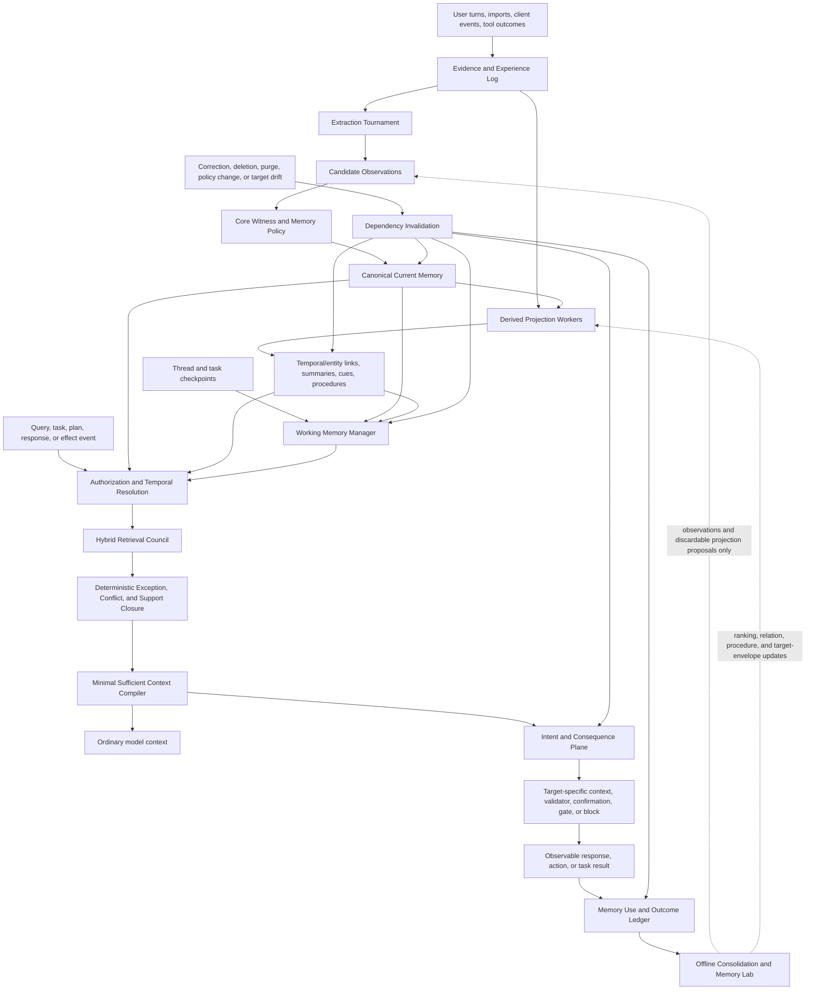

# ATC Memory Reliability Architecture

## A hybrid product and research program for solving AI memory

| Field | Value |
|---|---|
| Working name | ATC Memory Reliability Stack |
| Version | 0.1 |
| Date | July 23, 2026 |
| Repository baseline | `e5cb50a518aff571af46238682d8f7a082ca19f0` |
| Status | Research and product-direction proposal; not accepted production architecture or implemented behavior |
| Internal inputs | Current ATC direction, From Recall to Reaction, Relational Potential Memory, Behavioral Memory Virtualization, and Consequence-Closed Context |
| External inputs | Mem0, Graphiti/Zep, Hindsight, Letta/MemGPT, LangGraph/LangMem, HippoRAG, A-MEM, MemOS, ReasoningBank, and current memory benchmarks |

**North star:** An authorized experience that matters should become useful
knowledge, working state, or procedure; appear at the right task or action with
minimum necessary disclosure; improve outcomes across supported agents; be
correctable once; and leave an inspectable, purgeable account of what happened.

---

## Executive decision

The earlier [Consequence-Closed Context](CONSEQUENCE_CLOSED_CONTEXT.md) proposal
has merit, but it is not a complete solution to AI memory. It addresses the
last and most differentiated part of the lifecycle: making memory affect a
consequence and preventing a corrected memory from remaining operationally
current inside a conforming workflow.

A complete product also needs to:

- retain raw experience without confusing it with truth;
- extract durable knowledge without filling the vault with model guesses;
- represent semantic, episodic, procedural, relational, and working memory;
- consolidate experience over time;
- resolve changes, conflicts, and temporal validity;
- retrieve a sufficient set rather than isolated similar snippets;
- carry working state across sessions and agents;
- learn useful procedures from successful and failed outcomes;
- know when not to remember, retrieve, disclose, or act;
- correct, delete, and purge every dependent artifact; and
- prove an end-to-end benefit over long context and strong existing systems.

ATC should therefore pursue a **two-plane product** supported by a shared
evaluation lab:

1. **Memory Plane** — governed evidence, current knowledge, experience,
   procedures, working state, consolidation, and recall.
2. **Intent and Consequence Plane** — a small, adequately witnessed subset of
   preferences and directives compiled into event-bound obligations for
   cooperating clients.
3. **ATC Memory Lab** — reproducible adapters and benchmarks that make ATC,
   external systems, simple baselines, and new research compete under the same
   model, data, budget, and scoring conditions.

The implementation rule is:

> Adopt before invent, benchmark before promote, and never outsource authority.

ATC should reuse proven open implementations or their mechanisms wherever they
win. External extractors, graph engines, retrievers, consolidators, and memory
models may produce observations or discardable projections. They may not
directly establish current user truth, expand permissions, assign behavioral
force, or weaken correction and purge.

---

## 1. What “solving AI memory” must mean

No single benchmark score or vector index solves memory. A useful definition is
an end-to-end reliability contract.

| Capability | A credible system must demonstrate |
|---|---|
| Capture | Important user statements, experiences, outcomes, and changes enter the system with known provenance and low false-write rates |
| Epistemic separation | Evidence, explicit claims, inference, provider summaries, agent experience, and confirmed directives retain different authority |
| Memory forms | Working, episodic, semantic, procedural, and relational information have distinct schemas and update semantics |
| Consolidation | Repetition, summaries, links, and procedures improve future use without silently replacing source evidence |
| Temporal truth | The system can answer what is current, what was true at a past time, what changed, and why |
| Recall | It retrieves a sufficient, noncontradictory, minimally redundant set under scope, time, permission, and token constraints |
| Working continuity | A task can resume after a session, compaction, client change, or model change without pretending that all prior model state is still current |
| Experiential learning | Successful and failed outcomes produce reusable procedural knowledge without converting self-judgment into user truth |
| Consequence | Retrieved memory measurably improves an answer, decision, plan, or action rather than merely appearing in a prompt |
| Abstention | The system can say that evidence is absent, conflicting, stale, unauthorized, or too uncertain |
| Correction | One correction changes future canonical state, derived projections, working state, and supported downstream behavior within a declared boundary |
| Forgetting | Eviction, ranking decay, consolidation, soft deletion, and irreversible purge remain distinct operations |
| Governance | Provenance, permissions, minimum disclosure, untrusted-input handling, inspection, backup, and purge remain enforceable |
| Efficiency | Quality gains survive fixed model, context, latency, storage, and monetary budgets |

The product has not solved memory if it remembers facts but repeats failed
workflows, retrieves the right preference but the agent ignores it, updates the
database while a live agent continues from stale state, or improves a benchmark
by disclosing the user's entire history.

The practical product promise should be:

> Tell or show ATC once. Supported agents get the right current context where it
> matters. Correct it once. Future conforming checkpoints stop treating the old
> version as current. ATC can show why without exposing unrelated personal data.

---

## 2. ATC’s actual starting position

ATC already has a stronger governance substrate than a generic memory library:

- one user-owned, authoritative local Core;
- raw-source preservation and resumable provider ingestion;
- observations separated from current context;
- deterministic, versioned automatic policy;
- applied, reinforced, tentative, ignored, and staged dispositions;
- provenance, history, temporal validity, permissions, reversible deletion,
  restoration, and separate purge;
- Retrieval V3 with authorization and time before relevance;
- deterministic lexical retrieval and set-level compilation;
- support, conflict, duplicate, mandatory-preference, and budget constraints;
- local MCP clients and cross-platform desktop packaging; and
- no hosted V1 data plane or second memory authority.

Those are durable advantages. They are not yet a complete memory product.

### 2.1 Highest-leverage gaps

| Stage | Current state |
|---|---|
| Preserve evidence | Strong |
| Govern and correct current records | Strong |
| Retrieve on controlled synthetic fixtures | Strong |
| Attest that bytes came from a user turn | Incomplete; the direct client still asserts this basis |
| Reject direct secrets before durable payload storage | Not implemented |
| Preserve every policy transition append-only | Not implemented |
| Extract implicit durable memory from real conversations | Deliberately conservative and partial |
| Represent agent experiences and outcomes | Not first-class |
| Maintain resumable cross-agent working state | Not first-class |
| Build temporal and relational projections | Limited deterministic support relationships, not a general derived memory graph |
| Learn procedures from success and failure | Not implemented |
| Activate memory at an action or plan checkpoint | Research only |
| Verify cross-provider behavioral effect | Research only |
| Repair already-issued client state after correction | Research only |
| Provide secure direct-Core remote continuity | Pairing and encrypted transport remain missing |
| Prove broad user value | No public beta or real-world memory-quality evidence yet |

Three foundation repairs should precede any high-force memory research:

1. replace the force-bearing `explicit_user_statement` assertion with bounded
   witness classes;
2. refuse direct secret-like payloads before placing raw content in the durable
   observation ledger; and
3. make policy-decision transitions append-only while retaining a convenient
   current projection.

These repairs are useful even if every learned or consequence-oriented
experiment later fails.

---

## 3. What to adopt from existing systems

The point of this survey is implementation selection, not novelty theater.
Claims below describe public papers, repositories, and documentation as of
July 23, 2026. Reported benchmark numbers are vendor or author evidence until
reproduced in the ATC Memory Lab.

| System | Proven or promising mechanism | ATC integration mode | Boundary |
|---|---|---|---|
| [Mem0](https://github.com/mem0ai/mem0) and its [v3 notes](https://docs.mem0.ai/changelog/highlights) | Add-only LLM extraction, hash deduplication, semantic + BM25 + entity retrieval, built-in entity links, temporal query handling, and reversible search-time decay | First external extraction/retrieval baseline; adapt additive extraction and hybrid ranking patterns | Mem0 output becomes observations or shadow results, never current truth |
| [Graphiti](https://github.com/getzep/graphiti) / [Zep paper](https://arxiv.org/abs/2501.13956) | Raw episodes, entities, bitemporal fact edges, evolving summaries, and hybrid semantic/keyword/graph retrieval | Temporal-graph reference implementation and optional lab adapter; copy the data-model lessons before adopting its deployment stack | Graph facts and summaries remain derived projections linked to Core records and episodes |
| [Hindsight](https://github.com/vectorize-io/hindsight) / [ACL demo](https://aclanthology.org/2026.acl-demo.27/) | Separation of world facts, experiences, observations, and opinions; retain/recall/reflect; hybrid vector/keyword/graph/time retrieval | Strong end-to-end memory baseline and schema influence for experience versus knowledge | Its reflection output is a candidate interpretation, not authoritative belief |
| [MemGPT](https://arxiv.org/abs/2310.08560) / [Letta](https://github.com/letta-ai/letta) | Hierarchical context management, agent-visible memory blocks, archival memory, interrupts, shared blocks, sleep-time consolidation, and versioned context repositories | Adopt working-set, checkpoint, progressive-disclosure, and background-curation patterns | Agents may manage their working projection; they do not self-edit canonical Core state |
| [LangGraph memory](https://docs.langchain.com/oss/python/concepts/memory) / [LangMem](https://github.com/langchain-ai/langmem) | Thread checkpoints, semantic/episodic/procedural taxonomy, namespace stores, hot-path tools, and background consolidation | Host SDK reference, working-memory adapter, and extraction/consolidation baseline | Agent-chosen writes enter the observation path with appropriate origin |
| [ReasoningBank](https://arxiv.org/abs/2509.25140) | Distillation of reusable reasoning strategies from both successful and failed trajectories | Primary procedural-experience baseline | Store observable tactics, outcomes, and evidence; do not retain hidden reasoning or trust self-judgment as fact |
| [HippoRAG 2](https://github.com/OSU-NLP-Group/HippoRAG) | Entity graph plus Personalized PageRank for associative and multi-hop retrieval | Research retriever in the lab after authorization filtering | No graph node or traversal may bypass Core lifecycle and permission rules |
| [A-MEM](https://github.com/agiresearch/A-mem) | Contextual notes, dynamic links, and memory evolution inspired by Zettelkasten | Consolidation and relation-discovery baseline | Updates are versioned derived projections, not in-place rewrites of evidence |
| [MemOS](https://github.com/MemTensor/MemOS) | Memory lifecycle, scheduling, versioned memory units, and unified resource-management abstractions | Borrow lifecycle and scheduling concepts; evaluate interoperability | Defer activation- and parameter-memory adoption until attribution, local packaging, and purge are credible |
| [Generative Agents](https://arxiv.org/abs/2304.03442) | Observation stream, importance/recency/relevance retrieval, reflection, and planning | Historical reflection baseline | Reflections remain derived and source-linked |

### 3.1 Direct dependency, adapter, or design pattern

ATC should not install every attractive memory framework into the production
runtime. Each candidate belongs in one of three categories:

1. **Lab adapter** — run the external system as published, using the same
   underlying model and data as ATC. This establishes an honest baseline.
2. **Optional sidecar** — expose an implementation behind a narrow interface
   when it provides unique value and preserves local/cross-platform operation.
3. **Core-native pattern** — reproduce a small mechanism, data model, or
   algorithm when a heavyweight database, hosted service, or agent-owned truth
   model conflicts with ATC.

Initial recommendation:

- adapter first for Mem0, Hindsight, and Graphiti;
- design-pattern adoption for Letta/LangGraph working memory;
- research baselines for ReasoningBank, HippoRAG, and A-MEM; and
- no parameter-memory or private shared-gradient system in the product path.

Apache-2.0 and MIT repositories make code reuse possible, but license,
dependency, security, data-flow, and model-provider review must occur before
copying or vendoring code. An abstract that matches ATC is not a code audit.

---

## 4. The two-plane architecture



### 4.1 Memory Plane

The Memory Plane answers:

- What was observed?
- What is currently accepted?
- What happened?
- What has this agent or user learned to do?
- What state must a task resume from?
- What is relevant now?
- What changed, and which derived artifacts must be rebuilt?

It contains the evidence log, canonical Core, derived projections, working
memory, hybrid retrieval, consolidation, and outcome ledger.

### 4.2 Intent and Consequence Plane

The Intent and Consequence Plane answers:

- Does a current preference or directive apply at this checkpoint?
- What is its maximum authorized force?
- What representation or host mechanism can carry it for this target?
- Did the observable obligation hold?
- Is the issued intervention still current?

Most memories never enter this plane. Facts used to answer a question remain
ordinary memory. A preference may produce a soft contract. Only a
user-confirmed directive or independent policy may create a hard memory-derived
prerequisite or prohibition.

The detailed research protocol remains in
[Consequence-Closed Context](CONSEQUENCE_CLOSED_CONTEXT.md). The protocol must
not depend on learned joint compilation succeeding.

### 4.3 ATC Memory Lab

The lab is not an optional research accessory. It is the mechanism that stops
ATC from choosing architecture by taste.

It must:

- run simple and external baselines with identical data and model backbones;
- separate capture, canonicalization, retrieval, reading, action, and
  evaluation errors;
- preserve frozen test corpora, prompts, versions, and raw results;
- measure quality, false memory, abstention, latency, tokens, storage, and
  monetary cost;
- support deterministic replay after a policy or algorithm change; and
- prevent a vendor-reported score from becoming an architectural decision.

---

## 5. Memory objects and authority

The system should not call every persisted string a memory. Different objects
require different truth and forgetting semantics.

| Object | Purpose | Authority | Update and forgetting semantics |
|---|---|---|---|
| `EvidenceEpisode` | Immutable user turn, import segment, environment observation, tool result, or external event | Authoritative evidence that bytes/events were received under a witness class; not necessarily true content | Append; quarantine, source deletion, retention, or purge |
| `MemoryClaim` | Current fact, preference, commitment, project state, or confirmed directive | Core-authoritative current context within declared scope and time | Version, reinforce, supersede, correct, soft-delete, restore, purge |
| `ExperienceRecord` | What an agent attempted, the observable environment state, result, feedback, and cost | Authoritative for the captured event envelope; interpretation remains derived | Append; redact/minimize; expire or purge by policy |
| `ProcedureRecord` | Reusable tactic, workflow, warning, or skill distilled from experience | Derived unless explicitly confirmed; never user truth merely because it worked once | Version, corroborate, decay in ranking, retire, or rebuild from source experiences |
| `RelationProjection` | Entity link, temporal relation, support, conflict, prerequisite, exception, or retrieval cue | Discardable derived projection | Recompute on source/version change; never bypass canonical reread |
| `ReflectionArtifact` | Summary, profile, pattern, belief hypothesis, or higher-order synthesis | Derived, confidence-bearing, and source-linked | Rebuild, compare with evidence, never silently replace sources |
| `WorkingCheckpoint` | Resumable task/thread state, open goals, artifact commitments, and active context dependencies | Host/session state, not global personal truth | Append checkpoints; compact old state; invalidate or rebase when dependencies change |
| `ConsequenceContract` | Provider-neutral event-bound behavioral obligation with force ceiling | Derived from current memory; hard force requires adequate confirmation | Version and invalidate with every source, scope, or policy dependency |
| `ContextCapsule` | Leased compiled context and optional constraint for a target/checkpoint | Derived and temporary | Expire, stale, patch, rebase, revoke, or purge |
| `MemoryUseTransaction` | Read set, compiled state, target, observable result, and dependency manifest for one use | Audit and learning evidence, privacy-minimized | Retain under policy; detach or rebuild learned artifacts on correction/purge |

### 5.1 Separate truth from utility

A claim can be true but unhelpful for a task. A procedure can improve outcomes
without being a fact about the user. A retrieved record can be relevant but
behaviorally ineffective. ATC should therefore store separate projections for:

- epistemic status — why the claim is or is not current;
- retrieval utility — when it helped form a sufficient context set;
- procedural utility — when a tactic improved an observable outcome;
- behavioral effectiveness — whether a target followed a declared obligation;
  and
- risk and disclosure — what harm or unnecessary exposure occurred.

No utility score may promote an inference into current truth. Repeated model
agreement is not user authority.

### 5.2 Separate forms of forgetting

The following operations must never share one ambiguous “forget” control:

1. evict from the current context window;
2. reduce search rank or access priority;
3. summarize or consolidate episodes;
4. retire a derived procedure;
5. invalidate a stale projection;
6. soft-delete a canonical record;
7. restore a soft-deleted record; and
8. irreversibly purge attributable data and rebuild aggregates.

Mem0-style search-time decay is useful as a reversible ranking bias. It must not
make a current fact false or remove evidence.

---

## 6. The write and consolidation path

### 6.1 Capture evidence first

A registered host or importer creates an `EvidenceEpisode` with:

```text
episode_id
principal and source
witness class
role and channel
payload commitment
observed and ingested times
scope and sensitivity hints
raw-source reference
parser and schema versions
```

Direct secret-like payloads should be refused before raw content enters the
ordinary observation ledger. Provider archives require a separate quarantined
source policy because faithful import and direct memory submission have
different purposes.

### 6.2 Run an extraction tournament

One extractor should not define reality. The lab and, later, an optional local
background service should compare:

- deterministic explicit-statement parsing;
- ATC’s existing provider extractor;
- Mem0-style additive fact extraction;
- Hindsight-style fact/experience/observation separation;
- LangMem-style background memory management; and
- domain-specific extractors for projects, preferences, commitments, and
  procedures.

Each extractor emits typed `CandidateObservation` objects with exact source
spans, uncertainty, and version. Core policy decides the disposition.

For production, the tournament need not call every model on every turn. It can
route by source, risk, and uncertainty. Disagreement is useful evidence for
evaluation, not a reason to ask the user to administer a review inbox.

### 6.3 Use additive raw facts and versioned current claims

Mem0 v3’s move to additive extraction is directionally compatible with ATC:
do not ask an extraction model to mutate or delete earlier evidence. Add what
was observed, deduplicate exact repeats, and let Core’s versioned policy resolve
current state.

### 6.4 Build a bitemporal derived graph

Borrow Graphiti’s useful separation:

- episodes are the provenance-bearing stream;
- entities are stable projections;
- fact/relationship edges carry event-valid and system-known time; and
- summaries evolve but remain derived.

The first implementation should remain SQLite-native and rebuildable unless an
external graph engine proves enough value to justify its operational cost.
Graph edges may propose candidates for retrieval and consolidation. They never
become a second canonical truth store.

### 6.5 Consolidate during background time

Borrow the sleep-time pattern without giving a model authority over Core:

1. cluster related episodes and current claims;
2. propose summaries, entity links, procedures, conflicts, and stale cues;
3. validate exact dependencies and source permissions;
4. compare the proposal with existing current state;
5. submit observations or update only a derived projection; and
6. record the compiler, inputs, and decision.

More background compute is useful only when held-out future tasks improve. A
longer profile is not automatically better memory.

### 6.6 Learn procedures from success and failure

Use a ReasoningBank-style loop for procedural memory:

- retrieve related procedures before a task;
- observe the action trace and external result;
- label success, failure, partial success, and uncertainty from observable
  evidence where possible;
- distill a compact tactic, precondition, warning, or anti-pattern;
- link it to the exact experiences and evaluator version; and
- keep it derived until corroborated or explicitly confirmed.

Do not persist hidden chain-of-thought. Store observable action summaries,
decision rationales intentionally exposed for audit, result evidence, and
compact procedures.

---

## 7. The read and use path

### 7.1 Two triggers

Memory can activate from:

1. an ordinary query or task description; or
2. a typed task, plan, response, or effect checkpoint.

Query recall handles factual and conversational use. Checkpoint activation
handles semantic disconnect: the relevant preference may become obvious only
when an agent is about to commit a plan, disclose data, send a message, or
perform another effect.

### 7.2 Policy before every retrieval strategy

Core first resolves:

- principal and client authorization;
- current/applied lifecycle state;
- deletion and purge;
- temporal validity or `as_of`;
- source and scope;
- sensitivity and disclosure policy; and
- hard conflicts and confirmed force ceilings.

Only the resulting authorized identifiers may reach lexical, dense, graph,
learned, or external strategies.

### 7.3 A hybrid retrieval council

The candidate council should allow bounded, independently inspectable channels:

- Retrieval V3 lexical ranking;
- exact structured and entity matches;
- temporal intent and interval retrieval;
- optional local dense retrieval;
- graph neighborhood and Personalized PageRank;
- experience/procedure retrieval;
- recency and reversible access decay;
- current working-state dependencies; and
- later, an interaction-aware coalition proposer.

Fuse channels using a fixed deterministic baseline such as reciprocal rank
fusion before introducing learned arbitration. Preserve per-channel receipts.

### 7.4 Deterministic closure before learned set proposals

Before a learned model can influence the final set, deterministic rules add or
exclude:

- current replacements and temporal exceptions;
- higher-authority corrections;
- mandatory preferences;
- explicit support dependencies;
- same-slot conflicts;
- transitive duplicates;
- known prerequisites; and
- scope-specific exceptions.

Relational Potential Memory should begin as a benchmark and a pointer-only
shadow proposer. Per-record neural packets and recurrent assembly are justified
only if deterministic relation features and an ordinary set reranker miss
measurable interaction value.

### 7.5 Compile a minimal sufficient working set

The context compiler chooses a set under:

- obligation and answer coverage;
- contradiction and redundancy;
- token and latency budget;
- cumulative disclosure;
- target capabilities;
- current working state; and
- exact source dependencies.

The model receives rendered content only after Core rereads the selected current
records. A sidecar may return IDs, roles, and scores; it never returns
authoritative personal prose from its own state.

### 7.6 Measure use, not injection

Every evaluated memory use should record whether the selected memory:

- answered a required fact;
- supplied an exception or prerequisite;
- prevented a repeated failure;
- improved task success or efficiency;
- produced a false activation;
- distracted the target;
- disclosed unnecessary context; or
- had no measurable effect.

Prompt presence is not success.

---

## 8. New research: reversible experiential learning

Current systems increasingly learn in token space or distill strategies from
experience. That direction is valuable, but it creates an ATC-specific
question:

> Can a user-owned memory system learn from downstream success and failure
> while keeping truth authority external and making every private learned
> influence correctable, attributable, and purgeable?

### 8.1 The memory-use transaction

Introduce a privacy-minimized `MemoryUseTransaction`:

```text
MemoryUseTransaction
  use_id
  principal_view_generation
  canonical_snapshot
  trigger and task class
  authorized_candidate_ids
  selected record/procedure IDs and versions
  working_checkpoint_id
  compiler and strategy versions
  target and capability fingerprint
  rendered-artifact commitment
  observable outcome class
  verifier and confidence
  user correction or feedback reference
  latency, tokens, disclosure, and cost
  dependency_manifest
```

Raw prompts, personal content, outputs, and hidden reasoning are not operational
log defaults. The transaction stores opaque IDs, bounded structured features,
commitments, reason codes, and metrics unless a separate diagnostic scope
explicitly authorizes more.

### 8.2 What may learn

Offline analysis may update discardable local artifacts such as:

- retrieval-channel weights;
- trigger mappings;
- relation and prerequisite projections;
- procedure ranking and confidence;
- target-specific static lowering selection;
- soft target-behavior envelopes;
- consolidation schedules; and
- proposals for new observations or procedures.

It may not:

- change a canonical claim directly;
- infer a permission;
- raise behavioral force;
- convert success into evidence that the user wanted the behavior;
- weaken a deterministic exception or security gate; or
- place user-derived gradients in an untracked shared model.

### 8.3 Counterfactual contribution

For a bounded candidate set, the lab can replay or simulate:

```text
outcome(selected set)
outcome(selected set - record_i)
outcome(alternative procedure)
outcome(static target lowering)
outcome(no memory)
```

This estimates whether a memory was useful, harmful, or redundant. It does not
prove causality in the open world. Promotion decisions should use randomized or
controlled trials where possible and treat observational receipts as weaker
evidence.

### 8.4 Outcome closure

Every private learned artifact declares the exact records, episodes,
experiences, receipts, policy version, and compiler that contributed to it.

When a dependency is corrected, deleted, or purged:

1. invalidate live context and consequence capsules where required;
2. retire or rebuild affected summaries, graph edges, cues, and procedures;
3. remove the dependency’s contribution from local utility statistics;
4. delete record-owned packets or personal residuals;
5. rebuild aggregate models or indexes containing a private contribution; and
6. verify that no reachable private artifact remains attributable after purge.

This proposal calls the property **outcome closure**:

> The future influence of a corrected or purged private memory on ATC’s local
> learned and derived state is bounded by an inspectable dependency graph and a
> deterministic invalidate-or-rebuild procedure.

Outcome closure does not erase remote provider state, reverse completed
effects, or guarantee removal from opaque shared model weights. Those are
reasons not to place private gradients there.

### 8.5 Defensible research package

The strongest research hypotheses are:

1. **Consequence closure** — a correction revokes the future operational
   validity of issued, memory-derived checkpoint state for connected conforming
   hosts.
2. **Dual invalidation** — source-memory change and target/host/model/schema
   drift independently make a compiled capsule suspect.
3. **Outcome closure** — user-specific experiential improvements can remain
   dependency-bound, correctable, and purgeable without giving learned state
   truth authority.
4. **Joint coalition/intervention compilation** — selecting records and their
   target representation/enforcement jointly beats the strongest sequential
   pipeline on a preregistered interaction gate.

The fourth hypothesis may fail without harming the first three. Outcome-based
learning, reflection, temporal graphs, memory blocks, behavioral contracts,
leases, revocation, and counterfactual selection are not individually novel.
The claim, if supported, is an authority-preserving and correction-closed
composition.

---

## 9. Client capability and honest downgrade

ATC should expose explicit levels:

| Level | Capability | Honest guarantee |
|---|---|---|
| L0 | Query-time Core retrieval | Authorized current context returned; target use is best effort |
| L1 | Versioned working checkpoints and capsule acknowledgement | Task can resume from declared state and detect stale dependencies when connected |
| L2 | Typed task, plan, and response checkpoints | Event-bound soft obligations can activate and be verified on observable artifacts |
| L3 | Synchronous pre-effect checkpoint with immutable action envelope | A conforming host can enforce a current memory-derived prerequisite or block before the declared local transition |

Unknown or nonconforming clients remain L0. A hard obligation on an unsupported
client yields `unsupported`, `confirmation_required`, or `blocked`, never
“probably enforced.”

A memory-constraint token is not an action authorization. The host independently
authorizes the action and uses ATC only as one final memory-conformance
predicate over the same immutable action object.

---

## 10. ATC Memory Lab and evaluation

### 10.1 Frozen baseline matrix

At minimum, compare:

1. no durable memory;
2. full or long-context history;
3. a concise static `MEMORY.md` or user profile;
4. ATC Retrieval V3;
5. lexical + dense reciprocal-rank fusion;
6. Mem0 v3;
7. Graphiti;
8. Hindsight;
9. Letta/LangMem-style working and consolidated memory;
10. the strongest practical hybrid assembled from winning mechanisms; and
11. the hybrid plus each ATC research component as an ablation.

All systems must use the same answer model, extraction model where applicable,
context budget, corpus, clock, and evaluator protocol. Report model calls and
cost separately from storage and search latency.

### 10.2 Benchmark portfolio

| Benchmark | Primary capability |
|---|---|
| [LongMemEval](https://github.com/xiaowu0162/LongMemEval) | Information extraction, multi-session reasoning, knowledge updates, temporal reasoning, and abstention |
| [MemoryAgentBench](https://github.com/HUST-AI-HYZ/MemoryAgentBench) | Incremental retrieval, test-time learning, long-range understanding, and conflict/forgetting behavior |
| [MemoryArena](https://memoryarena.github.io/) | Whether memory from earlier sessions improves later interdependent agent actions |
| Relation Drift benchmark from Relational Potential Memory | Exceptions, prerequisites, synergy, contradiction, and jointly misleading sets |
| ConsequenceBench | Event activation, target compilation, observable compliance, correction closure, and host fault injection |
| ATC Authority and Purge suite | Origin spoofing, instruction injection, permissions, secret refusal, source deletion, restoration, purge residue, and learned-artifact lineage |
| Real opt-in ATC corpus | Practical capture precision, useful recall, repeated-restatement reduction, correction trust, and user burden |

LongMemEval and conversational QA remain useful, but
[MemoryArena](https://arxiv.org/abs/2602.16313) demonstrates why recall and
action must be evaluated together: systems that perform strongly on
conversation-memory benchmarks may still perform poorly on interdependent
multi-session agent tasks.

### 10.3 Stage-level metrics

**Capture**

- durable-statement precision and recall;
- false automatic-apply rate;
- witness-class accuracy;
- source-span completeness;
- secret-to-durable-ledger leakage; and
- cost per useful observation.

**Canonicalization**

- temporal and current-state accuracy;
- correction convergence;
- duplicate reinforcement;
- conflict-resolution accuracy;
- abstention and uncertainty calibration; and
- policy replay equivalence.

**Retrieval and compilation**

- Recall@k, MRR, and nDCG;
- set sufficiency and answer coverage;
- exception and prerequisite recall;
- contradictory-set and stale-inclusion rate;
- redundancy and disclosure;
- context tokens;
- p50/p95 latency; and
- cross-client consistency.

**Working and procedural memory**

- resume accuracy after session/model/compaction change;
- repeated-failure reduction;
- task success and steps to success;
- false procedure transfer;
- procedure half-life and correction rate; and
- improvement over no-memory and raw-trajectory baselines.

**Consequence**

- applicable-obligation activation;
- false activation;
- worst-target compliance;
- tokens per satisfied obligation;
- guardian precision/calibration;
- stale checkpoint crossing;
- mutated/replayed token acceptance; and
- confirmation and interruption burden.

**Governance**

- unauthorized influence, including side channels;
- cumulative disclosure;
- provenance completeness;
- purge residue;
- rebuild completeness;
- orphaned private artifacts; and
- offline/disconnected stale-state behavior.

### 10.4 Promotion gates

No component reaches production merely because its standalone score is high.

Required rules:

- zero known authorization or purge violations in the declared test boundary;
- no ordinary recall regression when a specialized mechanism is enabled;
- end-to-end task or behavioral gain over the strongest simpler baseline;
- fixed-budget comparison against long context;
- deterministic fallback;
- complete dependency manifests;
- cross-platform packaging evidence for default dependencies;
- independent capture, retrieval, reader, and evaluator error reporting;
- no reliance on a single LLM judge; and
- a preregistered kill rule before learned experiments.

---

## 11. Integration interfaces

External systems should enter through small seams rather than sharing Core
tables.

```python
class CandidateObservationAdapter(Protocol):
    def extract(self, episode_ids: Sequence[str]) -> Sequence[ObservationProposal]: ...


class DerivedProjectionAdapter(Protocol):
    def rebuild(self, authorized_record_ids: Sequence[str]) -> ProjectionManifest: ...


class RetrievalStrategy(Protocol):
    def rank(
        self,
        authorized_ids: Sequence[str],
        request: MemoryRequest,
    ) -> Sequence[ScoredRecordId]: ...


class ConsolidationStrategy(Protocol):
    def propose(
        self,
        episode_ids: Sequence[str],
        outcome_ids: Sequence[str],
    ) -> Sequence[DerivedArtifactProposal]: ...


class OutcomeEvaluator(Protocol):
    def evaluate(self, use_id: str) -> ObservableOutcomeReceipt: ...
```

Security requirements:

- Core supplies only authorized IDs/content to an adapter;
- adapters return IDs, scores, and proposals, never policy decisions;
- every adapter declares provider/network use and data egress;
- no raw personal content enters logs;
- caches are per-vault and rebuildable;
- timeouts and failure fall back to Core-native behavior;
- imported text remains data throughout prompts and tool calls; and
- an adapter cannot write canonical tables.

The lab may use containers or services for research where necessary. The shared
runtime remains Python 3.12+, cross-platform, loopback-bound by default, and
free of a mandatory hosted or heavyweight graph/vector service.

---

## 12. Shippable roadmap

Research must not block the existing beta.

### Track A — ship and learn from the governed baseline

1. finish the exact beta’s hosted matrix and fresh-user browser smoke;
2. validate real ChatGPT, Claude, and Grok exports;
3. publish the local Core, correction, deletion, backup, and MCP experience;
4. collect opt-in failure traces and user-reported usefulness; and
5. design secure direct-Core pairing without changing the loopback default.

This determines whether ordinary cross-client continuity creates real value.

### Track B — build the Memory Plane

#### Phase M0: Memory Lab

- frozen benchmark harness;
- common episode and result format;
- long-context and static-profile baselines;
- Mem0, Graphiti, and Hindsight adapters;
- stage-level metrics and cost accounting; and
- reproducible same-backbone reports.

#### Phase M1: authority foundation

- `WitnessEnvelope`;
- direct-secret pre-persistence refusal;
- append-only policy-decision transitions;
- stronger learned-artifact inventory and purge tests; and
- adversarial origin/role tests.

#### Phase M2: episodic and working memory

- `EvidenceEpisode` and `ExperienceRecord`;
- thread/task `WorkingCheckpoint`;
- resume after compaction and client/model change;
- progressive disclosure;
- bounded working-set compaction; and
- no automatic promotion from session state to global truth.

#### Phase M3: strong nonlearned hybrid

- additive extraction baseline;
- temporal/entity projections;
- lexical + optional dense + entity/time fusion;
- deterministic conflict/exception/support closure;
- background summaries with exact lineage; and
- external systems retained as regression competitors.

#### Phase M4: procedural experience

- observable outcome records;
- success/failure procedure distillation;
- procedure retrieval and ranking;
- false-transfer and repeated-failure benchmarks; and
- no private shared weights.

### Track C — build the differentiated plane

#### Phase C0: Contracts Lite

- two soft obligation families;
- one-time structured interpretation confirmation;
- static finite lowerings;
- observable deterministic verifiers; and
- honest L0 best-effort behavior.

#### Phase C1: reference checkpoint host

- `plan.commit`, `response.emit`, and synthetic `pre_effect`;
- immutable synthetic action envelopes;
- revision-bound capsules;
- one-use memory-constraint tokens;
- source and target invalidation; and
- patch/rebase/stop fault tests.

No real message, payment, deployment, or destructive action.

#### Phase C2: open conformance ABI

- host and witness attestation;
- checkpoint and target descriptors;
- contracts, capsules, invalidations, and acknowledgements;
- token consumption protocol;
- outcome receipts; and
- conformance test suite.

#### Phase C3: outcome closure

- `MemoryUseTransaction`;
- reverse dependencies across projections and local learned artifacts;
- correction and purge rebuild;
- offline contribution evaluation; and
- audit showing no reachable private residue in the declared boundary.

#### Phase C4: learned components in shadow

Promotion order:

1. static target mappings;
2. deterministic pair/role features;
3. calibrated tree or compact model for soft target envelopes;
4. pointer-only set proposer;
5. record-owned potential packets only if every simpler baseline fails.

Hard effects remain deterministic host gates regardless of learned performance.

---

## 13. Kill and simplification rules

Stop, narrow, or replace a component when:

- a static profile or long-context baseline matches its user value;
- an external implementation wins reliably and satisfies ATC’s authority and
  deployment constraints;
- a graph adds maintenance cost without temporal or multi-hop gain;
- LLM extraction increases false current memory beyond the configured limit;
- background consolidation produces polished but less faithful memory;
- procedures transfer incorrectly across tasks;
- self-evaluation reinforces agent mistakes;
- target-specific templates match learned behavior envelopes;
- deterministic relation features match Relational Potential;
- joint compilation produces no interaction benefit beyond more tokens;
- dependency closure causes intolerable invalidation fan-out;
- a conforming host cannot be obtained;
- confirmations become routine administration;
- learned artifacts cannot be purged without opaque retraining; or
- the product improves QA recall but not real task outcomes.

The right result may be a simpler system. A killed neural component is a
successful research outcome when the deterministic product becomes clearer.

---

## 14. Recommended near-term deliverables

The next artifacts should be concrete and separable:

1. **ATC Memory Lab specification** — common input, output, model, cost, and
   stage-diagnostic contracts.
2. **Baseline adapters** — ATC, long context, static profile, Mem0 v3,
   Graphiti, and Hindsight on one pinned subset.
3. **Memory reliability scorecard** — capture through outcome, including
   correction, abstention, disclosure, and purge.
4. **Experience and working-state schema** — no production migration until
   benchmark scenarios prove the need.
5. **Foundation repair design** — witness classes, direct-secret refusal, and
   append-only decisions.
6. **Contracts Lite prototype** — one soft cross-agent behavior with static
   lowering and an observable verifier.
7. **Reference host fault model** — prove consequence closure on synthetic
   actions before any real effect integration.

The first implementation milestone should not be a neural memory model. It
should be an apples-to-apples result showing:

- which existing system best captures and retrieves ATC-like personal context;
- where that system fails on authority, correction, action, or purge;
- whether the hybrid closes the failure without losing its quality; and
- whether one deterministic consequence contract improves an observable
  cross-agent behavior.

---

## 15. Recommended ATC decision

Adopt this document as the umbrella research and product direction, with four
constraints:

1. **The existing beta remains the product foundation.** Do not block shipment
   on graph, neural, or consequence research.
2. **Existing systems are competitors and suppliers, not enemies.** Integrate
   or reproduce their winning mechanisms after fair evaluation.
3. **Consequence-Closed Context is the differentiated second plane.** Do not
   present it as the entire memory solution or make its protocol depend on
   learned compilation.
4. **The moat is governed learning across the whole lifecycle.** Core keeps
   truth, external and learned systems improve derived memory, observable
   outcomes teach the system, and correction/purge can remove future private
   influence.

The strongest long-term product statement is:

> ATC is a user-owned memory reliability layer: it preserves evidence, maintains
> current knowledge, learns from experience, supplies the smallest sufficient
> context across agents, carries confirmed intent to the checkpoint where it
> matters, and can stop corrected private memory from remaining current in its
> own future derived behavior.

That is broader than retrieval, narrower than a claim of human memory, and
measurable enough to build.

---

## References

### Existing systems and mechanisms

1. Chhikara, P. et al. [Mem0: Building Production-Ready AI Agents with Scalable Long-Term Memory](https://arxiv.org/abs/2504.19413). 2025.
2. Mem0. [Platform and SDK highlights](https://docs.mem0.ai/changelog/highlights). 2026.
3. Rasmussen, P. et al. [Zep: A Temporal Knowledge Graph Architecture for Agent Memory](https://arxiv.org/abs/2501.13956). 2025.
4. Zep. [Graphiti](https://github.com/getzep/graphiti).
5. Latimer, C. et al. [Hindsight is 20/20: Building Agent Memory that Retains, Recalls, and Reflects](https://arxiv.org/abs/2512.12818). 2025.
6. Latimer, C. et al. [Hindsight: Structured Agent Memory that Retains, Recalls, and Reflects](https://aclanthology.org/2026.acl-demo.27/). 2026.
7. Packer, C. et al. [MemGPT: Towards LLMs as Operating Systems](https://arxiv.org/abs/2310.08560). 2023.
8. Letta. [Memory blocks](https://docs.letta.com/v1-sdk/memory/memory-blocks).
9. Letta. [Context Repositories: Git-based Memory for Coding Agents](https://www.letta.com/blog/context-repositories/). 2026.
10. Letta. [Memory Models: Towards Agents That Learn](https://www.letta.com/blog/towards-agents-that-learn/). 2026.
11. LangChain. [Memory overview](https://docs.langchain.com/oss/python/concepts/memory).
12. LangChain. [LangMem](https://github.com/langchain-ai/langmem).
13. Gutiérrez, B. J. et al. [From RAG to Memory: Non-Parametric Continual Learning for Large Language Models](https://arxiv.org/abs/2502.14802). 2025.
14. Xu, W. et al. [A-MEM: Agentic Memory for LLM Agents](https://arxiv.org/abs/2502.12110). 2025.
15. Li, Z. et al. [MemOS: A Memory OS for AI System](https://arxiv.org/abs/2507.03724). 2025.
16. Ouyang, S. et al. [ReasoningBank: Scaling Agent Self-Evolving with Reasoning Memory](https://arxiv.org/abs/2509.25140). 2025.
17. Park, J. S. et al. [Generative Agents: Interactive Simulacra of Human Behavior](https://arxiv.org/abs/2304.03442). 2023.
18. Sumers, T. R. et al. [Cognitive Architectures for Language Agents](https://arxiv.org/abs/2309.02427). 2023.

### Evaluation

1. Wu, D. et al. [LongMemEval: Benchmarking Chat Assistants on Long-Term Interactive Memory](https://arxiv.org/abs/2410.10813). 2024.
2. Hu, Y. et al. [MemoryAgentBench: Evaluating Memory in LLM Agents via Incremental Multi-Turn Interactions](https://openreview.net/forum?id=DT7JyQC3MR). 2026.
3. He, Z. et al. [MemoryArena: Benchmarking Agent Memory in Interdependent Multi-Session Agentic Tasks](https://arxiv.org/abs/2602.16313). 2026.

### Internal research

1. [From Recall to Reaction](FROM_RECALL_TO_REACTION.md)
2. [Consequence-Closed Context](CONSEQUENCE_CLOSED_CONTEXT.md)
3. `C:\Users\Noah\Downloads\atc_current_direction_findings.md`
4. `C:\Users\Noah\Downloads\atc_relational_potential_memory.md`
5. `C:\Users\Noah\Downloads\behavioral_memory_virtualization_atc.md`
