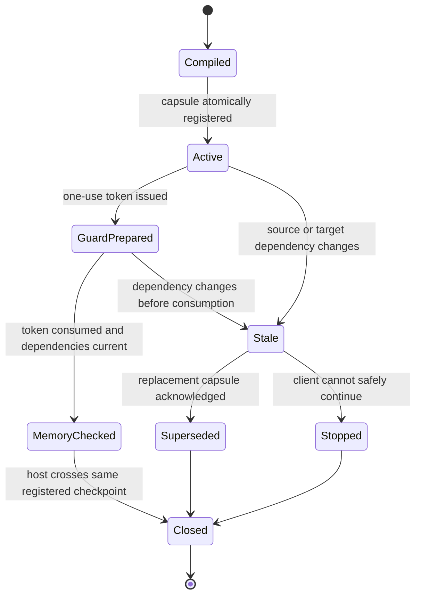
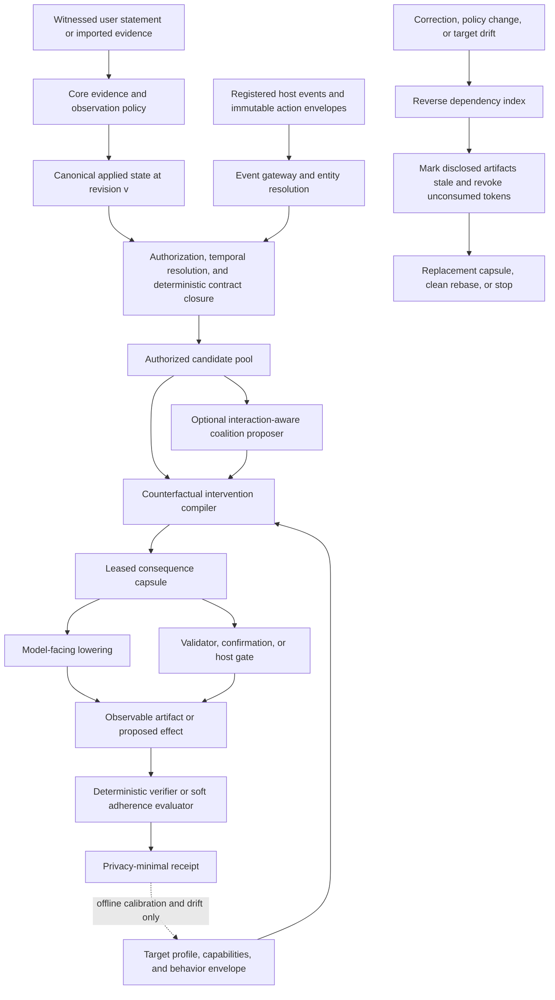

# Consequence-Closed Context

## A Counterfactual Behavioral Compiler for Correctable, Cross-Agent Memory

| Field | Value |
|---|---|
| Working name | ATC Consequence Reactor |
| Version | 0.2 |
| Date | July 23, 2026 |
| Repository baseline | `e5cb50a518aff571af46238682d8f7a082ca19f0` |
| Status | Research proposal; not accepted architecture, implemented behavior, or a claim of historical priority |
| Product role | Differentiated Intent and Consequence Plane within the broader [ATC Memory Reliability Architecture](ATC_MEMORY_RELIABILITY_ARCHITECTURE.md), not a complete AI-memory stack |
| Inputs | Current ATC direction, Relational Potential Memory, Behavioral Memory Virtualization, and From Recall to Reaction |
**Primary hypothesis:** Personal memory should be compiled into a locally deletion-minimal authorized intervention that preserves a declared consequence; ATC must be able to revoke that intervention's future operational validity and every unconsumed memory-constraint token derived from it.

---

## Abstract

This paper defines one experimental plane of a broader memory product. It does
not replace working memory, episodic experience, semantic/current knowledge,
procedural learning, temporal/relational organization, consolidation, ordinary
retrieval, or outcome feedback. Those concerns and the external systems ATC
should reuse are specified in the
[ATC Memory Reliability Architecture](ATC_MEMORY_RELIABILITY_ARCHITECTURE.md).

Most AI memory systems optimize storage, retrieval, ranking, or prompt assembly. Even systems that support proactive reminders, typed memory, behavioral contracts, runtime gates, or correction-aware capsules typically stop at one of two boundaries: they either deliver text to a model and hope it matters, or they govern an action without connecting that governance to the revision history of the user's memory.

This proposal gives All The Context a different unit of delivery: a **consequence contract**. A consequence contract binds an authority-bearing memory revision to a typed event, an observable behavioral obligation, an enforcement ceiling, and a verification rule. At a registered task, plan, response, or effect checkpoint, ATC does not merely retrieve records. It jointly searches over:

1. a locally deletion-minimal sufficient coalition of authorized canonical records within a declared candidate set;
2. the least-disclosing target-specific representation;
3. the weakest enforcement mechanism that meets the obligation; and
4. the correction and verification dependencies required to keep the result valid.

The result is a leased **consequence capsule**. Soft obligations may compile to provider-specific context, ordering, reminders, or validators. Hard obligations must compile to a conforming host gate whose predicate may require an exact current confirmation, or to a block; predicted model compliance and standalone confirmation are never enough. Observable outcomes produce privacy-minimal adherence receipts, not claims about hidden reasoning.

The proposal introduces **consequence closure**: for a connected, honest, conforming client and host, correction of any dependency marks already disclosed model-facing material stale and revokes every unconsumed memory-constraint token derived from it. A protected checkpoint must synchronously present a current token; otherwise the host stops the transition. The client may not cross its next registered effect checkpoint until it acknowledges a replacement capsule, cleanly rebases from current canonical state, or stops. A second invalidation axis treats provider, model, host, tool-schema, and capability drift as dependencies of the compiled result. The text may differ across targets, but ATC either preserves the declared obligation within measured bounds or explicitly refuses to claim continuity.

The potentially new contribution is not any individual component. Versioned memory, proactive reminders, causal selection, prompt transfer, behavioral contracts, and pre-action gates all have close prior work. The research hypothesis is their integration through a **joint counterfactual compiler with correction-closed execution**. This document defines that hypothesis narrowly, identifies what is inherited, gives formal and operational semantics, proposes a benchmark that can disprove it, and recommends a disposable deterministic prototype before any neural sidecar or production schema migration.

---

## 1. The innovation in one sentence

> ATC should compile versioned personal memory at the consequence it governs into a locally deletion-minimal, target-specific intervention that is sufficient to preserve an observable obligation, then revoke its future operational validity and every unconsumed memory-constraint token when its source or execution substrate changes.

This is not "better recall." It is memory as a closed-loop, correctable control plane.

The key change in abstraction is:

```text
store -> retrieve -> inject
```

becoming:

```text
attest -> interpret -> activate -> jointly compile
       -> intervene -> verify -> invalidate -> patch/rebase/stop
```

A memory is not operationally delivered merely because it appeared in a prompt. Delivery is complete only when:

1. an authenticated event activates the right obligation;
2. the intervention respects authority, scope, time, and disclosure policy;
3. the target is given a representation or control that can actually carry the obligation;
4. the observable response or effect is checked at a declared boundary; and
5. later corrections can prevent future instrumented effects from stale state.

---

## 2. Why this is more than combining the four proposals

The four source directions contain strong pieces, but none independently defines the complete optimization target.

| Source | Keep | Modify or reject |
|---|---|---|
| Current ATC direction | Core-only authority, evidence-to-observation policy, temporal current state, provenance, authorization before relevance, reversible deletion, separate purge, deterministic Retrieval V3 | Strengthen the user-statement trust boundary and avoid retaining rejected secret payloads |
| From Recall to Reaction | Typed event activation, witness/interpretation split, versioned capsules, conservative dependency certificates, effect guards, invalidation, patch/rebase/stop | Extend compilation from record selection to joint selection of records, representation, and enforcement; make target behavior and capability versions invalidation dependencies |
| Relational Potential Memory | Query- and event-conditioned interaction-aware coalition proposals, synergy, exception and prerequisite discovery, removable sidecars | Never let learned potentials authorize, establish truth, assign hard force, or suppress deterministic closure; defer record-owned neural packets until a benchmark proves need |
| Behavioral Memory Virtualization | Provider-neutral obligation semantics, target-specific lowering, observable guardians, receipts, capability-aware enforcement | Replace broad "Reaction Twins" with narrow calibrated target-behavior envelopes; do not treat prediction as causality or proof; defer personal residuals |
| This proposal | Joint counterfactual compilation across memory coalition, lowering, and enforcement; bounded local deletion-minimality; consequence closure over issued intervention state plus memory-constraint tokens; dual invalidation over source and target substrate | Must be rejected as a novel architecture if the joint system does not outperform strong sequential baselines |

The new computational question is not:

> Which memories are relevant?

Nor is it only:

> How should this memory be worded for Model X?

It is:

> Within a declared search space, what locally deletion-minimal authorized intervention changes or deterministically constrains the relevant consequence on this exact execution substrate, and what must be invalidated if either the source memory or the substrate changes?

That joint question matters because record usefulness is conditional on lowering and enforcement. A preference that is ineffective as prose may be highly effective as an ordered procedure. A prohibition that appears redundant in a prompt may be essential as a host gate. Removing a record can change the best representation of all remaining records. Selection and lowering therefore should not be assumed independent.

---

## 3. The new unit: a consequence contract

A canonical ATC record remains evidence or current context. It does not become executable merely because it is stored. Only an eligible interpretation of an adequately witnessed record may derive a **consequence contract**.

A consequence contract declares:

```text
ConsequenceContract
  contract_id
  derived_from: record_id@version[]
  witness_class
  when: restricted typed event predicate
  unless: restricted exception predicate[]
  obligation:
    strength: inform | prefer | require | prohibit
    observable_predicate
    ordering_relation?
  force_ceiling
  scope
  validity
  sensitivity
  admissible_interventions[]
  verification_spec
  confirmation_policy
  interpretation_version
```

Examples:

```yaml
contract_id: critique-before-build
derived_from:
  - preference-42@3
when:
  event: plan.commit
  task_kind: idea_implementation
obligation:
  strength: prefer
  ordering_relation:
    before: implementation_plan
    require: central_assumption_critique
force_ceiling: prefer
admissible_interventions:
  - ordered_context
  - pre_plan_reminder
  - response_validator
verification_spec:
  type: artifact_ordering
```

```yaml
contract_id: approve-final-draft-before-send
derived_from:
  - directive-9@2
when:
  event: pre_effect
  action_kind: message.send
unless:
  - recipient_scope_grant
obligation:
  strength: prohibit
  observable_predicate:
    approved_canonical_action_commitment_matches: true
force_ceiling: prohibit
admissible_interventions:
  - explicit_confirmation
  - host_effect_gate
verification_spec:
  type: deterministic_action_envelope
```

The approved commitment covers the entire canonical action object, including account, recipients, subject, body, attachments, visibility, thread identity, and dispatch method. Matching only the body is insufficient.

The contract is provider-neutral. It says what consequence must be preserved, not which prompt string to use.

### 3.1 Witness is separate from interpretation

ATC must distinguish a record's content from evidence about who actually said it.

```text
WitnessEnvelope
  witness_id
  transport_principal
  session_id
  source_channel
  source_role
  payload_commitment
  observed_at
  attestation_class
  attestation_signature?
  user_confirmation_id?
```

Initial attestation classes:

| Class | Meaning | Maximum derived force |
|---|---|---|
| `untrusted_import` | Text from an archive, attachment, provider memory, assistant output, or arbitrary import | Evidence only; never a directive |
| `client_asserted` | An authenticated client says the content came from the user, but the host did not attest the source turn | Tentative interpretation at most |
| `host_attested_user_turn` | A registered host attests that the bytes came from the user's role in a specific session | `prefer` at most; may trigger a structured confirmation request |
| `user_confirmed_contract` | The user confirmed a structured interpretation and scope | Eligible up to the confirmed force ceiling |

This removes a dangerous equivalence:

```text
authenticated client != authenticated user statement
```

The interpretation remains revisable. A host can attest the speech act without proving that ATC interpreted its scope correctly.

Host attestation has a bounded meaning. A signature proves which registered host made the assertion and protects the asserted bytes from undetected transport mutation. It does not prove that:

- the bytes truly originated from the user;
- the host displayed an exact confirmation;
- the host enforced every registered checkpoint;
- its capability advertisement is honest; or
- the host itself is uncompromised.

All checkpoint-closure properties are therefore conditional on an honest, connected, conforming host. If the threat model includes a compromised submitting host, a memory-derived `require` or `prohibit` must be confirmed through a user-authenticated channel that the submitting host cannot forge. A single host must not be allowed to manufacture a user turn, attest it, and self-confirm a hard contract.

Core is the sole authority for **canonical ATC state and memory-derived constraint status**. It is not an oracle for external-world truth and is not the final authority for host security policy or action authorization.

### 3.2 Force is monotone and bounded

For every derived obligation \(o\):

$$
Force(o)
\le
SourceAuthority
\sqcap
WitnessCeiling
\sqcap
ConfirmedForceCeiling
$$

where \(\sqcap\) is the meet in the ordered force lattice. Scope, capability, and security policy are different types and remain separate feasibility predicates:

$$
Scope(o)
\subseteq
AuthorizedScope
\cap
ConfirmedScope
$$

$$
Feasible(o,x)
=
CapabilitySupports(x)
\land
ExternalPolicyAllowsUnderlyingAction
\land
MemoryConstraintsSatisfied(o,x)
$$

A memory may add a constraint. It must never grant a permission that the host, application, or security policy does not already allow. A learned component may choose among policy-valid representations; it cannot raise or lower the force ceiling.

A memory-derived `require` or `prohibit` that can block a host effect requires a `user_confirmed_contract` or an independently authoritative external policy. An attested natural-language turn may prepare that confirmation, but it is not itself a machine-checked authorization rule. Memory can only add a prerequisite or deny conformance; it cannot authorize the underlying action.

---

## 4. The intervention lattice

The compiler operates over a finite, typed set of interventions rather than arbitrary prompt rewriting.

```text
Intervention
  memory_coalition
  semantic_lowering
  enforcement_mechanism
  verification_mechanism
  target_profile
```

The initial intervention lattice is:

| Intervention class | Example | Suitable for |
|---|---|---|
| `informational_context` | Concise current fact with provenance handle | Facts and low-force context |
| `preference_context` | A clearly labeled user preference | Soft style or priority |
| `ordered_procedure` | "First critique; then propose; then implement" | Workflow and ordering |
| `structured_obligation` | Typed JSON field or tool schema constraint | Capable clients |
| `near_consequence_reminder` | Re-injection at `plan.commit` or `response.emit` | Attention decay |
| `validator_retry` | Check artifact, then retry once with bounded escalation | Observable soft obligations |
| `explicit_confirmation` | Ask at the point of consequence and bind the result to the canonical action object | Input to a conforming host gate; never standalone enforcement |
| `host_effect_gate` | Deterministic check over immutable action envelope | Hard host-mediated effects |
| `block_or_stop` | Refuse continuation when no safe lowering exists | Unsupported hard obligations |

This is a partial order, not one universal scalar. A validator is not always stronger than confirmation, and a prompt is not comparable to a host gate for every task. The contract declares admissible classes and the host declares actual capabilities.

The safety rule is simple:

> A hard obligation is feasible only if it is deterministically host-enforced or blocked.

A user confirmation can satisfy a hard predicate only when a conforming host synchronously refuses dispatch without that exact, current confirmation bound to the entire canonical action object. Confirmation text or a stored approval bit without host enforcement is not coverage. No reaction model, LLM judge, or prompt score may certify a hard effect.

---

## 5. Target behavior envelopes, not digital twins

The "Reaction Twin" idea is useful but too broad. ATC does not need a psychological clone of a provider. It needs a conservative empirical envelope for a small declared predicate.

```text
TargetBehaviorEnvelope
  envelope_id
  provider
  model_build
  host_id
  role_placement
  context_regime
  tool_schema_digest
  capability_digest
  renderer_version
  task_family
  obligation_family
  candidate_strategy_id
  compliance_interval
  false_activation_interval
  calibration_set_digest
  calibrated_at
  valid_until
  drift_state
```

The envelope estimates a range, not a point:

$$
\Theta_T =
\{\theta :
\theta \text{ remains compatible with held-out calibration and drift bounds}\}
$$

For a soft obligation \(o\) and intervention \(x\), define robust predicted compliance:

$$
\rho_o(x)
=
\inf_{\theta \in \Theta_T}
P_{\theta}
\left(
\Gamma_o = pass
\mid x, e, T
\right)
$$

where \(\Gamma_o\) is an observable evaluation predicate. The compiler may use \(\rho_o\) to choose among already safe soft interventions.

The envelope is:

- target- and version-specific;
- trained first on public or synthetic tasks;
- independent of canonical truth;
- never the authority for a hard action;
- invalidated by material provider, model, host, placement, schema, or capability drift; and
- replaced with a conservative static fallback when stale or unknown.

Online receipts are observational and selection-biased. They can detect drift and support later experiments, but they do not establish causal effect by themselves. Causal language is reserved for randomized offline intervention trials or designs with explicit identification assumptions.

### 5.1 Conservation of Intent

The product-level target is **Conservation of Intent**:

> For a declared obligation and supported checkpoint, each target-specific compilation must either meet the target's preregistered conformance threshold, deterministically enforce the obligation, request the required confirmation, or report that the target cannot preserve it. Silent best-effort downgrade is not continuity.

This is not equality of prompts, internal states, or complete model behavior. It is a measured or deterministic claim about a narrow observable predicate under a declared target fingerprint and lease.

The result space is explicit:

```text
conforming_soft_intervention
deterministically_enforced
confirmation_required
unsupported_target
blocked
```

An unknown or drifted target may fall back to a conservative static lowering for a soft obligation. It may not inherit an old conformance claim. A hard obligation with no supported gate becomes `confirmation_required` or `blocked`.

---

## 6. The counterfactual intervention compiler

### 6.1 Inputs

At canonical revision \(v\), let:

- \(R_v\) be the authoritative applied state;
- \(p\) be the authenticated principal and disclosure policy;
- \(e\) be a host-attested typed event;
- \(T\) be the exact execution substrate;
- \(C_T\) be its declared and verified capabilities;
- \(K\) be the versioned compiler stack; and
- \(B\) be disclosure, token, latency, and interruption budgets.

Hard eligibility runs first:

$$
E
=
AuthorizeTemporalScope(R_v, p, e)
$$

An unauthorized record must not affect:

- learned candidate generation;
- scores;
- selected output;
- timing-visible diagnostics;
- interrupt behavior;
- client cursors; or
- calibration updates.

### 6.2 Candidate population

The safe candidate pool combines:

$$
\mathcal{K}
=
QueryRetrieval(E)
\cup
EventIndex(E,e)
\cup
DeterministicClosure(E,e)
$$

`DeterministicClosure` includes mandatory:

- supersession and temporal resolution;
- explicit exceptions;
- conflicts;
- source support required by policy;
- scope and entity resolution;
- applicable hard obligations; and
- security constraints.

This closure is never delegated to a learned potential model.

### 6.3 Optional interaction-aware coalition proposal

Relational Potential Memory becomes a proposal accelerator over the already authorized pool.

For coalition \(A \subseteq \mathcal{K}\):

$$
\Phi(A \mid e)
=
\sum_i a_i(e)
+
\sum_{i<j}\psi_{ij}(e)
+
\sum_h\psi_h(A,e)
-
\lambda_r Redundancy(A)
-
\lambda_d Disclosure(A)
$$

The useful interaction statistic is:

$$
\Gamma_{ij}
=
\Delta(\{i,j\})
-
\Delta(\{i\})
-
\Delta(\{j\})
$$

A positive \(\Gamma_{ij}\) suggests that two records are useful together even when neither ranks highly alone. The output is limited to canonical IDs, proposed roles, and interaction hypotheses.

The proposer cannot:

- inspect unauthorized records;
- create a fact or directive;
- change validity or scope;
- suppress deterministic exceptions or hard obligations;
- decide force;
- resolve an authority conflict; or
- directly render user content.

The first prototype should use deterministic relation features. Record-owned learned packets are justified only if a benchmark demonstrates a material candidate-coalition gap.

### 6.4 Joint candidate space

For each valid coalition \(A\), deterministic resolution derives obligations:

$$
O(A,e)
=
ResolveContracts(A,e,R_v,K)
$$

The compiler enumerates a bounded legal set:

$$
\mathcal{X}
=
\{
x=(A,l,g,q)
:
A \subseteq \mathcal{K},
l \in Lowerings_T(O),
g \in Guards_T(O),
q \in Verifiers_T(O)
\}
$$

where:

- \(l\) is a target-specific semantic lowering;
- \(g\) is an enforcement mechanism; and
- \(q\) is an observable verification plan.

The system does not select memories and then freeze that decision before choosing a rendering. It searches over the bounded cross-product because the value of \(A\) depends on \(l\) and \(g\).

### 6.5 Feasibility

An intervention is infeasible if it:

- uses unauthorized content;
- violates temporal or scope policy;
- exceeds the force ceiling;
- discloses a forbidden field;
- relies on a capability the host has not demonstrated through the required conformance check;
- leaves a hard obligation probabilistically enforced;
- depends on an unresolved hard conflict;
- lacks a sound dependency certificate;
- lacks a valid verification boundary; or
- cannot meet its correction-closure class.

For soft obligation \(o\), policy may require:

$$
\rho_o(x) \ge \tau_o
$$

For hard obligation \(h\):

$$
HardCovered_h(x)
\in
\{
host\_enforced,
blocked
\}
$$

An exact user confirmation may be an input to `host_enforced`; it is never a third enforcement class. Probability alone never satisfies `HardCovered`.

### 6.6 Lexicographic objective

ATC must not pretend that safety, disclosure, user interruption, tokens, and latency have a natural common unit.

The compiler minimizes:

```text
[
  hard_policy_escape,
  uncovered_critical_obligations,
  unresolved_authority_or_scope,
  unauthorized_or_excess_disclosure,
  robust_target_noncompliance,
  false_activation_risk,
  cumulative_disclosure,
  user_interruptions,
  context_tokens,
  local_latency
]
```

This ordering is configurable only within policy-approved bands. Cost cannot compensate for a hard-policy failure.

### 6.7 Bounded local deletion-minimality

For small benchmark coalitions, the compiler should exhaustively enumerate the declared subset and intervention space. For larger runtime pools, it applies deterministic backward elimination:

1. order discretionary records and mechanism features by a stable content-independent key;
2. remove one item and recompile the remaining coalition;
3. weaken one discretionary representation feature and recompile;
4. remove a reminder or soft validator and recompile;
5. retain the removal whenever all hard constraints and soft thresholds still pass; and
6. repeat the same fixed order until no single tested removal or weakening remains admissible.

The runtime result is **1-deletion-minimal under the declared candidate set, intervention grammar, tie-breaker, and elimination order**. It may not be globally smallest, and a different order can produce a different local result. The benchmark reports exhaustive optimum gaps for small cases.

Let \(J_T(x)\) be the lexicographic objective vector from Section 6.6. For record \(i\), compare:

$$
J_T\left(Compile(A \setminus \{i\})\right)
\quad\text{with}\quad
J_T\left(Compile(A)\right)
$$

and, for each soft obligation \(o\), report the recompiled omission contrast:

$$
\delta_{i,o}
=
\rho_o(Compile(A))
-
\rho_o(Compile(A \setminus \{i\}))
$$

Holding the old rendering fixed after removing a record gives the wrong counterfactual because the best legal representation may change.

The output may include a **bounded ablation receipt**:

```text
tested candidate set
tested removals and weakenings
hard feasibility results
soft confidence intervals
selected lexicographic cost vector
compiler and calibration versions
```

This is empirical evidence relative to a finite candidate set. It is not a mathematical proof that no better prompt, coalition, order, or hidden intervention exists.

### 6.8 Reference algorithm

```python
def compile_consequence(snapshot, principal, event, target, budgets):
    eligible = authorize_temporal_scope(snapshot, principal, event)

    candidates = union(
        query_retrieval(eligible, event),
        event_index(eligible, event),
        deterministic_contract_closure(eligible, event),
    )

    coalitions = deterministic_coalitions(candidates)
    if potential_proposer_is_enabled(event):
        coalitions |= verified_pointer_only_proposals(candidates, event)

    feasible = []
    for coalition in bounded(coalitions):
        current = reread_current_versions(snapshot, coalition)
        obligations = resolve_contracts(current, event)

        for lowering in legal_lowerings(obligations, target):
            for guard in legal_guards(obligations, target):
                verifier = choose_verifier(obligations, target, lowering, guard)
                intervention = Intervention(
                    coalition=current,
                    lowering=lowering,
                    guard=guard,
                    verifier=verifier,
                )
                if hard_feasible(intervention) and disclosure_feasible(
                    intervention, principal, budgets
                ):
                    feasible.append(
                        robustly_score_soft_obligations(intervention, target)
                    )

    selected = lexicographic_min(feasible)
    minimal = deterministic_local_delete_and_recompile(selected)
    certificate = build_conservative_dependency_certificate(
        minimal, snapshot, event, target
    )
    return register_if_all_dependencies_current(
        minimal,
        certificate,
        expected_snapshot=snapshot.revision,
        expected_target_epoch=target.epoch,
    )
```

All learned output is advisory inside the deterministic feasible set.

### 6.9 Atomic issuance and retry

Compilation and issuance are separate unless Core closes the race. Capsule registration must use optimistic concurrency:

1. compile from one committed canonical snapshot and one target epoch;
2. begin a registration transaction;
3. revalidate every positive dependency, negative-decision frontier, policy/compiler version, principal view revision, target fingerprint, and capability/calibration epoch;
4. atomically register the capsule, reverse dependency edges, and protected checkpoint requirements; or
5. abort and recompile when any dependency changed.

Retries are bounded. A high-force path fails closed after retry exhaustion; a low-force path may return `retry_later` or a policy-approved conservative fallback. No capsule is considered active merely because its bytes were rendered before registration completed.

---

## 7. The consequence capsule

The runtime output is a revision-bound artifact:

```text
ConsequenceCapsule
  capsule_id
  principal_view_revision
  internal_dependency_epoch
  principal
  event_commitment
  target_fingerprint
  selected_record_versions[]
  resolved_contracts[]
  semantic_obligation_digest
  lowering_strategy
  rendered_payload?
  enforcement_plan
  verification_plan
  positive_dependencies[]
  negative_decision_frontiers[]
  compiler_dependencies[]
  target_dependencies[]
  capsule_lease
  required_next_checkpoint
  semantic_state_digest
  explanation_handles[]
```

The capsule may contain several target artifacts with one semantic identity:

- a concise model-facing preference;
- a structured ordering constraint;
- a validator configuration;
- a confirmation requirement;
- a host-side tool restriction; and
- a one-use memory-constraint token.

All artifacts share one semantic lineage:

- one principal-scoped view revision;
- one semantic obligation digest;
- one dependency certificate; and
- one replacement lineage.

They do not share identical revocation mechanics. Already disclosed model-facing bytes can only be marked `stale` and superseded; they cannot be erased. An unconsumed host token can be synchronously revoked. This distinction prevents a common failure where prompt text is corrected while an old memory-conformance result remains usable at a protected checkpoint.

### 7.1 Memory-constraint token

A memory-constraint token is a necessary but never sufficient input to host dispatch. It certifies only that the registered memory-derived constraints were current and satisfied at its declared checkpoint.

```text
MemoryConstraintToken
  token_id
  capsule_id
  host_id
  checkpoint_kind
  canonical_checkpoint_object_commitment
  required_user_confirmation_commitment?
  principal_view_revision
  dependency_epoch
  issued_at
  expires_at
  one_use: true
  status: prepared | consumed | revoked | expired
```

For an effect checkpoint, the host first applies its independent authorization and security reference monitor. Only if that check allows the action does it consume the token immediately before synchronous dispatch of the exact canonical action object. For a plan or response checkpoint, the token binds the declared artifact or transition object instead. Core atomically rechecks the current dependency epoch, token state, checkpoint-object commitment, and any exact confirmation commitment during consumption. Object mutation, delay outside the registered window, replay, or retry requires a new token.

Successful consumption returns `MemoryConstraintsCurrent`, not permission to act. For an effect it is valid only as the last memory-derived predicate in an action the host has already independently authorized. Core can add a constraint or report nonconformance; it cannot expand authority.

Commitments over personal text or action fields must be keyed and domain-separated with vault- or principal-scoped keys. Raw hashes of short personal values are dictionary-testable and linkable across contexts.

### 7.2 Adherence receipt

The system records observable evidence only:

```text
AdherenceReceipt
  receipt_id
  capsule_id
  contract_ids[]
  target_fingerprint
  strategy_id
  artifact_or_action_commitment
  verifier_id
  verdict
  uncertainty_band?
  bounded_reason_codes[]
  observed_at
```

Receipts do not contain chain-of-thought. Raw prompts and responses are excluded by default. If a benchmark needs them, retention must be explicit, local, encrypted, scoped, and purgeable.

For a deterministic action predicate, the receipt can establish that the registered host reported checking the declared canonical object at the checkpoint, under the honest-host assumption. It does not prove the host dispatched those bytes or that an external system applied them. For a soft response predicate, it is a measurement, not proof of internal compliance.

---

## 8. Consequence closure

### 8.1 Definition

Let:

- \(C_i\) be an issued live consequence capsule;
- \(G_i\) be its set of unconsumed memory-constraint tokens;
- \(D(C_i)\) be its conservative dependency certificate;
- \(u\) be a committed update;
- \(Affected(C_i,u)\) mean deterministic recompilation or target-epoch validation changes client-relevant semantic state, required intervention, or enforcement;
- \(Checkpoint(a,t)\) be a registered task, response, or effect transition; and
- \(CurrentReplacement(a,u)\) mean a newly minted patch or clean-rebase capsule was registered and acknowledged.

Then, for a connected, honest, conforming client and host:

$$
Affected(C_i,u)
\Rightarrow
\left[
Stale(C_i)
\land
\forall g \in G_i,\ Revoked(g)
\right]
$$

and:

$$
Affected(C_i,u)
\land
Checkpoint(a,t>t_u)
\land
Depends(a,C_i)
\Rightarrow
CurrentReplacement(a,u)
\lor
Halted(a,u)
$$

In plain language:

> A relevant correction marks disclosed advice stale and revokes every unconsumed memory-constraint token. The next protected consequence boundary requires a newly registered replacement capsule or stop.

A patch does not reactivate the stale capsule. Both bounded patch and clean rebase mint a new capsule with a new principal-view revision, dependency certificate, semantic digest, and lease. The old capsule remains permanently `stale` or `superseded`.

### 8.2 Two invalidation axes

The capsule has two independently changing sources:

1. **Semantic source state**
   - record correction;
   - supersession;
   - scope or permission change;
   - deletion or purge;
   - witness or interpretation change;
   - policy, schema, resolver, or compiler change.

2. **Execution substrate**
   - provider or model build;
   - client or host;
   - role placement;
   - tool schema;
   - capability profile;
   - renderer;
   - target behavior envelope;
   - verifier.

A semantic change means the intended obligation may be different. A substrate change means the old intervention may no longer carry the same obligation even when the memory is unchanged.

The two axes produce **dual invalidation**:

```text
source changed    -> obligation may be wrong
target changed    -> lowering may be ineffective
either changed    -> compiled capsule is suspect
```

### 8.3 Positive and negative dependencies

Tracking selected records is insufficient. A compilation may depend on:

- no higher-authority exception existing;
- a conflicting record being excluded;
- an entity alias resolving to one person rather than another;
- a target capability being present;
- a lower-force intervention passing its threshold;
- no more restrictive policy applying; or
- a learned envelope remaining calibrated.

Therefore:

$$
D(C)
=
D^+(C)
\cup
D^-(C)
\cup
D^K(C)
\cup
D^T(C)
\cup
\{event, principal, budget\}
$$

where:

- \(D^+\) contains exact selected record and support versions;
- \(D^-\) contains bounded negative-decision witnesses or conservative index frontiers;
- \(D^K\) contains policy, schema, compiler, resolver, and renderer versions; and
- \(D^T\) contains target fingerprint, capability, calibration, and verifier dependencies.

A size cap may coarsen a frontier, shorten a capsule lease, or refuse high-force compilation. It must never silently omit a dependency.

### 8.4 Atomic checkpoint protocol

Polling is sufficient only for low-force informational freshness. Every checkpoint covered by the consequence-closure claim must synchronously present a current memory-constraint token:

1. for an effect, the host's independent reference monitor authorizes the canonical action object;
2. the host submits the exact canonical checkpoint object and token as its last local pre-transition check;
3. Core opens one transaction;
4. Core checks token state, expiry, one-use status, principal-view revision, current dependency epoch, checkpoint-object commitment, confirmation commitment where applicable, and host registration;
5. Core marks the token consumed only if every check succeeds; and
6. Core returns `MemoryConstraintsCurrent` or a closed failure code.

The host immediately crosses only the same registered checkpoint after success. For an effect, it dispatches only the same independently authorized canonical action object. A checkpoint between periodic polls is not protected unless it performs this synchronous check.

### 8.5 Runtime state machine



If the correction commits before token consumption, consumption fails. If it commits after consumption but before the host or a remote service performs the effect, the memory constraint passed at the declared local linearization point. This does not authorize the action and cannot make the remote effect atomic. The system must minimize, measure, and disclose the consume-to-dispatch race.

### 8.6 What closure does not mean

Consequence closure does not:

- erase text already sent to a remote provider;
- control an offline or nonconforming client;
- stop uninstrumented actions;
- reverse a completed payment, message, deployment, or deletion;
- prove what a model privately believed;
- make Core and an arbitrary remote system globally atomic; or
- guarantee soft behavior on a stochastic model.

The claim is conditional and precise: no future **registered, host-mediated** checkpoint may proceed from a known stale base in a connected conforming workflow.

---

## 9. System architecture



### 9.1 Authority boundaries

Core remains the only authority for canonical ATC state and memory-derived constraint status, including:

- canonical record state;
- temporal and supersession semantics;
- witness classification;
- source authority;
- disclosure authorization;
- contract force ceilings;
- correction;
- deletion and purge;
- memory-constraint token issuance and revocation; and
- authoritative audit state.

Disposable sidecars may:

- propose candidate coalitions;
- estimate soft target adherence;
- choose among legal lowerings;
- classify soft observable outcomes;
- detect drift; and
- recommend conservative escalation.

They may not establish canonical state, external-world truth, or permission to act.

### 9.2 Receding-horizon execution

The Reactor issues only what is needed for the next declared boundary:

1. compile for the next task, plan, response, or effect checkpoint;
2. observe the resulting artifact or action envelope;
3. verify the declared predicate;
4. escalate once within policy if a soft obligation fails; and
5. recompile at the next checkpoint.

This limits stale state, disclosure, and experimentation. Irreversible effects are never experimental trials.

---

## 10. Flagship product behavior

### 10.1 Soft cross-agent continuity

The user tells one assistant:

> When I bring you a technical idea, challenge the central assumption before giving me an implementation plan.

Days later, a clean coding-agent session receives:

> Build this.

There is little lexical overlap. At `plan.commit`:

1. the host emits an attested `plan.commit` event;
2. the event index activates the consequence contract;
3. deterministic closure adds the current project decision and any scoped exception;
4. the compiler compares a preference sentence, an ordered procedure, and a pre-plan reminder for the exact coding target;
5. it chooses a locally deletion-minimal strategy whose conservative compliance interval crosses the configured soft threshold;
6. the client emits a critique before a build plan;
7. an observable ordering verifier records an adherence receipt.

The result is not identical text across providers. It is measured **cross-provider obligation continuity**.

### 10.2 Mid-task correction

While the coding agent is working, the user narrows the preference in another client:

> Only do that for architecture changes, not small bug fixes.

The update changes the active contract scope. ATC:

1. marks affected live capsules stale;
2. revokes any unconsumed memory-constraint tokens derived from the old scope;
3. sends or makes available an invalidation notice;
4. blocks the next registered checkpoint from the stale base; and
5. requires the coding client to patch, cleanly rebase, or stop.

ATC does not pretend it erased the previous prompt. It prevents the next conforming checkpoint from treating it as current authority.

### 10.3 Hard effect continuity

The user has a confirmed rule:

> Never send a message for me without my approval of the final draft.

The compiler may remind the model, but that reminder is not the control. Before `message.send`, the host provides:

- the exact account;
- recipients;
- subject;
- exact body;
- attachments;
- visibility;
- reply/thread identity; and
- dispatch method.

Core requires a confirmation commitment bound to the entire canonical action object and issues a short, one-use memory-constraint token. When submitting-host compromise is in scope, that confirmation arrives through a separate user-authenticated channel. If any field changes, the token is invalid. If the rule is corrected before consumption, the token is revoked. The host must independently authorize the action and then obtain `MemoryConstraintsCurrent` as its last local pre-dispatch check; either check may deny dispatch.

This joins memory semantics and deterministic host constraint checking without making memory a source of action permission.

---

## 11. Security, privacy, and purge invariants

The architecture is acceptable only if the following invariants hold.

### 11.1 Authority and execution

1. Core is the sole authority for canonical ATC state, memory-derived force ceilings, and revocation of memory-conformance status. It is not the final action-authorizer or an oracle for external truth.
2. Authorization and temporal eligibility run before every learned, relational, or diagnostic operation.
3. Imported text is untrusted evidence and cannot create a directive, trigger, hard label, or permission. If authorized imported evidence becomes model-facing, it must pass through typed projection and unambiguous data quoting; instruction-shaped imported text is never rendered directly.
4. A learned component cannot suppress a deterministic exception or hard obligation.
5. Hard effects rely on an honest registered host, a canonical immutable action object, a one-use memory-constraint token, and the host's separate authorization/reference monitor.
6. High-force behavior fails closed when Core is unreachable, the target is unknown, capability registration is incomplete, or dependency certification fails.
7. Model prose is never the enforcement boundary for a hard effect.

### 11.2 Disclosure

1. The compiler minimizes cumulative disclosure, not only per-request tokens.
2. A per-principal disclosure ledger tracks combinations that can reconstruct a sensitive profile.
3. Unauthorized records cannot influence timing, interruption, diagnostics, or learned updates.
4. Receipts contain opaque IDs, tenant-scoped keyed commitments, closed reason codes, and verdicts by default.
5. Raw personal context, prompts, responses, and hidden reasoning do not enter operational logs.

### 11.3 Purge

Purge must remove or rebuild every local artifact derived from the purged record:

- canonical current state where policy permits;
- event and contract indexes;
- rendered lowerings;
- live and cached capsules;
- unconsumed memory-constraint tokens;
- positive and negative dependency edges;
- record-owned relation packets;
- pairwise or higher-order interaction deltas;
- user-derived calibration rows;
- personal residuals, if ever introduced;
- receipts retained under policy; and
- aggregate checkpoints containing a private contribution;
- orphaned database pages and temporary files inside the declared storage boundary; and
- backup copies within the documented retention and key-erasure policy.

The auditable claim is: after purge and required compaction or key destruction, no decryptable artifact inside the declared storage boundary remains attributable to the record. Dependency traversal must find no reachable private artifact, and storage tests must cover orphaned pages, journals, temporary files, snapshots, and backups. Generic models trained only on public or synthetic data may remain unchanged.

Core retains only a content-free monotonic principal-view generation or purge barrier so a disconnected client cannot later validate a pre-purge capsule after record-specific lineage has been erased. Client-visible cursors are principal-scoped; a global vault revision must not reveal unauthorized churn.

Purge cannot promise erasure from a remote provider, a disconnected copy, a completed effect, or a model provider's independent retention system.

### 11.4 Target-learning boundary

The initial system must not train shared weights on user-derived data. If later evidence supports personal adaptation:

- the artifact is classified as sensitive personal data;
- every contribution has exact lineage;
- it is stored locally;
- it is detachable;
- rebuild and purge are deterministic;
- the generic model remains usable without it; and
- production is prohibited until a fault-injected purge audit passes.

---

## 12. Foundation repairs required before the research claim

These are high-value existing techniques, not the novelty claim.

### 12.1 Replace client-asserted explicitness with attested witness classes

As of this proposal, the MCP memory submission interface defaults `explicit_user_statement` to `true`, while protocol documentation acknowledges that the basis is asserted by the client. Authentication establishes which client called Core; it does not establish that the submitted bytes came directly from the user.

The next policy version should:

1. remove the boolean as a force-bearing trust primitive;
2. default unproven submissions to `client_asserted`;
3. accept `host_attested_user_turn` only from a registered host attestation while documenting that this proves attribution, not host honesty;
4. bind confirmation grants to a structured interpretation, scope, canonical action type, and user-authenticated confirmation channel;
5. prevent the submitting host from self-confirming a hard contract when host compromise is in scope; and
6. preserve the original witness separately from later interpretations.

### 12.2 Refuse direct secret payloads before the durable observation ledger

Current policy marks secret-like observations `ignored`, but the observation row is already durable. "Not promoted to current context" is weaker than "not retained."

Introduce an intake refusal path:

```text
detect direct secret-like payload
  -> do not persist raw payload
  -> return bounded refusal reason
  -> optionally retain only an event ID, detector version, and keyed domain-separated commitment
```

Imported archives may require separate quarantine semantics because faithful import and forensic review have different requirements. Direct assistant proposals should not make raw credentials durable merely to record that they were ignored.

### 12.3 Make policy transitions append-only

Current disposition fields are convenient current projections. Research on correction closure needs a durable sequence of policy decisions:

```text
observation_id
decision_sequence
from_disposition
to_disposition
policy_version
reason_code
actor
decided_at
affected_record_version
```

The current row can remain a materialized projection. The transition log should be authoritative for historical explanation and invalidation reconstruction.

### 12.4 Preserve source deletion and purge boundaries

Deleting a provider archive source, reversing a current record, and purging derived artifacts are different operations. The Reactor must depend on the existing source-deletion boundary rather than inventing a second deletion model.

---

## 13. Novelty boundary

### 13.1 What nearby work already occupies

The following is a research scan as of July 23, 2026, not a patent search or a legal opinion.

| Work | Area already occupied | Remaining distinction tested here |
|---|---|---|
| [PLACEMEM](https://arxiv.org/abs/2607.04089) | Versioned capsules joining semantics, provenance, validity, reusable runtime state, and correction-aware cascading invalidation | Forward closure over already-issued heterogeneous client workflows and joint staleness of disclosed context plus revocation of unconsumed memory-constraint tokens |
| [Portable Agent Memory](https://arxiv.org/abs/2605.11032) | Structured portable memory, Merkle-DAG provenance, capability-based disclosure, and cross-model rehydration | Event-bound obligation compilation, measured target conformance, and correction propagation into live client state |
| [MemIR](https://arxiv.org/abs/2605.25869) | Typed separation of evidence, retrieval cues, and truth-bearing claims | Consequence contracts, target-specific interventions, memory-constraint tokens, and live correction closure |
| [Remember When It Matters](https://arxiv.org/abs/2607.08716) | Proactive memory reminders as interventions before action-agent calls | Authority-scoped deterministic event contracts, host effects, dependency certificates, and correction closure |
| [Causal Memory Intervention](https://arxiv.org/abs/2605.17641) | Controlled memory interventions for causal-usefulness selection | Joint selection of coalition, lowering, and enforcement under authority and live invalidation |
| [Decision-Aware Memory Cards](https://arxiv.org/abs/2606.08151) | Decision-oriented utility, context graphs, and typed compressed memory cards | Personal-memory authority, revision-bound obligations, effect control, and revocation |
| [RAMPART](https://arxiv.org/abs/2606.04628) | Context assembly as compilation from a structured block registry | Revision-bound issued artifacts, behavioral obligations, target uncertainty, and multi-client correction acknowledgement |
| [PromptBridge](https://arxiv.org/abs/2512.01420) | Cross-model prompt transfer and target prompt mappings | Preservation of declared memory-derived obligation predicates rather than general task performance |
| [Agent Behavioral Contracts](https://arxiv.org/abs/2602.22302) | Runtime behavioral contracts, probabilistic satisfaction, recovery, and drift | Contracts derived from authoritative personal-memory revisions and invalidated when those revisions change |
| [FORGE](https://arxiv.org/abs/2602.16708) | Deterministic declarative policy enforcement at policy-relevant agent actions | Dynamic derivation from governed personal memory and propagation into already-issued context |
| [Open Agent Passport](https://arxiv.org/abs/2603.20953) | Deterministic synchronous authorization before individual tool calls | Memory-derived obligation semantics, soft interventions, cross-provider lowering, and correction linkage |
| [Proof-Carrying Agent Actions](https://arxiv.org/abs/2606.04104) | Runtime-neutral action certificates, checkpoints, envelopes, approvals, and receipts | Personal-memory revision dependencies and source-driven invalidation of guidance plus the memory-conformance input to the host's action process |
| [CAVA](https://arxiv.org/abs/2607.13716) | Canonical action identity, verification, attestation, and runtime-portable action objects | Memory-derived consequence compilation and correction propagation |
| [Measuring Behavior Portability](https://arxiv.org/abs/2606.22797) | The phrase and measurement problem of behavioral portability across equivalent decision environments | A narrower protocol property: cross-provider continuity of declared, memory-derived obligation predicates |

### 13.2 Defensible novelty hypothesis

The strongest claim this project should test is:

> Among the bounded AI-agent works in Table 13.1 as reviewed on July 23, 2026, we did not identify a system that jointly compiles a versioned, provenance- and authority-bearing personal-memory coalition and a target-specific intervention at an attested consequence boundary; binds the resulting obligation, verification plan, and memory-constraint token to one conservative derivation certificate; and, after a source correction or target-substrate invalidation, requires a connected honest conforming host to obtain a current replacement before crossing a later protected checkpoint.

A narrower formal contribution is:

> **Consequence closure:** correcting any dependency of a live memory-derived obligation marks its disclosed intervention stale and revokes every unconsumed memory-constraint token derived from it. A connected honest conforming client and host cannot cross a subsequent protected checkpoint from that stale base without a newly registered replacement.

A separate empirical contribution is:

> **Counterfactual intervention compilation:** under a finite candidate and capability set, jointly choosing the memory coalition and intervention yields higher worst-target obligation compliance or lower disclosure than the best sequential selector-then-renderer baseline.

Both claims must be falsifiable.

The hypothesis is a new system boundary and application composition, not a claim to have invented leases, capability revocation, action envelopes, reference monitors, MVCC/OCC, event sourcing, data lineage, information-flow control, dependency invalidation, or delta debugging. The prototype should adopt PCAA/CAVA or another compatible canonical-action and host-governance substrate where practical rather than redefining those layers.

### 13.3 Claims ATC must not make

Do not claim:

- the first versioned or correction-aware memory capsule;
- the first proactive memory intervention;
- the first causal memory selector;
- the first typed memory IR;
- the first context compiler;
- the first cross-model prompt translator;
- the first behavioral contract;
- the first pre-action authorization system;
- the first action envelope, action certificate, or runtime receipt;
- the first lease, revocation, reference-monitor, optimistic-concurrency, lineage, or delta-debugging mechanism;
- a general digital twin of an AI provider;
- causal effect from observational receipts;
- behavioral equivalence across opaque stochastic models;
- correction of hidden model state;
- erasure from remote providers; or
- global historical novelty without a broader literature and patent search.

The architecture is novel only if the lifecycle and joint optimization create measurable value beyond their modules.

---

## 14. ConsequenceBench

The benchmark must be built before production architecture. Its purpose is to decide whether this is an invention, a useful integration, or an overcomplicated reranker.

### 14.1 Factorial design

The core experiment crosses:

| Factor | Conditions |
|---|---|
| Activation | query-only; typed event activation |
| Set selection | independent ranking; deterministic relation closure; interaction-aware coalition |
| Compilation | identical text; best manual static target template; target-aware sequential compiler; joint coalition/intervention compiler |
| Enforcement | prompt only; validator/retry; confirmation; host gate |
| Invalidation | none; source only; source plus target-substrate |
| Client state | fresh; long-lived; corrected mid-plan; disconnected then resumed |

The factorial structure isolates:

- the value of event activation;
- the value of interaction-aware selection;
- the value of target-specific lowering;
- the interaction benefit of joint compilation;
- the value of source correction closure; and
- the value of target-substrate invalidation.

The full Cartesian product is a design map, not a requirement to run every provider scenario in every cell. Pre-register a powered fractional-factorial design with:

- one primary endpoint;
- a fixed target and model-build roster;
- paired scenario seeds;
- explicit primary contrasts;
- noninferiority margins;
- multiplicity control;
- sample-size and power calculations; and
- a frozen hidden holdout.

Exhaustive combinations belong in the deterministic property and fault harness. Expensive stochastic provider trials should cover the preregistered contrasts and a smaller interaction design.

### 14.2 Obligation families

Start with three:

1. **Soft response ordering**
   - critique the central assumption before proposing implementation;
2. **Workflow ordering**
   - summarize findings before editing files;
3. **Hard pre-effect prohibition**
   - never send without approval of the exact final draft.

Add only after those are reliable:

- disclosure constraints;
- purchase confirmation;
- destructive filesystem controls;
- deployment prerequisites;
- recipient- or project-scoped exceptions; and
- multi-agent handoff obligations.

### 14.3 Scenario classes

Build 300-500 frozen scenarios across:

- obvious lexical activation;
- semantic disconnect;
- implicit tool choice;
- general rule plus scoped exception;
- prerequisite sets;
- mutually misleading individual facts;
- temporal replacement;
- correction during planning;
- correction after token preparation but before token consumption;
- correction after token consumption;
- target model update;
- tool-schema drift;
- context-position drift;
- unsupported capability;
- dishonest capability advertisement;
- imported prompt injection;
- client-asserted user speech;
- secret-like proposals;
- stale/disconnected clients;
- replayed or mutated action envelopes;
- cumulative disclosure; and
- purge.

Use synthetic private-looking data. No real user context is needed for the initial research result.

### 14.4 Strong baselines

Compare:

1. no memory;
2. full authorized context;
3. identical memory text on every target;
4. current Retrieval V3 query-only compilation;
5. Retrieval V3 plus deterministic event activation;
6. deterministic exception/support closure;
7. CMI-style per-candidate intervention selection;
8. best manually authored per-target templates;
9. sequential selector then target compiler;
10. deterministic host gate for hard effects; and
11. the full joint compiler.

A weak baseline would create a fake novelty result. The strongest sequential pipeline is the decisive comparison.

### 14.5 Metrics

#### Activation

- obligation activation recall;
- semantic-disconnect recall;
- false activation rate;
- activation latency.

#### Behavioral outcome

- compliance per obligation;
- worst-target compliance;
- cross-provider obligation continuity gap;
- task success;
- soft escalation rate;
- hard-constraint violation rate.

#### Joint compilation

- improvement over the best sequential selector/compiler;
- interaction term for set selection x target lowering;
- disclosure reduction from the pre-ablation feasible intervention;
- exhaustive optimality gap on small candidate sets;
- fixed-order 1-deletion-minimality pass rate;
- coalition sufficiency;
- record and mechanism ablation stability.

Define:

$$
DisclosureReduction
=
\frac{
Disclosure(x_{pre})
-
Disclosure(x_{post})
}{
Disclosure(x_{pre})
}
$$

Here \(x_{pre}\) is the selected feasible intervention before local deletion and \(x_{post}\) is the fixed-order deletion-minimal result. Also report leave-one-out compliance deltas and, where exhaustive enumeration is feasible, the gap between \(x_{post}\) and the true finite-space lexicographic optimum.

#### Correction

- affected-capsule detection recall;
- stale hard-effect escape rate;
- time to notice availability;
- time to patch/rebase/stop;
- false rebase rate;
- stale soft behavior after acknowledged rebase;
- invalidated token replay rate.

#### Privacy and cost

- fields and tokens disclosed;
- cumulative disclosure risk;
- confirmations per task;
- repeated-confirmation rate;
- local p50/p95/p99 compile latency;
- storage and invalidation fan-out;
- provider-token overhead.

#### Verification

- deterministic verifier soundness for structured effects;
- soft evaluator precision, recall, macro-F1, Brier score, and ECE;
- disagreement with independently labeled holdout;
- target drift detection delay.

### 14.6 Preregistered success gates

The following are zero-observed-failure design gates, not proofs of a zero underlying failure rate. For every randomized gate, report the exact one-sided 95% binomial upper bound; with zero events this is approximately \(3/N\). Predeclare the fault model, mutation operators, state-machine branch coverage, and dependency-graph coverage.

- 0 observed unauthorized effects on returned content, timing class, interrupts, diagnostics, cursors, or learning state in at least 1,000,000 randomized policy traces; one-sided 95% upper bound below approximately \(3 \times 10^{-6}\) per tested trace;
- 0 observed imported or inferred hard-force escalations in those traces, with the same bound;
- 0 observed consumed expired, revoked, replayed, or argument-mutated memory-constraint tokens in at least 100,000 fault-injected traces; upper bound below approximately \(3 \times 10^{-5}\) per tested trace;
- 0 missed affected capsules or unblocked protected checkpoints against the declared mutation oracle in the conforming-host trace set, with the exact upper bound reported;
- structural tests show no silently truncated dependency certificate under every declared size and coarsening branch; and
- purge inventory finds no decryptable record-derived artifact inside the declared storage and backup boundary after required compaction or key destruction.

Empirical gates on a frozen hidden holdout, with 95% confidence intervals:

- event activation improves latent-obligation recall by at least 15 percentage points or reduces misses by at least 30% relative to query-only, with false activation below 2%;
- interaction-aware selection improves set sufficiency by at least 8 points on exception and multi-record cases over Retrieval V3 plus deterministic closure, while ordinary recall is noninferior within 1 point;
- target-aware compilation improves worst-target compliance by at least 10 points over the best manual static target templates or reduces the continuity gap by at least 30%;
- joint compilation improves obligation compliance by at least 5 points over the best sequential selector/compiler, or shows a preregistered positive interaction effect of at least 3 points;
- counterfactual minimization reduces disclosed memory fields or tokens by at least 15% at equal hard-obligation recall and noninferior task success;
- 0 observed stale memory-constraint token crossing a protected checkpoint after a correction committed before token consumption, with the exact one-sided upper bound reported;
- excess stale soft behavior after a successful clean rebase is at most 1 percentage point above the matched clean-run stochastic baseline;
- soft evaluator macro-F1 is at least 0.90 and ECE at most 0.05 before it may drive retry behavior;
- deterministic compile p95 is at most 100 ms on the declared reference CPU;
- learned-path compile p95 is at most 150 ms and p99 at most 300 ms, excluding provider latency;
- confirmations average no more than 0.10 per task in the promoted low-risk slice.

### 14.7 Kill criteria

Kill or narrow the architecture if:

- joint compilation adds less than 5 points over the best sequential pipeline and no interaction term survives;
- target behavior envelopes add less than 5 points over strong static templates;
- relation-aware proposals add less than 3 points beyond deterministic closure;
- gains come primarily from more prompt tokens;
- target drift makes envelopes stale faster than they can be calibrated;
- correction closure cannot soundly track negative decisions;
- client integration cannot expose reliable checkpoints;
- soft verification remains poorly calibrated;
- disclosure or confirmation costs erase the task benefit;
- local latency misses the declared budget;
- purge cannot remove every user-derived sidecar deterministically; or
- any learned component causes a high-force invariant failure.

If the optimizer fails but correction closure succeeds, ship the protocol and use deterministic compilation. If correction closure fails, do not market the system as correctable behavioral memory.

---

## 15. Development path

The novelty budget should not be spent rebuilding mature mechanisms. The prototype should borrow:

- canonical action objects, approval binding, and runtime receipts from PCAA/CAVA-compatible designs;
- synchronous host reference-monitor patterns from FORGE/OAP;
- optimistic concurrency, event sourcing, dependency indexes, and revocation generations from conventional systems engineering;
- static target mappings and calibration methodology from prompt-transfer work;
- placement, grouping, and gating baselines from RAMPART; and
- intervention and decision-aware selection baselines from CMI/CICL.

ATC should invent and test only the memory-specific boundary: authority-bearing consequence contracts, joint coalition/intervention compilation, and correction closure from canonical personal memory into already-issued client checkpoint state.

### Phase 0: freeze the claim and benchmark

Deliver:

- a machine-readable contract schema;
- an event and target-capability schema;
- the factorial ConsequenceBench generator;
- oracle applicability and observable compliance labels;
- strong frozen baselines;
- a fault-injection harness;
- preregistered gates and kill rules.

No production schema migration and no user data.

### Phase 1: repair the authority foundation

Deliver:

- `WitnessEnvelope`;
- host-attested user-turn support;
- a separate user-authenticated confirmation path for hard contracts when host compromise is in scope;
- conservative force ceilings;
- direct secret refusal before raw-payload persistence;
- append-only policy-decision transitions; and
- adversarial tests for client assertion spoofing, host compromise assumptions, and self-confirmation rejection.

This work is valuable even if the Reactor is later killed.

### Phase 2: disposable deterministic vertical slice

Implement outside the canonical schema where possible:

- one `critique-before-build` soft contract;
- one `approved-final-draft-before-send` hard contract;
- `plan.commit`, `response.emit`, and synthetic `pre_effect` events;
- finite static lowerings;
- an observable ordering verifier;
- a canonical immutable synthetic `message.send` action object;
- a one-use memory-constraint token plus a separate host authorization stub;
- atomic dependency revalidation at capsule registration and token consumption;
- exact positive dependencies and conservative negative frontiers;
- correction invalidation; and
- replacement-capsule/rebase/stop.

Use a mock or cooperating host. Do not send real messages.

### Phase 3: static cross-target compilation

Before learning:

- support 3-4 target families;
- author the best static lowerings for each;
- test role placement and context position;
- add capability conformance;
- create short capsule leases for unknown model builds;
- implement conservative target downgrade.

This establishes the strongest deterministic baseline.

### Phase 4: offline target behavior lab

Run randomized synthetic trials:

- same contract and task;
- controlled coalition changes;
- controlled lowering changes;
- multiple target models and versions;
- independently labeled outcomes.

Fit small generic envelopes such as calibrated trees or compact MLPs. Keep the evaluator separately trained and independently validated. No personal residuals.

### Phase 5: joint compiler in shadow

Use:

- at most 24 candidate records;
- at most 8 selected records;
- bounded lowerings and guards;
- deterministic exception/support closure;
- lexicographic feasibility;
- fixed-order local deletion plus exhaustive small-case comparison;
- no production influence.

Compare directly with the best sequential pipeline. If the preregistered interaction gate fails, remove the joint optimizer claim.

### Phase 6: interaction-aware coalition proposals

Only if deterministic candidate formation is a measured bottleneck:

1. add deterministic pair and role features;
2. add a frozen pointer-only set model;
3. evaluate exception, prerequisite, and synergy cases;
4. audit correction and purge lineage;
5. keep it in shadow until it clears the independent gate.

Per-record neural packets and recurrent assembly are last, not first.

### Phase 7: narrow live promotion

Promote only:

- low-risk response ordering;
- one cooperating L3-style host;
- contracts with reliable observable predicates;
- targets with current calibration;
- bounded retry and interruption.

Hard effects remain deterministic gates regardless of learned performance.

### Phase 8: open conformance ABI

Specify:

- witness attestation;
- event descriptors;
- consequence contracts;
- target capability profiles;
- consequence capsules;
- memory-constraint tokens;
- invalidation notices;
- replacement-capsule and rebase acknowledgement;
- adherence receipts; and
- conformance levels.

The product moat should be the user-owned authoritative continuity layer and its evidence, not a proprietary prompt string.

---

## 16. Minimal protocol sketch

```text
register_host(host_profile, attestation_key)

submit_witnessed_observation(witness_envelope, observation)

register_checkpoint(
  workflow_id,
  parent_capsule_id?,
  event_envelope,
  target_fingerprint,
  capability_profile
)

compile_consequence(
  workflow_id,
  event_envelope,
  target_fingerprint,
  budgets
) -> ConsequenceCapsule

report_artifact(
  capsule_id,
  artifact_commitment,
  structured_features
) -> AdherenceReceipt

prepare_memory_constraints(
  capsule_id,
  canonical_checkpoint_object
) -> MemoryConstraintToken | ConfirmationRequired | MemoryBlocked

consume_memory_constraint_token(
  token_id,
  canonical_checkpoint_object
) -> MemoryConstraintsCurrent | Stale | Revoked | Expired | Mismatch

poll_invalidations(principal_view_cursor)
  -> InvalidationNotice[]

ack_replacement(
  stale_capsule_id,
  replacement_capsule_id,
  mode: patch | clean_rebase,
  artifact_disposition
)

stop_workflow(workflow_id, reason_code)
```

`MemoryConstraintsCurrent` is not a dispatch permit. For an effect, the host independently authorizes first, consumes the token as its last local memory predicate, and then dispatches only the same canonical action object. Every protected checkpoint performs the synchronous call; polling alone does not satisfy consequence closure.

Core operations should remain local and bind to `127.0.0.1` by default. Remote access requires an explicit operator choice and authenticated transport.

---

## 17. Open research questions

1. **Can target-specific obligation continuity be measured reliably enough to guide compilation?**
2. **Does joint coalition/intervention search materially beat a strong sequential pipeline?**
3. **Can negative-decision frontiers remain sound without causing intolerable invalidation fan-out?**
4. **Which soft obligations have observable predicates that do not require hidden reasoning?**
5. **How quickly do provider/model updates invalidate target behavior envelopes?**
6. **Can the event ABI remain small while representing the consequences users actually care about?**
7. **How should cumulative disclosure be bounded across many individually authorized requests?**
8. **When is patching safe, and when must the client perform a clean rebase?**
9. **Can relation-aware coalition models add value after deterministic exception and support closure?**
10. **Can a host demonstrate capability and checkpoint conformance without becoming provider-specific?**
11. **How should conflicting soft preferences compose across people, projects, and roles?**
12. **What user experience makes one-time contract confirmation feel natural rather than bureaucratic?**

---

## 18. Recommended ATC decision

ATC should pursue this as its principal post-beta research direction, with two constraints:

1. treat the deterministic consequence-closure protocol as the foundation; and
2. make every learned component earn its place against a strong deterministic baseline.

The immediate artifact should not be a production neural memory system. It should be a disposable **ConsequenceBench plus deterministic Reactor slice** that demonstrates:

- a latent preference activating at `plan.commit` despite semantic disconnect;
- a target-specific ordered lowering outperforming identical text;
- a hard `message.send` memory rule enforced as one predicate in a separate host gate, using an exact one-use memory-constraint token;
- a mid-task correction marking disclosed guidance stale and revoking the unconsumed token; and
- the client being forced to acknowledge a replacement capsule, cleanly rebase, or stop before its next protected consequence.

If that demo works under fault injection, ATC has moved beyond portable recall. It has shown a new product category:

> **user-owned memory that preserves intent across agents and can prevent future conforming checkpoints from relying on a corrected memory.**

If the learned compiler later clears the joint-optimization gate, the stronger scientific claim becomes available:

> ATC does not merely retrieve what the user once said. Within a declared search space, it compiles a locally deletion-minimal intervention that preserves the user's confirmed obligation at the point where it matters.

---

## References

Primary adjacent work cited in the novelty analysis:

1. Ganguly, S. [PLACEMEM: Toward a Compute-Aware Memory Plane for Lifelong Agents](https://arxiv.org/abs/2607.04089). 2026.
2. Ravindran, S. K. [Portable Agent Memory: A Protocol for Cryptographically-Verified Memory Transfer Across Heterogeneous AI Agents](https://arxiv.org/abs/2605.11032). 2026.
3. Jin, Z. et al. [Mitigating Provenance-Role Collapse in Long-Term Agents via Typed Memory Representation](https://arxiv.org/abs/2605.25869). 2026.
4. Wu, Y. et al. [Remember When It Matters: Proactive Memory Agent for Long-Horizon Agents](https://arxiv.org/abs/2607.08716). 2026.
5. Srivastava, S. S. [Causal Intervention-Based Memory Selection for Long-Horizon LLM Agents](https://arxiv.org/abs/2605.17641). 2026.
6. Guan, X., Zhao, Q., and Deng, Y. [Decision-Aware Memory Cards: Counterfactual-Inspired Context Selection and Compression for Tool-Using LLM Agents](https://arxiv.org/abs/2606.08151). 2026.
7. Tomczak, N. [RAMPART: Registry-based Agentic Memory with Priority-Aware Runtime Transformation](https://arxiv.org/abs/2606.04628). 2026.
8. Wang, Y. et al. [PromptBridge: Cross-Model Prompt Transfer for Large Language Models](https://arxiv.org/abs/2512.01420). 2025.
9. Bhardwaj, V. P. [Agent Behavioral Contracts: Formal Specification and Runtime Enforcement for Reliable Autonomous AI Agents](https://arxiv.org/abs/2602.22302). 2026.
10. Palumbo, N. et al. [Formal Policy Enforcement for Real-World Agentic Systems](https://arxiv.org/abs/2602.16708). 2026.
11. Uchibeke, U. [Before the Tool Call: Deterministic Pre-Action Authorization for Autonomous AI Agents](https://arxiv.org/abs/2603.20953). 2026.
12. Wang, Z. [Proof-Carrying Agent Actions: Model-Agnostic Runtime Governance for Heterogeneous Agent Systems](https://arxiv.org/abs/2606.04104). 2026.
13. Wang, Z. [CAVA: Canonical Action Verification and Attestation for Runtime Governance of Agentic AI Systems](https://arxiv.org/abs/2607.13716). 2026.
14. Dong, T., Kunievsky, N., and Evans, J. A. [Measuring Behavior Portability in Large Language Models](https://arxiv.org/abs/2606.22797). 2026.

Internal source proposals:

1. `docs/research/FROM_RECALL_TO_REACTION.md`
2. `atc_current_direction_findings.md`
3. `atc_relational_potential_memory.md`
4. `behavioral_memory_virtualization_atc.md`
