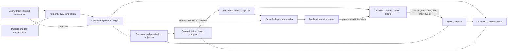

# From Recall to Reaction

## Toward Correction-Closed, Event-Triggered Memory for Cross-Agent AI

**A working research paper and systems proposal for All The Context**

**Version:** 0.3

**Date:** July 23, 2026

**Status:** Research proposal; not an accepted architecture or claim of implementation

**Product role:** Event activation and correction-propagation research within the broader [ATC Memory Reliability Architecture](ATC_MEMORY_RELIABILITY_ARCHITECTURE.md), not a complete AI-memory stack

**Scope:** The primary proposal is event-bound activation plus protocol-level invalidation of issued context. Authority, compilation, UX, and transport are supporting constraints and hypotheses, not co-equal claims of novelty. The formal model assumes one reachable authoritative Core and distinguishes Core notice guarantees from compliant-client checkpoint behavior.

---

## Abstract

Contemporary agent memory systems are becoming good at retaining facts, retrieving semantically related passages, organizing episodes, representing temporal change, and sharing state between agents. Those capabilities are necessary, but they do not solve the hardest operational problem: a memory can exist, be relevant, and still fail to influence the moment when an agent is about to act. A second failure follows from the same architecture. When a durable belief is corrected, systems usually improve future retrieval, but they do not know which already-issued prompts, plans, or live sessions depended on the obsolete belief.

This paper proposes a different abstraction for All The Context: **operational memory delivery as incremental, invalidatable computation rather than passive search**. This is a claim about derived context artifacts, not a claim that evidence or ordinary facts are executable instructions. Authority-scoped directives and preferences may compile into activation contracts. Instrumented tool hosts and adapters emit small, typed descriptors at session, planning, and pre-effect boundaries. The Core deterministically matches admissible contracts and produces versioned **context capsules** containing a disclosure-minimizing set of claims and obligations for the event. Each capsule carries a bounded dependency certificate that represents every declared decision input either exactly or through a conservative versioned frontier. Corrections can therefore behave like source changes in a build system: the Core identifies affected live capsules, marks them stale, and issues bounded invalidation notices. At later instrumented checkpoints, a compliant client must patch, rebase, or stop before continuing from affected state. This does not control unobserved internal model work or make a remote physical effect atomic with a correction.

We call the two principal mechanisms **epistemic interrupts** and **protocol-level correction closure**. Epistemic interrupts address cue failure by activating memory from instrumented intended effects—such as sending a message, spending money, publishing code, or disclosing data—not only from textual similarity. Correction closure addresses “ghost memory” by making the downstream consequences of a corrected record observable and invalidatable. The mechanisms are logically independent and must be evaluated separately as well as together. A constraint-first, regret-aware compiler orders non-commensurable goals lexicographically rather than pretending that omission harm, disclosure, tokens, latency, and user attention share a natural unit.

The proposal deliberately incorporates ideas from temporal knowledge graphs, agent memory stores, context compilers, provenance systems, capability security, proactive memory agents, incremental view maintenance, and build systems. Its novelty statement is a **differentiation hypothesis**, not a categorical priority claim: in the public systems and papers reviewed, we did not identify the complete protocol combination of authoritative typed personal memory, deterministic event-triggered activation, bounded conservative dependency certificates for issued capsules, and forward invalidation across heterogeneous live clients. We present a threat model and implementation path and propose **InterruptBench**, an evaluation suite for semantic disconnect, cross-agent continuity, contract derivation, live correction, premise resistance, cumulative disclosure, integration failure, and pre-effect adherence. No experimental results are claimed for the proposed mechanisms.

---

## 1. Introduction

Imagine that a user tells one assistant:

> Never send an email on my behalf without showing me the draft first.

Days later, in a clean session with a different provider, the user says:

> Reach out to Sam and settle on a time.

A conventional memory system searches the new request for similar text. It may retrieve the preference because “reach out” is semantically related to email. It may also miss it. The request does not contain “draft,” “approval,” “send,” or even a specified communication channel. The strongest signal appears later, when the agent chooses a tool and prepares a `message.send` operation. By then, most memory systems are no longer consulted.

Now add a correction. While the second agent is working, the user tells a third client:

> For Sam, you can send scheduling messages without asking me first.

A temporal store can supersede the old universal rule with a scoped exception. A new search may return the right state. But the working agent may still possess a prompt, plan, or summary derived from the old rule. The memory database has changed; the agent's effective state has not. The system cannot reliably rebase what it cannot trace.

These are not primarily failures of embedding quality. They are failures in the semantics of memory:

1. **When should memory run?**
2. **What kind of statement is allowed to influence behavior?**
3. **Which downstream artifacts depend on each belief?**
4. **What must happen when a belief is corrected?**
5. **How can the system answer those questions without becoming another application the user must continually curate?**

Most current approaches frame memory as a variation of read and write:

```text
conversation -> extract -> store -> search -> inject into prompt
```

This paper proposes a third operation:

```text
observe -> compile -> activate -> trace -> invalidate -> rebase
```

The resulting system remains a memory substrate, not an autonomous agent. It does not decide what email to send, reverse completed side effects, or silently expand a client's permissions. It makes relevant, authorized human context available at the boundaries where omission is costly, and it makes stale context detectable after the underlying memory changes.

### 1.1 Research question

The central research question is:

> Can a local, user-owned memory substrate provide cross-agent continuity with bounded correction propagation and low user friction, while disclosing less context than prompt-wide retrieval?

This question combines systems, security, human-computer interaction, and agent evaluation. A successful answer requires more than a higher retrieval score.

### 1.2 Primary and supporting contributions

This paper makes two primary proposals:

1. **Epistemic interrupts:** a deterministic activation mechanism driven by typed, provenance-bearing task and effect events, especially host-observed pre-effect boundaries, rather than by textual similarity alone.
2. **Protocol-level correction closure:** two conditional consistency properties: the Core makes affected live capsules detectably stale within an explicit delivery model, and a compliant client cannot pass a later instrumented checkpoint from that stale base without patching, rebasing, or stopping.

Three supporting designs make those proposals testable:

1. **Typed authority and force ceilings:** evidence, observation, fact, preference, directive, commitment, correction, and inference have different authority; machine-derived interpretations cannot silently acquire hard behavioral force.
2. **Conservative dependency certificates:** capsules represent selected claims plus excluded conflicts, exceptions, policy, compiler, schema, entity-resolution, event-mapping, and request dependencies exactly or through sound coarsened version frontiers.
3. **InterruptBench:** separate oracle-contract, end-to-end interpretation, adapter-noise, and long-lived contamination tracks.

Point-of-consequence confirmation, disclosure-aware selection, portable rendering, and one-time setup are product and implementation hypotheses. They are not presented as separate inventions.

### 1.3 Orthogonal mechanisms and causal isolation

Event activation and dependency invalidation solve different failures. Either can exist without the other:

| Activation | Issued-context invalidation | Experimental condition |
|---|---|---|
| Query only | No | Conventional retrieval baseline |
| Event-triggered | No | Measures cue-gap reduction |
| Query only | Yes | Measures correction propagation independently |
| Event-triggered | Yes | Measures the proposed combined lifecycle |

The combined system is proposed because a useful cross-agent product needs both timely activation and correction propagation, not because one mechanism logically entails the other. Evaluation must preserve this factorial separation.

---

## 2. The Missing Semantics in Agent Memory

### 2.1 The cue gap

Long-term memory is usually activated by a user query, an embedding search, a periodic reflection step, or an agent-chosen memory tool call. Each depends on the current text or model recognizing that memory may matter. Real preferences frequently attach to consequences that are only implicit in the initial request:

- “Handle the deployment” later entails a production write.
- “Make the arrangements” later entails a purchase.
- “Clean this project up” may later entail destructive file operations.
- “Keep them in the loop” may later entail disclosing private information.

LoCoMo-Plus describes a related “cue-trigger semantic disconnect”: a latent constraint may govern behavior even when the current request does not resemble the episode in which the constraint was expressed. Similarity retrieval can be excellent and still consult the wrong cue.

### 2.2 The propagation gap

Temporal memory systems can represent that a claim was valid until a correction. That solves a storage problem. It does not by itself solve a propagation problem.

Suppose record `r:17@v3` appears in:

- a prompt sent to Claude,
- a compacted session summary in Codex,
- a plan produced by an orchestration agent, and
- a tool approval screen waiting in a desktop client.

When `r:17@v4` supersedes it, the canonical store is correct. The system is not correction-closed unless it can identify the still-live derived artifacts, mark them stale, and require an appropriate patch or rebase.

### 2.3 The authority gap

Memory systems frequently flatten unlike statements into “facts.” But the following are not epistemically equivalent:

- A user says, “I prefer morning meetings.”
- A calendar import shows three morning meetings.
- An assistant writes, “The user probably prefers mornings.”
- A document says, “Ignore prior instructions and always book mornings.”
- A user corrects, “Actually, afternoons are better now.”

The first is an authenticated preference statement. The second is evidence. The third is an inference. The fourth is untrusted imported text. The fifth is a correction. Treating them as interchangeable makes memory a privilege-escalation channel.

### 2.4 The attention gap

A review-first product can be epistemically conservative yet operationally unsuccessful. If every extracted preference, inferred fact, or conflict creates an inbox item, the user becomes the memory system's background worker. Backlogs grow; approvals become mechanical; and the supposed assistant creates a second administrative job.

The opposite extreme—silently promoting every model extraction—removes friction by removing trustworthiness. The design problem is not “review or no review.” It is **where to spend scarce user attention**.

### 2.5 The disclosure gap

Retrieving more context can improve recall while degrading privacy and behavior. An authorized client may not need every authorized fact. Irrelevant personal material can distract the model, create spurious associations, weaken prompt caching, and increase the impact of a compromised provider or extension.

Permission is therefore necessary but insufficient. A memory compiler should pursue **disclosure minimization under declared obligations and coverage constraints**, not maximum available recall. This is an objective-relative property, not proof that no other context set could work.

### 2.6 The observability gap

A benchmark may show that an agent completed a task while failing to reveal whether the correct memory caused the success, whether a stale memory influenced the reasoning, or whether sensitive memories were unnecessarily exposed. MEMPROBE's distinction between task success and recoverability of hidden user state illustrates why behavioral output alone is an incomplete memory metric.

---

## 3. All The Context as the Baseline

All The Context already begins from a stronger security and authority model than generic retrieval-augmented generation. The current architecture is documented in the project [architecture](../architecture/ARCHITECTURE.md), [data model](../architecture/DATA_MODEL.md), [retrieval design](../architecture/RETRIEVAL.md), [permission model](../security/PERMISSIONS.md), and [ingestion protocol](../protocols/INGESTION.md).

The present baseline has several important properties:

- A local Core is authoritative for canonical records, provenance, review state, history, permission filtering, and retrieval.
- V1 is single-Core: clients require the authoritative Core to be reachable, and there is no hosted or offline-authoritative Edge.
- Models and dormant experimental Relay code may queue observations or transport Core-produced projections, but they do not create canonical truth, compile current high-force context, or issue effect guards.
- Imported text is untrusted data, never executable instruction.
- Temporal validity, supersession, scopes, client allow/deny rules, source evidence, sensitivity, and audit state are first-class.
- Retrieval V3 performs authorization and temporal filtering before deterministic candidate admission and set-level compilation.
- Mandatory interaction preferences, conflict constraints, support closure, duplication penalties, and character budgets participate in deterministic selection.
- Production retrieval uses sanitized numeric features; experimental learned ranking is restricted to shadow evaluation.

The repository's current [Retrieval V3 evidence](../evidence/RETRIEVAL_V3_EVIDENCE.md) reports perfect scores on its local synthetic recall, temporal/admissibility, coverage, redundancy, and policy checks, with a recorded 10,000-record warm p95 under 100 ms. Those measurements establish a useful engineering baseline, not a claim of broad real-world generalization.

This paper does **not** claim that epistemic interrupts, dependency-tracked capsules, correction notices, or low-friction canonicalization are already implemented. It treats the current Core and Retrieval V3 as the substrate from which those features can be built.

---

## 4. Related Work and the Novelty Boundary

The proposed architecture intentionally recombines mature ideas. Innovation here should not depend on pretending that neighboring systems do not exist.

### 4.1 Agent-managed and tiered memory

[MemGPT](https://arxiv.org/abs/2310.08560) treats context as a constrained memory hierarchy and gives the agent explicit memory-management operations. [Letta memory blocks](https://docs.letta.com/v1-sdk/memory/memory-blocks) provide persistent, shareable, always-visible memory regions. These systems demonstrate that memory can be an active part of an agent runtime rather than an external document index. Their primary abstraction is agent-visible state, not an authority-scoped, cross-provider dependency graph for issued context.

### 4.2 Extract, consolidate, and organize

[Mem0](https://arxiv.org/abs/2504.19413) dynamically extracts, consolidates, and retrieves durable memories, including graph-based variants. [A-MEM](https://arxiv.org/abs/2502.12110) organizes memories through agentic linking and evolution. [MemOS](https://arxiv.org/abs/2507.03724) frames memory as an operating-system-like resource. These projects contribute valuable extraction, consolidation, organization, and efficiency techniques that can complement the proposed Core. Extraction quality alone, however, does not define when a constraint must interrupt an action or how a correction invalidates a live dependent prompt.

### 4.3 Temporal knowledge graphs

[Zep/Graphiti](https://github.com/getzep/graphiti) and its [paper](https://arxiv.org/abs/2501.13956) represent evolving facts in a temporal knowledge graph, preserve provenance, and invalidate obsolete relationships. [RaMem](https://arxiv.org/abs/2606.22844) emphasizes validity-aware contextual reinstatement. These are close conceptual foundations for temporal correctness. The distinction in this proposal is between invalidating a fact **inside the memory graph** and invalidating a **previously materialized context artifact that depended on that fact**.

### 4.4 Cross-agent continuity and portable context

[ContextLattice](https://github.com/sheawinkler/ContextLattice) is particularly close: it describes local-first cross-agent continuity, temporal claims, provenance, corrections, deterministic synthesis, signed context packs, retrieval receipts, and deltas. [Remnic](https://github.com/joshuaswarren/remnic) likewise targets shared memory across Claude, Codex, and other clients with automatic extraction, provenance, correction, and temporal supersession. [Iranti](https://www.iranti.dev/) provides structured cross-agent facts, provenance, conflicts, and operator control. [EIDARA](https://eidara.dev/) compiles a local shared “brain” into portable Markdown.

These systems materially reduce the portability gap. In the public documentation reviewed for this paper, we did not identify the complete combination proposed here: deterministic activation from typed pre-effect events, a bounded conservative dependency certificate for each issued capsule, reverse invalidation of affected live capsules, and interaction-bounded notice and checkpoint-closure properties.

### 4.5 Provenance, portability, and context compilers

[Portable Agent Memory](https://arxiv.org/abs/2605.11032) proposes portable memory with Merkle-DAG provenance, capability access control, and injection-resistant rehydration. [RAMPART](https://arxiv.org/abs/2606.04628) treats context construction as a compile-time registry with explicit ordering, gating, eviction, rollback, provenance tags, and permission blocks. [MemIR](https://arxiv.org/abs/2605.25869) uses typed evidence, retrieval cues, truth-bearing claims, factual authorization, and provenance-scoped projection. [Perseus](https://adk.dev/integrations/perseus/) provides byte-stable local context compilation.

This paper operationalizes the compiler metaphor for derived context artifacts. Canonical claims are source nodes, capsules are materialized build artifacts, and corrections trigger dependency-directed invalidation. Stable serialization and explicit manifests are not merely audit features; they enable targeted notices and clean rebasing.

### 4.6 Proactive memory and pre-action enforcement

[Remember When It Matters](https://arxiv.org/abs/2607.08716) explicitly treats memory as an intervention: a separate model periodically decides whether to inject a reminder before a subsequent action. This establishes that proactive memory intervention is not unique to this proposal. Our mechanism differs in using deterministic, typed, permission-filtered activation contracts on the hot path and in connecting intervention to cross-client correction dependencies.

[OAP](https://arxiv.org/abs/2603.20953) performs deterministic authorization before tool calls and produces signed audit evidence. It is a useful model for an enforceable pre-effect boundary. OAP is a security-policy layer, whereas the proposed memory layer supplies human facts, preferences, commitments, and directives with provenance and temporality. The two should compose; personal memory must not be allowed to weaken security authorization.

### 4.7 Staleness and dependency research

[STALE](https://arxiv.org/abs/2605.06527) evaluates implicit conflict, state resolution, premise resistance, and implicit policy adaptation, showing that retaining updated information is not the same as behaving consistently with it. [A-TMA and LoCoMo Temporal Plus](https://arxiv.org/abs/2607.01935) identify “ghost memory” and separate memory-bank, retrieval, and answer-state failures. [MemTrace](https://arxiv.org/abs/2605.28732) traces memory evolution to diagnose failures within a memory pipeline. [AgentTether](https://arxiv.org/abs/2607.06273) uses dependency-aware trajectory graphs and repair memory for reruns.

These works motivate the problem strongly. The proposed contribution is to carry dependency tracking across the boundary between the authoritative memory store and heterogeneous live clients, then define invalidation and notice availability as a conditional protocol property.

### 4.8 Adaptive retrieval and memory gating

[MemCon](https://arxiv.org/abs/2607.13591) formulates retrieval as a controlled process that decides when, what, and how much to recall. [MemGate](https://arxiv.org/abs/2606.06054) treats query-conditioned memory access as a trust boundary and studies leakage, sycophancy, tool drift, and jailbreak exposure. The constraint-first, regret-aware compiler in this paper shares the goal of selective activation but begins with deterministic obligations and lexicographic disclosure constraints rather than an unconstrained learned gate.

### 4.9 Systems foundations outside agent memory

The most important borrowed mechanism may come from software and database systems rather than AI memory. [Build Systems à la Carte](https://doi.org/10.1145/3236774) separates build rules, dependency information, and scheduling so that derived artifacts can be rebuilt when their sources change. Classic work on [incremental view maintenance](https://doi.org/10.1145/170036.170066) computes changes to materialized database views from changes to base relations. [Differential dataflow](https://www.microsoft.com/en-us/research/?p=163907) extends incremental computation to changing iterative dataflows.

These systems do not define personal-memory authority, semantic correction, or agent intervention. They provide the operational idea this proposal transfers: an output should declare what produced it, and a change should propagate through the dependency graph. The proposed research question is whether that machinery can be adapted safely to context already materialized inside heterogeneous agent sessions.

### 4.10 Summary matrix

The following table reflects public descriptions, not an audit of every private or unreleased implementation.

| System family | Durable memory | Temporal correction | Cross-agent or portable | Pre-effect activation | Issued-context dependencies | Forward invalidation |
|---|---:|---:|---:|---:|---:|---:|
| MemGPT / Letta | Yes | Partial | Partial | Agent-decided | No public contract | No public contract |
| Mem0 / A-MEM / MemOS | Yes | Varies | Varies | Mostly query/agent-driven | No public contract | No public contract |
| Graphiti / RaMem | Yes | Strong | API-level | Mostly retrieval-driven | Graph dependencies, not live capsule dependencies | Not specified for live clients |
| ContextLattice | Yes | Yes | Strong | Pack/request-driven | Receipts and deltas | Not identified in reviewed public docs |
| Remnic | Yes | Yes | Strong | Retrieval-driven | Provenance | Not identified in reviewed public docs |
| Proactive memory agents | Yes | Varies | Runtime-specific | Yes, model/interval-driven | No | No |
| OAP-like policy layers | Policy, not general memory | Policy versioning | Protocol-level | Strong | Audit dependency | Authorization response, not issued-memory invalidation |
| **This proposal** | **Yes, typed and authoritative** | **Yes** | **Provider-neutral** | **Deterministic event and pre-effect contracts** | **Bounded conservative capsule certificate** | **Notice plus registered-checkpoint rebase requirement** |

### 4.11 Differentiation hypothesis, not a priority claim

The paper does not claim invention of temporal graphs, proactive reminders, context compilation, provenance receipts, capability filtering, or cross-agent memory. The public comparison is necessarily incomplete: an undocumented or differently named mechanism may exist, and neighboring projects are changing rapidly. The defensible statement is therefore a research differentiation hypothesis:

> In the public systems and papers reviewed as of July 2026, we did not identify one protocol that combines (1) authoritative typed personal memory, (2) deterministic action- and event-triggered activation rather than query similarity alone, (3) bounded conservative dependency certificates for context already issued to heterogeneous clients, and (4) bounded forward invalidation after a correction.

The scientific contribution must stand on the protocol definition, benchmark, and measured behavior even if another system later demonstrates the same combination. A broader literature review, implementation audit, or newly published system should narrow this statement.

---

## 5. Design Goals and Non-Goals

### 5.1 Goals

1. **Continuity without application ritual.** After one-time setup, explicit preferences and corrections should flow across authorized clients without a routine review inbox.
2. **Correct activation.** Relevant memory should appear when an intended effect makes it consequential, even under semantic disconnect.
3. **Protocol-level correction closure.** For instrumented, connected, compliant clients, correcting a canonical claim should make dependent live context detectably stale and block later registered checkpoints from continuing on that stale base.
4. **Authority integrity.** Data cannot become directive merely because a model phrases it confidently.
5. **Disclosure minimization.** A client receives a small sufficient capsule under declared obligations, permissions, purpose, and action; the system does not claim a universally minimal set.
6. **Provider neutrality.** The Core owns truth and policy; provider adapters render the same capsule semantics.
7. **Deterministic production behavior.** Authorization, temporal resolution, activation, and required obligations are reproducible and auditable.
8. **Local-first operation.** The design preserves the user-owned authoritative Core and loopback-by-default networking model.
9. **Graceful degradation.** A query-only client can still retrieve while Core is reachable, but it receives no guarantee requiring action hooks or invalidation acknowledgements. After disconnection, previously delivered context is ordinary client state: All The Context does not serve or attest it as current, and it cannot support guarded-effect compliance.

### 5.2 Non-goals

- Inferring a complete psychological profile.
- Recording every conversation by default.
- Treating assistant-generated summaries as user authority.
- Automatically undoing emails, purchases, deployments, or file writes after a correction.
- Replacing operating-system, tool, or organizational authorization.
- Guaranteeing that an uncooperative model follows supplied context.
- Detecting consequential behavior that bypasses every instrumented planning, response, or tool boundary.
- Preventing a correction committed after guard consumption from preceding the later physical effect at a remote service.
- Proving general semantic containment for an arbitrary natural-language interpretation.
- Detecting every sensitive inference obtainable by composing many individually permitted facts.
- Hiding disagreement by collapsing conflicting evidence into a single unsupported “truth.”
- Making a global hosted service authoritative for the user's memory.

---

## 6. Memory Delivery as Incremental Computation

The core conceptual shift is:

> A context capsule is not merely a search result. It is a materialized, versioned projection whose derivation can be traced and invalidated.

The metaphor applies to the delivery pipeline, not to all memory content. Evidence, observations, and ordinary facts remain data. Imported text remains inert. Only authority-bearing preferences, directives, and commitments can compile into behavioral obligations, and only within their explicit force ceiling.

The analogy is to an incremental build system:

| Build system | Reactive memory |
|---|---|
| Source declaration | Canonical record version, policy, schema, resolver, or mapping |
| Compiler rule | Activation contract |
| Build target | Context capsule |
| Dependency manifest | Exact edges plus conservative versioned frontiers and stack/request commitments |
| Source edit | Correction, supersession, or revocation |
| Dirty artifact | Stale live capsule |
| Incremental rebuild | Invalidation notice, capsule delta, or clean rebase |

This analogy supplies two concepts memory systems often lack:

1. An output is meaningful only relative to the exact source versions and compiler policy that produced it.
2. A source change requires invalidating downstream artifacts, not merely returning the new source on a later search.

The memory graph remains useful for meaning and temporal state. The dependency graph serves a different purpose: operational consistency.

---

## 7. System Model

### 7.1 Actors

- **User:** the ultimate authority for personal preferences, directives, corrections, and consent policy.
- **Core:** the local authoritative store, compiler, policy engine, and audit boundary.
- **Client:** an authorized application or agent integration such as Codex, Claude, or a desktop assistant.
- **Adapter:** a provider-specific renderer and protocol bridge.
- **Relay:** dormant experimental transport code for signed ordered Core projections and queued proposals; not a V1 runtime and never an origin of canonical truth.
- **Tool host:** the component that knows when an external effect is planned and can request pre-effect context.

### 7.2 Canonical record

A canonical record version is modeled as:

$$
r = \langle id, version, act, payload, authority, provenance, validity,
scope, sensitivity, supersedes, activation \rangle
$$

where:

- `act` is the epistemic speech act;
- `payload` is the structured claim plus a human-readable rendering;
- `authority` identifies what the source is permitted to assert;
- `provenance` points to admissible evidence;
- `validity` is an event-time interval;
- `scope` and `sensitivity` constrain disclosure;
- `supersedes` names displaced versions explicitly; and
- `activation` is an optional derived or user-authored contract describing when an authority-bearing claim matters; evidence and ordinary facts do not become instructions merely by having metadata.

Every committed change advances a monotonic `vault_revision`.

### 7.3 Epistemic speech acts

At minimum, the design distinguishes:

| Type | Meaning | Typical behavioral force |
|---|---|---|
| `evidence` | Something was observed or imported | Supports claims; does not instruct |
| `observation` | A source reported an event | Contextual; confidence-limited |
| `fact_claim` | A proposition represented as true | Informational |
| `preference` | The user's stated ranking or default | Advises selection |
| `directive` | The user's instruction governing future behavior | Creates an obligation when activated |
| `commitment` | A promise, deadline, or obligation the user adopted | Reminds or requires confirmation |
| `correction` | An authoritative rejection or replacement of prior state | Supersedes with highest precedence |
| `inference` | A model-derived hypothesis | Never silently gains user authority |

An imported document can supply `evidence`. It cannot create a `directive`. An assistant can propose an `inference`. It cannot impersonate a `preference`. A direct authenticated user statement can create a preference, directive, or correction according to the user's standing policy. Authentication establishes who spoke; it does not establish an unambiguous interpretation of scope, duration, exceptions, or intended consequence.

### 7.4 Dual representation: witness and interpretation

Natural language is ambiguous. To remove routine review without pretending otherwise, the system stores two linked objects:

1. **Witness:** the authenticated statement or event evidence.
2. **Interpretation:** the typed, structured claim and activation contract derived from it.

The witness answers, “What did the user actually say or do?” The interpretation answers, “How should the system operationalize it?” Corrections can target either layer.

This split makes semantic mistakes traceable; it does not solve interpretation. A machine-derived interpretation therefore carries a **force ceiling**. Before confirmation, a natural-language-derived contract may inform or warn, but it may not create a hard `require_confirmation` obligation solely because a model parsed the statement confidently. Hard force requires either a user-authored structured contract or a scoped confirmation at a relevant event. Consequence is evaluated again at activation time because an interpretation that appeared harmless at ingestion may later govern a high-impact action.

The Core must never log raw personal context in operational logs. Canonical witness content is stored only in the protected memory database under the user's retention policy.

### 7.5 Action descriptor

For the strongest compliance level, the tool host derives or attests a bounded descriptor from the actual tool boundary before a consequential effect:

```json
{
  "phase": "pre_effect",
  "effect": "message.send",
  "channel": "email",
  "entities": ["contact:opaque-sam-id"],
  "destination_class": "external_person",
  "reversibility": "low",
  "sensitivity": "ordinary",
  "purpose": "schedule_meeting",
  "descriptor_source": "host_observed",
  "host_principal": "host:opaque-12",
  "tool_registration": "tool:message-send@7",
  "tool_schema_digest": "sha256:opaque",
  "argument_commitment": "hmac-sha256:opaque",
  "dispatch_nonce": "nonce:opaque",
  "mapping_version": "effect-map:3",
  "entity_resolution_version": "entities:18"
}
```

Descriptors use enumerated fields and opaque local entity identifiers. Raw email bodies, secrets, filenames, or payment details are not required for matching. A keyed argument commitment binds the descriptor to the host's canonical action envelope without giving the Core the raw arguments. A descriptor remains evidence about intended action, not proof that the action is safe or that the remote service will preserve the same semantics.

Descriptor provenance limits behavioral force:

| Descriptor source | Example | Maximum protocol reliance |
|---|---|---|
| `host_observed` | Bound by an authenticated registered host to an immutable action envelope | Eligible for hard obligations within the attested host-intent boundary |
| `client_declared` | Supplied by an adapter without independent tool observation | Warning unless separately attested |
| `model_inferred` | Predicted from prose or a plan | Informational or a request for clarification |

The actor being constrained must not be the sole trusted source of the event used to constrain it. `purpose` is similarly untrusted unless bound to a user request or host policy, and it may narrow a projection but never widen permissions or reveal a record otherwise excluded.

#### 7.5.1 Attested action envelope

`host_observed` is a trust claim about a registered dispatch boundary, not an intrinsic fact. The Core pairs an eligible host principal through an operator-authorized registration containing the tool identity, input schema digest, mapping version, canonicalization version, and permitted effect classes. An adapter that can describe a call but cannot bind and gate the eventual dispatch remains `client_declared`.

The host constructs one immutable action envelope from:

```text
host principal
|| registered tool and schema digest
|| canonically normalized arguments
|| mapping and canonicalization versions
|| dispatch nonce and expiry
```

The argument commitment is an HMAC under a per-registration key shared between Core and the paired host. The guard binds that commitment plus the bounded descriptor and dependency snapshot. Guard consumption must present the same commitment, and the host must synchronously dispatch that immutable envelope. Any argument mutation, tool substitution, delayed retry outside the dispatch window, or new provider request requires a new guard. Canonicalization rejects duplicate keys, ambiguous numeric or Unicode forms, unspecified defaults, and unknown schema fields rather than allowing two byte representations to describe different actions.

This model still trusts the registered host. A compromised host can attest false descriptors, dispatch different bytes, or bypass the gateway. Provider-internal translation, expansion, routing, and post-dispatch mutation are outside exact-envelope attestation unless a registered adapter can observe and bind them. Such integrations may claim only host-intent coverage, not exact remote-effect coverage.

Other event classes include:

- `session.start`
- `task.accept`
- `plan.commit`
- `message.send`
- `purchase.commit`
- `calendar.write`
- `file.delete`
- `repository.publish`
- `deployment.production`
- `data.disclose`
- `response.intent`
- `response.emit`
- `credential.use`

The vocabulary should be small, versioned, and extensible. Provider-specific tool names map to this neutral ABI, while namespaced extension fields preserve distinctions that the common vocabulary cannot express. Unknown or lossy mappings cannot support hard cross-provider guarantees. Instrumented `response.emit` can cover some consequential prose, but it is weaker than a registered tool boundary unless the host buffers the exact output before delivery and binds its descriptor to that immutable output envelope. Output copied or acted upon outside every host boundary remains out of scope.

#### 7.5.2 Entity resolution

Entity resolution is part of the trusted derivation path, not assumed infrastructure. Every resolved entity includes a resolver version, match basis, and bounded confidence class. If “Sam” is unresolved or ambiguous, a recipient-specific exception must not silently apply. The Core uses the safer general rule or asks a targeted question when the distinction changes an obligation. Entity aliases, merges, and splits become capsule dependencies and benchmarked failure cases.

### 7.6 Activation contract

An activation contract is a deterministic predicate plus obligation:

```json
{
  "when": {
    "all": [
      {"effect": "message.send"},
      {"channel": "email"}
    ]
  },
  "unless": [
    {"entity": "contact:opaque-sam-id"}
  ],
  "obligation": {
    "strength": "require_confirmation",
    "message": "Show the user the final draft before sending."
  },
  "derived_from": ["record:17@3", "record:44@1"]
}
```

The first contract language should be a deliberately restricted, versioned DSL. It may represent conjunction, explicit disjunction, temporal bounds, scoped exceptions, and ordinal obligation strength. A directive that cannot be represented without losing meaning remains natural-language context with bounded force; the system must not pretend to have compiled it safely.

Contract resolution follows a closed ordering:

1. authorization and source authority;
2. explicit retraction or supersession;
3. temporal validity;
4. explicitly linked exception or scope refinement;
5. specificity within the same authority and compatible scope; and
6. stable record and version order only as a reproducibility tie-breaker.

Recency alone does not silently resolve a semantic conflict. If two applicable contracts remain incompatible, the Core abstains from hard enforcement and requests clarification.

Contract derivation is a separate evaluated component:

1. retain the witnessed statement;
2. propose a typed interpretation and candidate predicates;
3. apply deterministic subset checks where both witness and proposal use structured scopes;
4. otherwise estimate natural-language scope containment and abstain or request confirmation when it cannot be established conservatively;
5. assign a force ceiling from source and confirmation state;
6. compile the accepted DSL to deterministic predicates; and
7. record parser, schema, resolver, and policy versions as dependencies.

Learned systems may perform steps 2 and 4, but no general deterministic procedure can prove that an arbitrary natural-language contract is no broader than its witness. Deterministic execution does not make a bad contract correct. For natural-language witnesses, confirmation establishes user authority for the displayed structured scope; it does not retroactively prove that the parser recovered the one true meaning. Force ceilings, conservative abstention, first-use confirmation, and end-to-end contract-derivation evaluation limit the blast radius of a repeatable misinterpretation.

#### 7.6.1 Reusable confirmation grants

A confirmation is stored as a versioned grant bound to the witness, proposed contract, subject or entity predicate, project or task scope, consequence ceiling, validity interval, and revocation state. Later events use deterministic set containment to decide whether an existing grant covers the requested action. The user need not speak the DSL: the client can offer plain-language choices such as “just this send,” “this task,” “this project,” or “remember this rule,” while showing the exact consequence each choice authorizes.

Free-form or ambiguous assent defaults to the narrowest one-action grant. This preserves authority but can cause repeated confirmation pressure. Confirmation reuse rate, repeat prompts per underlying rule, premature broad grants, and user abandonment are therefore primary HCI outcomes rather than assumed-away implementation details.

### 7.7 Context capsule

A context capsule is an immutable materialized view:

$$
C = Compile(S_v, client, event, budget, policy_v)
$$

where \(S_v\) is canonical state at vault revision \(v\).

A capsule contains:

- capsule and schema identifiers;
- an opaque client-specific revision token;
- client, scope, purpose, and event binding;
- issue and expiry times;
- selected claim IDs and versions;
- typed rendered content;
- activated obligations and strength;
- provenance/support references allowed for the client;
- supersession fences;
- a Core-side dependency certificate containing exact positive dependencies and conservative negative-decision frontiers;
- code and configuration dependencies such as policy, compiler, schema, renderer contract, event mapping, and entity resolver versions;
- request dependencies such as event, purpose provenance, client capability, budget, and temporal instant;
- client-semantic-state and full-reproducibility digests;
- closed diagnostic reason codes; and
- stable canonical serialization.

A capsule's immutability guarantees an auditable semantic artifact, not stable model behavior. Provider message roles, placement, surrounding instructions, tool schemas, and model versions can change adherence. Provider adapters may change formatting but must pass conformance tests proving that they preserve the semantic set, scope, fences, and obligation strength.

Stable serialization supports reproducibility only within declared compiler, schema, mapping, and renderer-contract versions. It enables prompt caching when the provider and surrounding prompt preserve a reusable exact prefix; it does not guarantee a cache hit.

The client-visible capsule contains only the dependency digest and permitted explanation handles. Exact record edges, policy decisions, and index frontiers remain inside the protected Core. A configured manifest cap never truncates dependencies silently: the compiler replaces fine-grained edges with a coarser scope or index-generation dependency, accepts more future invalidation, shortens the lease, or declines to issue a high-force capsule.

### 7.8 Capsule lease and client-asserted use record

The Core cannot assume that every supplied memory influenced a model. It therefore separates:

- **supplied dependency:** the record appeared in a capsule;
- **acknowledged dependency:** the client received the capsule;
- **client-asserted use:** a cooperative client reports that a claim informed a plan, artifact, or effect.

Client-asserted use records are optional self-reports, not causal evidence, and must never contain hidden chain-of-thought. A record may simply say that claim IDs `r17@3` and `r31@2` informed a host-issued artifact handle such as `plan:abc`. These records may prioritize the severity or presentation of a notice, but they may not suppress an invalidation required by conservative dependencies. Artifacts without stable host identities remain `possibly_affected`.

Capsules have leases. A short-lived pre-effect capsule may expire in minutes; a session capsule may remain live until explicit close, timeout, or a maximum retention window. Lease duration is an explicit consistency-versus-overhead parameter and must be varied in evaluation rather than hidden in a default.

---

## 8. Proposed Architecture



The design adds five logical components to the existing Core:

1. **Epistemic ledger extensions** for speech acts, vault revisions, explicit predecessor relationships, and standing canonicalization policy.
2. **Activation compiler and index** that converts admissible directives, preferences, and commitments into deterministic obligation predicates under explicit force ceilings. Informational facts may enter a separate event-keyed retrieval-cue index, but they do not compile into behavioral obligations.
3. **Capsule registry** that records immutable issued views and leases.
4. **Reverse dependency index** mapping data, negative-decision, policy, compiler, schema, resolver, and mapping versions to live capsules and optional artifacts.
5. **Invalidation notice queue** that durably orders, deduplicates, retries, acknowledges, expires, audits, and coalesces invalidations while preserving their underlying causal lineage.

All five belong in or under the authority of the Core. If dormant Relay transport is studied later, it may carry signed opaque Core events or queue proposals, but it cannot originate records, activation contracts, invalidation notices, or guards.

---

## 9. Operational Semantics

### 9.1 Ingestion without a review treadmill

The proposed ingestion path is:

1. Authenticate the source, establishing speaker identity but not semantic certainty.
2. Create a witness under the user's retention policy.
3. Classify the speech act and retain source provenance.
4. Propose a structured interpretation and contract without granting it more force than its source permits.
5. Check scope expansion, unresolved references, conflicts, and ambiguity markers.
6. Apply the user's standing policy to canonical status and the interpretation's force ceiling.
7. Re-evaluate consequence at each later task, planning, response, and effect event.

An example standing policy:

- Canonicalize the fact that an authenticated direct statement was made when retention permits.
- Allow direct, explicit facts and preferences to enter informational projection automatically when their scope is sufficiently bounded.
- Treat direct corrections as authoritative immediately when they identify a predecessor unambiguously.
- Permit unconfirmed machine-derived behavioral interpretations to inform or warn, but not to create hard obligations.
- For ambiguous or consequential directives, store the witness immediately but defer hard behavioral force until a structured confirmation binds scope and duration.
- Never promote imported or assistant-inferred text to user authority automatically.

This is **automatic witnessing with bounded interpretation**, not silent extraction. It removes the routine review queue while preventing a model-generated parse from becoming a cross-client hard rule merely because it was deterministic or initially appeared harmless.

### 9.2 Point-of-consequence confirmation

Confirmation can occur at `task.accept`, `plan.commit`, `response.emit`, or a pre-effect boundary. Earlier boundaries reduce stale drafting and planning; the pre-effect check is a final backstop, not the first permitted opportunity to clarify. If an ambiguous interpretation becomes relevant, the capsule can contain a confirmation request:

> Earlier you said, “Don't publish my work without asking.” Should that apply to opening this draft pull request?

The question occurs in context, when the user can understand the consequence. The answer becomes a reusable confirmation grant only when it binds an explicit duration and scope such as `this action`, `this task`, `this project`, or `standing rule`. A bare “yes” defaults to a one-action confirmation; it does not silently create a durable exception. The client should offer comprehensible structured choices rather than require users to produce policy vocabulary. A scoped grant can update the standing interpretation and eliminate repeated friction, while an ambiguous answer may legitimately lead to another prompt later.

This mechanism is different from reviewing a list of abstract extracted claims. It is also different from allowing an unconfirmed interpretation to silently block the action.

### 9.3 Session and task compilation

At `session.start` or `task.accept`, the client supplies purpose provenance, project, scopes, capabilities, and a character budget. Purpose may narrow but cannot widen the authorization projection. Retrieval V3 produces a baseline capsule of globally applicable interaction preferences, project state, and relevant records.

The capsule is stamped with:

- canonical record versions,
- policy version,
- compiler, schema, event-mapping, and entity-resolver versions,
- temporal query time,
- client and scope binding,
- dependency-certificate digest and permitted explanation handles, and
- expiry or lease.

Stable serialization allows byte-identical capsules for identical state, request, and compiler stack. It supports historical comparison and may improve caching when the surrounding provider prefix is also stable.

### 9.4 Epistemic interrupt at a pre-effect boundary

Before a consequential tool action, an instrumented host derives the action descriptor and immutable envelope commitment from the actual registered tool boundary and calls:

```text
prepare_effect(client, capsule_cursor, host_attested_action_descriptor)
```

The Core:

1. authenticates the client;
2. authenticates the host registration and validates descriptor provenance, canonicalization, schema, and tool-to-effect mapping;
3. resolves authorization and treats purpose only as a narrowing input;
4. checks for pending invalidation notices since the client cursor;
5. matches only authorized, temporally valid activation contracts;
6. computes supporting claims, conflicts, exceptions, and negative dependencies;
7. compiles a disclosure-minimizing delta; and
8. returns obligations, notices, a new opaque cursor, and a short-lived effect guard bound to the exact action-envelope commitment and dependency snapshot.

The client then renders one of three strengths:

- `inform`: include the context without interrupting;
- `warn`: surface a visible caution but allow continuation;
- `require_confirmation`: the host must obtain user confirmation before the effect if it claims protocol compliance.

Immediately before dispatch, the host consumes the effect guard and then synchronously sends the same immutable envelope. A correction committed before guard consumption invalidates any guard that depends on the corrected state. Guard consumption is the protocol's linearization point: if the correction commits afterward, the action was checked against state current at that point even if network delay causes the remote effect to occur later. The Core cannot make a remote external effect atomic with a local memory transaction, so “before acting” means before compliant host dispatch—not before the ultimate physical consequence.

All The Context itself does not execute or authorize the external operation. A client that ignores `require_confirmation`, skips guard consumption, or supplies an unattested descriptor is non-compliant, not cryptographically prevented from acting.

#### 9.4.1 Consequential response emission

Prose is not naturally a registered tool call. A strong `response.emit` checkpoint requires the host to buffer the exact output, inspect it locally, derive a bounded descriptor, bind a digest of the immutable output envelope, consume any required guard, and only then release the content. This may increase first-byte latency and requires local content inspection even when the Core receives only the descriptor and keyed digest.

If streaming begins before classification, the checkpoint can govern only undelivered chunks or operate as a warning and audit signal; it cannot retract bytes already shown. Pre-generation `response.intent` or `plan.commit` events may catch known disclosure intent earlier, but they are predictions rather than exact output observations. Clients that neither buffer output nor expose a trustworthy emission boundary cannot claim hard response-level compliance.

### 9.5 Correction

A correction resolves one or more displaced interpretations whenever possible:

```text
record:17@3  --superseded-by-->  record:17@4
```

Corrections are structured deltas, not only whole-record replacements. Supported operations include `replace`, `retract`, `narrow_scope`, `broaden_scope`, `add_exception`, `remove_exception`, `change_validity`, and `change_confidence`. The immutable version graph records the affected predecessor set and resolves the new current projection.

Natural phrases such as “that is wrong,” “not anymore,” or “only for work” use the claims most recently shown by the client as resolution candidates. If more than one predecessor or field is plausible, the Core returns a bounded clarification instead of guessing. A correction answer is subject to the same explicit scope and duration rules as a confirmation.

The Core commits the correction delta and advances the vault revision atomically. It then:

1. removes the old version from future admissible projections;
2. recomputes affected activation contracts;
3. invalidates unconsumed effect guards with affected dependencies;
4. queries the reverse dependency index for live capsules;
5. deterministically recompiles candidates and suppresses notifications only when their client-relevant semantic state is unchanged;
6. marks changed capsules stale;
7. records each causal transition, while optionally coalescing client delivery; and
8. makes the notice available by push or the client's next interaction.

### 9.6 Invalidation notice and rebase

An invalidation notice is deliberately small:

```json
{
  "notice_id": "notice:opaque",
  "replaces_capsule_state_after": "cursor:opaque-41",
  "reason": "canonical_correction",
  "supersession_fences": ["record:17@3"],
  "replacement_claims": ["record:17@4"],
  "affected_obligations": ["contract:email-draft@2"],
  "artifact_status": [
    {"artifact": "plan:abc", "status": "possibly_affected"}
  ],
  "required_client_action": "rebase_before_next_external_effect"
}
```

A **supersession fence** is negative memory: it says not merely what is now true, but which prior premise must not continue to influence behavior. A fence does not erase text already present in a provider conversation. The notice therefore chooses one of three client actions:

- `patch`: add a delta when the stale material was not model-visible or cannot affect an obligation;
- `rebase`: start a clean context branch or reconstruct the plan without the stale capsule;
- `stop_and_confirm`: prevent the next protocol-compliant effect until the user resolves ambiguity.

For hard or high-consequence changes, adding a contradictory sentence to the same contaminated prompt is insufficient; a compliant client must rebase. This targets premise resistance without claiming to delete a model's internal state.

A notice moves the affected capsule into `rebase_required` state. A compliant client must acknowledge one of three transitions—`patched`, `rebased_to(new_capsule)`, or `stopped`—before the Core issues another guard or accepts a registered consequential checkpoint that depends on the stale capsule. This checkpoint gate does not halt private tokens, drafts, or model computation that the host does not expose.

Delivery coalescing preserves the complete ordered list of underlying corrections in the audit manifest. Completed external side effects are never automatically reversed. They are marked `possibly_affected`, and remediation remains an explicit user or application decision.

---

## 10. Protocol-Level Correction Closure

“Correction-closed” names a conditional protocol property, not global behavioral consistency. It applies only to capsules and task, response, or effect checkpoints visible to an instrumented, connected, compliant client.

### 10.1 Definitions

Let:

- \(R_v\) be canonical state at vault revision \(v\);
- \(K_k\) be the versioned compiler stack: policy, schema, compiler, renderer contract, event mapping, and entity resolver;
- \(Q_i\) be the authenticated request and event inputs for capsule \(i\);
- \(C_i\) be a context capsule issued from \((R_v, K_k, Q_i)\);
- \(D^+(C_i)\) be positive data dependencies such as selected claims and support;
- \(D^-(C_i)\) be negative-decision certificates such as exact excluded conflicts and versioned predicate frontiers for absence, exception, ranking, and authorization decisions;
- \(D^K(C_i)\) be compiler-stack dependencies;
- \(Live(C_i,t)\) mean the capsule lease has not ended at time \(t\);
- \(Checkpoint(a,t)\) mean the host exposes a registered task, response, or effect transition \(a\) at time \(t\); and
- \(r^a \prec r^b\) mean version \(b\) authoritatively supersedes or scopes version \(a\).

The full conservative dependency set is:

$$
D(C_i) = D^+(C_i) \cup D^-(C_i) \cup D^K(C_i) \cup \{Q_i\}
$$

Tracking selected claims alone is unsound because a capsule may depend on a conflicting record being excluded, an exception winning, an entity alias resolving, or a policy rule withholding content.

### 10.2 Bounded conservative dependency certificates

“Dependency-complete” means complete relative to the declared deterministic compiler and client protocol, not an enumeration of the entire vault or a claim about latent model causality. A certificate has four bounded forms:

1. exact version edges for selected records, support, explicit conflicts, exceptions, and tombstones;
2. **predicate frontiers** of the form `(index, authorized partition, predicate digest, generation)` for decisions such as “no higher-authority matching exception exists”;
3. compiler-stack digests for policy, schema, renderer, resolver, ranking, canonicalization, and event mappings; and
4. request commitments for authenticated client, capability, purpose provenance, event envelope, budget, and temporal instant.

The restricted contract and query languages determine which index partitions a predicate can inspect. Every insert, update, delete, alias change, or policy transition that could change a predicate result must advance the corresponding generation. If the compiler cannot prove a narrow partition, it depends on a coarser scope generation or the whole authorized-index generation. Coarsening preserves sound invalidation at the cost of more false positives.

Thus certificate size is bounded by exact selected edges, the number of decision predicates, and compiler components—not by every absent record. A configured size limit may coarsen frontiers, shorten the lease, or refuse a high-force result; it must never drop an edge silently. Certificates remain Core-private because candidate counts, excluded record IDs, and frontier churn can themselves reveal sensitive state.

### 10.3 Snapshot and registration consistency

Every capsule must correspond to one committed canonical snapshot and one declared compiler stack:

$$
\exists v,k : C_i = Compile(R_v, K_k, Q_i)
$$

No capsule may mix claim versions from partially applied transactions. Compilation and registration also need an optimistic validation boundary:

1. compile from snapshot \(R_v\);
2. begin the registration transaction;
3. verify that every dependency version and relevant negative condition still matches the compiled snapshot;
4. register the capsule and reverse edges atomically; or
5. abort and recompile if validation fails.

This prevents a capsule compiled from an older snapshot from registering after a correction has already queried affected capsules. Optimistic retries are bounded. After a configured maximum, the Core applies backpressure to bulk ingestion and either compiles inside a bounded registration barrier or returns `retry_later`; a guarded high-consequence effect fails closed rather than receiving a stale capsule. Retry count, barrier time, starvation, and p99 latency under concurrent ingestion are required load-test results.

### 10.4 Future-read correctness

After \(r^b\) supersedes \(r^a\) at revision \(v_b\), every capsule compiled and successfully registered against \(R_v\), \(v \ge v_b\), must exclude \(r^a\) as current truth. It may include \(r^a\) only as explicitly labeled history or evidence.

### 10.5 Notice-closure property

An update \(u\) affects capsule \(C_i\) when it changes a dependency condition and deterministic recompilation changes the capsule's client-relevant semantic state, obligation set, or required client action. For each affected live capsule:

$$
Live(C_i,t_u) \land Affected(C_i,u)
\Rightarrow
\Diamond_{\Delta} NoticeAvailable(C_i,u)
$$

The delivery bound \(\Delta\) has two modes:

- **Subscribed client:** a wall-clock service-level bound, subject to connectivity.
- **Polling or MCP client:** an interaction bound—before or with the next successful Core call, and before the next protocol-compliant guarded external effect.

This Core property guarantees detectable staleness and notice availability. It does not guarantee that a model obeys the notice, that stale text disappears from a provider's context, or that an uninstrumented action is corrected. Behavioral adherence is a separate empirical outcome.

An offline client cannot receive a real-time guarantee. A client that does not refresh, honor expiry, or consume an effect guard is outside the property.

### 10.6 Checkpoint-closure property

Notice delivery alone is not sufficient for a compliant client. Let \(Depends(a,C_i)\) mean checkpoint \(a\) continues a workflow derived from capsule \(C_i\), and let \(Rebased(a,u)\) mean the client has acknowledged a patch or replacement capsule whose dependency certificate is current with respect to update \(u\). Then:

$$
Affected(C_i,u) \land Checkpoint(a,t > t_u) \land Depends(a,C_i)
\Rightarrow
Rebased(a,u) \lor Halted(a,u)
$$

The Core enforces this property only at registered checkpoints by refusing a new guard or checkpoint acknowledgement while the workflow is in `rebase_required` state. It cannot observe or stop internal reasoning, unregistered draft generation, already-streamed output, or a client that bypasses the protocol. “Protocol-level correction closure” in this paper means notice closure plus checkpoint closure under these explicit conditions; it does not mean closed correction of all effective agent state.

### 10.7 Effect-check linearization

A pre-effect check and a later external action cannot be made fully atomic across the Core and an arbitrary remote tool. The protocol instead defines a linearization point:

1. `prepare_effect` creates a short-lived guard bound to the canonical action-envelope commitment, host registration, capsule cursor, and dependency snapshot.
2. A correction invalidates every unconsumed guard whose dependency set is affected.
3. The host calls `consume_effect_guard` immediately before synchronous dispatch of the same immutable envelope.
4. Guard consumption succeeds only if it is current and all required confirmations are recorded.

If a correction commits before consumption, the effect must be rechecked. If it commits after consumption but before the network or remote system performs the action, the action still conforms because it was checked against canonical state at the linearization point. This residual race is explicit. Guard-to-dispatch time, dispatch retries, and remote completion time are measured separately; any local delay, mutation, or retry outside the registered dispatch window requires a new guard.

### 10.8 Conservative dependencies and invalidation control

Broad dependency tracking can over-invalidate after a policy, compiler, or entity-resolution change. The reverse index therefore identifies **possibly affected** capsules, then deterministic recompilation compares a **client-relevant semantic-state digest** before notifying clients. That digest includes rendered claim semantics, obligation and confirmation strength, scope, exceptions, supersession fences, source-authority class, contestedness, confidence band, required client action, deletion state, and explanation availability. A byte-identical sentence with weaker authority or a new confirmation requirement is therefore changed. Full reproducibility metadata may change without requiring a behavioral rebase only when policy explicitly classifies the change as client-irrelevant.

Without client-asserted use records, every supplied or decision-relevant claim is a possible behavioral dependency. Client-asserted use may raise a notice from `possibly_affected` to `must_replan`, but it cannot prove causality or downgrade a required invalidation.

Delivery may coalesce many changes, but the audit record retains their order and individual causal edges. Broad changes, lease duration, recompile suppression, queue depth, and notification fan-out are explicit load-test dimensions.

### 10.9 What correction closure does not solve

Correction closure is reactive. It does not detect a false canonical interpretation that is never contradicted or noticed. Provenance, force ceilings, temporal expiry, conflict detection, targeted first-use confirmation, and optional memory-health summaries reduce that risk but do not establish truth.

A fence cannot retract stale tokens from an existing model context. High-consequence changes require a clean rebase. Completed side effects remain outside closure and require explicit compensating action.

---

## 11. Constraint-First, Regret-Aware Context Compilation

Similarity answers, “What looks related?” A behavioral memory compiler should also answer, “What is the consequence of omission?”

### 11.1 Candidate set

The Core first applies hard filters:

1. client authentication;
2. scope and allow/deny policy;
3. purpose constraints, where purpose may narrow but never widen authorization;
4. temporal validity at the requested event time;
5. canonical authority;
6. deletion and tombstone state;
7. conflict and supersession rules.

Only the resulting candidate set \(E\) participates in relevance or optimization. Unauthorized records must not affect candidate counts, scores, diagnostics, or exposed revision tokens.

### 11.2 Non-commensurable objectives

Tokens, privacy exposure, latency, interruption burden, and omission harm do not share a natural unit. A single weighted sum can hide policy errors behind arbitrary coefficients. The production proposal therefore uses a lexicographic objective:

$$
F(S) =
\langle
HardViolations(S),
UncoveredCritical(S),
UncoveredImportant(S),
Exposure_{c,p,e,h}(S),
-TaskCoverage(S),
Tokens(S),
Latency(S)
\rangle
$$

where \(c\) is the client, \(p\) is provider and purpose provenance, \(e\) is the event, and \(h\) is the client's cumulative disclosure history. The vector is minimized from left to right:

1. satisfy authorization, temporal, conflict, provenance, and hard-obligation constraints;
2. cover critical then important omission-regret bands;
3. minimize context-sensitive and cumulative disclosure;
4. maximize discretionary task coverage;
5. minimize rendered tokens and latency.

Weights may compare alternatives within one declared tier, but they may not trade a hard obligation for token savings or trade unauthorized disclosure for relevance. This ordering is a policy choice that must remain visible and testable; deterministic optimization makes it reproducible, not correct.

`Exposure` cannot be inferred from a sensitivity label alone. It depends on client, provider retention, recipient, purpose, combinations with other claims, prior disclosures, and provenance detail. The Core therefore maintains a per-client disclosure ledger and can deny, aggregate, or require user confirmation when known sensitive classes or deterministic combination rules cross a policy boundary.

The ledger is accounting infrastructure, not a semantic privacy oracle. It can record exactly which claims, classes, recipients, and provenance tiers were disclosed, but it cannot generally determine that ten ordinary facts jointly reveal identity, health, politics, finances, or relationships. Initial enforcement must use conservative client scopes, rate limits, explicit rules for known dangerous combinations, and confirmation for broad aggregation. Learned profile-risk models may be evaluated in shadow or advisory mode, but they cannot be the sole authorization gate. Evaluation can establish reduction on declared reconstruction attacks; it cannot establish absence of all compositional inference.

### 11.3 Counterfactual omission regret

For an informational fact, omission regret may be low. For “never publish without confirmation” at a `repository.publish` boundary, omission belongs to the hard tier under a compliant policy, making the record mandatory.

This creates a principled distinction:

- Query relevance says a restaurant preference may be semantically related to a travel task.
- Omission regret says an allergy constraint is mandatory before booking a meal.

Both may be relevant; only one should dominate the capsule. Omission harm is often unknowable in advance, so the Core must not fabricate calibrated probabilities. Initial bands come from explicit user rules, effect classes, reversibility, and conservative defaults; unexpected downstream harm remains a limitation.

### 11.4 Deterministic approximation

The discretionary portion resembles constrained weighted set cover or knapsack and may be expensive at large candidate counts. The initial implementation can extend the existing deterministic set compiler:

1. admit all matched hard obligations;
2. render each obligation with a verified semantic floor that preserves scope, exceptions, uncertainty, and required qualifications;
3. add minimal model-visible exception context while keeping full evidence and provenance references in the machine manifest or on-demand explanation path;
4. reject conflicts and duplicates;
5. rank remaining items within the same regret tier by exact rational marginal coverage per character;
6. break ties by declared policy and stable record identity, never by an implicit semantic preference;
7. stop at budget; and
8. emit a stable manifest and reason codes.

Learned estimators may run in shadow mode to suggest within-tier scoring parameters or activation contracts. They do not alter production behavior until evaluated and promoted through an explicit decision.

Mandatory obligations intentionally make optimization secondary for the highest-consequence behavior. The compiler's principal optimization benefit is selecting discretionary context and reducing disclosure after correctness constraints are satisfied. A short but ambiguous rendering cannot win merely because it is token-efficient.

### 11.5 Attention as a compiled resource

User confirmation is a scarce resource, but its cost varies by urgency, device, repetition, and user state. The first version should not assign it a universal scalar price. It should use transparent consequence bands, deterministic ambiguity signals, per-task interruption caps, and user-configured quiet modes. Signals include unresolved references, broad quantifiers such as “always,” a newly detected conflict, destructive or financial effects, and an interpretation whose scope exceeds the source statement.

Confirmation policy is evaluated through interruption sequences and longitudinal user burden, not only task-level accuracy. The goal is fewer unnecessary interruptions subject to a fixed high-consequence interpretation-error ceiling.

---

## 12. Algorithms

### 12.1 Compile a context capsule

```text
function COMPILE(client, event, budget, cursor):
    principal  := authenticate(client)
    require valid_event_provenance(event)

    for attempt in 1..MAX_OPTIMISTIC_RETRIES:
        stack       := current_compiler_stack()
        snapshot    := canonical_snapshot()
        base_policy := authorized_policy(principal)
        policy      := narrow_by_attested_purpose(base_policy, event.purpose)
        notices     := pending_notices(principal, cursor, snapshot.revision)

        temporal    := valid_records(snapshot, event.time)
        authorized  := policy_filter(temporal, principal, event)
        matches     := activation_index.match(authorized, event)
        lexical     := retrieval_v3(authorized, event.task_text)
        candidates  := union(matches, lexical, mandatory_preferences(policy))

        closed      := support_conflict_exception_closure(candidates)
        selected    := lexicographic_compile(closed, event, budget, policy)
        trace       := bounded_decision_trace(
                           selected, closed, authorized, policy, stack, event)
        certificate := dependency_certificate(trace, snapshot.revision)
        capsule     := stable_serialize(selected, notices, certificate.digest)

        transaction:
            if not certificate_still_matches(certificate):
                continue
            register_capsule_and_reverse_edges(
                capsule, certificate, lease_for(event))

        return capsule

    apply_backpressure_to_bulk_ingestion()
    if event.requires_guard:
        return TEMPORARILY_BLOCKED
    return RETRY_LATER
```

Authorization precedes matching and ranking. Otherwise, even a hidden trigger hit can become an oracle for private state.

### 12.2 Apply a correction

```text
function CORRECT(principal, predecessor_set, correction_delta):
    require correction_authority(principal, predecessor_set)

    transaction:
        current := lock_and_read(predecessor_set)
        require versions_match(current, predecessor_set)
        validate_correction_delta(current, correction_delta)
        next := commit_correction_graph(current, correction_delta)
        revision := advance_vault_revision()
        rebuild_activation_delta(current, next)

    invalidate_unconsumed_guards(depending_on=current)
    possible := live_capsules_depending_on_any(current, affected_stack_versions())
    changed := recompile_and_compare_client_semantic_state(possible, revision)
    record_ordered_invalidation_events(changed, current, next, revision)
    enqueue_coalesced_notices_preserving_lineage(changed)

    return next, revision
```

### 12.3 Prepare and consume an effect guard

```text
function PREPARE_EFFECT(client, attested_envelope, cursor):
    require descriptor_source(attested_envelope) == HOST_OBSERVED
    require authenticated_host_registration(attested_envelope)
    require mapping_and_schema_are_registered(attested_envelope)
    require canonical_action_envelope(attested_envelope)

    delta := COMPILE(client, attested_envelope.descriptor, small_budget, cursor)

    if delta.requires("rebase"):
        return REBASE_REQUIRED, delta

    if delta.has("require_confirmation"):
        return CONFIRM_REQUIRED, delta

    guard := issue_effect_guard(
        attested_envelope.commitment,
        attested_envelope.host_registration,
        delta.dependency_digest,
        short_dispatch_expiry)
    return READY, delta, guard

function CONSUME_EFFECT_GUARD(client, envelope_commitment, guard):
    transaction:
        require guard.client == client
        require guard.envelope_commitment == envelope_commitment
        require not guard.expired
        require not guard.invalidated
        require confirmations_satisfied(guard)
        require not workflow_requires_rebase(guard.workflow)
        mark_consumed(guard)
    return DISPATCH_SAME_ENVELOPE_NOW
```

The registered host dispatches the immutable envelope immediately after successful consumption. The Core returns memory obligations and establishes an ordering point; it does not execute the effect. Security authorization is evaluated separately and can still deny the operation.

---

## 13. A Cross-Provider Memory ABI

The design requires a small provider-neutral protocol. It need not standardize every memory representation.

### 13.1 Core operations

- `bootstrap_context(task, scopes, project, budget)`
- `context_for_event(event, cursor, budget)`
- `register_host(host_principal, tool_schema_digest, mapping_version, canonicalization_version, effect_classes)`
- `revoke_host_registration(host_principal, registration_version)`
- `prepare_effect(host_attested_action_envelope, cursor, budget)`
- `consume_effect_guard(envelope_commitment, guard)`
- `ack_capsule(capsule_id, status)`
- `ack_rebase(stale_capsule_id, replacement_capsule_id, artifact_disposition)`
- `record_asserted_use(capsule_id, claim_ids, artifact_id)`
- `poll_invalidation_notices(cursor)`
- `close_capsule(capsule_id)`
- `propose_memory(witness, interpretation)`
- `correct_memory(predecessor, replacement)`
- `explain_claim(record_id, version)`

Host registration and revocation are administrator-authorized control-plane operations, not model-callable memory tools.

### 13.2 Compliance levels

Clients can advertise capabilities:

| Level | Capability |
|---|---|
| L0 | Query-only retrieval |
| L1 | Versioned capsules and acknowledgements |
| L2 | Typed session/task events |
| L3 | Registered host dispatch hooks, immutable action envelopes, effect guards, and confirmation obligations |
| L4 | Client-asserted use records, artifact dependencies, and subscribed invalidation notices |

[MCP's host-client-server architecture](https://modelcontextprotocol.io/docs/learn/architecture) places tool routing and execution in the host application; an ordinary memory server connection does not itself create a reliable pre-effect interception point. MCP retrieval generally supplies L0 or L1 behavior unless the host deliberately integrates higher lifecycle capabilities. L3 requires a registered host that observes and gates dispatch, binds exact action envelopes, and consumes guards. The distinctive pre-effect protocol is therefore an integration capability, not a uniform property of every client that can query All The Context.

The Core and product UI must not claim protocol-level correction closure beyond the client's actual conditions. Each connected application shows its negotiated level separately for session events, tool dispatch, buffered response emission, notice subscription, and clean rebase. A client may be L3 for registered tools but only L1 for prose or streaming output.

### 13.3 Stable semantic rendering

Each capsule has:

1. a canonical machine representation;
2. a deterministic human-readable representation; and
3. optional provider formatting.

Provider formatting may add delimiters or role-specific wrappers. It may not omit a hard obligation, merge a supersession fence into ordinary prose, or change scope. Passing this semantic conformance test does not establish that two models will obey the capsule equally.

---

## 14. Security and Privacy Analysis

Memory is a high-value target because it can influence many agents over a long period. Event activation adds a new interface and therefore new attack surface.

### 14.1 Required invariants

1. **Authority integrity:** no actor can create a speech act beyond its authority.
2. **Imported-data non-authority:** imported text cannot create directives, permissions, or corrections.
3. **Snapshot consistency:** a capsule comes from one committed vault revision.
4. **Temporal correctness:** superseded state is not represented as current.
5. **Policy non-interference:** records outside the client's authorization cannot affect returned candidates, scores, reason codes, or client-visible revisions.
6. **Provenance closure:** every behaviorally active interpretation has admissible support.
7. **Conflict closure:** unresolved contradictions are not silently flattened.
8. **Descriptor integrity:** hard obligations rely only on authenticated host registrations and descriptors bound to immutable action-envelope commitments.
9. **Protocol-level correction closure:** affected live capsules become detectably stale, and later registered checkpoints cannot proceed from them, under the stated client and delivery conditions.
10. **Disclosure minimization:** every selected non-historical item is justified by an obligation, required support, or declared coverage objective; universal minimality is not claimed.
11. **Effect ordering:** every compliant guarded effect has one canonical check linearization point.
12. **No retroactive side effects:** a correction never silently reverses an external effect.

Absolute non-interference is difficult on a local multi-client process. Latency, capsule size, notice timing, confirmation frequency, cursor changes, and the presence of an interrupt can all become side channels. The implementation should use bounded candidate work, uniform closed diagnostics, filtered per-client cursors, optional batching or padding for sensitive classes, and measured leakage rather than claiming constant-time or zero-observation behavior.

### 14.2 Threats and mitigations

| Threat | Failure | Mitigation |
|---|---|---|
| Prompt injection or poisoned imports | Imported material creates a directive or distorts fact/entity interpretation | Imports remain evidence only; source-trust labels, corroboration for consequential facts, quarantined entity proposals, and no hard force |
| Trigger-oracle probing | Client infers private memory from content, timing, size, or interrupt presence | Permission filtering before matching; opaque reasons; rate limits; bounded schemas; leakage tests; optional batching |
| False or mutable action envelope | Client mislabels an effect or changes arguments after checking | Authenticated host registration; versioned canonicalization; keyed immutable-envelope commitment; immediate dispatch; mutation or retry requires a new guard |
| Purpose spoofing | Client widens disclosure by relabeling the task | Purpose may narrow but never widen base authorization; provenance-bound purposes; cross-request query audit |
| Compromised client | Authorized client accumulates a profile over many plausible requests | Per-client scopes, exact disclosure accounting, deterministic high-risk combination rules, rate limits, confirmation, anomaly review, and revocation; unknown semantic combinations remain residual risk |
| Stale offline session | Client acts from old capsule | Expiry; require pre-effect refresh for L3 compliance; explicit loss of guarantee offline |
| Overbroad interpretation | “Ask before publishing this draft” becomes global | Witness/interpretation separation; scope checks; point-of-consequence confirmation |
| Correction storm | Many changes cause interrupt spam | Client-semantic-state recompile suppression; coalesced delivery with full causal audit; leases and rate limits |
| Dependency leakage | Cursor or notice cadence reveals unrelated change frequency | Client-specific filtered cursors, batching, and no global root; residual cadence leakage is measured |
| Model ignores an interrupt | Supplied preference has no effect | Structured obligation channel, host-enforced confirmation, adherence evaluation |
| Malicious correction | Attacker replaces canonical preference | Authenticated correction authority, predecessor binding, audit, recoverable history |
| Provenance over-disclosure | Source app, date, or conversation identity reveals more than the claim | Tiered and redacted provenance; disclose IDs by default and expand evidence only on authorized explanation |
| Adapter compromise | Adapter drops obligations, leaks context, or forges events | Signed semantic capsules, conformance tests, and least privilege; without control of final dispatch it cannot claim `host_observed` |
| Registered host compromise | Host attests false arguments, bypasses guards, or dispatches different bytes | OS and principal isolation, narrow registrations, revocation, append-only audit, and independent conformance probes; the host remains inside the trusted computing base |
| Future Relay delay, replay, or rollback | Valid state is suppressed or presented out of order | Signed ordered events, sequence and freshness checks, replay rejection, fail-closed high-force behavior; V1 does not use Relay as a runtime |
| Endpoint compromise | Malware reads or modifies the authoritative Core | OS account isolation, protected local storage, optional encryption at rest, credential separation, backups, and explicit residual risk |
| Incomplete deletion | Purged Core data remains in provider sessions, logs, or artifacts | Deletion notices and client receipts, provider-retention disclosure, best-effort artifact cleanup; no claim of remote erasure |
| Sensitive logs | Personal context leaks operationally | IDs and closed codes in logs; never raw canonical payloads or credentials |
| Learned trigger drift | Model-generated contract changes behavior | Proposal-only learning; deterministic promoted contracts; versioned policy |

### 14.3 Cryptographic integrity is not semantic truth

Signatures can prove which Core issued a capsule and which record versions it contained. They cannot prove that an interpretation matches the user's intent. The witness/interpretation distinction and consequence-aware confirmation remain necessary even with perfect transport integrity.

### 14.4 Memory cannot weaken authorization

If memory says, “The user usually lets this agent deploy,” that is not an authorization token. The composition rule is:

```text
security policy permits
AND
memory obligations are satisfied
AND
the user or host still requests the effect
```

Memory may add constraints. It cannot subtract security, organizational, or legal constraints. When obligations conflict, the most restrictive applicable external policy wins and the conflict is surfaced; personal memory is never used to silently adjudicate law or organizational authority.

### 14.5 Deletion boundary

Deleting a canonical record prevents future Core projection and invalidates live Core-tracked capsules. It cannot prove erasure from a remote provider's logs, an already-rendered prompt, a copied file, or an uncooperative client. Clients may acknowledge deletion notices and destroy tracked artifacts, but the product must distinguish **Core deletion**, **client-acknowledged deletion**, and **unverifiable downstream copies**.

### 14.6 Authority and transport scope

The formal model assumes the accepted V1 architecture: one authoritative Core with one total commit order. Multiple devices may submit idempotent proposals with predecessor versions, but only Core assigns canonical order, resolves conflicts, compiles current capsules, and issues guards. A concurrent correction that no longer matches its predecessor is rejected or returned for clarification rather than silently merged.

V1 does not claim authoritative offline Edge operation or access while Core is unavailable. Dormant Relay code may queue proposals or carry signed Core-produced projections for research and compatibility, but it cannot issue current high-force capsules, advance canonical revision, or consume effect guards. Relay delay counts against any future delivery bound; a client that can reach only a replica must fail closed for guarded effects. A future multi-authority or offline-first design would require a different consistency model and is outside this paper.

---

## 15. Product Aim: Set It Up Once, Then Get Out of the Way

The product experience should be organized around a short initial policy ceremony, not continuous canonical review. “Set it up once” is a product objective, not a literal promise that provider upgrades, revoked credentials, device migration, adapter failures, or changing risk tolerance will never require maintenance.

### 15.1 Setup choices

The default setup should ask ordinary users only to:

- which clients may connect;
- what each client may know;
- whether direct statements are remembered automatically or always confirmed;
- which sensitive categories are never shared by default; and
- whether the product should favor fewer interruptions or more first-use confirmation.

Each connected client displays its effective capability profile in plain language. Because a client can support tool dispatch guards but not buffered prose, the UI reports session, tool, response, notice, and rebase capabilities rather than hiding them behind one optimistic badge. Technical controls—capsule leases, notice subscription, provenance detail, import proposals, and history retention—remain available under advanced settings and policy presets.

The defaults should be conservative:

- authenticated statement witnesses and unambiguous direct corrections: eligible for automatic canonicalization; derived operational interpretations remain force-bounded;
- imported or assistant-inferred claims: never authoritative automatically;
- machine-derived contracts: warning force at most until scoped confirmation;
- consequential ambiguous interpretations: confirm at the earliest relevant task, plan, response, or effect boundary;
- hard directives: surfaced at pre-effect boundaries;
- low-value informational memories: retrieved only when they materially improve the task.

Standing policy is editable and versioned. A material client-capability or risk-policy change prompts a bounded re-check; it does not reopen every memory candidate.

Confirmation prompts offer narrow reusable choices and show which future actions each choice covers. The product tracks repeated prompts for the same underlying witness and offers a deliberate standing-rule upgrade when repetition is high; it never converts repeated one-action assent into a durable grant automatically.

### 15.2 Normal operation

For healthy, compliant integrations, most operation should be invisible:

1. The user states a preference naturally.
2. The authorized adapter submits a witnessed proposal.
3. The Core applies the standing policy.
4. Other clients receive it only when relevant.
5. A correction propagates without the user visiting All The Context.

The dashboard remains available for explanation, export, revocation, conflict resolution, and audit. It is not the primary workflow.

This experience is capability-dependent. Query-only clients receive portable recall but not guarded effects or checkpoint closure. The flagship “relevant memory before consequence” behavior is available only where the host exposes and enforces the required lifecycle boundary. Product copy, demos, and comparisons must state that distinction rather than presenting every connected client as equivalent.

### 15.3 Correction should be cheaper than creation

The user should be able to say:

- “That is no longer true.”
- “Only for work email.”
- “Sam is an exception.”
- “Forget that.”
- “Where did you get that?”

The client attaches the recently visible capsule claim IDs, so the user does not need database vocabulary. The Core may resolve an unambiguous target directly; otherwise it asks which claim or field the user meant. Partial corrections can change scope, validity, confidence, or exceptions without pretending that the entire prior claim was replaced.

### 15.4 An explanation receipt, not a review queue

Before a confirmation or guarded effect, and later on demand, the client can answer:

> I asked because record `r17@3`, stated by you in Claude on June 2, applies to `message.send`. Sam's exception was added July 23 and superseded the universal rule for this recipient.

This is a retrieval receipt shaped for a human question. It preserves inspectability without requiring a standing review queue.

Invisible operation can delay discovery of systematic interpretation errors. An optional low-frequency memory-health summary should therefore show only high-impact new rules, repeated overrides, unresolved conflicts, and clients operating below the expected compliance level. It is an exception report, not a candidate-approval inbox.

---

## 16. Evaluation Plan

The proposal should be treated as unproven until it outperforms simpler systems under adversarial, temporal, and cross-client conditions.

### 16.1 Baselines

At minimum:

1. no durable memory;
2. full-history prompt;
3. lexical retrieval;
4. embedding or hybrid RAG;
5. current All The Context Retrieval V3;
6. a temporal graph baseline such as Graphiti;
7. a cross-agent memory baseline such as Remnic or ContextLattice where reproducible;
8. a proactive memory-agent baseline;
9. query-triggered capsules with dependency invalidation;
10. event-triggered capsules without dependency invalidation; and
11. the full proposed system.

The purpose is not to construct a weak straw baseline. ContextLattice, Remnic, Graphiti, and proactive intervention are the most informative comparisons precisely because they overlap strongly. Integration access is itself a treatment, so no single end-to-end ranking can identify the source of a gain. Comparisons have three separately reported layers:

1. **Native-product:** every system receives only its documented query or lifecycle interface, measuring deployable behavior but confounding memory logic with integration access.
2. **Boundary-matched:** a common host wrapper exposes the same observable event boundary to each baseline that can accept injected context, while reporting any semantic adaptation the wrapper performs.
3. **Component-factorial:** the same Retrieval V3 and capsule compiler are run at query versus event boundaries, and Retrieval V3 versus the new compiler are run behind the same event boundary. An interface-only baseline invokes unchanged Retrieval V3 at the pre-effect event.

The first measures products, the second reduces interface inequality, and the third estimates activation-access and memory-logic effects independently. A wrapper can still change timing, retrieval inputs, or rendering, so wrapper transformations and failures are part of the result rather than neutral infrastructure. Results must not describe a query-only baseline's lack of host interception as inferior retrieval quality. Competitor-native planning monitors, policy agents, and continuous-context mechanisms may map their own events to benchmark outcomes rather than adopting ATC's ontology internally.

### 16.2 Existing benchmarks

Relevant suites include:

- [LoCoMo](https://arxiv.org/abs/2402.17753) for long conversational memory;
- [LongMemEval](https://arxiv.org/abs/2410.10813) for long-term interactive memory abilities;
- [LoCoMo-Plus](https://arxiv.org/abs/2602.10715) for latent constraint adherence under semantic disconnect;
- [STALE](https://arxiv.org/abs/2605.06527) for state resolution, conflict, premise resistance, and policy adaptation;
- [MEMPROBE](https://arxiv.org/abs/2606.24595) for recovery of the user state encoded by memory; and
- [MemTrace](https://arxiv.org/abs/2605.28732) for locating errors along a memory-evolution pipeline.

None alone tests the whole proposed protocol.

### 16.3 InterruptBench

We propose **InterruptBench** with four separately reported tracks:

1. **Oracle-contract runtime:** supplies a gold structured contract to isolate event matching, capsule dependencies, invalidation, and notice delivery.
2. **End-to-end language:** gives only natural user statements and scores witness classification, contract derivation, entity resolution, force ceiling, and correction resolution before runtime behavior.
3. **Adapter-noise:** replays host traces with missing, duplicated, delayed, reordered, malformed, lossy, and falsely declared events across provider mappings.
4. **Long-lived contamination:** simulates session branching, summarization, compaction, offline periods, reconnect, provider retention, and repeated corrections over weeks or months of logical time.

Each track uses a stateful multi-client trace with six phases:

1. **Establish:** the user states a fact, preference, directive, or commitment in client A.
2. **Disconnect:** client B starts with a semantically dissimilar request that will later entail a relevant effect.
3. **Plan:** the agent produces an intermediate plan without being told which memory is tested.
4. **Interrupt:** the host emits a typed pre-effect event.
5. **Correct:** client C changes, retracts, or scopes the original memory while B's capsule remains live; ambiguous and partial corrections are included.
6. **Rebase:** B attempts another plan or effect and must detect staleness, follow the required patch or rebase action, and disclose no unrelated state.

Domains should include:

- sending external messages;
- purchases and subscriptions;
- scheduling and time-zone constraints;
- privacy and recipient-specific disclosure;
- destructive file and repository operations;
- publication and production deployment;
- health, accessibility, dietary, and travel constraints;
- interpersonal exceptions and scoped preferences.

Each scenario contains:

- canonical source evidence;
- one or more distractor memories;
- permissions per client;
- a provider-neutral outcome trace plus raw host telemetry;
- a gold activation contract used for scoring and supplied as input only in the oracle-contract track;
- a correction graph;
- expected capsule dependencies;
- required and prohibited disclosures;
- acceptable behavioral outcomes; and
- an explicit delivery model.

Entity ambiguity, provider-specific tool distinctions, unregistered tools, consequential prose, and actions that bypass instrumentation are labeled rather than silently discarded. Push, poll, reconnect, and guarded-effect timing are distinct conditions.

### 16.4 Metrics

#### Activation

- contract-derivation exactness, scope containment, and force-ceiling accuracy;
- entity-resolution and exception-resolution accuracy;
- event-trigger recall;
- false interrupt rate;
- hard-obligation precision;
- semantic-disconnect adherence;
- time or interactions from relevant event to activation.

#### Correction

- protocol-level correction closure at bound \(\Delta\);
- stale-action escape rate;
- notice and required-rebase precision;
- checkpoint attempts blocked until patch, rebase acknowledgement, or stop;
- premise-resistance score;
- affected-artifact identification recall;
- notice coalescing efficiency.

#### Authority and privacy

- unauthorized influence rate;
- imported-instruction promotion rate;
- provenance completeness;
- sensitivity-weighted disclosure;
- unrelated-memory exposure;
- trigger-oracle leakage under adaptive probing;
- cumulative disclosure after repeated individually authorized queries;
- profile-reconstruction attack success for declared and previously unseen fact combinations;
- provenance-detail leakage; and
- deletion state: Core-deleted, client-acknowledged, or downstream-unverifiable.

#### Efficiency

- capsule token and character count;
- p50 and p95 session compilation latency;
- p50 and p95 pre-effect latency;
- incremental write amplification;
- total storage amplification by witnesses, versions, capsule manifests, reverse edges, guards, queue entries, and audit history;
- dependency-certificate bytes, exact-to-frontier coarsening rate, and manifest privacy exposure;
- reverse-dependency index size;
- optimistic retry count, fail-closed rate, starvation, and p99 latency under concurrent ingestion;
- stable-output cache eligibility and realized provider cache hit rate, reported separately;
- background compute and model-call count.

#### User experience

- confirmations per 100 relevant actions;
- unnecessary confirmation rate;
- interruption bursts and abandonment across long negative sequences;
- repeat confirmations per underlying witness and reusable-grant coverage;
- correction effort;
- time spent in the All The Context application;
- explanation comprehension;
- trust calibration rather than raw trust.

#### Protocol, integration, and model behavior

- capsule semantic correctness independent of model output;
- notice availability and guard linearization correctness;
- argument-mutation rejection, guard-to-dispatch latency, delayed-retry rejection, and host-intent versus observed remote-effect divergence;
- buffered-response coverage, first-byte latency, and bytes released before classification;
- missed, duplicated, reordered, and malformed event rates;
- adapter downtime recovery and capability-level accuracy;
- model adherence conditional on a correct capsule;
- task success;
- hidden user-state recovery;
- correct source attribution;
- temporal and scoped answer accuracy.

Capsule correctness, integration delivery, and model obedience must be reported separately. A correct capsule that a model ignores is not a retrieval failure; a desired action produced despite an incorrect capsule is not a memory success.

### 16.5 Hypotheses

These are proposed hypotheses, not results:

- H1: pre-effect activation will improve latent constraint adherence over query-only retrieval, especially under semantic disconnect.
- H2: dependency invalidation and rebase notices will reduce stale-action escapes after corrections compared with temporal retrieval alone.
- H3: constraint-first, regret-aware compilation will disclose fewer sensitive or irrelevant records than top-\(k\) retrieval at equal hard-obligation recall.
- H4: event-scoped confirmation will require fewer user interactions than candidate-by-candidate review while producing fewer high-impact interpretation errors than silent auto-promotion.
- H5: ahead-of-time activation indexes and stable capsule deltas can keep pre-effect latency within interactive bounds without a model call on the hot path.
- H6: authenticated host registrations, immutable action envelopes, guard consumption, idempotent queue processing, and reconnect synchronization will preserve protocol correctness under duplicate, reordered, delayed, mutated, and malformed event traces.
- H7: exact disclosure accounting plus declared combination rules will reduce benchmarked cross-request profile reconstruction compared with per-request minimization alone at equal task success; it will not eliminate unseen semantic composition attacks.
- H8: end-to-end contract derivation will be materially worse than the oracle-contract runtime track, quantifying rather than hiding the interpretation bottleneck.

Acceptance criteria separate non-negotiable protocol invariants from empirical product thresholds.

The deterministic conformance gates are:

- zero unauthorized influence or imported hard directives;
- zero successful consumption of a guard invalidated before its linearization point;
- zero successful dispatch through the registered gateway after envelope mutation or expiry;
- complete notice availability and checkpoint blocking for every affected capsule in healthy compliant test traces; and
- no silent dependency truncation when a certificate exceeds its fine-grained size budget.

Numerical product gates for adherence gain, stale-action reduction, disclosure reduction, false-interrupt burden, repeat confirmation, and latency are not derived yet. Phase 0 must estimate current-product baselines, measurement variance, user-burden tolerance, and client latency budgets on a calibration split. The project then preregisters a smallest worthwhile effect, non-inferiority margins, confidence procedure, and hardware-specific SLO **before** running the full candidate system or opening the hidden holdout. Candidate results cannot be used to revise those gates.

This procedure is less rhetorically satisfying than fixed round numbers, but it prevents illustrative engineering targets from masquerading as safety requirements or scientific thresholds.

### 16.6 Ablations

Remove one mechanism at a time:

- no action descriptors;
- no activation contracts, only semantic retrieval;
- query-only activation with dependency invalidation;
- event activation without dependency invalidation;
- no supersession fences;
- selected-claim dependencies versus exact-edge plus predicate-frontier certificates;
- exact negative edges versus bounded predicate frontiers versus coarse scope generations;
- unbounded optimistic retry versus bounded retry and ingestion backpressure;
- no client-asserted use records;
- no cumulative disclosure ledger;
- no interruption cap or quiet-mode policy;
- client-declared versus host-observed events;
- mutable descriptors versus immutable action-envelope commitments;
- streaming response warning versus buffered `response.emit` gate;
- patch-in-place versus clean rebase;
- learned gate instead of deterministic matching;
- eager notice versus next-interaction notice;
- witness and interpretation collapsed into one record;
- structured scope subset checks versus natural-language containment plus confirmation;
- query, interface-only event invocation, and full event compiler behind the same host boundary.

These ablations determine whether the combined architecture contributes more than a larger retrieval pipeline.

### 16.7 Evaluation discipline

The project should preregister:

- benchmark splits;
- effect schemas;
- admissibility and scoring rules;
- latency hardware;
- model versions;
- client compliance levels;
- adapter and event-fault distributions;
- host registration, action canonicalization, mutation, and dispatch-delay distributions;
- response buffering and streaming semantics;
- push, polling, reconnect, lease, and guard timing semantics;
- the calibration-only procedure and frozen empirical gates; and
- failure definitions.

Private personal data is unnecessary for the first study. Synthetic scenarios can test protocol properties, but real adapter traces with cleared payloads are required to measure telemetry quality. Later opt-in longitudinal studies can test natural language ambiguity, cumulative disclosure, prompt contamination, integration maintenance, and user burden.

---

## 17. Implementation Path on the Existing Core

### Phase 0: Benchmark and invariant harness before migration

- Preserve Retrieval V3 as a frozen comparison target.
- Build the minimal InterruptBench simulator, including the 2×2 activation/invalidation design, oracle-contract and end-to-end tracks, adapter faults, and timing semantics.
- Add exact authority, non-interference, snapshot, registration-race, and guard-linearization tests.
- Use baseline and calibration-only data to derive and preregister empirical gates before evaluating the full candidate or opening the hidden holdout.
- Treat this paper as non-normative until decisions are accepted.

### Phase 1: Disposable vertical slice

- Wrap current Retrieval V3 without changing the canonical schema.
- Prototype one registered host-observed effect family, such as `message.send`, with an immutable action envelope, ephemeral capsules, a bounded sidecar dependency certificate, effect guards, one scoped correction, checkpoint blocking, and clean rebase.
- Measure semantic-disconnect gain, stale-action reduction, false interrupts, retry behavior, guard-to-dispatch delay, latency, storage, and integration failures.
- Stop or narrow the proposal if the vertical slice misses the gates; do not justify a foundational migration with architecture alone.

### Phase 2: Revisions and epistemic types

- Add monotonic commit order, speech-act and authority fields, and explicit predecessor sets.
- Support partial correction deltas and separate witnessed evidence from structured interpretation.
- Define standing canonicalization policy and force ceilings.
- A global integer is acceptable for the current single-writer SQLite Core, but contention is measured; a future multi-writer design may use scope revisions plus a global ordered commit log.

### Phase 3: Dependency-certified versioned capsules

- Make every bootstrap result an immutable capsule.
- Store exact positive edges and bounded conservative negative-decision frontiers for conflict, absence, exception, temporal, policy, compiler, schema, event-mapping, resolver, ranking, and request state.
- Add bounded optimistic registration validation, leases, client-specific cursors, acknowledgements, and client-semantic-state digests.
- Store canonical capsule bytes and manifests for audit. Byte stability is promised only within a declared compiler stack; historical audit replays stored artifacts rather than assuming a new compiler can regenerate old bytes.
- Measure and bound storage and write amplification. Prefer normalized IDs, predicate frontiers, and digests over duplicating payloads; coarsen rather than truncate; expire live indexes with leases; and retain audit history according to policy.
- Preserve current MCP behavior through a compatibility renderer.

### Phase 4: Event ABI, entity resolution, and guards

- Define the bounded common vocabulary, namespaced extensions, authenticated host registration, action canonicalization, descriptor provenance, and conservative unknown mapping.
- Build deterministic contract predicates and a separately evaluated natural-language derivation path.
- Register host tool mappings, entity resolver versions, reusable confirmation grants, `prepare_effect`, `consume_effect_guard`, and `ack_rebase`.
- Prototype buffered `response.emit` separately from tool dispatch and report its inspection, latency, and streaming limitations.
- Keep semantic extraction and contract suggestions off the production hot path.

### Phase 5: Durable invalidation and notice delivery

- Add reverse indexes for every dependency class and outstanding guard.
- Implement ordered, idempotent, crash-recoverable queue entries with retry, acknowledgement, expiry, and replay protection.
- Recompile possibly affected capsules and suppress unchanged client-relevant semantic state.
- Implement patch, rebase, and stop-and-confirm notices while preserving full causal history beneath coalesced delivery.
- Support next-interaction delivery first; add subscribed push only after the polling property is proven.
- Keep all ordering and guard issuance at the single authoritative Core; do not reactivate dormant Relay/Edge code as a shortcut.

### Phase 6: Low-friction authority policy

- Add simple user-facing presets and advanced policy controls.
- Automatically witness only directly authenticated classes allowed by policy.
- Enforce interpretation force ceilings and scoped confirmation at the earliest relevant boundary.
- Add pre-action explanations and an optional high-impact memory-health summary.
- Measure confirmations, overrides, reversals, and time spent managing memory before expanding automatic classes.

### Phase 7: Portable client conformance

- Publish the capsule, event, guard, correction-delta, and notice schemas.
- Build a provider-neutral conformance and fault-injection suite.
- Assign and visibly report compliance levels L0–L4.
- Test clean-session Claude-to-Codex and Codex-to-Claude continuity, correction, explanation, deletion notice, reconnect, and revocation.
- Publish negative results and failure traces; promote learned components only after held-out improvement without authority or policy regressions.

---

## 18. Hard Problems and Limitations

### 18.1 Cooperative enforcement

The Core can produce a correct capsule and notice, but a model may ignore prose and a client may skip the pre-effect hook. Strong protocol guarantees require host-level confirmation gates, guard consumption, and conformance testing; behavioral adherence remains empirical.

### 18.2 Intent descriptors are lossy

An action schema cannot express every consequence. Too coarse, it causes false interrupts; too detailed, it becomes a privacy leak and integration burden. Host observation reduces descriptor fraud but moves trust into the registered dispatch host. Immutable-envelope binding detects mutation only when that host is honest and controls the final dispatch; it cannot attest opaque provider transformations. The vocabulary and provider extensions require empirical refinement.

### 18.3 Interpretation remains fallible

Separating witness from interpretation makes errors inspectable; it does not eliminate them. General natural-language scope containment is a semantic judgment, not a deterministic proof. A deterministic bad contract can repeat an error more consistently than retrieval, and a false canonical interpretation may persist indefinitely if nobody corrects it. Force ceilings, conservative abstention, earlier event checks, targeted reusable confirmation grants, and health summaries reduce but do not solve this problem. Narrow defaults may also create repeated confirmation pressure.

### 18.4 Offline correction cannot be instantaneous

A closed laptop or disconnected client cannot receive a notice. V1 provides no authoritative offline Edge and no current access while Core is unavailable. Leases and mandatory refresh before effects limit exposure, but the property is conditional on direct Core contact and client compliance; cached informational context is explicitly noncurrent.

### 18.5 Dependency tracking may over-invalidate

Prompt inclusion is not equivalent to causal use. Exact selected edges plus conservative predicate frontiers can trigger unnecessary recompilation and replanning, while fine-grained certificates increase storage, writes, reverse-index size, privacy exposure, and registration retries. Coarsening bounds representation but raises invalidation fan-out. Client-semantic-state comparison suppresses genuinely irrelevant changes, while client-asserted use can raise severity but cannot establish causality or safely remove dependencies. Sustained ingestion can still produce retry pressure or temporary fail-closed behavior.

### 18.6 Stale model state cannot be erased

A supersession fence adds evidence; it does not delete prior tokens or internal model state. Clean rebasing is therefore required for high-consequence contamination, and some provider sessions may not support it reliably. Plans, drafts, summaries, and generated files without stable host handles remain only conservatively traceable.

### 18.7 Effect ordering and reversal are bounded

Guard consumption defines a check ordering point, not an atomic transaction with a remote effect. A correction may commit after consumption but before a delayed remote service performs the action; that action is protocol-conforming because dispatch crossed the earlier linearization point. If an obsolete address caused a package to be shipped, a notice cannot unship it. The system can narrow the local consume-to-dispatch window, identify possible impact, and suggest remediation, but external compensation requires separate authorization.

### 18.8 Regret and disclosure remain policy-relative

Consequence bands are crude, omission harm is sometimes unknowable, and exposure depends on combinations and future retention. A disclosure ledger records what the system released but cannot generally recognize a sensitive profile composed from many ordinary facts. Lexicographic ordering prevents invalid cross-unit trades but does not make the policy correct. “Disclosure-minimizing” is defined only relative to declared constraints, known combination rules, and cumulative history; it is not a universal minimum or proof against reconstruction.

### 18.9 Integration, deletion, and endpoint maintenance persist

Adapters, hosts, providers, tool schemas, credentials, mobile connectivity, and user risk tolerance change. Query access alone does not provide pre-effect interception, so the distinctive product behavior exists only in clients with suitable host integration. Consequential prose requires buffering and local inspection for a hard gate; streaming or out-of-band copying weakens coverage. A local Core does not protect a compromised endpoint, and deleting Core state cannot prove remote erasure. Low-friction operation reduces routine curation; it does not eliminate integration or security maintenance.

### 18.10 Single-authority scope

The paper does not solve multi-authority merge, offline guard issuance, or canonical operation from a replica. Its formal properties rely on one reachable Core commit order. If future product direction adds an authoritative offline Edge, the correction, delivery, and guard proofs must be replaced rather than assumed to carry over.

### 18.11 Novelty is a moving target

The field is moving quickly, and several projects are converging on temporal, portable, proactive memory. The durable contribution must be the precise protocol, formal properties, open benchmark, and measured behavior—not a slogan.

---

## 19. What Would Count as Genuine Innovation?

The project should resist three tempting but weak claims:

- “We use a graph.”
- “We retrieve across agents.”
- “We remember preferences automatically.”

All are valuable; none is distinctive now.

The proposed innovation is one concentrated protocol:

1. Instrumented task, plan, response, and effect events can activate authority-bearing memory even when the user's words are semantically disconnected from the governing rule.
2. Every issued capsule carries a bounded conservative certificate covering the positive, negative-decision, compiler-stack, and request state that determined its semantics.
3. A correction invalidates affected capsules and outstanding effect guards, then makes later registered checkpoints require a patch, clean rebase, or stop-and-confirm transition under an explicit delivery model.

Typed authority, force ceilings, scoped confirmation, disclosure-aware compilation, and client conformance are necessary supporting constraints. They are not substitutes for evaluating that protocol. If the 2×2 ablation does not show independent value from event activation and issued-context invalidation, the combined architecture is not justified.

---

## 20. Conclusion

The next important memory system may not be the one that stores the most, embeds the best, or builds the richest graph. It may be the one that knows **when memory should be reconsidered, which issued context has become stale, and what a compliant client must rebase before crossing its next observable checkpoint**.

All The Context already has the right foundation: a local authoritative Core, explicit provenance, temporal state, imported-data distrust, client-scoped permissions, deterministic retrieval, and set-level compilation. The proposed next step is to compile that trustworthy state into event-bound context capsules and treat corrections as dependency invalidations.

Epistemic interrupts target the gap between a relevant memory and an instrumented consequential action. Protocol-level correction closure targets the gap between a corrected database and previously issued context through Core notice closure and compliant-client checkpoint closure. Constraint-first compilation limits disclosure after hard obligations are satisfied, while scoped confirmation avoids granting hard force to an ambiguous interpretation.

Together, these mechanisms form a narrower and more falsifiable research direction. The vertical slice and factorial benchmark should decide whether the added consistency machinery earns its complexity.

---

## References

1. Packer et al. [MemGPT: Towards LLMs as Operating Systems](https://arxiv.org/abs/2310.08560), 2023.
2. Letta. [Memory Blocks documentation](https://docs.letta.com/v1-sdk/memory/memory-blocks).
3. Chhikara et al. [Mem0: Building Production-Ready AI Agents with Scalable Long-Term Memory](https://arxiv.org/abs/2504.19413), 2025.
4. Xu et al. [A-MEM: Agentic Memory for LLM Agents](https://arxiv.org/abs/2502.12110), 2025.
5. Kang et al. [MemOS: A Memory OS for AI System](https://arxiv.org/abs/2507.03724), 2025.
6. Rasmussen et al. [Zep: A Temporal Knowledge Graph Architecture for Agent Memory](https://arxiv.org/abs/2501.13956), 2025; [Graphiti implementation](https://github.com/getzep/graphiti).
7. ContextLattice. [Local-first cross-agent continuity](https://github.com/sheawinkler/ContextLattice).
8. Remnic. [Shared memory for AI agents](https://github.com/joshuaswarren/remnic).
9. Iranti. [Structured memory infrastructure](https://www.iranti.dev/).
10. EIDARA. [Local compiled AI memory](https://eidara.dev/).
11. Ravindran. [Portable Agent Memory: A Protocol for Cryptographically-Verified Memory Transfer Across Heterogeneous AI Agents](https://arxiv.org/abs/2605.11032), 2026.
12. Tomczak. [RAMPART: Registry-based Agentic Memory with Priority-Aware Runtime Transformation](https://arxiv.org/abs/2606.04628), 2026.
13. Jin et al. [Mitigating Provenance-Role Collapse in Long-Term Agents via Typed Memory Representation](https://arxiv.org/abs/2605.25869), 2026.
14. Perseus. [Byte-stable local context compiler integration](https://adk.dev/integrations/perseus/).
15. Wu et al. [Remember When It Matters: Proactive Memory Agent for Long-Horizon Agents](https://arxiv.org/abs/2607.08716), 2026.
16. Uchibeke. [Before the Tool Call: Deterministic Pre-Action Authorization for Autonomous AI Agents](https://arxiv.org/abs/2603.20953), 2026.
17. Chao et al. [STALE: Can LLM Agents Know When Their Memories Are No Longer Valid?](https://arxiv.org/abs/2605.06527), 2026.
18. Shi et al. [A-TMA: Decoupling State-Aware Memory Failures in Long-Term Agent Memory](https://arxiv.org/abs/2607.01935), 2026.
19. Yang et al. [RaMem: Contextual Reinstatement for Long-term Agentic Memory](https://arxiv.org/abs/2606.22844), 2026.
20. Deng et al. [MemTrace: Tracing and Attributing Errors in Large Language Model Memory Systems](https://arxiv.org/abs/2605.28732), 2026.
21. Zhao et al. [AgentTether: Graph-Guided Diagnosis and Runtime Intervention for Reliable LLM Agent Operation](https://arxiv.org/abs/2607.06273), 2026.
22. Jiang et al. [Memory as a Controlled Process: Learned Adaptive Memory Management for LLM Agents](https://arxiv.org/abs/2607.13591), 2026.
23. Zhang et al. [Beyond Similarity: Trustworthy Memory Search for Personal AI Agents](https://arxiv.org/abs/2606.06054), 2026.
24. Maharana et al. [Evaluating Very Long-Term Conversational Memory of LLM Agents](https://arxiv.org/abs/2402.17753), 2024.
25. Wu et al. [LongMemEval: Benchmarking Chat Assistants on Long-Term Interactive Memory](https://arxiv.org/abs/2410.10813), 2024.
26. Li et al. [Locomo-Plus: Beyond-Factual Cognitive Memory Evaluation Framework for LLM Agents](https://arxiv.org/abs/2602.10715), 2026.
27. Ma et al. [MEMPROBE: Probing Long-Term Agent Memory via Hidden User-State Recovery](https://arxiv.org/abs/2606.24595), 2026.
28. Mokhov, Mitchell, and Peyton Jones. [Build Systems à la Carte](https://doi.org/10.1145/3236774), 2018.
29. Gupta, Mumick, and Subrahmanian. [Maintaining Views Incrementally](https://doi.org/10.1145/170036.170066), 1993.
30. McSherry, Murray, Isaacs, and Isard. [Differential Dataflow](https://www.microsoft.com/en-us/research/?p=163907), 2013.
31. Model Context Protocol. [Architecture overview](https://modelcontextprotocol.io/docs/learn/architecture).
