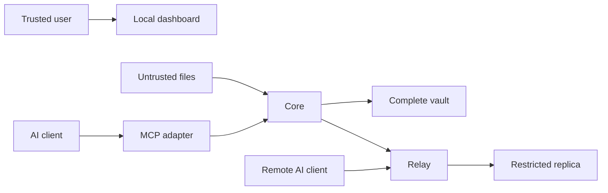

# All The Context threat model

## Executive summary

The highest risks are disclosure through an internet-facing Relay or
over-permissive client, poisoning of canonical memory through untrusted imports
and proposals, and failure to propagate deletion or permission changes. The
design keeps Core authoritative, makes imported data inert, filters before
retrieval, and authenticates an ordered application-level event stream.

## Scope and assumptions

In scope: Python Core and Relay services, SQLite stores, archive import, MCP
adapters, dashboard/API, replication, credentials, and portable export. CI and
development tooling are distinguished from runtime. One trusted OS user owns a
vault; Relay is single-user and internet-facing behind TLS; client and
replication bearer secrets are distinct. Multi-tenant and hostile local-admin
attackers are out of scope. Code signing and production hosting controls remain
deployment responsibilities.

## System model

### Primary components

- Core API/domain/storage: authoritative personal data and decisions
  (`packages/allthecontext/src/allthecontext/core`).
- Import/export: attacker-controlled files cross into local parsers
  (`packages/allthecontext/src/allthecontext/importers.py`, `export.py`).
- MCP/API clients: bearer-authenticated retrieval and proposals
  (`packages/allthecontext/src/allthecontext/mcp_adapter.py`).
- Desktop setup: per-user installation, credential persistence, reversible
  client configuration, and loopback dashboard handoff (`desktop.py`,
  `desktop_setup.py`, `client_config.py`).
- Relay: restricted replica and proposal queue
  (`packages/allthecontext/src/allthecontext/relay`).

### Data flows and trust boundaries

- AI client -> MCP adapter -> Core/Relay: JSON-RPC and HTTP, scoped bearer
  identity, Pydantic size/schema validation, audit events, application limits.
- Local file -> Core importer: untrusted bytes, allow-listed formats, size and
  archive limits, no instruction execution or URL fetch.
- Core -> Relay: HTTPS deployment channel, distinct replication credential,
  ordered HMAC-authenticated events, hash/schema/authorization checks.
- Browser -> loopback Core: local operational API, admin bearer credential,
  origin/host controls and loopback default.
- Desktop wizard -> OS store/client config/browser: credential writes are read
  back before trust; existing TOML is validated and backed up; the dashboard
  token travels in a URL fragment, is stored locally, and is immediately removed
  from browser history before API calls.

#### Diagram

## Assets and security objectives

| Asset | Why it matters | Security objective |
|---|---|---|
| Raw sources and canonical context | Highly personal user data | C/I/A |
| Approval, versions, tombstones | Defines what is true and what must be absent | I/A |
| Client and replication credentials | Grant disclosure and synchronization access | C/I |
| Permission policy and audit trail | Prevents and explains cross-client disclosure | I/A |
| Portable exports | Concentrated backup of the vault | C/I/A |

## Attacker model

### Capabilities

A remote attacker may reach a deployed Relay, possess malicious import content,
or steal one client token. An authorized model may make incorrect or adversarial
proposals. Dependency artifacts and archive structures may be malicious.

### Non-capabilities

The attacker is not assumed to control the trusted OS account, TLS terminator,
or Core process. V1 has one user and no cross-tenant boundary. Relay compromise
cannot disclose raw sources or `local_only`/`core_available` content because it
does not possess them.

## Entry points and attack surfaces

| Surface | How reached | Trust boundary | Notes | Evidence |
|---|---|---|---|---|
| Core API | Loopback HTTP | client -> Core | bearer scopes and limits | `core/app.py` |
| Relay API | HTTPS proxy | internet -> Relay | TLS external, bearer scopes | `relay/app.py` |
| MCP STDIO/HTTP | configured client | AI -> adapter | typed tools, no admin deletes | `mcp_adapter.py` |
| Import parser | local file/upload | file -> Core | untrusted, bounded, inert | `importers.py` |
| Replication apply | Core push | Core -> Relay | HMAC, sequence, hash | `replication.py` |
| Export restore | local file | backup -> Core | AEAD and integrity checks | `export.py` |
| Desktop setup | user launch | installer -> OS/config/browser | per-user paths, verified credential write, parsed/atomic config replacement | `desktop_setup.py`, `client_config.py` |

## Top abuse paths

1. Attacker embeds instructions in an archive -> extractor treats them as
   authority -> poisoned candidate is approved -> AI receives false context.
2. Stolen broad client token -> attacker searches unrelated scopes -> private
   records are returned unless record allow/deny policy is applied first.
3. Attacker replays or edits an old replication event -> Relay restores deleted
   context -> offline clients receive stale private data.
4. Malicious archive expands or parses excessively -> Core disk/CPU exhaustion
   -> user cannot inspect or retrieve the vault.
5. Relay credential theft -> forged canonical-looking event -> restricted
   replica integrity is corrupted.
6. Availability or permission change is not replicated -> Relay retains content
   after the user believes it was withdrawn.
7. Logs or an unencrypted backup capture content/token -> local or hosting
   operator obtains concentrated personal data.
8. Setup trusts a broken credential backend or corrupts an existing client
   configuration -> MCP silently loses access or another client stops working.

## Threat model table

| Threat ID | Threat source | Prerequisites | Threat action | Impact | Impacted assets | Existing controls (evidence) | Gaps | Recommended mitigations | Detection ideas | Likelihood | Impact severity | Priority |
|---|---|---|---|---|---|---|---|---|---|---|---|---|
| TM-001 | Malicious source/model | Import/proposal access | Poison durable memory | Incorrect context and decisions | Records | Candidate separation and review (`INGESTION.md`) | Human approval can err | Evidence view, conflict/duplicate grouping, inference labels | Audit unusual approval bursts | medium | high | high |
| TM-002 | Remote/token thief | Relay/client token | Query excessive context | Personal-data disclosure | Context, tokens | Scopes plus allow/deny filters (`security.py`) | Bearer theft remains usable until revoke | OS secret store, short rotation, rate limits | Per-client query/denial alerts | medium | high | high |
| TM-003 | Network attacker | Replication reachability | Replay/tamper events | Restore or alter context | Replica, tombstones | HMAC, hash, strict sequence (`replication.py`) | Shared-secret rotation is manual | Key IDs, rotation overlap, TLS pinning option | Gap/MAC/replay counters | low | high | high |
| TM-004 | Malicious archive | Import permission | Bomb/traversal/oversize input | Core denial of service | Availability, disk | Format and size bounds (`importers.py`) | Parser complexity varies | Streaming quotas, ZIP ratio/file caps, time budgets | Import byte/warning metrics | medium | medium | medium |
| TM-005 | Misconfiguration | Non-loopback Core or HTTP Relay | Expose service without TLS/auth | Broad disclosure | All reachable data | Loopback default and startup checks (`config.py`) | Reverse proxy is external | Refuse unsafe bind, deployment doctor | Unsafe-start audit event | low | high | high |
| TM-006 | Bug/operator failure | Delete/permission update | Relay remains stale | Deleted context persists | Privacy state | Transactional event/outbox and checkpoint (`storage.py`) | Offline Relay delays delivery | Prominent lag status, reconciliation | Alert oldest undelivered event | medium | high | high |
| TM-007 | Local/hosting attacker | Read files/logs | Exfiltrate backup or content | Concentrated disclosure | Vault/export | Redacted logs, encrypted export (`export.py`) | Database-at-rest depends on OS | Document disk encryption; future vault key | Secret-pattern log tests | low | high | medium |
| TM-008 | Supply-chain attacker | Compromised dependency/build | Execute in trusted process | Full vault compromise | All assets | Pinned ranges and CI (`pyproject.toml`) | No signed releases yet | lockfile, Dependabot, SBOM, signed artifacts | Dependency audit in release gate | low | high | medium |
| TM-009 | Local failure/malware | Setup access to user config | Drop credential or alter client config | Silent MCP failure or client disruption | Tokens, availability | Credential read-back, TOML parse, managed markers, backup, atomic replace (`desktop_setup.py`, `client_config.py`) | Fallback file is not OS-protected | Signed installer, recovery UI, eliminate fallback for production | Setup warning and packaged smoke | low | high | medium |

## Criticality calibration

- Critical: unauthenticated remote Core/Relay code execution; universal auth
  bypass; release compromise affecting every installation.
- High: practical context exfiltration, durable memory poisoning, forged
  replication, or failure to honor deletion for one vault.
- Medium: bounded denial of service, encrypted-export metadata leak, or attack
  requiring a stolen scoped token with limited records.
- Low: low-sensitivity status disclosure or noisy local failure with an obvious
  recovery path.

## Focus paths for security review

| Path | Why it matters | Related threats |
|---|---|---|
| `packages/allthecontext/src/allthecontext/security.py` | Credential and authorization decisions | TM-002, TM-005 |
| `packages/allthecontext/src/allthecontext/importers.py` | Parses attacker-controlled data | TM-001, TM-004 |
| `packages/allthecontext/src/allthecontext/replication.py` | Authority boundary and deletion convergence | TM-003, TM-006 |
| `packages/allthecontext/src/allthecontext/storage.py` | Canonical transactions and parameterized queries | TM-001, TM-006 |
| `packages/allthecontext/src/allthecontext/export.py` | Concentrated portable backup | TM-007 |
| `packages/allthecontext/src/allthecontext/core/app.py` | Local HTTP/admin entry point | TM-002, TM-005 |
| `packages/allthecontext/src/allthecontext/relay/app.py` | Internet-facing surface | TM-002, TM-003, TM-005 |
| `packages/allthecontext/src/allthecontext/client_config.py` | Reversible client configuration and credential handoff | TM-002, TM-009 |

## Quality check

- Covers runtime API, MCP, imports, replication, storage, and export entrypoints.
- Covers each local, file, client, and remote trust boundary.
- Separates CI/dependencies from runtime threats.
- Reflects confirmed single-user, TLS-proxy, and policy-review assumptions.
- Production deployment, key rotation, and signed packaging remain explicit
  residual risks.
