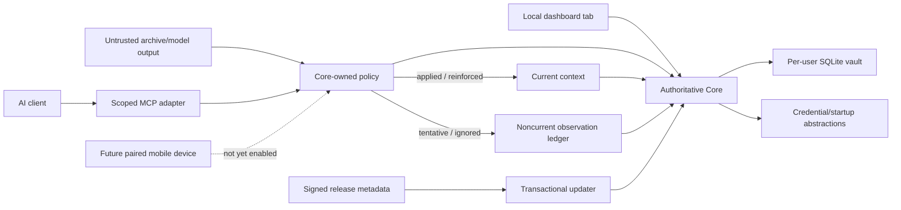

# All The Context V1 threat model

## Scope and assumptions

V1 has one user and one authoritative local Core. In scope: Core, its SQLite
vault, automatic context policy, dashboard, archive import, MCP HTTP/STDIO
transports, desktop setup, credentials, export/restore, and updates. There is no
supported hosted Edge, cloud replica, or third-party runtime.

The operating-system user account is trusted to own the vault. AI clients and
imported content are not trusted to choose a disposition, create current
context directly, or expand permissions. The live SQLite database is not
application-encrypted; OS account/disk protection is part of the boundary.

## Assets

- raw source material, observations, and current context;
- policy dispositions/reasons, provenance, history, permissions, tombstones,
  and audit state;
- administrator and scoped client credentials;
- OS integration/configuration backups;
- encrypted exports and their passphrases; and
- release public keys, manifests, packages, and update journals.

## Trust boundaries

Core listens on `127.0.0.1` by default. The future mobile boundary is not
trusted or enabled automatically; it requires device enrollment, encrypted
transport, revocation, discovery, and recovery acceptance.

## Attacker capabilities

- submit malicious archives or model observations;
- operate an authorized or stolen client credential and lie in submitted
  content or basis fields;
- exploit a provider archive with incorrect or adversarial role labels;
- send cross-origin/browser requests to loopback;
- place an unrelated service on the expected port;
- interrupt migrations, writes, policy evaluation, export, shutdown, or update;
- tamper with update metadata or packages; and
- convince a user to expose Core over an unsafe network interface.

An attacker who already controls the user's OS account can read the live V1
vault and is outside the application-encryption boundary.

## Principal threats and mitigations

| ID | Threat | Impact | Mitigations | Residual risk |
|---|---|---|---|---|
| TM-001 | Imported/model text is treated as instruction | Poisoned current context or code execution | Treat text as inert data; bounded parsers; normalize and exclude assistant/system/tool/attachment roles; keep generic instruction-bearing observations tentative; Core-owned policy | Parser or provider role-label defects may misclassify plausible user prose |
| TM-002 | Client exceeds scopes or record allowlist | Personal-context disclosure | Per-client credentials; applied/current, policy, validity, and deletion filters before every ranker; indistinguishable denied/missing results | Authorized client/provider sees returned content |
| TM-003 | Model or importer forces an applied disposition | Integrity loss | Inputs create observations only; Core derives origin and runs hard policy; inference/provider synthesis remains tentative by default; decision is versioned and reversible | An authorized malicious client can lie about user intent; deterministic policy can contain a defect |
| TM-004 | Browser ticket/token leaks or CSRF mutates Core | Administrative compromise | One-use expiring ticket; opaque memory/tab session; no admin token in URL/cookie/storage; custom dashboard mutation header | Malicious code in the authenticated tab remains powerful |
| TM-005 | Unknown loopback listener impersonates Core | Credential theft/wrong-vault access | Installation-bound challenge proof; exact vault/port binding; refuse unknown listener | Compromised local account can replace binaries/state |
| TM-006 | Core is exposed on LAN/Internet without transport security | Full reachable-vault disclosure | Loopback default; no automatic exposure; UI warning; mobile gate requires pairing and encryption | Operator can still deliberately override configuration |
| TM-007 | Credential backend drops or exposes tokens | Client takeover | Read-after-write verification; OS keyring abstraction; explicit fallback warning; redacted logs | Development fallback is weaker than OS storage |
| TM-008 | Interrupted migration/export/update or observation transaction corrupts vault | Availability, partial context publication, or data loss | SQLite transactions/backups; idempotent policy/batches; portable locks; bounded temp files; update journal, health check, and rollback | Hardware/filesystem failure can defeat local recovery |
| TM-009 | Malicious update or mutable URL executes | Code execution | No-redirect metadata fetch; strict Ed25519 manifest; immutable version URL; one pinned GitHub release-CDN redirect; size/hash/platform/version checks; offline key custody | Community package lacks publisher identity |
| TM-010 | Deletion/purge leaves recoverable live content | Privacy expectation failure | Reversible delete/history semantics; explicit irreversible purge state; secure-delete/checkpoint/VACUUM; resurrection barriers and byte scans | Backups, SSD remanence, and user copies remain outside live-store claims |
| TM-011 | Large requests/imports or ZIP bombs cause denial of service | Core unavailable/disk exhaustion | Chunked upload/blob writes; raw, entry, expanded-text, per-conversation, and compression bounds; in-place ZIP reads; resumable ingestion; temporary-file cleanup | Valid large local archives can still consume time and local disk |
| TM-012 | Dormant experimental Edge code contacts a service or becomes an authority | Unexpected third-party disclosure or split-brain context | No Edge UI/workflow/template/console entry; background worker disabled; Relay queues observations and accepts signed ordered Core projections only | Manual use of internal APIs remains possible to a local administrator |
| TM-013 | Provider output is mistaken for direct user context | False current context without a review checkpoint | Provider role normalization; only eligible user-authored durable statements may apply after successful session finish; provider synthesis stays tentative; provenance, bounded decision reasons, correction, and undo | A provider can mislabel roles; automatic policy can apply a plausible false statement |
| TM-014 | Provider schema drift silently omits conversations | Incomplete portable context | Preserve byte-exact raw source; report recognized files/messages, warnings, unavailable material, and limitations; version parser sessions for reprocessing | Provider schemas are not contractual, especially Grok |
| TM-015 | Routine review is removed but tentative state leaks into retrieval | Unverified inference reaches clients | Treat disposition as a hard retrieval predicate before indexing/ranking; test tentative/ignored isolation across restart, restore, and migration | A migration or index bug could violate the predicate |
| TM-016 | Automatic conflict resolution destroys the earlier truth | Stale or incorrect current context with lost evidence | Advisory slots; targeted correction, explicitness, and `observed_at` precedence; immutable versions and evidence links; reversible correction/restore; purge remains separate | Policy precedence cannot infer every real-world nuance |
| TM-017 | Compromised proposal client abuses `forget_context` | Current context becomes temporarily unavailable | Require `context:propose`, exact record ID, explicit-user tool instructions, reason, audit, and a reversible tombstone; keep restore and purge outside model-facing MCP | A stolen authorized credential can hide records until the user restores them |

## Security invariants

1. Core is the only authority that can create or change current context.
2. Observations cannot select their own Core-derived origin or disposition.
3. Imported/model text is inert data and cannot act as instructions.
4. Tentative, ignored, and staged observations are never retrieved as current
   context.
5. A failed or unfinished import cannot change current context.
6. Permissions and validity run before relevance scoring.
7. Core binds to loopback unless explicitly configured otherwise.
8. Relay accepts signed ordered Core projections and queues observations only;
   it never evaluates policy or creates current context.
9. Credentials and raw personal context are never logged.
10. A partial or unhealthy update cannot be committed as successful.
11. Mobile access is not called complete until its new network boundary has
    dedicated acceptance evidence.

## Deferred experimental code

The Relay/Edge modules retain their earlier protocol tests as defense against
regressions while compatibility/cleanup requirements are evaluated. They are
not part of the V1 runtime threat surface because Core does not start the worker
and no supported deployment artifact is published. If exercised explicitly,
Relay remains a transport/projection and observation queue, never a current
context authority. Re-enabling any hosted component requires a new threat-model
revision and architecture decision.
