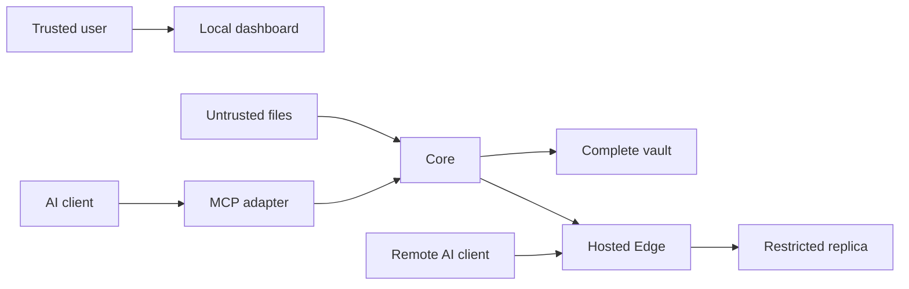

# All The Context threat model

## Executive summary

The highest risks are disclosure through an internet-facing Edge or
over-permissive client, poisoning of canonical memory through untrusted imports
and proposals, and failure to propagate deletion or permission changes. The
design keeps Core authoritative, makes imported data inert, filters before
retrieval, authenticates an ordered application-level event stream, and binds
each durable Edge disk to one vault, pairing secret, and public origin.

## Scope and assumptions

In scope: Python Core and Relay services, SQLite stores, archive import, MCP
adapters, dashboard/API, replication, credentials, OAuth, remote proposal
transport, Edge deployment, and portable export. CI and development tooling are
distinguished from runtime. One trusted OS user owns a vault; Edge is
single-user and internet-facing behind TLS; OAuth, owner, client, and
replication credentials have distinct roles. Multi-tenant and hostile
local-admin or hosting-process attackers are out of scope. A hosting operator
can read the approved replica while serving it, so zero-knowledge hosting is
not a security objective. Code signing, TLS, and production host controls remain
deployment responsibilities.

## System model

### Primary components

- Core API/domain/storage: authoritative personal data and decisions
  (`packages/allthecontext/src/allthecontext/core`).
- Import/export: attacker-controlled files cross into local parsers
  (`packages/allthecontext/src/allthecontext/importers.py`, `export.py`).
- MCP/API clients: bearer-authenticated retrieval and proposals
  (`packages/allthecontext/src/allthecontext/mcp_adapter.py`).
- Desktop setup: per-user installation, credential persistence, reversible
  client configuration, and loopback dashboard handoff (`desktop.py`,
  `desktop_setup.py`, `client_config.py`).
- Edge (implemented by the Relay package): restricted replica, encrypted
  proposal transport queue, owner recovery, and OAuth/MCP endpoint
  (`packages/allthecontext/src/allthecontext/relay`).

### Data flows and trust boundaries

- AI client -> MCP adapter -> Core/Edge: JSON-RPC and HTTP, scoped bearer or
  OAuth 2.1 credentials,
  identity, Pydantic size/schema validation, audit events, application limits.
- Local file -> Core importer: untrusted bytes, allow-listed formats, size and
  archive limits, no instruction execution or URL fetch.
- Core -> Edge: HTTPS deployment channel, distinct replication credential,
  ordered HMAC-authenticated events, hash/schema/authorization checks.
- Remote AI client -> Edge: dynamic registration only in an owner-opened window,
  authorization code + PKCE, audience-bound access tokens, rotating refresh
  families, per-client permissions, and explicit revocation.
- Remote proposal -> Edge -> Core: AES-GCM sealed, bounded, expiring transport
  envelope; it is scrubbed after Core acknowledgement and never becomes
  canonical at Edge.
- Browser -> loopback Core: local operational API, opaque tab-scoped session
  backed only by Core memory, bearer validation behind that capability, a
  required custom header on mutations, and loopback default.
- Desktop wizard -> OS store/client config/browser: credential writes are read
  back before trust; existing TOML/JSON is validated and backed up; a random
  one-use ticket expires after 60 seconds and is exchanged for an opaque tab
  session; a per-installation challenge proof is verified before any privileged
  credential is sent to the loopback listener.

#### Diagram

## Assets and security objectives

| Asset | Why it matters | Security objective |
|---|---|---|
| Raw sources and canonical context | Highly personal user data | C/I/A |
| Approval, versions, tombstones | Defines what is true and what must be absent | I/A |
| Client and replication credentials | Grant disclosure and synchronization access | C/I |
| Permission policy and audit trail | Prevents and explains cross-client disclosure | I/A |
| Portable exports | Concentrated backup of the vault | C/I/A |

## Attacker model

### Capabilities

A remote attacker may reach a deployed Edge, possess malicious import content,
or steal one client token. An authorized model may make incorrect or adversarial
proposals. A hosting operator can inspect process memory and deployment secrets.
Dependency artifacts and archive structures may be malicious.

### Non-capabilities

The attacker is not assumed to control the trusted OS account, TLS terminator,
Core process, or hosting process unless explicitly analyzing privacy at the host.
V1 has one user and no cross-tenant boundary. Edge compromise
cannot disclose raw sources or `local_only`/`core_available` content because it
does not possess them.

## Entry points and attack surfaces

| Surface | How reached | Trust boundary | Notes | Evidence |
|---|---|---|---|---|
| Core API | Loopback HTTP | client -> Core | bearer scopes and limits | `core/app.py` |
| Edge API and OAuth/MCP | HTTPS proxy | internet -> Edge | TLS external, owner-gated registration, OAuth/PKCE, global request bounds | `relay/app.py`, `relay/oauth.py`, `relay/mcp.py` |
| MCP STDIO/HTTP | configured client | AI -> adapter | typed tools, no admin deletes | `mcp_adapter.py` |
| Import parser | local file/upload | file -> Core | untrusted, bounded, inert | `importers.py` |
| Replication apply | Core push | Core -> Relay | HMAC, sequence, hash | `replication.py` |
| Export restore | local file | backup -> Core | AEAD and integrity checks | `export.py` |
| Desktop setup | user launch | installer -> OS/config/browser | per-user paths, verified credential write, parsed/atomic config replacement | `desktop_setup.py`, `client_config.py` |

## Top abuse paths

1. Attacker embeds instructions in an archive -> extractor treats them as
   authority -> poisoned candidate is approved -> AI receives false context.
2. Stolen broad client token -> attacker searches unrelated scopes -> private
   records are returned unless record allow/deny policy is applied first.
3. Attacker replays or edits an old replication event -> Relay restores deleted
   context -> offline clients receive stale private data.
4. Malicious archive expands or parses excessively -> Core disk/CPU exhaustion
   -> user cannot inspect or retrieve the vault.
5. Relay credential theft -> forged canonical-looking event -> restricted
   replica integrity is corrupted.
6. Availability or permission change is not replicated -> Relay retains content
   after the user believes it was withdrawn.
7. Logs or an unencrypted backup capture content/token -> local or hosting
   operator obtains concentrated personal data.
8. Setup trusts a broken credential backend or corrupts an existing client
   configuration -> MCP silently loses access or another client stops working.
9. A local process captures or replays a browser handoff ticket -> it attempts
   to obtain dashboard authority before the ticket expires or is consumed.
10. An operator reuses an Edge disk with another vault or pairing secret -> old
    refresh/access tokens could cross authorities unless startup binds identity.
11. An unauthenticated internet client streams an oversized or filter-heavy
    request -> public parsing/search work exhausts memory or CPU.
12. A user uninstalls after interrupted Edge setup -> orphaned credentials or an
    undecommissioned remote service survive a false-success uninstall.
13. A request passes an HTTP terminal-state check, pauses, then commits after
    decommission -> supposedly removed Edge data or authority is resurrected.
14. Core crashes after one-time MCP setup -> clients silently stop using context
    or the user must manually recover the service.

## Threat model table

| Threat ID | Threat source | Prerequisites | Threat action | Impact | Impacted assets | Existing controls (evidence) | Gaps | Recommended mitigations | Detection ideas | Likelihood | Impact severity | Priority |
|---|---|---|---|---|---|---|---|---|---|---|---|---|
| TM-001 | Malicious source/model | Import/proposal access | Poison durable memory | Incorrect context and decisions | Records | Candidate separation and review (`INGESTION.md`) | Human approval can err | Evidence view, conflict/duplicate grouping, inference labels | Audit unusual approval bursts | medium | high | high |
| TM-002 | Remote/token thief | Relay/client token | Query excessive context | Personal-data disclosure | Context, tokens | Scopes plus allow/deny filters (`security.py`) | Bearer theft remains usable until revoke | OS secret store, short rotation, rate limits | Per-client query/denial alerts | medium | high | high |
| TM-003 | Network attacker | Replication reachability | Replay/tamper events | Restore or alter context | Replica, tombstones | HMAC, hash, strict sequence (`replication.py`) | Shared-secret rotation is manual | Key IDs, rotation overlap, TLS pinning option | Gap/MAC/replay counters | low | high | high |
| TM-004 | Malicious archive | Import permission | Bomb/traversal/oversize input | Core denial of service | Availability, disk | Format and size bounds (`importers.py`) | Parser complexity varies | Streaming quotas, ZIP ratio/file caps, time budgets | Import byte/warning metrics | medium | medium | medium |
| TM-005 | Misconfiguration | Non-loopback Core or HTTP Relay | Expose service without TLS/auth | Broad disclosure | All reachable data | Loopback default and startup checks (`config.py`) | Reverse proxy is external | Refuse unsafe bind, deployment doctor | Unsafe-start audit event | low | high | high |
| TM-006 | Bug/operator failure | Delete/permission update | Relay remains stale | Deleted context persists | Privacy state | Transactional event/outbox and checkpoint (`storage.py`) | Offline Relay delays delivery | Prominent lag status, reconciliation | Alert oldest undelivered event | medium | high | high |
| TM-007 | Local/hosting attacker | Read files/logs | Exfiltrate backup or content | Concentrated disclosure | Vault/export | Redacted logs, encrypted export (`export.py`) | Database-at-rest depends on OS | Document disk encryption; future vault key | Secret-pattern log tests | low | high | medium |
| TM-008 | Supply-chain attacker | Compromised dependency/build | Execute in trusted process | Full vault compromise | All assets | Pinned ranges and CI (`pyproject.toml`) | No signed releases yet | lockfile, Dependabot, SBOM, signed artifacts | Dependency audit in release gate | low | high | medium |
| TM-009 | Local failure/malware | Setup/uninstall access to user config | Drop credential, retain token backup, or alter client config | Silent MCP failure, surviving access, or client disruption | Tokens, availability | Credential read-back and ambiguous-write rollback; TOML/JSON parse; managed markers; atomic replace; strict store-specific deletion for corrupt-vault uninstall; token-bearing backup scrub (`desktop_setup.py`, `client_config.py`) | Fallback file is not OS-protected | Signed installer, recovery UI, eliminate fallback for production | Setup warning, missing-secret-service and packaged smoke tests | low | high | medium |
| TM-010 | Local process/browser history observer, another loopback service, or another web origin | Access during desktop launch or a browser request | Impersonate Core, capture/replay dashboard handoff, or submit an authenticated mutation | Dashboard administration | Tokens, context | Per-installation HMAC challenge proof before credential send; 256-bit random ticket, 60-second TTL, one-use consume, no administrator credential in URL/cookie/browser storage, opaque tab session backed only by Core memory, custom mutation header (`instance_identity.py`, `browser_session.py`, `core/app.py`) | Hostile trusted OS account can read the installation secret and remains out of scope | Signed release and browser-session revocation UI | Audit rejected proof, ticket, session, and mutation-header failures | low | high | medium |
| TM-011 | Remote attacker or stolen refresh token | Internet reachability or token theft | Register without consent, replay a rotated token, or retain access after revoke | Replica disclosure/proposal injection | Edge context, OAuth material | Ten-minute persisted registration window, DCR bounds/rate limits, PKCE, audience binding, hashed tokens, rotating family replay revocation, client revoke (`relay/oauth.py`) | Reverse-proxy distributed rate limiting is external | Add host-level rate limiting and alerting | Registration denials, replay-family revocations | medium | high | high |
| TM-012 | Host operator/misconfiguration | Reuse a durable disk or change enrollment/public origin | Make old tokens valid under a new authority | Cross-vault disclosure | Edge replica, tokens | Persisted vault + pairing fingerprint + origin binding before MCP startup (`0005_edge_identity_binding.sql`, `relay/oauth.py`) | Host process compromise still sees approved data | Separate host accounts and secrets; rotate by explicit redeploy | Startup binding mismatch | low | high | high |
| TM-013 | Unauthenticated remote client | Public Edge URL | Send oversized/chunked/filter-heavy requests | Edge denial of service | Availability | Global body/query caps before parsing, bounded models, filter cardinality limits, iterative retrieval paging (`relay/app.py`, `relay/service.py`) | In-process limiter is single-instance and not a DDoS service | Provider/WAF request and connection limits | 413/414/422 and rate-limit counters | medium | medium | medium |
| TM-014 | Crash, offline host, or corrupted local state | Partial setup or uninstall | Skip remote erasure but report successful uninstall | Persistent remote data/access | Edge context, credentials | Uninstall inspects state and credential independently, cryptographically verifies the origin, requires terminal zero-record response, revokes readable local AI identities, strictly removes authority-bearing credentials when SQLite is corrupt, and blocks on orphan/offline Edge state (`desktop.py`, `edge_connection.py`) | Manual hosting deletion may still be required | Guided recovery and provider deletion checklist | Uninstall error with no application-file deletion | low | high | medium |
| TM-015 | Concurrent request/process | Request began before Edge decommission or Core forget | Commit after terminal purge or recreate local connection state | Deleted context/access returns | Edge context, lifecycle state | Terminal recheck in the same `BEGIN IMMEDIATE` transaction, database write triggers, cross-process Edge file lock, interrupted-purge restart (`relay/service.py`, `relay/oauth.py`, `0006_terminal_write_guards.sql`, `edge_connection.py`) | Host-level database replacement remains operator authority | Keep terminal state in durable backups and never reuse disks across vaults | 410 responses, trigger violations, lifecycle error logs | low | high | high |
| TM-016 | Core crash or hostile loopback listener | Managed STDIO client invokes a tool | Keep Core offline or trick adapter into starting/sending to another service | Context unavailable or credential disclosure | Availability, client tokens | Managed-only auto-start, exact 127.0.0.1 origin, installation-bound proof, unknown-listener refusal, exact Core command, bounded readiness wait (`mcp_adapter.py`, `desktop_setup.py`) | Hostile same-account process can read installation material and is out of scope | Signed packages and OS account protection | Proof failures and Core restart log | low | high | medium |

## Criticality calibration

- Critical: unauthenticated remote Core/Relay code execution; universal auth
  bypass; release compromise affecting every installation.
- High: practical context exfiltration, durable memory poisoning, forged
  replication, or failure to honor deletion for one vault.
- Medium: bounded denial of service, encrypted-export metadata leak, or attack
  requiring a stolen scoped token with limited records.
- Low: low-sensitivity status disclosure or noisy local failure with an obvious
  recovery path.

## Focus paths for security review

| Path | Why it matters | Related threats |
|---|---|---|
| `packages/allthecontext/src/allthecontext/security.py` | Credential and authorization decisions | TM-002, TM-005 |
| `packages/allthecontext/src/allthecontext/importers.py` | Parses attacker-controlled data | TM-001, TM-004 |
| `packages/allthecontext/src/allthecontext/replication.py` | Authority boundary and deletion convergence | TM-003, TM-006 |
| `packages/allthecontext/src/allthecontext/storage.py` | Canonical transactions and parameterized queries | TM-001, TM-006 |
| `packages/allthecontext/src/allthecontext/export.py` | Concentrated portable backup | TM-007 |
| `packages/allthecontext/src/allthecontext/core/app.py` | Local HTTP/admin entry point | TM-002, TM-005 |
| `packages/allthecontext/src/allthecontext/relay/app.py` | Internet-facing surface | TM-002, TM-003, TM-005 |
| `packages/allthecontext/src/allthecontext/relay/oauth.py` | Owner sessions, registration, token rotation, durable identity binding | TM-011, TM-012 |
| `packages/allthecontext/src/allthecontext/edge_connection.py` | Core-to-Edge proof, credential/state recovery, terminal decommission | TM-012, TM-014 |
| `packages/allthecontext/src/allthecontext/client_config.py` | Reversible client configuration and credential handoff | TM-002, TM-009 |

## Quality check

- Covers runtime API, MCP, imports, replication, storage, and export entrypoints.
- Covers each local, file, client, and remote trust boundary.
- Separates CI/dependencies from runtime threats.
- Reflects confirmed single-user, TLS-proxy, and policy-review assumptions.
- Production deployment, key rotation, and signed packaging remain explicit
  residual risks.
