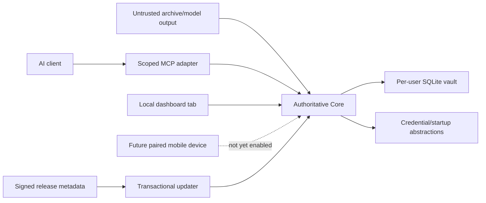

# All The Context V1 threat model

## Scope and assumptions

V1 has one user and one authoritative local Core. In scope: Core, its SQLite
vault, dashboard, archive import, MCP HTTP/STDIO transports, desktop setup,
credentials, export/restore, and updates. There is no supported hosted Edge,
cloud replica, or third-party runtime.

The operating-system user account is trusted to own the vault. AI clients and
imported content are not trusted to approve memory or expand permissions. The
live SQLite database is not application-encrypted; OS account/disk protection
is part of the boundary.

## Assets

- raw source material and canonical context;
- provenance, history, permissions, tombstones, and audit state;
- administrator and scoped client credentials;
- OS integration/configuration backups;
- encrypted exports and their passphrases; and
- release public keys, manifests, packages, and update journals.

## Trust boundaries

Core listens on `127.0.0.1` by default. The future mobile boundary is not
trusted or enabled automatically; it requires device enrollment, encrypted
transport, revocation, discovery, and recovery acceptance.

## Attacker capabilities

- submit malicious archives or model proposals;
- operate an authorized or stolen client credential;
- send cross-origin/browser requests to loopback;
- place an unrelated service on the expected port;
- interrupt migrations, writes, export, shutdown, or update;
- tamper with update metadata or packages; and
- convince a user to expose Core over an unsafe network interface.

An attacker who already controls the user's OS account can read the live V1
vault and is outside the application-encryption boundary.

## Principal threats and mitigations

| ID | Threat | Impact | Mitigations | Residual risk |
|---|---|---|---|---|
| TM-001 | Imported/model text is treated as instruction | Poisoned canonical memory or code execution | Treat text as inert data; bounded parsers; candidate-only extraction; explicit approval | Reviewer may approve a plausible falsehood |
| TM-002 | Client exceeds scopes or record allowlist | Personal-context disclosure | Per-client credentials; policy/validity/deletion before every ranker; indistinguishable denied/missing results | Authorized client/provider sees returned content |
| TM-003 | Model writes canonical memory directly | Integrity loss | MCP exposes proposals, not approval/correction/deletion authority | Misconfigured future auto-policy could be too broad |
| TM-004 | Browser ticket/token leaks or CSRF mutates Core | Administrative compromise | One-use expiring ticket; opaque memory/tab session; no admin token in URL/cookie/storage; custom dashboard mutation header | Malicious code in the authenticated tab remains powerful |
| TM-005 | Unknown loopback listener impersonates Core | Credential theft/wrong-vault access | Installation-bound challenge proof; exact vault/port binding; refuse unknown listener | Compromised local account can replace binaries/state |
| TM-006 | Core is exposed on LAN/Internet without transport security | Full reachable-vault disclosure | Loopback default; no automatic exposure; UI warning; mobile gate requires pairing and encryption | Operator can still deliberately override configuration |
| TM-007 | Credential backend drops or exposes tokens | Client takeover | Read-after-write verification; OS keyring abstraction; explicit fallback warning; redacted logs | Development fallback is weaker than OS storage |
| TM-008 | Interrupted migration/export/update corrupts vault | Availability or data loss | SQLite transactions/backups; portable locks; bounded temp files; update journal, health check, and rollback | Hardware/filesystem failure can defeat local recovery |
| TM-009 | Malicious update or mutable URL executes | Code execution | HTTPS no-redirect fetch; strict Ed25519 manifest; immutable version URL; size/hash/platform/version checks; offline key custody | Community package lacks publisher identity |
| TM-010 | Deletion/purge leaves recoverable live content | Privacy expectation failure | Tombstones/history semantics; explicit irreversible purge state; secure-delete/checkpoint/VACUUM; resurrection barriers and byte scans | Backups, SSD remanence, and user copies remain outside live-store claims |
| TM-011 | Large requests/imports cause denial of service | Core unavailable/disk exhaustion | Body, record, query, export, and pagination bounds; resumable ingestion; temporary-file cleanup | Valid large local archives can still consume time |
| TM-012 | Dormant experimental Edge code contacts a service | Unexpected third-party disclosure | No Edge UI/workflow/template/console entry; background worker disabled; retain only explicit compatibility/cleanup paths | Manual use of internal APIs remains possible to a local administrator |

## Security invariants

1. Core is the only canonical authority.
2. Imported/model text cannot approve itself.
3. Permissions and validity run before relevance scoring.
4. Core binds to loopback unless explicitly configured otherwise.
5. No V1 startup path contacts or deploys a hosted context service.
6. Credentials and raw personal context are never logged.
7. A partial or unhealthy update cannot be committed as successful.
8. Mobile access is not called complete until its new network boundary has
   dedicated acceptance evidence.

## Deferred experimental code

The Relay/Edge modules retain their earlier protocol tests as defense against
regressions while compatibility/cleanup requirements are evaluated. They are
not part of the V1 runtime threat surface because Core does not start the worker
and no supported deployment artifact is published. Re-enabling any hosted
component requires a new threat-model revision and architecture decision.
