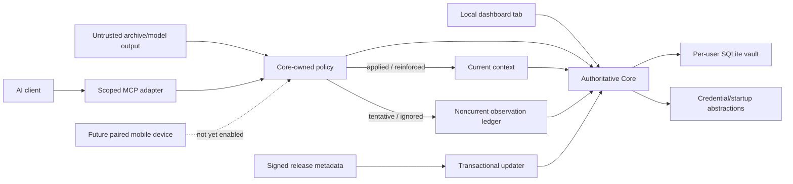

# All The Context V1 threat model

## Scope and assumptions

V1 has one user and one authoritative local Core. In scope: Core, its SQLite
vault, automatic context policy, dashboard, archive import, MCP HTTP/STDIO
transports, desktop setup, credentials, export/restore, and updates. There is no
supported hosted Edge, cloud replica, or third-party runtime. Ordinary Core
Edge/Relay operation routes, mutation triggers, and CLI commands are removed or
tombstoned. The remaining `legacy-edge` status/decommission/forget surface is
an isolated cleanup mechanism for pre-V1 residual state; exact packaged
candidate proof remains required.

The operating-system user account is trusted to own the vault. AI clients and
imported content are not trusted to choose a disposition, create current
context directly, or expand permissions. The live SQLite database is not
application-encrypted; OS account/disk protection is part of the boundary.
An ATC-configured same-device client principal may be granted authority to
attest that specific text was explicitly stated by the user. This is a scoped
local trust grant, not cryptographic authorship proof; authentication alone
does not confer it and imported content never inherits it.

## Assets

- raw source material, observations, and current context;
- policy dispositions/reasons, provenance, history, permissions, tombstones,
  and audit state;
- administrator and scoped client credentials;
- OS integration/configuration backups;
- encrypted exports and their passphrases; and
- release public keys, manifests, packages, and update journals.

## Trust boundaries

```mermaid
flowchart LR
  Import["Untrusted archive/model output"] --> Policy["Core-owned policy"]
  Client["AI client"] --> Adapter["Scoped MCP adapter"] --> Policy
  Policy -->|"applied / reinforced"| Current["Current context"]
  Policy -->|"tentative / ignored"| Ledger["Noncurrent observation ledger"]
  Browser["Local dashboard tab"] --> Core["Authoritative Core"]
  Policy --> Core
  Current --> Core
  Ledger --> Core
  Core --> Vault["Per-user SQLite vault"]
  Core --> OS["Credential/startup abstractions"]
  Mobile["Future paired mobile device"] -. "not yet enabled" .-> Policy
  Release["Signed release metadata"] --> Updater["Transactional updater"] --> Core
```

Core listens on `127.0.0.1` by default. The future mobile boundary is not
trusted or enabled automatically; it requires device enrollment, encrypted
transport, revocation, discovery, and recovery acceptance.

## Attacker capabilities

- submit malicious archives or model observations;
- submit a low-entropy secret-like value and use any retained hash/fingerprint
  as an offline guessing oracle;
- operate an authorized or stolen client credential and lie in submitted
  content or basis fields;
- exploit a provider archive with incorrect or adversarial role labels;
- send cross-origin/browser requests to loopback;
- place an unrelated service on the expected port;
- interrupt migrations, writes, policy evaluation, export, shutdown, or update;
- tamper with update metadata or packages; and
- convince a user to expose Core over an unsafe network interface.

An attacker who already controls the user's OS account can read the live V1
vault and is outside the application-encryption boundary.

## Principal threats and mitigations

| ID | Threat | Impact | Mitigations | Residual risk |
|---|---|---|---|---|
| TM-001 | Imported/model text is treated as instruction | Poisoned current context or code execution | Treat text as inert data; bounded parsers; normalize and exclude assistant/system/tool/attachment roles; keep generic instruction-bearing observations tentative; Core-owned policy | Parser or provider role-label defects may misclassify plausible user prose |
| TM-002 | Client exceeds scopes or record allowlist | Personal-context disclosure | Per-client credentials; applied/current, policy, validity, and deletion filters before every ranker; indistinguishable denied/missing results | Authorized client/provider sees returned content |
| TM-003 | Model or importer forces an applied disposition | Integrity loss | Inputs create observations only; Core derives origin and runs hard policy; only an ATC-configured same-device principal explicitly granted the direct-user-statement witness class may attest it; authentication alone is insufficient; inference/provider synthesis remains tentative; imported content never inherits the grant; decisions are versioned and reversible | The trust grant is not cryptographic authorship proof; an authorized malicious client can lie about user intent and deterministic policy can contain a defect |
| TM-004 | Browser ticket/token leaks or CSRF mutates Core | Administrative compromise | One-use expiring ticket; opaque memory/tab session; no admin token in URL/cookie/storage; custom dashboard mutation header | Malicious code in the authenticated tab remains powerful |
| TM-005 | Unknown loopback listener impersonates Core | Credential theft/wrong-vault access | Installation-bound challenge proof; exact vault/port binding; refuse unknown listener | Compromised local account can replace binaries/state |
| TM-006 | Core is exposed on LAN/Internet without transport security | Full reachable-vault disclosure | Loopback default; no automatic exposure; UI warning; mobile gate requires pairing and encryption | Operator can still deliberately override configuration |
| TM-007 | Credential backend drops or exposes tokens | Client takeover | Read-after-write verification; normal setup fails closed when the OS store is unavailable; plaintext development storage requires deliberate opt-in; normal managed configs carry credential references rather than bearer tokens; partial writes revoke new principals, delete credentials, and restore prior config bytes; errors/logs redact backend details | Real exact-package Windows Credential Manager and supported Linux Secret Service receipts remain required; retained macOS code is outside the beta threat surface |
| TM-008 | Interrupted migration/export/update or observation transaction corrupts vault | Availability, partial context publication, or data loss | SQLite transactions/backups; idempotent policy/batches; portable locks; bounded temp files; update journal, health check, and rollback | Hardware/filesystem failure can defeat local recovery |
| TM-009 | Malicious update or mutable URL executes | Code execution | No-redirect metadata fetch; strict Ed25519 manifest; immutable version URL; one pinned GitHub release-CDN redirect; size/hash/platform/version checks; offline key custody | Community package lacks publisher identity |
| TM-010 | Deletion/purge leaves recoverable live content | Privacy expectation failure | Reversible delete/history semantics; explicit irreversible purge state; secure-delete/checkpoint/VACUUM; resurrection barriers and byte scans | Backups, SSD remanence, and user copies remain outside live-store claims |
| TM-011 | Large requests/imports or ZIP bombs cause denial of service | Core unavailable/disk exhaustion | Chunked upload/blob writes; raw, entry, expanded-text, per-conversation, and compression bounds; in-place ZIP reads; resumable ingestion; temporary-file cleanup; mandatory 2,000,000,000-byte acceptance uses a physically allocated non-sparse canary, predeclared RSS/disk/progress/cancel/retry/wall-time budgets, and every frozen target | Valid large local archives still consume substantial time and disk within the disclosed support profile |
| TM-012 | Active Edge compatibility API/CLI/triggers contact a service or create a second authority | Unexpected third-party disclosure or split-brain context | Enrollment, deployment, connect, sync, client management, mutation triggers, and routine Relay CLI paths are removed/tombstoned; the worker never starts; negative API/CLI/package/network tests cover ordinary Core; residual cleanup is isolated and refuses to create a new authority | Exact downloaded-artifact proof is pending, and a compromised local administrator can deliberately invoke cleanup against preserved pre-V1 state |
| TM-013 | Provider output is mistaken for direct user context | False current context without a review checkpoint | Provider role normalization; only eligible user-authored durable statements may apply after successful session finish; provider synthesis stays tentative; provenance, bounded decision reasons, correction, and undo | A provider can mislabel roles; automatic policy can apply a plausible false statement |
| TM-014 | Provider schema drift silently omits conversations | Incomplete portable context | Preserve byte-exact raw source; report recognized files/messages, warnings, unavailable material, and limitations; version parser sessions for reprocessing | Provider schemas are not contractual, especially Grok |
| TM-015 | Routine review is removed but tentative state leaks into retrieval | Unverified inference reaches clients | Treat disposition as a hard retrieval predicate before indexing/ranking; test tentative/ignored isolation across restart, restore, and migration | A migration or index bug could violate the predicate |
| TM-016 | Automatic conflict resolution destroys the earlier truth | Stale or incorrect current context with lost evidence | Advisory slots; targeted correction, explicitness, and `observed_at` precedence; immutable versions and evidence links; reversible correction/restore; purge remains separate | Policy precedence cannot infer every real-world nuance |
| TM-017 | Compromised proposal client abuses `forget_context` | Current context becomes temporarily unavailable | Require `context:propose`, exact record ID, explicit-user tool instructions, reason, audit, and a reversible tombstone; keep restore and purge outside model-facing MCP | A stolen authorized credential can hide records until the user restores them |
| TM-018 | Refused secret payload leaves durable bytes or a guessable verifier | Credential disclosure or offline guessing | Enforce refusal/redaction before durable payload storage; forbid unkeyed content hashes/fingerprints; use opaque operation IDs or reviewed keyed derivation; rebuild/compact affected stores; scan synthetic canaries across SQLite pages/freelists, WAL/journal/SHM, FTS, temp state, diagnostics, export, and restore | Historical external backups and storage-device remanence cannot be silently repaired and require explicit operator retirement/warning |

## Security invariants

1. Core is the only authority that can create or change current context.
2. Observations cannot select their own Core-derived origin or disposition.
3. Imported/model text is inert data and cannot act as instructions.
4. Tentative, ignored, and staged observations are never retrieved as current
   context.
5. A failed or unfinished import cannot change current context.
6. Permissions and validity run before relevance scoring.
7. Core binds to loopback unless explicitly configured otherwise.
8. Relay accepts signed ordered Core projections and queues observations only;
   it never evaluates policy or creates current context.
9. Credentials and raw personal context are never logged.
10. A partial or unhealthy update cannot be committed as successful.
11. Mobile access is not called complete until its new network boundary has
    dedicated acceptance evidence.
12. Normal beta setup never silently falls back to plaintext credential
    storage.
13. Refused secret-like content leaves no durable payload or unkeyed
    content-derived verifier.
14. Supported beta artifacts expose no active Edge/Relay operation path; any
    retained cleanup path is isolated and nonauthoritative.

## Pre-beta compatibility code

The Relay/Edge modules retain earlier protocol tests as defense against
regressions and support isolated cleanup of pre-V1 residual state. Ordinary
Core operation cannot enroll, deploy, connect, synchronize, manage remote
clients, serve Relay, or start the legacy worker. The local-only status path
cannot open an outbound connection; decommission can contact only an already
paired residual service, and refuses when that state is absent. Beta acceptance
must repeat the negative proofs against the exact downloaded artifacts. Relay
remains only a transport/projection and observation queue, never a
current-context authority. Re-enabling any hosted component requires a new
threat-model revision and architecture decision.
